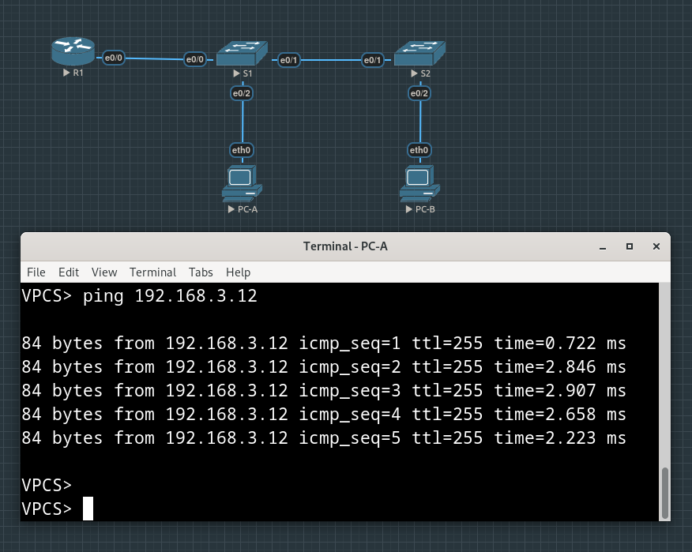

# Lab #1. Configure Router-on-a-Stick Inter-VLAN Routing


***Addressing Table***

| Device | Interface | IP Address | Subnet Mask | Default Gateway |
| :------------------------ | :------------------ | :------------------ | :------------------ | :------------------ |
| R1 | e0/0.3 | 192.168.3.1 | 255.255.255.0 | N/A |
| | e0/0.4 | 192.168.4.1 | 255.255.255.0 | |
| | e0/0.8 | N/A | N/A | — |
| S1 | VLAN 3 | 192.168.3.11 | 255.255.255.0 | 192.168.3.1 |
| S2 | VLAN 3 | 192.168.3.12 | 255.255.255.0 | 192.168.3.1 |
| PC-A | NIC | 192.168.3.3 | 255.255.255.0 | 192.168.3.1 |
| PC-B | NIC | 192.168.4.3 | 255.255.255.0 | 192.168.4.1 |

**VLAN Table**

| VLAN | Name | Interface Assigned |
| :------------------------ | :------------------ | :------------------ |
| 3 | Management | S1: VLAN 3 <br> S2: VLAN 3 <br> S1: e0/2|
| 4 | Operations | S2: e0/2 |
| 7 | ParkingLot | S1: e0/3 <br> S2: e0/0, e0/3 |
| 8 | Native | N/A |

## Part 1: Build the Network and Configure Basic Device Settings


### Step 1. Cable the network as shown in the topology


### Step 2. Configure basic settings for the router

Assigning name to the router, disabling DNS lookup and providing passwords for priveleged mode and for console and VTY lines:

```
Router>en
Router#conf t
Enter configuration commands, one per line.  End with CNTL/Z.
Router(config)#hostn
Router(config)#hostname R1
R1(config)#no ip domain lookup 

R1(config)#enable secret class
R1(config)#line co
R1(config)#line console ?
  <0-0>  First Line number

R1(config)#line console 0 
R1(config-line)#pass
R1(config-line)#password cisco
R1(config-line)#login
R1(config-line)#exit 
R1(config)#line vty ?
  <0-4>  First Line number

R1(config)#line vty 0 ?
  <1-4>  Last Line number
  <cr>

R1(config)#line vty 0 4
R1(config-line)#passwo
R1(config-line)#password cisco
R1(config-line)#login

```

Prior to ```service password-encryption``` command exectuion:

```
!         
line con 0
 password cisco
 logging synchronous
 login
line aux 0
line vty 0 4
 password cisco
 login
 transport input none
!      
```

After ```service password-encryption``` command exectuion:
```
!
line con 0
 password 7 01100F175804
 logging synchronous
 login    
line aux 0
line vty 0 4
 password 7 02050D480809
 login    
 transport input none
!
```

Setting banner and clock:
```
R1(config)#banner motd "This is R1, unauthorized access is prohibited!"
R1(config)#exit
R1#clock set 11:09:00 Nov 3 2024  
R1#
*Nov  3 11:09:00.000: %SYS-6-CLOCKUPDATE: System clock has been updated from 11:09:00 UTC Sun Nov 3 2024 to 11:09:00 UTC Sun Nov 3 2024, configured from console by console.
```

Saving current config:

```
R1#copy ru
R1#copy running-config st
R1#copy running-config startup-config
Destination filename [startup-config]? 
Building configuration...
[OK]
```

Result:


### Step 3. Configure basic settings for each switch

Performing same commands we used for the router on both switches:

```
Switch>
Switch>en
Switch#conf t
Enter configuration commands, one per line.  End with CNTL/Z.
Switch(config)#hostn
Switch(config)#hostname S1
S1(config)#no ip domain lookup 
S1(config)#ena
S1(config)#enable se
S1(config)#enable secret class
S1(config)#line co
S1(config)#line console ?
  <0-0>  First Line number

S1(config)#line console 0
S1(config-line)#pas
S1(config-line)#password cisco
S1(config-line)#login
S1(config-line)#
S1(config-line)#line vty 0 4
S1(config-line)#password cisco
S1(config-line)#login
S1(config-line)#exit
S1(config)#
S1(config)#service password-encryption
S1(config)#
S1(config)#banner motd "This is S1, unauthorized access is prohibited!"
S1(config)#exit               
S1#clock set 11:51:25 Nov 3 2024
S1#
*Nov  3 11:51:25.000: %SYS-6-CLOCKUPDATE: System clock has been updated from 11:51:25 UTC Sun Nov 3 2024 to 11:51:25 UTC Sun Nov 3 2024, configured from console by console.
S1#
S1#copy run sta
Destination filename [startup-config]? 
Building configuration...
Compressed configuration from 952 bytes to 693 bytes[OK]
S1#
```

### Step 4. Configure PC hosts

Assiging IP addresses, subnet masks and default gateway IPs according to the Addressing Table


## Part 2: Create VLANs and Assign Switch Ports

### Step 1. Create VLANs on both switches

```
S1(config)#vlan 3
S1(config-vlan)#name Management
S1(config-vlan)#vlan 4
S1(config-vlan)#name Operations
S1(config-vlan)#vlan 7
S1(config-vlan)#name ParkingLot
S1(config-vlan)#vlan 8
S1(config-vlan)#name Native
S1(config-vlan)#exit
S1(config)#exit
```

```
S1#show vlan brief 

VLAN Name                             Status    Ports
---- -------------------------------- --------- -------------------------------
1    default                          active    Et0/0, Et0/1, Et0/2, Et0/3
3    Management                       active    
4    Operations                       active    
7    ParkingLot                       active    
8    Native                           active    
1002 fddi-default                     act/unsup 
1003 token-ring-default               act/unsup 
1004 fddinet-default                  act/unsup 
1005 trnet-default                    act/unsup 
S1#
```

Configuring the management interface and default gateway on each switch using the IP address information in the Addressing Table

```
S1(config)#int Vlan 3
S1(config-if)#
Nov  3 12:10:54.727: %LINEPROTO-5-UPDOWN: Line protocol on Interface Vlan3, changed state to down
S1(config-if)#ip a
S1(config-if)#ip ad
S1(config-if)#ip?  
ip  ipv6  

S1(config-if)#ip address 192.168.3.11 255.255.255.0
S1(config-if)#ip defa?
% Unrecognized command
S1(config-if)#ip route ? 
  cef             Enable Cisco Express Forwarding
  flow            Enable Flow fast-switching cache
  policy          Enable fast-switching policy cache for outgoing packets
  same-interface  Enable fast-switching on the same interface
  <cr>
```

Evidently, default-gateway command should not be performed per-interface for a switch:

```
S1(config-if)#no shut
S1(config-if)#exit
S1(config)#
Nov  3 12:15:26.376: %LINK-3-UPDOWN: Interface Vlan3, changed state to down
S1(config)#ip default-?
default-gateway  default-network  

S1(config)#ip default-gateway 192.168.3.1
S1(config)#exit
```

Configuring Vlan 3 interface and default gateway address on S2:

```
S2(config)#int vlan 3
S2(config-if)#ip address 1
Nov  3 12:36:51.740: %LINEPROTO-5-UPDOWN: Line protocol on Interface Vlan3, changed state to down
S2(config-if)#ip address 192.168.3.12 255.255.255.0
S2(config-if)#no shut
S2(config-if)#exit
S2(config)#
Nov  3 12:37:13.643: %LINK-3-UPDOWN: Interface Vlan3, changed state to down
S2(config)#ip def
S2(config)#ip default-ga
S2(config)#ip default-gateway 192.168.3.1
S2(config)#exit
```


Assigning all unused ports on both switches to the ParkingLot VLAN, configuring them for static access mode,
and administratively deactivate them.

On S1:

```
S1(config)#int e0/3
S1(config-if)#swi
S1(config-if)#switchport ac
S1(config-if)#switchport access vl
S1(config-if)#switchport access vlan 7
S1(config-if)#shut                    
S1(config-if)#exit
S1(config)#do show vlan bri        
Nov  3 12:22:21.517: %LINK-5-CHANGED: Interface Ethernet0/3, changed state to administratively down
S1(config)#do show vlan bri
Nov  3 12:22:22.521: %LINEPROTO-5-UPDOWN: Line protocol on Interface Ethernet0/3, changed state to down
S1(config)#do show vlan bri

VLAN Name                             Status    Ports
---- -------------------------------- --------- -------------------------------
1    default                          active    Et0/0, Et0/1, Et0/2
3    Management                       active    
4    Operations                       active    
7    ParkingLot                       active    Et0/3
8    Native                           active    
1002 fddi-default                     act/unsup 
1003 token-ring-default               act/unsup 
1004 fddinet-default                  act/unsup 
1005 trnet-default                    act/unsup 
S1(config)#
```

On S2 (using ```interface range``` command):

```
S2(config)#int range e0/0,e0/3
S2(config-if-range)#swi
S2(config-if-range)#switchport acc
S2(config-if-range)#switchport access vl
S2(config-if-range)#switchport access vlan 7
S2(config-if-range)#shut
S2(config-if-range)#
Nov  3 12:39:02.244: %LINK-5-CHANGED: Interface Ethernet0/0, changed state to administratively down
Nov  3 12:39:02.245: %LINK-5-CHANGED: Interface Ethernet0/3, changed state to administratively down
Nov  3 12:39:03.249: %LINEPROTO-5-UPDOWN: Line protocol on Interface Ethernet0/0, changed state to down
Nov  3 12:39:03.249: %LINEPROTO-5-UPDOWN: Line protocol on Interface Ethernet0/3, changed state to down
S2(config-if-range)#exit
S2(config)#exit
S2#show vlan brief 

VLAN Name                             Status    Ports
---- -------------------------------- --------- -------------------------------
1    default                          active    Et0/1, Et0/2
3    Management                       active    
4    Operations                       active    
7    ParkingLot                       active    Et0/0, Et0/3
8    Native                           active    
1002 fddi-default                     act/unsup 
1003 token-ring-default               act/unsup 
1004 fddinet-default                  act/unsup 
1005 trnet-default                    act/unsup 
S2#
```

### Step 2. Assign VLANs to the correct switch interfaces

On S1:

```
S1(config)#int e0/2
S1(config-if)#switchport mode access 
S1(config-if)#switchport access vlan 3
```

On S2:

```
S2(config)#int e0/2
S2(config-if)#switchport mode access 
S2(config-if)#switchport access vlan 4
```


## Part 3: Configure an 802.1Q Trunk Between the Switches

### Step 1. Manually configure trunk interface between switches on both sides (e0/1)


```
S1(config)#int e0/1
S1(config-if)#swi
S1(config-if)#switchport mode
S1(config-if)#switchport mode tru
S1(config-if)#switchport mode trunk ?
  <cr>

S1(config-if)#switchport mode trunk 
Command rejected: An interface whose trunk encapsulation is "Auto" can not be configured to "trunk" mode.
S1(config-if)#swi
S1(config-if)#switchport tr
S1(config-if)#switchport trunk en
S1(config-if)#switchport trunk encapsulation 8
S1(config-if)#switchport trunk encapsulation ?
  dot1q      Interface uses only 802.1q trunking encapsulation when trunking
  isl        Interface uses only ISL trunking encapsulation when trunking
  negotiate  Device will negotiate trunking encapsulation with peer on
             interface

S1(config-if)#switchport trunk encapsulation d
S1(config-if)#switchport trunk encapsulation dot1q 
S1(config-if)#switchport mode trunk                
S1(config-if)#
S1(config-if)#switchport trunk allowed vlan 3,4 
S1(config-if)#swi
S1(config-if)#switchport tr
S1(config-if)#switchport trunk na
S1(config-if)#switchport trunk native v
S1(config-if)#switchport trunk native vlan 9
S1(config-if)#switchport trunk native vlan 8
```

From the description:
>specify that VLANs 3, 4, and 8 are only allowed to cross the trunk

Why 8? Aren't frames in native VLAN left untagged? If so, why do we need to add VLAN 8 to allowed VLANs?


### Step 2. Manually configure S1’s trunk interface to router (e0/0)

```
S1(config)#int e0/0
S1(config-if)#switchport mode trunk 
Command rejected: An interface whose trunk encapsulation is "Auto" can not be configured to "trunk" mode.
S1(config-if)#
S1(config-if)#switchport trunk encapsulation dot1q 
S1(config-if)#switchport mode trunk
Nov  3 13:01:10.318: %LINEPROTO-5-UPDOWN: Line protocol on Interface Ethernet0/0, changed state to down
S1(config-if)#switchport trunk allowed 
Nov  3 13:01:13.321: %LINEPROTO-5-UPDOWN: Line protocol on Interface Ethernet0/0, changed state to up
S1(config-if)#switchport trunk allowed vlan 3,4
S1(config-if)#switchport trunk native vlan 8
```

>Why does F0/5 (e0/0 in my case) not appear in the list of trunks?

Actually, it can be seen (see screenshot below):


Only access ports are left in ```show vlan``` table (the one to PC and another was manually shut down and placed in unused VLAN).

## Part 4: Configure Inter-VLAN Routing on the Router

Activate interface e0/0 on the router.

```
R1#conf t  
Enter configuration commands, one per line.  End with CNTL/Z.
R1(config)#int e0/0
R1(config-if)#no shut
R1(config-if)#
Nov  3 13:09:50.357: %LINK-3-UPDOWN: Interface Ethernet0/0, changed state to up
Nov  3 13:09:51.364: %LINEPROTO-5-UPDOWN: Line protocol on Interface Ethernet0/0, changed state to up
```

Configuring sub-interfaces for each VLAN as specified in the IP addressing table.

Sub-interface for Management VLAN:

```
R1(config-if)#int e0/0.3
R1(config-subif)#ip addr 192.168.3.1 255.255.255.0 

% Configuring IP routing on a LAN subinterface is only allowed if that 
subinterface is already configured as part of an IEEE 802.10, IEEE 802.1Q, 
or ISL vLAN.

R1(config-subif)#encapsulation dot1Q 
% Incomplete command.

R1(config-subif)#encapsulation dot1Q 3
R1(config-subif)#ip addr 192.168.3.1 255.255.255.0
R1(config-subif)#description Management VLAN
R1(config-subif)#exit
```

Sub-interface for Operations VLAN:

```
R1(config)#int e0/0.4                       
R1(config-subif)#encapsulation dot1Q 4
R1(config-subif)#description Operations VLAN
R1(config-subif)#ip addr 192.168.4.1 255.255.255.0
R1(config-subif)#exit
```

Sub-interface for Native VLAN (does not have an IP address
assigned):

```
R1(config)#int e0/0.8                       
R1(config-subif)#encapsulation dot1Q 8 native 
R1(config-subif)#description Native VLAN
```

Verifying that the sub-interfaces are operational:


## Part 5: Verify Inter-VLAN Routing is working

### Step 1. Pinging from PC-A

a. Ping from PC-A to its default gateway:


b. Ping from PC-A to PC-B:


c. Ping from PC-A to S2:


All at once (capturing on S1 e0/1):


### Step 2. Tracing from PC-B

The first hop is default gateway for PC-B, the second is our destination PC-A:

