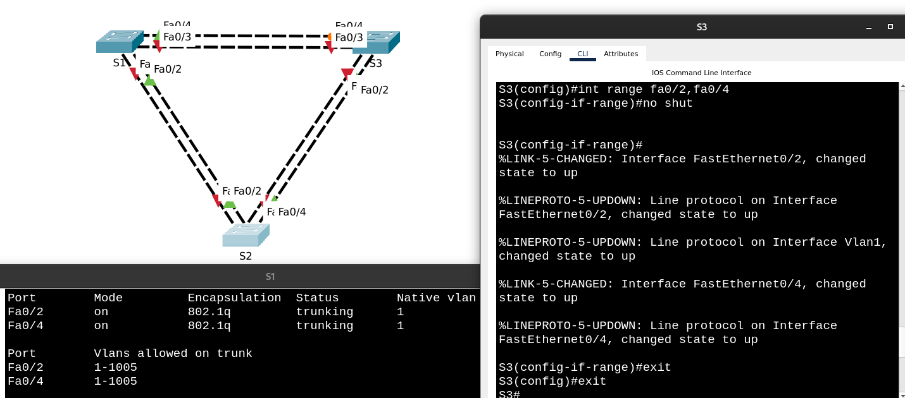
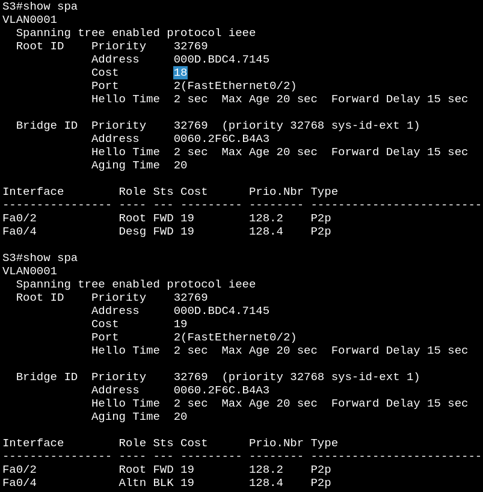

# Лабораторная работа №2. Развертывание коммутируемой сети с резервными каналами

**Топология**


**Таблица адресации**

| Устройство | Интерфейс | IP-адрес    | Маска подсети |
| :----------| :-------- | :---------- | :------------ |
| S1         | VLAN 1    | 192.168.1.1 | 255.255.255.0 |
| S2         | VLAN 1    | 192.168.1.2 | 255.255.255.0 |
| S3         | VLAN 1    | 192.168.1.3 | 255.255.255.0 |

## Часть 1. Создание сети и настройка основных параметров устройств


```
Switch>en
Switch#conf t
Enter configuration commands, one per line.  End with CNTL/Z.
Switch(config)#hostname S1
S1(config)#
S1(config)#no ip domain-lookup
S1(config)#enable secret class
S1(config)#
S1(config)#line console 0
S1(config-line)#password cisco
S1(config-line)#login
S1(config-line)#logging synch
S1(config-line)#logging synchronous 
S1(config-line)#exit
S1(config)#
S1(config)#line vty 0 4
S1(config-line)#password cisco
S1(config-line)#login
S1(config-line)#logging synchronous 
S1(config-line)#exit
S1(config)#
S1(config)#banner motd "This is S1, unauthorized access is prohibited!"
S1(config)#
S1(config)#int vlan 1
S1(config-if)#ip add
S1(config-if)#ip address 192.168.1.1 255.255.255.0
S1(config-if)#no shut

S1(config-if)#
%LINK-5-CHANGED: Interface Vlan1, changed state to up

%LINEPROTO-5-UPDOWN: Line protocol on Interface Vlan1, changed state to up

S1(config-if)#exit
S1(config)#exit
S1#
S1#copy running-config ?
  flash:          Copy to flash file
  ftp:            Copy to current system configuration
  scp:            Copy to scp: file system
  startup-config  Copy to startup configuration
  tftp:           Copy to current system configuration
S1#copy running-config startup-config
Destination filename [startup-config]? 
Building configuration...
[OK]
```
Аналогичные настройки производим на S2 и S3.

Проверка связи между коммутаторами:


## Часть 2. Определение корневого моста

### Шаг 1: Отключение всех портов на коммутаторах


### Шаг 2: Настройка подключенных портов в качестве транковых

```
S2(config)#int range fa0/1-4
S2(config-if-range)#switchport mode trunk 
S2(config-if-range)#exit
```

### Шаг 3: Включение портов F0/2 и F0/4 на всех коммутаторах



### Шаг 4: Отображение данных протокола spanning-tree

Вводим команду ``show spanning-tree``` на всех трех коммутаторах


Ответы на вопросы из методички:

>Какой коммутатор является корневым мостом?

S2, как видно на скриншоте выше (надпись "This bridge is the root" в выводе ```show spa``` для нашего единственного VLAN-а)

>Почему этот коммутатор был выбран протоколом spanning-tree в качестве корневого моста?

Именно у него оказался наименьший "burned-in MAC" ("нижняя" часть Bridge Id, или младшие разряды числа Bridge Id, последние 48 бит). Bridge Priority в "верхней" части Bridge Id (старшие разряды числа Bridge Id, первые 16 бит) мы не настраивали, поэтому у всех коммутаторов он одинаковый, это видно в строке Bridge ID Priority вывода ```show spa```:

у S2 "burned-in" MAC ```000D.BDC4.7145```

против S1 ```0050.0FC7.7AA4```

и S3 ```0060.2F6C.B4A3```

>Какие порты на коммутаторе являются корневыми портами? 

Поскольку стоимости портов мы тоже отдельно не настраивали, для всех Fast Ethernet они имеют одинаковое значение 19, и кратчайший путь до S2 от S1 и S3 - через интерфейсы, подключенные непосредственно к S2, т.е. Fa0/2 на обоих коммутаторах.

Это подтверждается и записью из ```show spanning-tree```:

```
Interface  Role Sts Cost  Prio.Nbr Type
---------- ---- --- ----- -------- -----
Fa0/2      Root FWD 19    128.2    P2p
```

>Какие порты на коммутаторе являются назначенными портами?

Назначенными будут все порты корневого коммутатора S2 (поскольку путь от одного "листа" (т.е. конечного, не промежуточного узла) дерева к другому лежит через корневой коммутатор, его порты ни в коем случае не должны быть заблокированы). Для некорневых коммутаторов это будут некорневые порты, сравнение при равных стоимостях пути до корневого коммутатора (а это как раз наш случай) происходит по Bridge Id, и здесь выигрывает порт F0/4 коммутатора S1 (```0050.0FC7.7AA4``` против ```0060.2F6C.B4A3```)


>Какой порт отображается в качестве альтернативного и в настоящее время заблокирован? Почему протокол spanning-tree выбрал этот порт в качестве невыделенного (заблокированного) порта?

F0/4 коммутатора S3 оказался заблокированным - это некорневой порт (т.е. не в сторону кратчайшего пути к Root Bridge), как описано в ответе на предыдущий вопрос, стоимость пути через этот порт до корневого коммутатора такая же, как и для F0/4 коммутатора S1, поэтому выбор производился по Bridge Id, у S3 burned-in MAC оказался больше, поэтому именно его порт и был заблокирован.  


## Часть 3. Наблюдение за процессом выбора протоколом STP порта, исходя из стоимости портов

На коммутаторе с заблокированным портом изменим стоимость корневого порта (чтобы суммарная стоимость пути через в данный момент заблокированный порт F0/4 коммутатора S3 и потом через корневой порт F0/2 этого же коммутатора S3 был дешевле, чем путь через F0/4 -> F0/2 другого некорневого коммутатора S1)

```
S3(config)#int fa0/2
S3(config-if)#spanning-tree cost 18
```

Видим, что STP пересчитал Root Path Cost через каждый порт, перевел F0/4 на S3 в Designated, и заблокировал F0/4 на S1:


Вернем корневому порту F0/2 коммутатора S3 изначальную стоимость

```
S3(config)#int fa0/2
S3(config-if)#spanning-tree cost 19
```

Убеждаемся, что STP снова пересчитал суммарные стоимости путей, и снова в своем выборе блокируемого порта стал опираться на большее значение Bridge Id.

На скриншоте: сверху STP еще не успел пересчитать Root Path Cost (в выводе 18), поэтому F0/4 еще не заблокирован, снизу Root Path Cost пересчитан, F0/4 уже заблокирован:




## Часть 4. Наблюдение за процессом выбора протоколом STP порта, исходя из приоритета портов

Включаем порты F0/1 и F0/3 на всех коммутаторах.


>Обратите внимание, что порт корневого моста переместился на порт с меньшим номером, связанный с коммутатором корневого моста, и заблокировал предыдущий порт корневого моста.

Действительно, до включения F0/1 на S1 корневым портом был F0/2, сейчас же он заблокирован:


>Какой порт выбран протоколом STP в качестве порта корневого моста на каждом коммутаторе некорневого моста? Почему протокол STP выбрал эти порты в качестве портов корневого моста на этих коммутаторах?

На S1 корневым портом был выбран F0/1, т.к. путь через него до Root Bridge (S2) дешевле, чем через F0/3 и F0/4 (понятно, что путь напрямую к S2 дешевле, чем через еще один коммутатор), а при сравнении F0/1 с F0/2 (стоимости путей одинаковы, Bridge Id обоих портов тоже одинаков, ибо это порты одного коммутатора) выигрывает порт, соединенный с портом (на той стороне, т.е. на S2) с наименьшим Port Id (Port Priority мы сами нигде не настраивали), и это F0/1 (мы собрали симметрично, F0/1 на S1 соединен с F0/1 на S2, так же для F0/2).

На S3 выбор между F0/1 и F0/2 производился по тому же критерию, т.е. меньший Port Id соседа, F0/3 на S3 соединен с F0/1 на корневом коммутаторе S2 поэтому он и был выбран корневым (единица в F0/1 меньше, чем двойка в F0/2).

## Вопросы для повторения

>Какое значение протокол STP использует первым после выбора корневого моста, чтобы определить выбор порта?

Root Path Cost - через какой порт дешевле добраться до корневого коммутатора.


>Если первое значение на двух портах одинаково, какое следующее значение будет использовать протокол STP при выборе порта?

Bridge Id коммутаторов, которым принадлежат эти сравниваемые порты

>Если оба значения на двух портах равны, каким будет следующее значение, которое использует протокол STP при выборе порта?

Port Priority соседей (т.е. портов, с которыми соединены сравниваемые порты), если не наконфигурены (с помощью ```spanning-tree vlan X port-priority Y```), то по номеру портов соседей (как в Части 4, сравнивали 2 и 1 в Fa0/2 и Fa0/1).