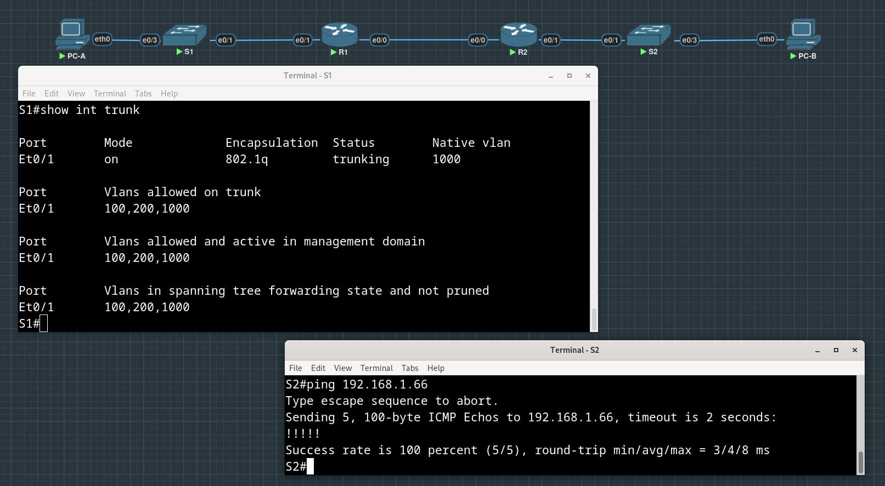
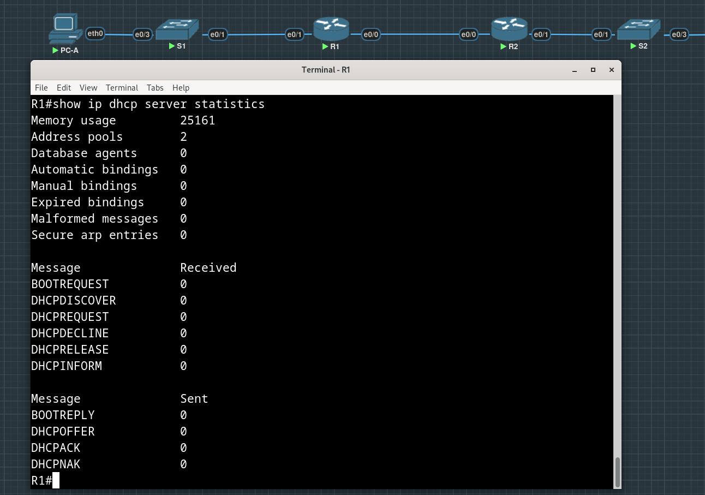

# Lab #3.1. Implement DHCPv4


**Addressing Table**

| Device | Interface | IP Address | Subnet Mask     | Default Gateway |
| :----- | :-------- | :--------- | :-------------- | :-------------- |
| R1     | e0/0      | 10.0.0.1   | 255.255.255.252 | N/A             |
|        | e0/1      | N/A        | N/A             |                 |
|        | e0/1.100  |            |                 |                 |
|        | e0/1.200  |            |                 |                 |
|        | e0/1.1000 | N/A        | N/A             |                 |
| R2     | e0/0      | 10.0.0.2   | 255.255.255.252 | N/A             |
|        | e0/1      |            |                 |                 |
| S1     | VLAN 200  |            |                 |                 |
| S2     | VLAN 1    |            |                 |                 |
| PC-A   | NIC       | DHCP       | DHCP            | DHCP            |
| PC-B   | NIC       | DHCP       | DHCP            | DHCP            |

**VLAN Table**

| VLAN | Name        | Interface Assigned |
| :--- | :---------- | :----------------- |
| 1    | N/A         | S2: e0/3           |
| 100  | Clients     | S1: e0/3           |
| 200  | Management  | S1: VLAN 200       |
| 999  | Parking_Lot | S1: e0/0, e0/2     |
| 1000 | Native      | N/A                |

## Part 1: Build the Network and Configure Basic Device Settings

### Step 1. Establish an addressing scheme

Subnet the network 192.168.1.0/24 to meet the following requirements:

- a. One subnet, “Subnet A”, supporting 58 hosts (the client VLAN at R1).

    Subnet A:
    We can only subnet an amount of hosts which is equal to the power of two. The most closest to 58 is 2 ^ 6 = 64. Exponent here actually hints how many bits are required to cover all 64 address combinations (62 if not including the network address itself and the broadcast address). Therefore, 6 bits from subnet will be used as host-portion of the address, fist two bits of the last byte will be in network-portion of the address.

    The obtained subnet will have the address 192.168.1.0/26.

    Recording the first IP address in the Addressing Table for R1 e0/1.100 -> 192.168.1.1/26

 - b. One subnet, “Subnet B”, supporting 28 hosts (the management VLAN at R1). 

    Subnet B:
    To cover all 28 host addresses, 5 bits will be required, as the closest highest power of two is 32 = 2 ^ 5. The last address of the Subnet A is 192.168.1.63/26, the first free address is 192.168.1.64, which will be the network address of Subnet B. The prefix length (or network-portion of the address) is 24 + 8 - 5 = 27.

    Recording the first IP address in the Addressing Table for R1 e0/1.200 -> 192.168.1.65/27
    
    Recording the second IP address in the Address Table for S1 VLAN 200 -> 192.168.1.66/27. and entering the associated default gateway -> 192.168.1.65/27

 - c. One subnet, “Subnet C”, supporting 12 hosts (the client network at R2).
    
    Subnet C:

    The last address of Subnet B is 192.168.1.95/27, thus, the next free address is 192.168.1.96, which we will use as the network address for Subnet C. It has 12 hosts, so 4 bits (2 ^ 4 = 16 combinations) for host-portion of the prefix will be sufficient. The network-portion of the address will be 24 + 8 - 4 = 28 bits.
    
    Recording the first IP address in the Addressing Table for R2 e0/1 -> 192.168.1.97/28.

Resulting addressing table will look like this:

| Device | Interface | IP Address       | Subnet Mask         | Default Gateway  |
| :----- | :-------- | :--------------- | :------------------ | :--------------- |
| R1     | e0/0      | 10.0.0.1         | 255.255.255.252     | N/A              |
|        | e0/1      | N/A              | N/A                 |                  |
|        | e0/1.100  | **192.168.1.1**  | **255.255.255.192** |                  |
|        | e0/1.200  | **192.168.1.65** | **255.255.255.224** |                  |
|        | e0/1.1000 | N/A              | N/A                 |                  |
| R2     | e0/0      | 10.0.0.2         | 255.255.255.252     | N/A              |
|        | e0/1      | **192.168.1.97** | **255.255.255.240** |                  |
| S1     | VLAN 200  | **192.168.1.66** | **255.255.255.224** | **192.168.1.65** |
| S2     | VLAN 1    | **192.168.1.98** | **255.255.255.240** | **192.168.1.97** |
| PC-A   | NIC       | DHCP             | DHCP                | DHCP             |
| PC-B   | NIC       | DHCP             | DHCP                | DHCP             |


### Step 2. Cable the network as shown in the topology

Attaching the devices as shown in the topology diagram:


### Step 3. Configure basic settings for each router

The usual routine: hostname, passwords for console and VTY access, password for privileged mode, etc.

```
Router>en
Router#conf t
Enter configuration commands, one per line.  End with CNTL/Z.
Router(config)#hostname R1
R1(config)#
R1(config)#no ip domain-lookup
R1(config)#enable secret class
R1(config)#line console 0
R1(config-line)#password cisco
R1(config-line)#login
R1(config-line)#line vty 0 4
R1(config-line)#password cisco
R1(config-line)#login
R1(config-line)#logging synchronous
R1(config-line)#exit
R1(config)#
R1(config)#service password-encryption
R1(config)#
R1(config)#banner motd "This is R1, unauthorized access is prohibited!"
R1(config)#exit
R1#
*Nov  9 20:09:49.692: %SYS-5-CONFIG_I: Configured from console by console
R1#show clock
*20:10:10.510 UTC Sat Nov 9 2024
R1#
R1#clock set 20:10:50 Nov 9 2024
R1#show clock                   
*Nov  9 20:10:50.000: %SYS-6-CLOCKUPDATE: System clock has been updated from 20:10:49 UTC Sat Nov 9 2024 to 20:10:50 UTC Sat Nov 9 2024, configured from console by console.
R1#show clock
20:10:52.152 UTC Sat Nov 9 2024
R1#copy ru st
Destination filename [startup-config]? 
Building configuration...
[OK]
R1#
```

### Step 4. Configure Inter-VLAN Routing on R1

All sub-interfaces use 802.1Q encapsulation and are assigned the first usable address from the IP address pool we have calculated (except sub-interface for native VLAN).

```
R1#conf t 
Enter configuration commands, one per line.  End with CNTL/Z.
R1(config)#int e0/1.100
R1(config-subif)#encapsulation dot1Q 100
R1(config-subif)#ip address 192.168.1.1 255.255.255.192
R1(config-subif)
R1(config-subif)#int e0/1.200
R1(config-subif)#encapsulation dot1Q 200
R1(config-subif)#ip address 192.168.1.65 255.255.255.224
R1(config-subif)
R1(config-subif)#int e0/1.1000
R1(config-subif)#encapsulation dot1Q 1000 native
R1(config-subif)
R1(config-subif)#int e0/1
R1(config-if)#no shut
R1(config-if)#
Nov  9 20:29:52.064: %LINK-3-UPDOWN: Interface Ethernet0/1, changed state to up
Nov  9 20:29:53.065: %LINEPROTO-5-UPDOWN: Line protocol on Interface Ethernet0/1, changed state to up
R1(config-if)#
R1(config-if)#int e0/0
R1(config-if)#ip address 10.0.0.1 255.255.255.252
R1(config-if)#no shut
R1(config-if)#exit
R1(config)#
Nov  9 20:31:35.694: %LINK-3-UPDOWN: Interface Ethernet0/0, changed state to up
Nov  9 20:31:36.694: %LINEPROTO-5-UPDOWN: Line protocol on Interface Ethernet0/0, changed state to up

```

### Step 5. Configure e0/1 on R2, then e0/0 and static routing for both routers


R2:

```
R2(config)#int e0/1
R2(config-if)#ip address 192.168.1.97 255.255.255.240
R2(config-if)#no shut
R2(config-if)#
*Nov  9 20:37:17.428: %LINK-3-UPDOWN: Interface Ethernet0/1, changed state to up
*Nov  9 20:37:18.434: %LINEPROTO-5-UPDOWN: Line protocol on Interface Ethernet0/1, changed state to up
R2(config-if)#int e0/0
R2(config-if)#ip address 10.0.0.2 255.255.255.252
R2(config-if)#no shut
R2(config-if)#
*Nov  9 20:37:36.249: %LINK-3-UPDOWN: Interface Ethernet0/0, changed state to up
*Nov  9 20:37:37.249: %LINEPROTO-5-UPDOWN: Line protocol on Interface Ethernet0/0, changed state to up
R2(config-if)#exit
```


R1:

```
R1(config-if)#int e0/0
R1(config-if)#ip address 10.0.0.1 255.255.255.252
R1(config-if)#no shut
```

Configuring static routes and pinging interfaces, which are not directly connected (from 192.168.1.X subnets):


### Step 6. Configure basic settings for each switch

The usual routine with passwords, hostnames and message-of-the-day, now for switches.

```
Switch>en
Switch#conf t
Enter configuration commands, one per line.  End with CNTL/Z.
Switch(config)#hostname S1
S1(config)#no ip domain-lookup 
S1(config)#enable secret class
S1(config)#service password-encryption
S1(config)#
S1(config)#line console 0
S1(config-line)#password cisco
S1(config-line)#login
S1(config-line)#exec-timeout 0 0
S1(config-line)#
S1(config-line)#line vty 0 4
S1(config-line)#password cisco
S1(config-line)#login 
S1(config-line)#logging synchronous
S1(config-line)#exec-timeout 0 0 
S1(config-line)#exit
S1(config)#
S1(config)#banner motd "This is S1, unauthorized access is prohibited!"
S1(config)#exit
S1#copy 
*Nov  9 21:03:20.097: %SYS-5-CONFIG_I: Configured from console by console
S1#copy run sta
Destination filename [startup-config]? 
Building configuration...
Compressed configuration from 950 bytes to 684 bytes[OK]
```

### Step 7. Create VLANs on S1

Just creating and naming VLANs:

```
S1(config)#vlan 100
S1(config-vlan)#name Clients
S1(config-vlan)#vlan 200
S1(config-vlan)#name Management
S1(config-vlan)#vlan 999 
S1(config-vlan)#name Parking_Lot
S1(config-vlan)#vlan 1000
S1(config-vlan)#name Native
```

Configuring and activating the management interface on S1 (VLAN 200) using the second IP address from the subnet calculated earlier.

Additionally, setting the default gateway on S1 (we remember, ```ip default-gateway <ip>``` may not work properly, so configuring default route with ```ip route 0.0.0.0 0.0.0.0 <gateway-ip>```):

```
S1(config)#int vlan 200
S1(config-if)#
*Nov  9 21:19:34.302: %LINEPROTO-5-UPDOWN: Line protocol on Interface Vlan200, changed state to down
S1(config-if)#ip address 192.168.1.66 255.255.255.224
S1(config-if)#no shut
S1(config-if)#exit
*Nov  9 21:20:20.443: %LINK-3-UPDOWN: Interface Vlan200, changed state to down
S1(config)#ip route 0.0.0.0 0.0.0.0 192.168.1.65
S1(config)#exit
S1#wr
Building configuration...
Compressed configuration from 1049 bytes to 751 bytes[OK]
S1#
```

Configuring and activating the management interface on S2 (VLAN 1) using the second IP address from the subnet calculated earlier:

```
S2(config)#int vlan 1
*Nov  9 21:28:37.621: %LINEPROTO-5-UPDOWN: Line protocol on Interface Vlan1, changed state to down
S2(config-if)#ip address 192.168.1.98 255.255.255.240
S2(config-if)#no shut
S2(config-if)#exit
*Nov  9 21:31:02.473: %LINK-3-UPDOWN: Interface Vlan1, changed state to up
*Nov  9 21:31:03.478: %LINEPROTO-5-UPDOWN: Line protocol on Interface Vlan1, changed state to up
S2(config)#ip route 0.0.0.0 0.0.0.0 192.168.1.97
```

Assigning all unused ports on S1 to the Parking_Lot VLAN, configuring them for static access mode, and administratively deactivating them:

```
S1(config)#int range e0/0, e0/2
S1(config-if-range)#switchport mode access
S1(config-if-range)#switchport access vlan 999
S1(config-if-range)#shut
S1(config-if-range)#
*Nov  9 21:33:22.373: %LINK-5-CHANGED: Interface Ethernet0/0, changed state to administratively down
*Nov  9 21:33:22.373: %LINK-5-CHANGED: Interface Ethernet0/2, changed state to administratively down
*Nov  9 21:33:23.379: %LINEPROTO-5-UPDOWN: Line protocol on Interface Ethernet0/0, changed state to down
*Nov  9 21:33:23.379: %LINEPROTO-5-UPDOWN: Line protocol on Interface Ethernet0/2, changed state to down
```

On S2, administratively deactivating all the unused ports:

```
S2(config)#int range e0/0, e0/2
S2(config-if-range)#shut
S2(config-if-range)#exit
S2(config)#
*Nov  9 21:34:23.225: %LINK-5-CHANGED: Interface Ethernet0/0, changed state to administratively down
*Nov  9 21:34:23.234: %LINK-5-CHANGED: Interface Ethernet0/2, changed state to administratively down
*Nov  9 21:34:24.229: %LINEPROTO-5-UPDOWN: Line protocol on Interface Ethernet0/0, changed state to down
*Nov  9 21:34:24.238: %LINEPROTO-5-UPDOWN: Line protocol on Interface Ethernet0/2, changed state to down
S2(config)#
```

### Step 8. Assign VLANs to the correct switch interfaces

Assigning used ports to the appropriate VLAN (specified in the VLAN table above) and configuring them for static access mode:

```
S1(config)#int e0/3
S1(config-if)#switchport mode access 
S1(config-if)#switchport access vlan 100
S1(config-if)#exit
```


>Why is interface F0/5 (e0/1 in our case, interface to R1) listed under VLAN 1?

Answer: this interface is not configured yet, we will configure it as trunk during the next step.

### Step 9. Manually configure S1’s interface e0/1 as an 802.1Q trunk

```
S1(config)#int e0/1
S1(config-if)#switchport mode trunk
Command rejected: An interface whose trunk encapsulation is "Auto" can not be configured to "trunk" mode.
S1(config-if)#
S1(config-if)#switchport nonegotiate
Command rejected: Conflict between 'nonegotiate' and 'dynamic' status on this interface: Et0/1
S1(config-if)#
S1(config-if)#switchport trunk encapsulation dot1q
S1(config-if)#
S1(config-if)#switchport mode trunk 
*Nov  9 21:50:54.964: %LINEPROTO-5-UPDOWN: Line protocol on Interface Ethernet0/1, changed state to down
*Nov  9 21:50:57.970: %LINEPROTO-5-UPDOWN: Line protocol on Interface Ethernet0/1, changed state to up
S1(config-if)#switchport trunk allowed vlan 100,200,1000
S1(config-if)#switchport trunk native vlan 1000
S1(config-if)#exit
S1(config)#exit
```



>At this point, what IP address would the PC’s have if they were connected to the network using DHCP?

Answer: requests from PC-A, sent through switch S1 via trunk to R1, will be tagged with VLAN 100, thus R1 (which will act as DHCP server) will receive them on e0/1.100 sub-interface, which is in 192.168.1.0/26 network. So it will take an address from this network and assign it to PC-A.

## Part 2: Configure and verify two DHCPv4 Servers on R1

### Step 1. Configure R1 with DHCPv4 pools for the two supported subnets.

Excluding first five addresses from two subnets, which have their hosts receiving IPs via DHCP:

```
R1(config)#ip dhcp excluded-address 192.168.1.1 192.168.1.5
R1(config)#
R1(config)#ip dhcp excluded-address 192.168.1.97 192.168.1.102
```

Configuring DHCP-pool for Subnet A:

```
R1(config)#ip dhcp pool POOL-A
R1(dhcp-config)#
R1(dhcp-config)#network 192.168.1.0/26
                                   ^
% Invalid input detected at '^' marker.

R1(dhcp-config)#network 192.168.1.0 /26
R1(dhcp-config)#
R1(dhcp-config)#domain-name ccna-lab.com
R1(dhcp-config)#
R1(dhcp-config)#default-router 192.168.1.1
R1(dhcp-config)#
R1(dhcp-config)#lease ?
  <0-365>   Days
  infinite  Infinite lease

R1(dhcp-config)#lease 2 ?
  <0-23>  Hours
  <cr>

R1(dhcp-config)#lease 2 12 30
R1(dhcp-config)#exit
```

Configuring DHCP-pool for Subnet B:

```
R1(config)#ip dhcp pool POOL-B
R1(dhcp-config)#network 192.168.1.96 /28
R1(dhcp-config)#
R1(dhcp-config)#domain-name ccna-lab.com
R1(dhcp-config)#
R1(dhcp-config)#default-router 192.168.1.97
R1(dhcp-config)#
R1(dhcp-config)#lease 2 12 30
R1(dhcp-config)#exit
```

### Step 2. Save your configuration

### Step 3. Verify the DHCPv4 Server configuration

 - a. Issuing the command ```show ip dhcp pool``` to examine the pool details.

    

 - b. Issuing the command ```show ip dhcp bindings``` to examine established DHCP address assignments.

    

 - c. Issuing the command ```show ip dhcp server statistics``` to examine DHCP messages.

    

### Step 4. Attempt to acquire an IP address from DHCP on PC-A

Issuing the command ```ip dhcp -r``` on PC-A:


Testing connectivity by pinging other IPs:


## Part 3: Configure and verify a DHCP Relay on R2

### Step 1. Configure R2 as a DHCP relay agent for the LAN on e0/1

Configuring the ```ip helper-address``` command on e0/1 specifying R1’s e0/0 IP address:

```
R2(config)#int e0/1
R2(config-if)#
R2(config-if)#ip helper-address 10.0.0.1 
```

### Step 2. Attempt to acquire an IP address from DHCP on PC-B

Issuing the command ```ip dhcp -r``` on PC-B:


Pinging other devices from PC-B:


Watching output of ```show ip dhcp binding``` and ```show ip dhcp server statistics``` commands:

