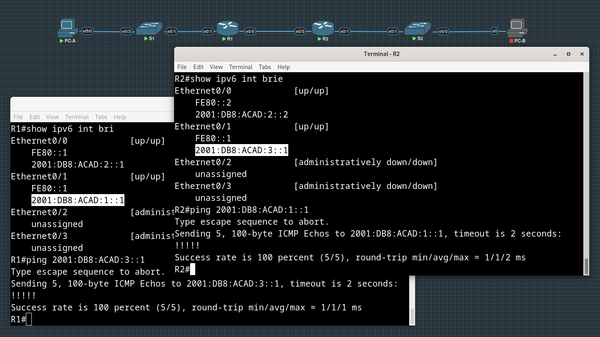
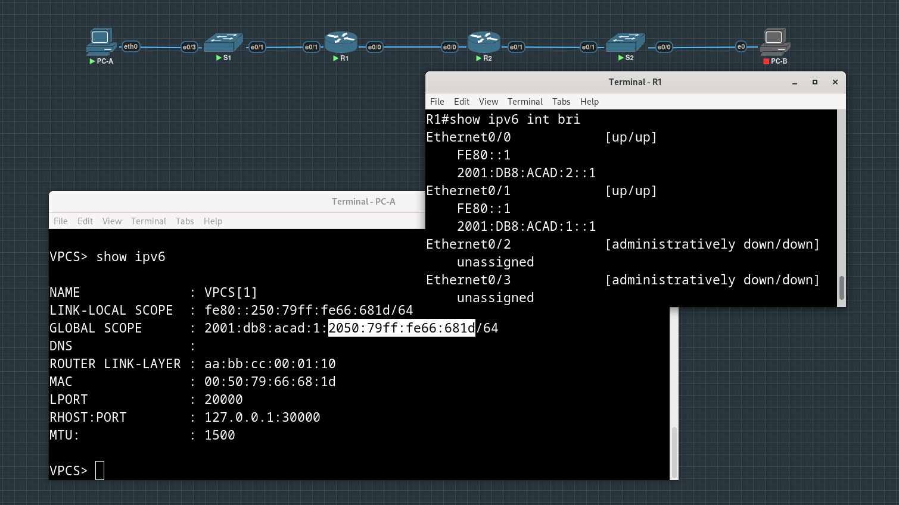
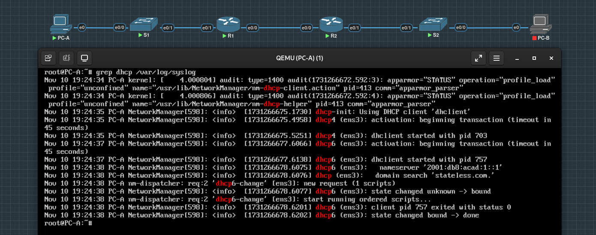
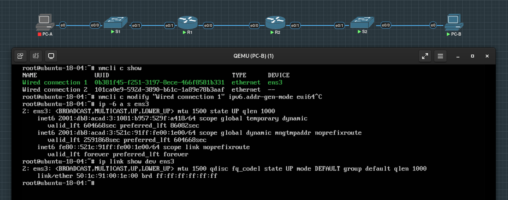
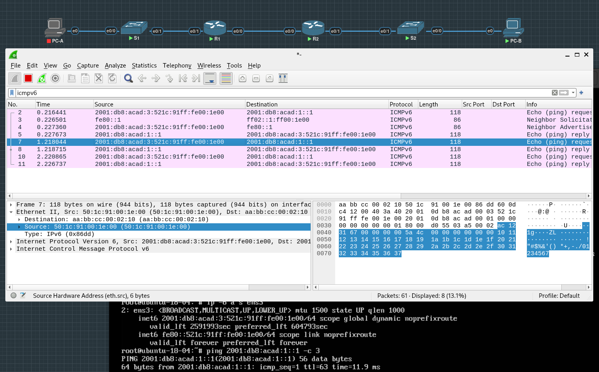
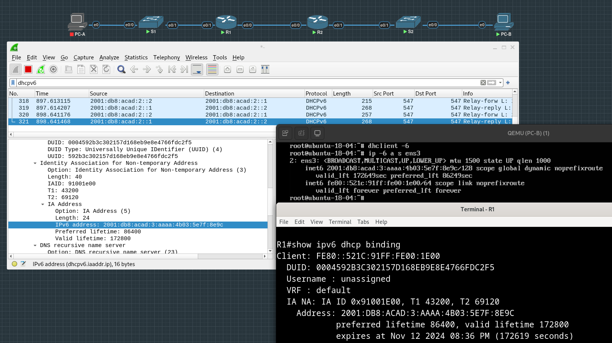
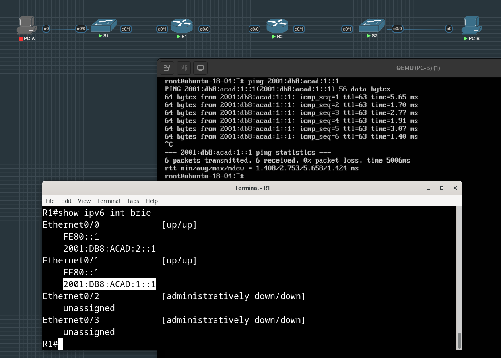

# Lab #3.2. Configure DHCPv6

**Topology**


**Addressing Table**

| Device | Interface | IPv6 Address          |
| :----- | :-------- | :-------------------- |
| R1     | e0/0      | 2001:db8:acad:2::1/64 |
|        |           | fe80::1               |
|        | e0/1      | 2001:db8:acad:1::1/64 |
|        |           | fe80::1               |
| R2     | e0/0      | 2001:db8:acad:2::2/64 |
|        |           | fe80::2               |
|        | e0/1      | 2001:db8:acad:3::1/64 |
|        |           | fe80::1               |
| PC-A   | NIC       | DHCP                  |
| PC-B   | NIC       | DHCP                  |

## Part 1: Build the Network and Configure Basic Device Settings

Attaching devices, connecting them with each other and configuring basic settings (passwords for console and VTY lines, privileged mode password, shutting down unused ports etc)

Enabling ipv6 routing with ```ipv6 unicast-routing``` on both routers.

```
Router>en
Router#conf t
Enter configuration commands, one per line.  End with CNTL/Z.
Router(config)#hostname R1
R1(config)#banner motd "This is R1, unauthorized access is prohibited!"
R1(config)#service password-encryption 
R1(config)#enable secret class
R1(config)#
R1(config)#line console 0  
R1(config-line)#password cisco
R1(config-line)#login
R1(config-line)#exec-timeout 0 0
R1(config-line)#exit
R1(config)#
R1(config)#line vty 0 4
R1(config-line)#password cisco
R1(config-line)#login
R1(config-line)#logging synchronous 
R1(config-line)#exec-timeout 0 0 
R1(config-line)#exit
R1(config)#
R1(config)#ipv6 unicast-routing
R1(config)#
R1(config)#exit
*Nov 10 14:36:55.372: %SYS-5-CONFIG_I: Configured from console by console
R1#copy running-config startup-config
Destination filename [startup-config]? 
Building configuration...
[OK]
```

Configuring the e0/0 and e0/1 interfaces on R1 and R2 with the IPv6 addresses specified in the addressing table:

```
R1(config)#int e0/0
R1(config-if)#ipv6 address 2001:db8:acad:2::1/64 
R1(config-if)#ipv6 addr fe80::1 link-local 
R1(config-if)#no shut
R1(config-if)#exit
R1(config)#
*Nov 10 14:42:40.048: %LINK-3-UPDOWN: Interface Ethernet0/0, changed state to up
*Nov 10 14:42:41.053: %LINEPROTO-5-UPDOWN: Line protocol on Interface Ethernet0/0, changed state to up
R1(config)#int e0/1
R1(config-if)#ipv6 address 2001:db8:acad:1::1/64
R1(config-if)#ipv6 addr fe80::1 link-local 
R1(config-if)#no shut
R1(config-if)#exit
R1(config)#exit
R1#s
*Nov 10 14:43:43.664: %LINK-3-UPDOWN: Interface Ethernet0/1, changed state to up
*Nov 10 14:43:44.669: %LINEPROTO-5-UPDOWN: Line protocol on Interface Ethernet0/1, changed state to up
```

Checking addresses assigned to interfaces:

```
R1#show ipv6 interface brief
Ethernet0/0            [up/up]
    FE80::1
    2001:DB8:ACAD:2::1
Ethernet0/1            [up/up]
    FE80::1
    2001:DB8:ACAD:1::1
Ethernet0/2            [administratively down/down]
    unassigned
Ethernet0/3            [administratively down/down]
    unassigned
R1#
```
Configuring a default route on each router pointed to the IP address of e0/0 on the other router:

```
R1(config)#ipv6 route ::/0 2001:DB8:ACAD:2::2
```

```
R2(config)# ipv6 route ::/0 2001:DB8:ACAD:2::1
```

Verifying that routing is working by pinging other router's e0/1 interface from each router 



## Part 2: Verify SLAAC Address Assignment from R1

It's obvious that PC-A received it IPv6 unicast address via SLAAC :

first 64 bits are the same as the prefix in unicast IPv6 address we assigned to R1 e0/1 interface,
and second 64 bits are generated with EUI-64 algorithm as they consist of modified MAC address of PC-A with ```ff:fe``` can be noticed in the middle of it.



## Part 3: Configure and Verify a DHCPv6 server on R1

Creating an IPv6 DHCP pool on R1 named R1-STATELESS.

As a part of that pool, assigning the DNS server address as ```2001:db8:acad::1``` and the domain name as ```stateless.com```:

```
R1(config)#ipv6 dhcp pool R1-STATELESS
R1(config-dhcpv6)#dns-server 2001:db8:acad:1::1  
R1(config-dhcpv6)#domain-name stateless.com
```

Configuring the e0/1 interface on R1 to provide the OTHER config flag to the R1 LAN, and specifying the DHCP pool we just created as the DHCP resource for this interface:

```
R1(config)#int e0/1
R1(config-if)#ipv6 nd other-config-flag 
R1(config-if)#ipv6 dhcp server R1-STATELESS
```

Checking that PC-A received DNS-server info via DHCP (had to replace VPC with ubuntu to see DHCPv6 info). In the screenshot below it can be seen that the nameserver address and the domain name match with those we configured on R1 earlier:



## Part 4: Configure a stateful DHCPv6 server on R1

Creating a DHCPv6 pool on R1 for the ```2001:db8:acad:3:aaaa::/80``` network.

This will provide addresses to the LAN connected to interface e0/1 on R2.
As a part of the pool, setting the DNS server to ```2001:db8:acad::254```, and setting the domain name to ```STATEFUL.com```:

```
R1(config)#ipv6 dhcp pool R1-STATEFUL
R1(config-dhcpv6)#address prefix 2001:db8:acad:3:aaaa::/80
R1(config-dhcpv6)#domain-name stateful.com
R1(config-dhcpv6)#dns-server 2001:db8:acad::254
R1(config-dhcpv6)#exit
R1(config)#
R1(config)#int e0/0
R1(config-if)#ipv6 dhcp server R1-STATEFUL
R1(config-if)#exit
R1(config)#exit
R1#wr
Building configuration...
[OK]
```

## Part 5: Configure and verify DHCPv6 relay on R2

### Step 1. Power on PC-B and examine the SLAAC address that it generates

After some manipulations in Network Manager CLI, we managed to make PC-B with ubuntu to generate its IPv6 unicast address with EUI-64:



After getting rid of the second "temporary" generated ipv6 address (with kernel parameter ```use_tempaddr``` set to zero in config file in```/etc/sysctl.d```)

Here it can be clearly seen that modified MAC address is a part of IPv6 address (pings from PC-B):



### Step 2. Configure R2 as a DHCP relay agent for the LAN on e0/1

```
R2(config)#int e0/1
R2(config-if)#ipv6 dhcp relay destination 2001:db8:acad:2::1 e0/0
R2(config-if)#ipv6 nd managed-config-flag 
```

### Step 3. Attempt to acquire an IPv6 address from DHCPv6 on PC-B



Testing connectivity by pinging R1’s e0/1 interface IP address:

