# Лабораторная работа №4. Проектирование сети

**Описание/Пошаговая инструкция выполнения домашнего задания**:

    В этой самостоятельной работе мы ожидаем, что вы самостоятельно:

    - Разработаете и задокументируете адресное пространство для лабораторного стенда.
    - Настроите ip адреса на каждом активном порту.
    - Настроите каждый VPC в каждом офисе в своем VLAN.
    - Настроите VLAN/Loopbackup interface управления для сетевых устройств.
    - Настроите сети офисов так, чтобы не возникало broadcast штормов, а использование линков было максимально оптимизировано.
    - Используете IPv4. IPv6 по желанию.

**Топология**
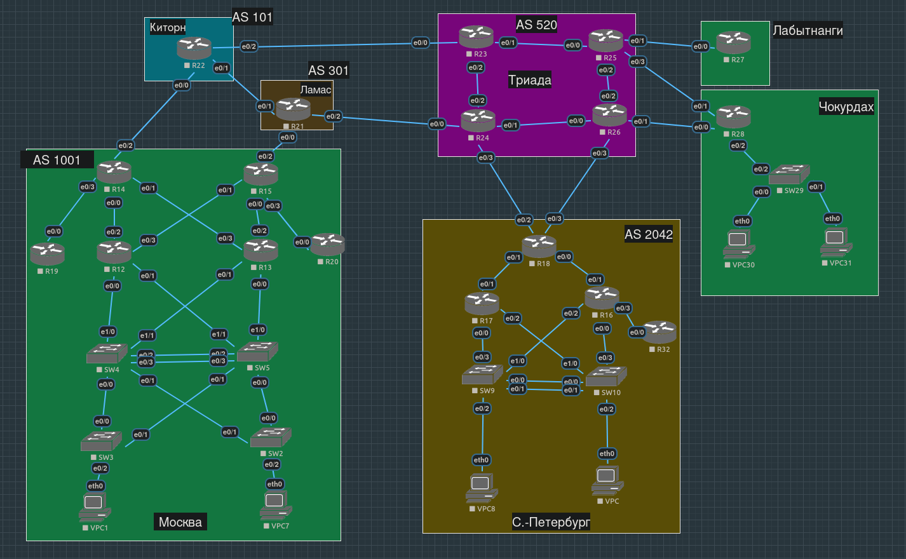

## Шаг 1: Продумывание адресного пространства

- [Адреса Loopback-интерфейсов наших маршрутизаторов](#адреса-loopback-интерфейсов-наших-маршрутизаторов)
- [Адреса SVI-интерфейсов коммутаторов](#адреса-svi-интерфейсов-коммутаторов)
- [Адреса офисных машин](#адреса-офисных-машин)
- [Адреса физических интерфейсов маршрутизаторов](#адреса-физических-интерфейсов-маршрутизаторов)
  - [Наши офисы](#наши-офисы)
  - [Оборудование провайдеров](#оборудование-провайдеров)
- [Адреса виртуальных маршрутизаторов "первого хопа"](#адреса-виртуальных-маршрутизаторов-первого-хопа)
- [Адреса ВСЕХ интерфейсов ВСЕХ устройств в одной большой таблице](#адреса-всех-интерфейсов-всех-устройств-в-одной-большой-таблице)

Сложно заглянуть далеко в будущее, чтобы быть уверенным, что ничего из однажды заданного менять не придется, но на данном этапе видится, что адреса из публичных сетей будут присвоены только маршрутизаторам на границах наших офисов, все устройства внутри (за исключением, быть может, серверов, если какие-то из VPC их символизируют) будут иметь только приватные адреса, причем желательно, чтобы на Loopback-интерфейсах маршрутизаторов, ~~на SVI-интерфейсах коммутаторов~~ (UPD: не получится) ~~и интерфейсах офисных компьютеров~~ были адреса из одного префикса (например, `192.168.0.0/16`), а на физических интерфейсах маршрутизаторов - из других, причем гораздо более мелко нарезанных (например, `10.X.Y.Z/30`, вся такая сеть - соединение двух маршрутизаторов).

###### UPD: 
позже мы убедились, что невозможно выделить интерфейсам конечных устройств (у нас VPC) адреса из того же префикса, который использовали для loopback-интерфейсов маршрутизаторов - ибо первый хоп для конечных устройств - это физический (!) интерфейс маршрутизатора (или виртуальный адрес VRRP группы маршрутизаторов, важно отметить, что и общий VRRP-адрес должен принадлежать тому же префиксу, что и адреса физических интерфейсов объединяемых в группу маршрутизаторов), а не loopback-интерфейс, соответственно, и у VPC адрес должен быть из того же префикса, из которого выделен адрес физического интерфейса маршрутизатора (или VRRP группы маршрутизаторов). Возможно, в реальной жизни, если бы вместо VPC были бы сервера, для доступа к ним извне мы бы тоже добавили им loopback-интерфейсы с адресами из того же префикса, что и у адресов loopback-интерфейсов маршрутизаторов ("внутренние" адреса физических интерфейсов серверов так же не будут известны снаружи, как и адреса многочисленных физических интерфейсов маршрутизаторов).

Маршрутизаторы из групп Киторн, Ламас и Триада считаем оборудованием провайдеров, т.е. про наши приватные сети из префиксов `192.168.0.0/16` и `10.0.0.0/8` они знать ничего не будут.

Для доступа на устройства, мы будем использовать адреса, присвоенные Loopback-интерфейсам, чтобы не думать, по какому пути, через какие физические интерфейсы, будет идти трафик от "нас" (откуда мы пытаемся обратиться к устройству). Эти же адреса впоследствии будем добавлять в протоколы динамической маршрутизации.

Также хочется разделить префиксы по географическому признаку, пусть, например, адреса на Loopback-интефейсах в московском офисе будут выделены из префикса `192.168.77.0/24`, а в питерском - из `192.168.78.0/24` (т.е. максимум по `2 ^ 8 - 2 = 254` устройства на офис/регион). Для однозначного определения расположения устройства по адресу его Loopback/SVI интерфейса, в третьем октете адреса будем использовать те же числа, что и автомобильные коды регионов. Изначально хотели использовать числа, начиная с единицы, но позже решили, что для SVI-интерфейсов коммутаторов было бы удобно обозначить в самом адресе номер management VLAN-а, а иметь VLAN c номером 1 небезопасно. UPD: позже также убедились, что адреса SVI-интерфейсов должны быть из тех же префиксов, что и адреса роутеров-на-палочке, и наша идея иметь адреса SVI-интерфейсов в том же префиксе, что и loopback-и маршрутизаторов (т.е. из префикса, который будет виден снаружи офисов), не сработает.

На граничных маршрутизаторах офисов, очевидно, будет осуществляться трансляция в публичные адреса и будут подняты VPN-туннели, чтобы из любого офиса можно было сходить в любой другой по адресам из `192.168.0.0/16`.

Пусть также для удобства число в четвертом октете адреса Loopback-интерфейса будет соответствовать номеру устройства, например, для московского `R15` адресом на `Lo0` будет `192.168.77.15/32`, для питерского `R32` - `192.168.78.32/32`. К счастью для нас, в исходной топологии номера устройств уникальны для всех наших локаций (т.е. если устройство с номером N есть в офисе в Санкт-Петербурге, то устройства с таким же номером N не может быть в Москве).

В случае с физическими адресами, будем придерживаться следующего "правила":

Для интерфейсов, смотрящих в сторону устройств, находящихся относительно данного "снизу" в нашей топологии, ~~во втором октете будем записывать номер самого устройства, а в третьем октете будем записывать номер устройства "снизу"~~ UPD: переставили содержимое второго и третьего октета местами, это нужно для маршрутизаторов, соединенных с конечными устройствами, и объединения их в VRRP-группы (причина, почему мы поменяли правило: добиваемся, чтобы у смотрящих "вниз" к конечным устройствам объединяемых в VRRP интерфейсов разных маршрутизаторов были адреса из одинаковых префиксов, во втором октете как раз будет общее для VRRP-группы число, например, 47: 4 - т.к. в сторону SW4, 7 - т.к. для VLAN 70, про VLAN [см. ниже](#наши-офисы)), т.е. во втором октете будет содержаться номер устройства "снизу", а в третьем - номер самого устройства, с которым соединен этот интерфейс. В четвертом октете будет первый доступный адрес из префикса `/30`. Например, интерфейс `e0/0` маршрутизатора `R15` соединен с маршрутизатором `R13`, поэтому его адрес будет иметь вид `10.13.15.1/30`.

Соответственно, для интерфейсов, смотрящих в сторону устройств, находящихся относительно данного "сверху" в нашей топологии, ~~во втором октете будет записан номер устройства "сверху", в третьем октете - номер самого устройства~~ UPD: во втором октете - номер самого устройства, в третьем - номер устройства "сверху", а в четвертом - следующий адрес из префикса `/30`. Например, для интерфейса `e0/3` маршрутизатора `R12`, который соединен с `R15`, по нашему "правилу" получится адрес `10.12.15.2/30`.

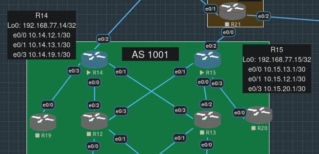

Такое "правило" нивелирует преимущество префиксов самого маленького размера, с тем же успехом можно было брать сети `/24`, и создает искусственное ограничение в 255 маршрутизаторов (максимально возможно значение во втором и третьем октете) на все офисы, но мы сделали выбор в пользу большей понятности, а не экономии приватных адресов.


### **Адреса Loopback-интерфейсов наших маршрутизаторов**:

Код региона в третьем октете.

#### ***Москва***:

| Устройство | Интерфейс | IP-адрес         |
| :--------- | :-------- | :--------------- |
| R12        | Loopback0 | 192.168.77.12/32 |
| R13        | Loopback0 | 192.168.77.13/32 |
| R14        | Loopback0 | 192.168.77.14/32 |
| R15        | Loopback0 | 192.168.77.15/32 |
| R19        | Loopback0 | 192.168.77.19/32 |
| R20        | Loopback0 | 192.168.77.20/32 |

#### ***Санкт-Петербург***:

| Устройство | Интерфейс | IP-адрес         |
| :--------- | :-------- | :----------------|
| R16        | Loopback0 | 192.168.78.16/32 |
| R17        | Loopback0 | 192.168.78.17/32 |
| R18        | Loopback0 | 192.168.78.18/32 |
| R32        | Loopback0 | 192.168.78.32/32 |

#### ***Лабытнанги***:

| Устройство | Интерфейс | IP-адрес         |
| :--------- | :-------- | :--------------- |
| R27        | Loopback0 | 192.168.89.27/32 |

#### ***Чокурдах***:

| Устройство | Интерфейс | IP-адрес         |
| :--------- | :-------- | :--------------- |
| R28        | Loopback0 | 192.168.14.28/32 |


### **Адреса физических интерфейсов маршрутизаторов**:

#### Наши офисы
Для адресов интерфейсов, соединенных с коммутаторами, в третьем октете будем дописывать к номеру коммутатора номер конечного устройства, находящегося в соотвествующем VLAN-е. В четвертом октете адресов таких интерфейсов всегда будем прописывать `254`. Чтобы номера VLAN-ов были выбраны не совсем случайно, а чтобы, находясь на коммутаторе, можно было понять, какому его интерфейсу какой VLAN должен соответствовать, будем использовать такую формулу: номер VPC умноженный на 10 - например, устройства `VPC30` и `VPC31`, соединенные с access-портами коммутатора `SW29` будут находиться в VLAN-ах 300 и 310 cоответственно (но в четвертом октете адресов sub-интерфейсов все-таки будем использовать не номер VLAN-а, а соотвествующий ему VPC, как раз из-за вылезающих за 255 номеров VLAN-ов). Конечно, для абстрактной сети это не очень удачная формула, но конкретно в нашем задании сказано "каждый VPC в каждом офисе в своем VLAN".


#### ***Москва***:

| Устройство | Интерфейс     | IP-адрес        |
| :--------- | :------------ | :-------------- |
| R12        | e0/2 (к R14)  | 10.12.14.2/30   |
|            | e0/3 (к R15)  | 10.12.15.2/30   |
|            | e0/0 (к SW4)  |                 |
|            | e0/0.10       | 10.41.12.254/16 |
|            | e0/0.70       | 10.47.12.254/16 |
|            | e0/0.77 (SVI) | 10.74.12.254/16 |
|            | e0/1 (к SW5)  |                 |
|            | e0/1.10       | 10.51.12.254/16 |
|            | e0/1.70       | 10.57.12.254/16 |
|            | e0/1.77 (SVI) | 10.75.12.254/16 |


| Устройство | Интерфейс     | IP-адрес         |
| :--------- | :-----------  | :--------------- |
| R13        | e0/2 (к R15)  | 10.13.15.2/30    |
|            | e0/3 (к R14)  | 10.13.14.2/30    |
|            | e0/0 (к SW5)  |                  |
|            | e0/0.10       | 10.51.13.254/16  |
|            | e0/0.70       | 10.57.13.254/16  |
|            | e0/0.77 (SVI) | 10.75.13.254/16  |
|            | e0/1 (к SW4)  |                  |
|            | e0/1.10       | 10.41.13.254/16  |
|            | e0/1.70       | 10.47.13.254/16  |
|            | e0/1.77 (SVI) | 10.74.13.254/16 |

| Устройство | Интерфейс    | IP-адрес      |
| :--------- | :----------- | :------------ |
| R19        | e0/0 (к R14) | 10.19.14.2/30 |

| Устройство | Интерфейс    | IP-адрес      |
| :--------- | :----------- | :------------ |
| R20        | e0/0 (к R15) | 10.20.15.2/30 |

Для провайдеров Киторн и Ламас выберем случайные существующие сети:

Киторн-Москва `38.156.254.0/24`
Ламас-Москва `131.72.76.0/24`
Киторн-Ламас `161.18.208.0/24`

| Устройство | Интерфейс            | IP-адрес          |
| :--------- | :------------------- | :---------------- |
| R14        | e0/0 (к R12)         | 10.12.14.1/30     |
|            | e0/1 (к R13)         | 10.13.14.1/30     |
|            | e0/1 (к R22 Киторн)  | 38.156.254.14/24  |
|            | e0/3 (к R19)         | 10.19.14.1/30     |

| Устройство | Интерфейс           | IP-адрес         |
| :--------- | :------------------ | :--------------- |
| R15        | e0/0 (к R13)        | 10.13.15.1/30    |
|            | e0/1 (к R12)        | 10.12.15.1/30    |
|            | e0/2 (к R21 Ламас)  | 131.72.76.15/24  |
|            | e0/3 (к R20)        | 10.20.15.1/30    |

#### ***Санкт-Петербург***:

| Устройство | Интерфейс     | IP-адрес         |
| :--------- | :------------ | :--------------- |
| R16        | e0/1 (к R18)  | 10.16.18.2/30    |
|            | e0/3 (к R32)  | 10.32.16.1/30    |
|            | e0/0 (к SW10) |                  |
|            | e0/0.80       | 10.108.16.254/16 |
|            | e0/0.110      | 10.101.16.254/16 |
|            | e0/0.78 (SVI) | 10.107.16.254/16 |
|            | e0/2 (к SW9)  |                  |
|            | e0/2.80       | 10.98.16.254/16  |
|            | e0/2.110      | 10.91.16.254/16  |
|            | e0/2.78 (SVI) | 10.97.16.254/16  |


| Устройство | Интерфейс     | IP-адрес         |
| :--------- | :------------ | :--------------- |
| R17        | e0/1 (к R18)  | 10.17.18.2/30    |
|            | e0/0 (к SW9)  |                  |
|            | e0/0.80       | 10.98.17.254/16  |
|            | e0/0.110      | 10.91.17.254/16  |
|            | e0/0.78 (SVI) | 10.97.17.254/16  |
|            | e0/2 (к SW10) |                  |
|            | e0/2.80       | 10.108.17.254/16 |
|            | e0/2.110      | 10.101.17.254/16 |
|            | e0/2.78 (SVI) | 10.107.17.254/16 |

| Устройство | Интерфейс    | IP-адрес      |
| :--------- | :----------- | :------------ |
| R32        | e0/0 (к R16) | 10.32.16.2/30 |


Пусть все интерфейсы, соединенные с внешними интерфейсами маршрутизаторов Триады, будут иметь адреса из префикcов `89.178.XY.Z/24`, где `X` - номер "нашего" маршрутизатора, `Y` - номер интерфейса "нашего" маршрутизатора (если он подключен сразу к нескольким марщрутизаторам Триады), `Z`- номер маршрутизатора Триады.

| Устройство | Интерфейс           | IP-адрес         |
| :--------- | :------------------ | :--------------- |
| R18        | e0/0 (к R16)        | 10.16.18.1/30    |
|            | e0/1 (к R17)        | 10.17.18.1/30    |
|            | e0/2 (к R24 Триада) | 89.178.182.24/24 |
|            | e0/3 (к R26 Триада) | 89.178.183.26/24 |

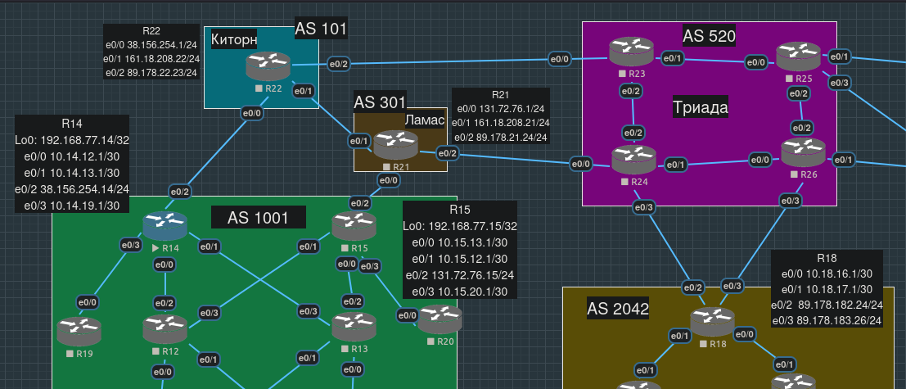

#### ***Лабытнанги***:

| Устройство | Интерфейс           | IP-адрес        |
| :--------- | :------------------ | :-------------- |
| R27        | e0/0 (к R25 Триада) | 89.178.27.25/24 |

#### ***Чокурдах***:

Здесь такой же трюк с `89.178.XY.Z/24` (см. выше) не провернуть, т.к. полученное `XY` окажется больше 255, поэтому будем добавлять цифру из номера интерфейса в середину, между двумя цифрами номера маршрутизатора (получится 208 и 218).

| Устройство | Интерфейс           | IP-адрес         |
| :--------- | :------------------ | :--------------- |
| R28        | e0/0 (к R26 Триада) | 89.178.208.26/24 |
|            | e0/1 (к R25 Триада) | 89.178.218.25/24 |
|            | e0/2 (к SW29)       |                  |
|            | e0/2.300            | 10.30.28.254/24  |
|            | e0/2.310            | 10.31.28.254/24  |
|            | e0/2.140            | 10.14.28.254/24  |

### **Адреса виртуальных маршрутизаторов "первого хопа"**:

Поскольку в офисах Москвы и Санкт-Петербурга имеется по два VLAN-а, и по два маршрутизатора "первого хопа", напрашивается также добавление двух групп VRRP: для каждого VLAN-а будет свой адрес шлюза по умолчанию, оба из которых - вирутальные для пары маршрутизаторов, причем для одного VLAN-а более приоритетным будет один из физических маршрутизаторов пары, а для второго VLAN-а - другой. 

~~Выделяем эти виртуальные адреса из того же префикса, что и для адресов Loopback-интерфейсов маршрутизаторов и для адресов офисных машин.~~ UPD: как отмечалось [выше](#upd), это сделать невозможно: общий виртуальный адрес VRRP-группы обязан быть выделен из того же префикса, что и входящие в нее физические интерфейсы, так что от идеи "адреса VPC, виртуальный адрес VRRP и адреса всех loopback-интерфейсов маршрутизаторов в одном префиксе" пришлось отказаться. Более того, с нашим задуманным правилом для второго октета адреса интерфейса, смотрящего "вниз", значение в котором должно символизировать номер устройства, нам вообще не удастся объединить интерфейсы разных маршрутизаторов в одну VRRP-группу.

~~Хотим использовать в четвертом октете номер VLAN-а, нам повезло, что нет пересечений с номерами устройств.~~ UPD: не получится, если по две группы на каждый VLAN.

#### ***Москва***:

У нас по два физических интерфейса в сторону VPC на каждом из двух маршрутизаторов, на каждом интерфейсе - по два sub-интерфейса, соответстующих VLAN-ам, в которые входят VPC. Мы не хотим объединять суммарно четыре интерфейса (например,на e0/0.10 и e0/1.10 R12 и на e0/0.10 и e0/1.10 R13 для VLAN 10) в одну группу - к тому же, наверняка, невозможно включить в состав группы интерфейсы одного и того же маршрутизатора, так что пусть лучше у нас будет по две VRRP-группы на каждый VLAN (т.е. для VLAN 10 две, и для VLAN 70 тоже две).


| Устройство | VLAN       | IP-адрес         |
| :--------- | :--------- | :--------------- |
| R12-R13    | 10 (к SW4) | 10.41.254.254/16 |
|            | 10 (к SW5) | 10.51.254.254/16 |
|            | 70 (к SW4) | 10.47.254.254/16 |
|            | 70 (к SW5) | 10.57.254.254/16 |
|            | 77 (к SW4) | 10.74.254.254/16 |
|            | 77 (к SW5) | 10.75.254.254/16 |

#### ***Санкт-Петербург***:

| Устройство | VLAN         | IP-адрес          |
| :--------- | :---------   | :---------------- |
| R16-R17    | 80 (к SW9)   | 10.98.254.254/16  |
|            | 80 (к SW10)  | 10.108.254.254/16 |
|            | 110 (к SW9)  | 10.91.254.254/16  |
|            | 110 (к SW10) | 10.101.254.254/16 |
|            | 78 (к SW9)   | 10.97.254.254/16  |
|            | 78 (к SW10)  | 10.107.254.254/16 |

### **Адреса SVI-интерфейсов коммутаторов**:

~~Код региона в третьем октете - он же соответствует номеру management VLAN-а. Длина префикса `/24` - хотели выставить `/32`, но Cisco IOS не позволяет это сделать.~~ UPD: от идеи выделять адреса SVI-интерфейсов из того же префикса, что и адреса loopback-интерфейсов маршрутизаторов пришлось отказаться (после неудачных экспериментов с `ip route` на коммутаторах).

#### ***Москва***:

| Устройство | Интерфейс | IP-адрес     |
| :--------- | :-------- | :----------- |
| SW2        | SVI 77    | 10.75.2.2/16 |
| SW3        | SVI 77    | 10.74.3.3/16 |
| SW4        | SVI 77    | 10.74.4.4/16 |
| SW5        | SVI 77    | 10.75.5.5/16 |

#### ***Санкт-Петербург***:

| Устройство | Интерфейс | IP-адрес        |
| :--------- | :-------- | :-------------- |
| SW9        | SVI 78    | 10.97.9.9/16    |
| SW10       | SVI 78    | 10.107.10.10/16 |

#### ***Чокурдах***:

| Устройство | Интерфейс | IP-адрес       |
| :--------- | :-------- | :------------- |
| SW29       | SVI 14    | 10.14.28.29/24 |

### **Адреса офисных машин**:

С учетом [столкновения с суровой реальностью](#upd), на физических интерфейсах офисных конечных устройств пришлось выделить адреса, находящиеся в том же префиксе, что и адреса физических интерфейсов соединенных с ними маршрутизаторов, и виртуальные VRRP-адреса объединений интерфейсов этих маршрутизаторов.

#### ***Москва***:

| Устройство | Интерфейс | IP-адрес     |
| :--------- | :-------- | :----------- |
| VPC1       | eth0      | 10.41.1.1/16 |
| VPC7       | eth0      | 10.57.7.7/16 |

#### ***Санкт-Петербург***:

| Устройство | Интерфейс | IP-адрес        |
| :--------- | :-------- | :-------------- |
| VPC8       | eth0      | 10.98.8.8/16    |
| VPC11      | eth0      | 10.101.11.11/16 |

#### ***Чокурдах***:

| Устройство | Интерфейс | IP-адрес        |
| :--------- | :-------- | :-------------- |
| VPC30      | eth0      | 10.30.28.254/24 |
| VPC31      | eth0      | 10.31.28.254/24 |

#### Оборудование провайдеров

Выше выбрали сеть `161.18.208.0/24` между провайдерами Киторн-Ламас. Для интерфейсов в сторону Триады правило то же: `89.178.X.Z/24`, где `X` - номер маршрутизатора Киторн/Ламас, `Z`- номер маршрутизатора Триады.

#### ***Ламас***:

| Устройство | Интерфейс           | IP-адрес         |
| :--------- | :------------------ | :--------------- |
| R21        | e0/0 (к R15)        | 131.72.76.1/24   |
|            | e0/1 (к R22 Киторн) | 161.18.208.21/24 |
|            | e0/2 (к R24 Триада) | 89.178.21.24/24  |

#### ***Киторн***:

| Устройство | Интерфейс           | IP-адрес         |
| :--------- | :------------------ | :--------------- |
| R22        | e0/0 (к R14)        | 38.156.254.1/24  |
|            | e0/1 (к R21 Ламас)  | 161.18.208.22/24 |
|            | e0/2 (к R23 Триада) | 89.178.22.23/24  |

#### ***Триада***:

Выберем `/24` сети для взаимодействия внутри Триады из приватного префикса `172.16.0.0/12`. Опять-таки, можно было обойтись сетями `/30`, но мы хотим, чтобы в четвертом октете адресов содержалось значение, имеющее какой-то смысл.

Пусть в третьем октете содержится число, составленное из младших разрядов номеров маршрутизаторов, начиная с меньшей цифры, например, сеть между `R23` и `R25` будет иметь в третьем октете `35`, а между `R24` и `R25` - `46`.
В четвертом октете пусть содержится номер маршрутизатора, с которым соединен данный интерфейс, например, для интерфейса `e0/1` маршрутизатора `R23`, которым он соединен с `R25`, в четвертом октете адреса будет число `25`.

Адреса к офисам выделены из `89.178.XY.Z/24`, где `XY` - номер офисного маршрутизатора, с добавленным к нему номером интерфейса офисного маршрутизатора (для случаев, когда один офисный маршрутизатор соединен с несколькими маршрутизаторами Триады, см. выше описание перед таблицами офисных маршрутизаторов), `Z` же пускай всегда будет равным `254`.

| Устройство | Интерфейс           | IP-адрес         |
| :--------- | :------------------ | :--------------- |
| R23        | e0/0 (к R22 Киторн) | 89.178.22.254/24 |
|            | e0/1 (к R25)        | 172.16.35.25/24  |
|            | e0/2 (к R24)        | 172.16.34.24/24  |

| Устройство | Интерфейс           | IP-адрес          |
| :--------- | :------------------ | :---------------- |
| R24        | e0/0 (к R21 Ламас)  | 89.178.21.254/24  |
|            | e0/1 (к R26)        | 172.16.46.26/24   |
|            | e0/2 (к R23)        | 172.16.34.23/24   |
|            | e0/3 (к R18 Питер)  | 89.178.182.254/24 |

| Устройство | Интерфейс               | IP-адрес          |
| :--------- | :---------------------- | :---------------- |
| R25        | e0/0 (к R23)            | 172.16.35.23/24   |
|            | e0/1 (к R27 Лабытнанги) | 89.178.27.254/24  |
|            | e0/2 (к R25)            | 172.16.56.26/24   |
|            | e0/3 (к R28 Чокурдах)   | 89.178.218.254/24 |

| Устройство | Интерфейс               | IP-адрес          |
| :--------- | :---------------------- | :---------------- |
| R26        | e0/0 (к R24)            | 172.16.46.24/24   |
|            | e0/1 (к R28 Чокурдах)   | 89.178.208.254/24 |
|            | e0/2 (к R25)            | 172.16.56.25/24   |
|            | e0/3 (к R18 Питер)      | 89.178.183.254/24 |

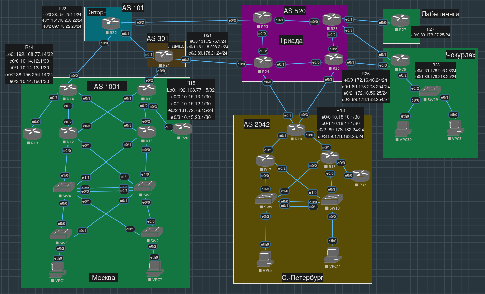


### **Адреса ВСЕХ интерфейсов ВСЕХ устройств в одной большой таблице**

| Устройство | Локация         | Интерфейс               | IP-адрес          |
| :--------- |:--------------  | :---------------------- | :---------------- |
| VPC1       | Москва          | eth0 (к SW3)            | 10.41.1.1/16      |
| SW2        | Москва          | SVI 77                  | 10.75.2.2/16      |
| SW3        | Москва          | SVI 77                  | 10.74.3.3/16      |
| SW4        | Москва          | SVI 77                  | 10.74.4.4/16      |
| SW5        | Москва          | SVI 77                  | 10.75.5.5/16      |
| VPC7       | Москва          | eth0 (к SW2)            | 10.57.7.7/16      |
| VPC8       | Санкт-Петербург | eth0 (к SW9)            | 10.98.8.8/16      |
| SW9        | Санкт-Петербург | SVI 78                  | 10.97.9.9/16      |
| SW10       | Санкт-Петербург | SVI 78                  | 10.107.10.10/16   |
| VPC11      | Санкт-Петербург | eth0 (к SW10)           | 10.101.11.11/16   |
| R12        | Москва          | e0/0 (к SW4)            |                   |
|            |                 | e0/0.10 (VLAN 10)       | 10.41.12.254/16   |
|            |                 | e0/0.70 (VLAN 70)       | 10.47.12.254/16   |
|            |                 | e0/0.77 (VLAN 77)       | 10.74.12.254/16   |
|            |                 | e0/1 (к SW5)            |                   |
|            |                 | e0/1.10 (VLAN 10)       | 10.51.12.254/16   |
|            |                 | e0/1.70 (VLAN 70)       | 10.57.12.254/16   |
|            |                 | e0/1.77 (VLAN 77)       | 10.75.12.254/16   |
|            |                 | e0/2 (к R14)            | 10.12.14.2/30     |
|            |                 | e0/3 (к R15)            | 10.12.15.2/30     |
|            |                 | Loopback0               | 192.168.77.12/32  |
| R13        | Москва          | e0/0 (к SW5)            |                   |
|            |                 | e0/0.10 (VLAN 10)       | 10.51.13.254/16   |
|            |                 | e0/0.70 (VLAN 70)       | 10.57.13.254/16   |
|            |                 | e0/0.77 (VLAN 77)       | 10.75.13.254/16   |
|            |                 | e0/1 (к SW4)            |                   |
|            |                 | e0/1.10 (VLAN 10)       | 10.41.13.254/16   |
|            |                 | e0/1.70 (VLAN 70)       | 10.47.13.254/16   |
|            |                 | e0/1.77 (VLAN 77)       | 10.74.13.254/16   |
|            |                 | e0/2 (к R15)            | 10.13.15.2/30     |
|            |                 | e0/3 (к R14)            | 10.13.14.2/30     |
|            |                 | Loopback0               | 192.168.77.13/32  |
| R12-R13    | Москва          | VLAN10 (к SW4)          | 10.41.254.254/16  |
|            |                 | VLAN10 (к SW5)          | 10.51.254.254/16  |
|            |                 | VLAN70 (к SW4)          | 10.47.254.254/16  |
|            |                 | VLAN70 (к SW5)          | 10.57.254.254/16  |
|            |                 | VLAN77 (к SW4)          | 10.74.254.254/16  |
|            |                 | VLAN77 (к SW5)          | 10.75.254.254/16  |
| R14        | Москва          | e0/0 (к R12)            | 10.12.14.1/30     |
|            |                 | e0/1 (к R13)            | 10.13.14.1/30     |
|            |                 | e0/1 (к R22 Киторн)     | 38.156.254.14/24  |
|            |                 | e0/3 (к R19)            | 10.19.14.1/30     |
|            |                 | Loopback0               | 192.168.77.14/32  |
| R15        | Москва          | e0/0 (к R13)            | 10.13.15.1/30     |
|            |                 | e0/1 (к R12)            | 10.12.15.1/30     |
|            |                 | e0/2 (к R21 Ламас)      | 131.72.76.15/24   |
|            |                 | e0/3 (к R20)            | 10.20.15.1/30     |
|            |                 | Loopback0               | 192.168.77.15/32  |
| R16        | Санкт-Петербург | e0/0 (к SW10)           |                   |
|            |                 | e0/0.80 (VLAN 80)       | 10.108.16.254/16  |
|            |                 | e0/0.110 (VLAN 110)     | 10.101.16.254/16  |
|            |                 | e0/0.78 (VLAN 78)       | 10.107.16.254/16  |
|            |                 | e0/1 (к R18)            | 10.16.18.2/30     |
|            |                 | e0/2 (к SW9)            |                   |
|            |                 | e0/2.80 (VLAN 80)       | 10.98.16.254/16   |
|            |                 | e0/2.110 (VLAN 110)     | 10.91.16.254/16   |
|            |                 | e0/2.78 (VLAN 78)       | 10.97.16.254/16   |
|            |                 | e0/3 (к R32)            | 10.32.16.1/30     |
|            |                 | Loopback0               | 192.168.78.16/32  |
| R17        | Санкт-Петербург | e0/0 (к SW9)            |                   |
|            |                 | e0/0.80 (VLAN 80)       | 10.98.17.254/16   |
|            |                 | e0/0.110 (VLAN 110)     | 10.91.17.254/16   |
|            |                 | e0/0.78 (VLAN 78)       | 10.97.17.254/16   |
|            |                 | e0/1 (к R18)            | 10.17.18.2/30     |
|            |                 | e0/2 (к SW10)           |                   |
|            |                 | e0/2.80 (VLAN 80)       | 10.108.17.254/16  |
|            |                 | e0/2.110 (VLAN 110)     | 10.101.17.254/16  |
|            |                 | e0/2.78 (VLAN 78)       | 10.107.17.254/16  |
|            |                 | Loopback0               | 192.168.78.17/32  |
| R16-R17    | Санкт-Петербург | VLAN80 (к SW9)          | 10.98.254.254/16  |
|            |                 | VLAN80 (к SW10)         | 10.108.254.254/16 |
|            |                 | VLAN110 (к SW9)         | 10.91.254.254/16  |
|            |                 | VLAN110 (к SW10)        | 10.101.254.254/16 |
|            |                 | VLAN78 (к SW9)          | 10.97.254.254/16  |
|            |                 | VLAN78 (к SW10)         | 10.107.254.254/16 |
| R18        | Санкт-Петербург | e0/0 (к R16)            | 10.16.18.1/30     |
|            |                 | e0/1 (к R17)            | 10.17.18.1/30     |
|            |                 | e0/2 (к R24 Триада)     | 89.178.182.24/24  |
|            |                 | e0/3 (к R26 Триада)     | 89.178.183.26/24  |
|            |                 | Loopback0               | 192.168.78.18/32  |
| R19        | Москва          | e0/0 (к R14)            | 10.19.14.2/30     |
|            |                 | Loopback0               | 192.168.77.19/32  |
| R20        | Москва          | e0/0 (к R15)            | 10.20.15.2/30     |
|            |                 | Loopback0               | 192.168.77.20/32  |
| R21        | Ламас           | e0/0 (к R15)            | 131.72.76.1/24    |
|            |                 | e0/1 (к R22 Киторн)     | 161.18.208.21/24  |
|            |                 | e0/2 (к R24 Триада)     | 89.178.21.24/24   |
| R22        | Киторн          | e0/0 (к R14)            | 38.156.254.1/24   |
|            |                 | e0/1 (к R21 Ламас)      | 161.18.208.22/24  |
|            |                 | e0/2 (к R23 Триада)     | 89.178.22.23/24   |
| R23        | Триада          | e0/0 (к R22 Киторн)     | 89.178.22.254/24  |
|            |                 | e0/1 (к R25)            | 172.16.35.25/24   |
|            |                 | e0/2 (к R24)            | 172.16.34.24/24   |
| R24        | Триада          | e0/0 (к R21 Ламас)      | 89.178.21.254/24  |
|            |                 | e0/1 (к R26)            | 172.16.46.26/24   |
|            |                 | e0/2 (к R23)            | 172.16.34.23/24   |
|            |                 | e0/3 (к R18 Питер)      | 89.178.182.254/24 |
| R25        | Триада          | e0/0 (к R23)            | 172.16.35.23/24   |
|            |                 | e0/1 (к R27 Лабытнанги) | 89.178.27.254/24  |
|            |                 | e0/2 (к R25)            | 172.16.56.26/24   |
|            |                 | e0/3 (к R28 Чокурдах)   | 89.178.218.254/24 |
| R26        | Триада          | e0/0 (к R24)            | 172.16.46.24/24   |
|            |                 | e0/1 (к R28 Чокурдах)   | 89.178.208.254/24 |
|            |                 | e0/2 (к R25)            | 172.16.56.25/24   |
|            |                 | e0/3 (к R18 Питер)      | 89.178.183.254/24 |
| R27        | Лабытнанги      | e0/0 (к R25 Триада)     | 89.178.27.25/24   |
|            |                 | Loopback0               | 192.168.89.27/32  |
| R28        | Чокурдах        | e0/0 (к R26 Триада)     | 89.178.208.26/24  |
|            |                 | e0/1 (к R25 Триада)     | 89.178.218.25/24  |
|            |                 | e0/2 (к SW29)           |                   |
|            |                 | e0/2.300                | 10.30.28.254/24   |
|            |                 | e0/2.310                | 10.31.28.254/24   |
|            |                 | e0/2.140                | 10.14.28.254/24   |
|            |                 | Loopback0               | 192.168.14.28/32  |
| SW29       | Чокурдах        | SVI 14                  | 10.14.28.29/24    |
| VPC30      | Чокурдах        | eth0 (к SW29)           | 10.30.28.254/24   |
| VPC31      | Чокурдах        | eth0 (к SW29)           | 10.31.28.254/24   |
| R32        | Санкт-Петербург | e0/0 (к R16)            | 10.32.16.2/30     |
|            |                 | Loopback0               | 192.168.78.32/32  |


## Шаг 2: Настройка IP-адресов на активных портах

Теперь, пользуясь составленной на предыдущем шаге таблицей, мы можем настроить адреса на устройствах сети.

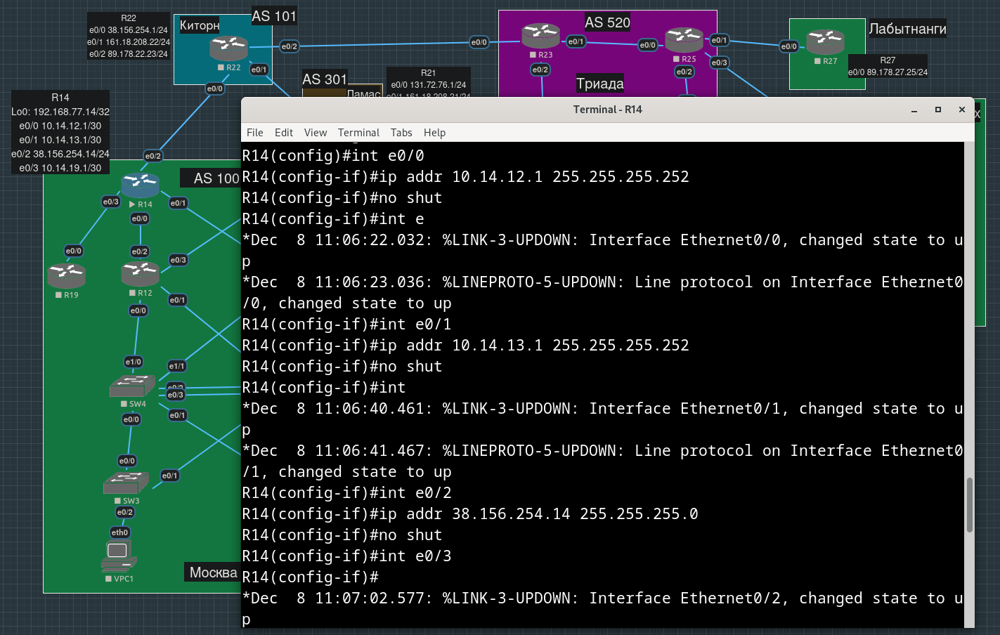

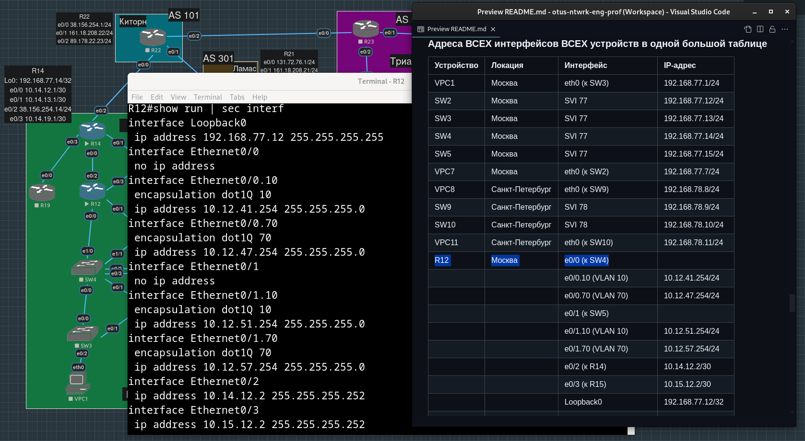

Пробуем пинговать соседей "снизу" на `R14` и `R15`:

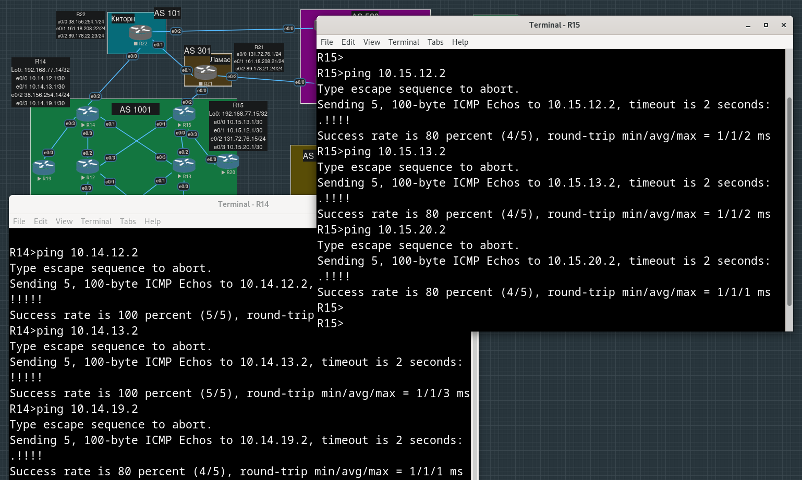

Пингуем `R18` и `R32` с `R16`:

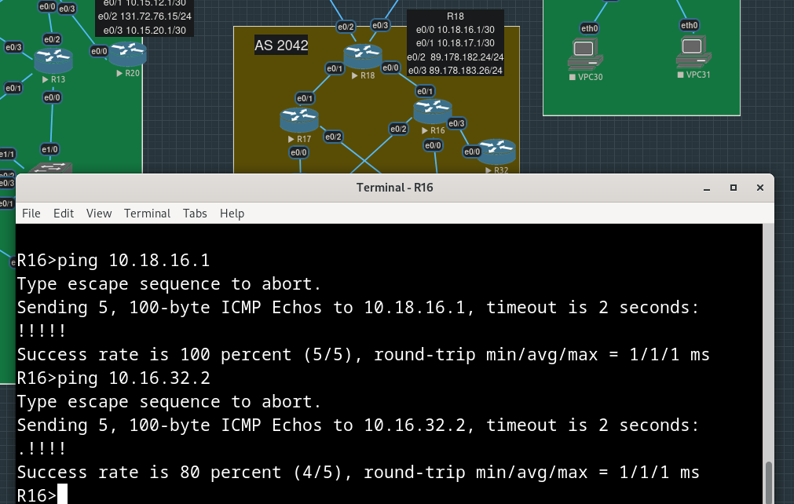

Пингуем с `R24` всех его соседей:

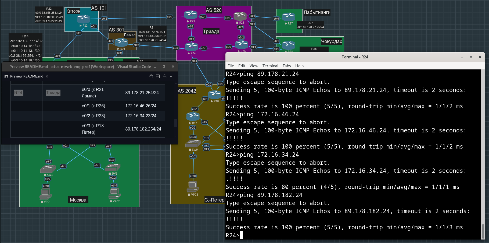

Пингуем с `R25` всех его соседей:


## Шаг 3: Настройка VLAN и SVI-интерфейсов коммутаторов

В качестве native vlan-а выберем 99. В качестве vlan-а для неиспользуемых портов выберем 1000. Неиспользуемые порты заблокируем явно.

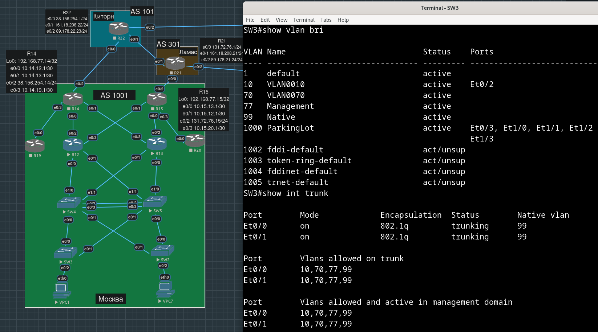

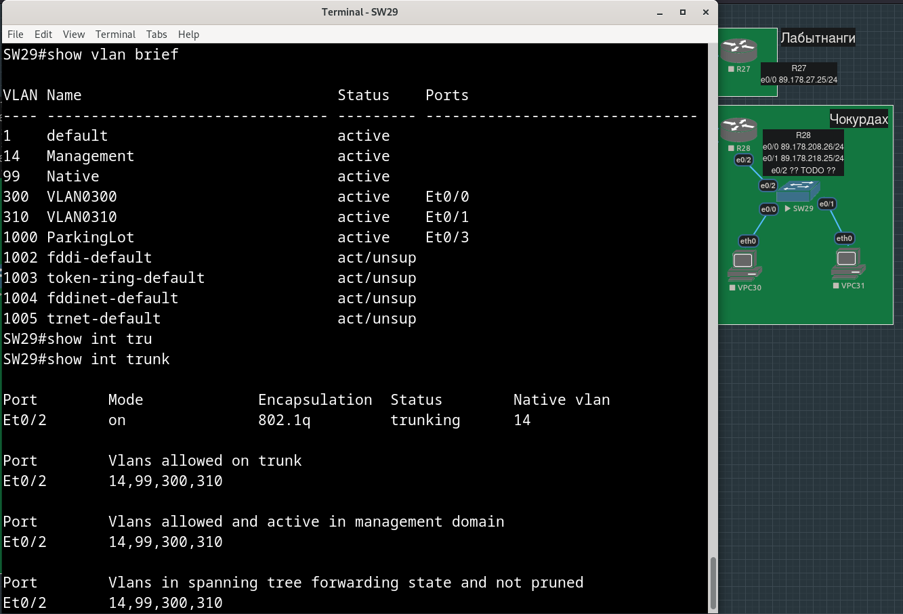


Настраиваем адреса на sub-интерфейса маршрутизаторов, относящихся к management-vlan-ам:

```
R13(config)#int e0/1.77
R13(config-subif)#encapsulation dot1Q 77
R13(config-subif)#ip addr 10.74.13.254 255.255.0.0 
R13(config-subif)#no shut
```

## Шаг 4: Настройка агрегации каналов (LACP) между коммутаторами

С обеих сторон настраиваем LACP в активном режиме.

```
SW4(config-if-range)#channel-group 1 mode ?
  active     Enable LACP unconditionally
  auto       Enable PAgP only if a PAgP device is detected
  desirable  Enable PAgP unconditionally
  on         Enable Etherchannel only
  passive    Enable LACP only if a LACP device is detected

SW4(config-if-range)#channel-group 1 mode act
SW4(config-if-range)#channel-group 1 mode active 
Creating a port-channel interface Port-channel 1

SW4(config-if-range)#exit
SW4(config)#int po1
SW4(config-if)#no shut
```

Выглядит так, будто нужно настраивать транк не только на агрегированном порту, но и на входящих в него физических портах (в `show vlan` входящие в транк физические порты отображались как принадлежащие дефолтному `vlan 1`).

Также непонятно различие в последней записи `Vlans in spanning tree forwarding state and not pruned` для агрегированного `Po1` (на `SW5` - `none`, в отличие от `SW4` со списком vlan-ов):

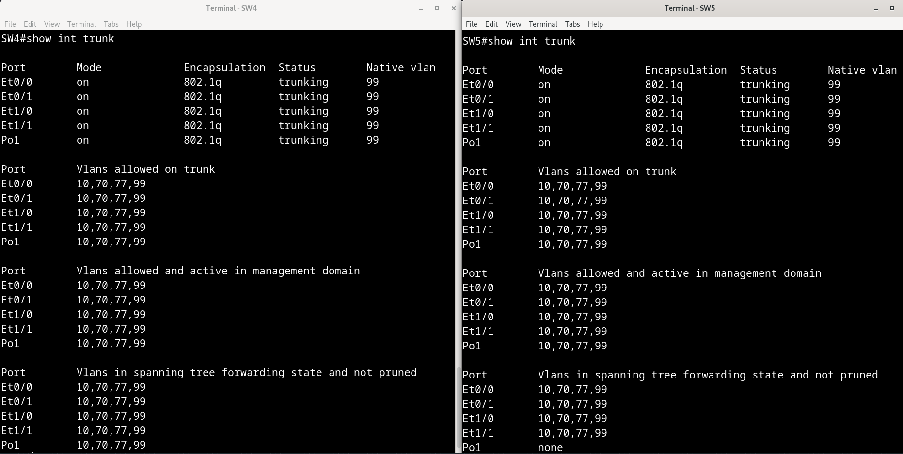

Перезагрузка агрегированного порта на обоих коммутаторах ситуацию не изменила.

Аналогично настроили в Петербурге:

```
SW10(config)#int ra e0/0-1
SW10(config-if-range)#channel-group 1 mode active 
Creating a port-channel interface Port-channel 1

SW10(config-if-range)#switchport trunk encapsulation dot1q
SW10(config-if-range)#switchport trunk allowed v 78,80,99,110
SW10(config-if-range)#switchport trunk native vlan 99
SW10(config-if-range)#exit
SW10(config)#int po1                                
SW10(config-if)#no shut
SW10(config-if)#int ra e0/0-1                          
SW10(config-if-range)#no shut
```

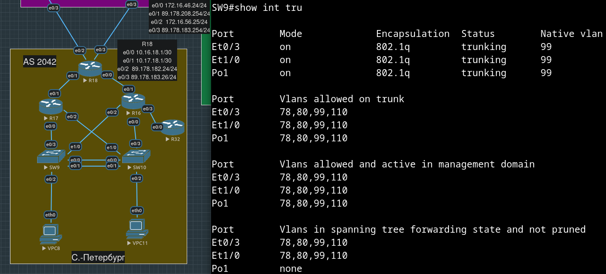


## Шаг 5: Настройка корневых коммутаторов для STP

Переключим протокол Spanning Tree на всех коммутаторах в режим RPVTS:

```
SW5(config)#spanning-tree mode rapid-pvst 
```

Чтобы избежать блокировки линков, назначим для каждого VLAN-а свой корневой коммутатор.

Пусть для vlan-ов 10 и 99 корневым будет `SW4`, а для vlan-ов 70 и 77 корневым будет `SW5`.

```
SW4(config)#spanning-tree vlan 10 root primary 
SW4(config)#spanning-tree vlan 99 root primary     
SW4(config)#spanning-tree vlan 70 root secondary 
SW4(config)#spanning-tree vlan 77 root secondary 
```

На соседнем коммутаторе того же уровня, наоборот:

```
SW5(config)#spanning-tree vlan 70 root primary 
SW5(config)#spanning-tree vlan 77 root primary 
SW5(config)#spanning-tree vlan 10 root secondary 
SW5(config)#spanning-tree vlan 99 root secondary 
```

Ниже результат применения настроек на `SW4` и `SW5` для vlan 10 - видно, что `SW4` стал для него корневым коммутатором, а на `SW5` смотрящий на `SW4` агрегированный порт `Po1` стал корневым портом.

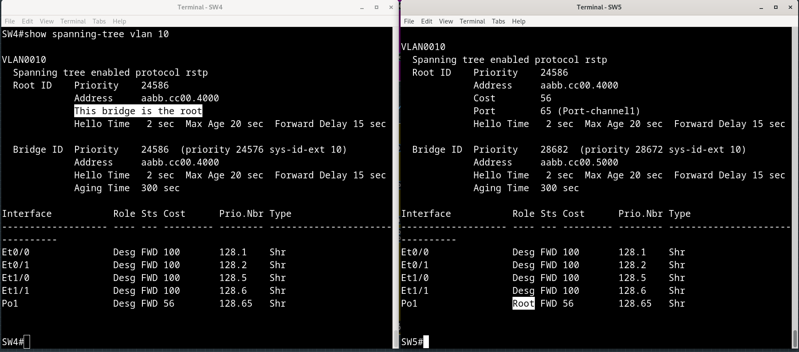

К счастью, после объединения на предыдущем шаге обоих линков между коммутаторами в Петербурге в одну агрегацию, L2-петель в других локациях возникнуть не может.

## Шаг 6: Настройка VRRP на парах R12-R13 и R16-R17

Ради VRRP нам пришлось изменить наше "правило" выставления определенных числе в октеты адресов физических интерфейсов маршрутизаторов. Для sub-интерфейсов, обслуживающих management VLAN-ы, также настроили VRRP группы.

Для группы 41 (интерфейсы в сторону SW4, VLAN 10):

```
R12(config)#int e0/0.10
R12(config-subif)#ip address 10.41.12.254 255.255.0.0
R12(config-subif)#vrrp 41 ip 10.41.254.254
```

```
R13(config)#int e0/1.10
R13(config-subif)#ip address 10.41.13.254 255.255.0.0
R13(config-subif)#vrrp 41 ip 10.41.254.254
```

Для группы 57 (интерфейсы в сторону SW5, VLAN 70):

```
R12(config)#int e0/1.70
R12(config-subif)#ip address 10.57.12.254 255.255.0.0
R12(config-subif)#vrrp 57 ip 10.57.254.254
```

```
R13(config)#int e0/0.70
R13(config-subif)#ip address 10.57.13.254 255.255.0.0
R13(config-subif)#vrrp 57 ip 10.57.254.254
```

На Санкт-Петербургских маршрутизаторах:

```
R17(config)#int e0/0.80
R17(config-subif)#vrrp 98 ip 10.98.254.254

R17(config)#int e0/0.110              
R17(config-subif)#vrrp 91 ip 10.91.254.254

R17(config-subif)#int e0/2.80 
R17(config-subif)#vrrp 108 ip 10.108.254.254

R17(config-subif)#int e0/2.110
R17(config-subif)#vrrp 101 ip 10.101.254.254
```

```
R16(config)#int e0/0.80
R16(config-subif)#vrrp 108 ip 10.108.254.254

R16(config-subif)#int e0/0.110
R16(config-subif)#vrrp 101 ip 10.101.254.254

R16(config-subif)#int e0/2.80
R16(config-subif)#vrrp 98 ip 10.98.254.254

R16(config-subif)#int e0/2.110
R16(config-subif)#vrrp 91 ip 10.91.254.254
```

## Шаг 7: Настройка IP адресов и адресов шлюза по умолчанию на VPC

В качестве шлюза по умолчанию будет выступать один из адресов VRRP-групп:

Москва:

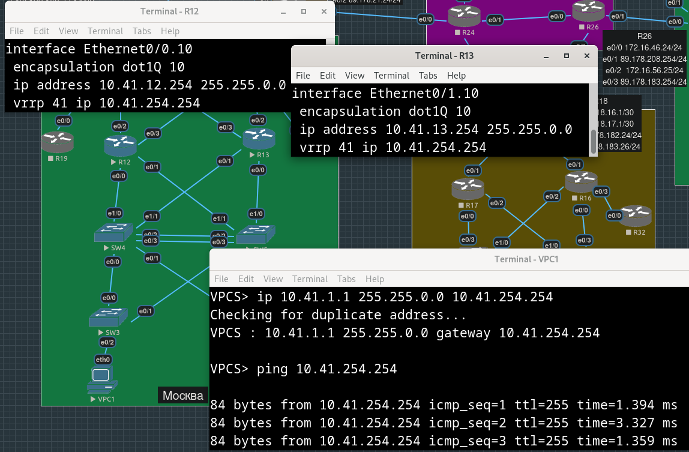

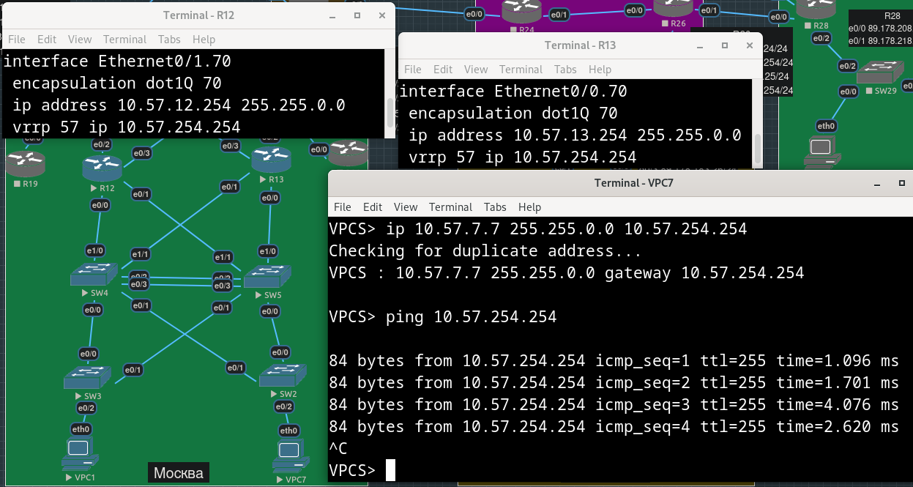

Петербург:

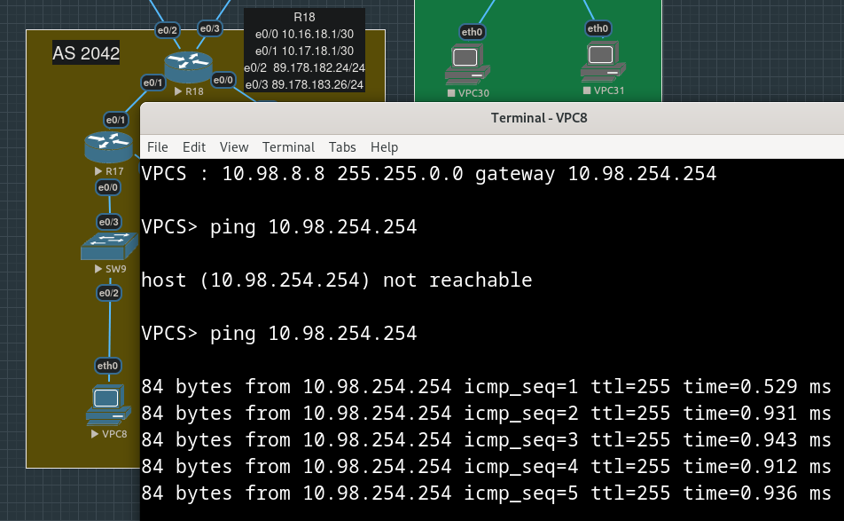

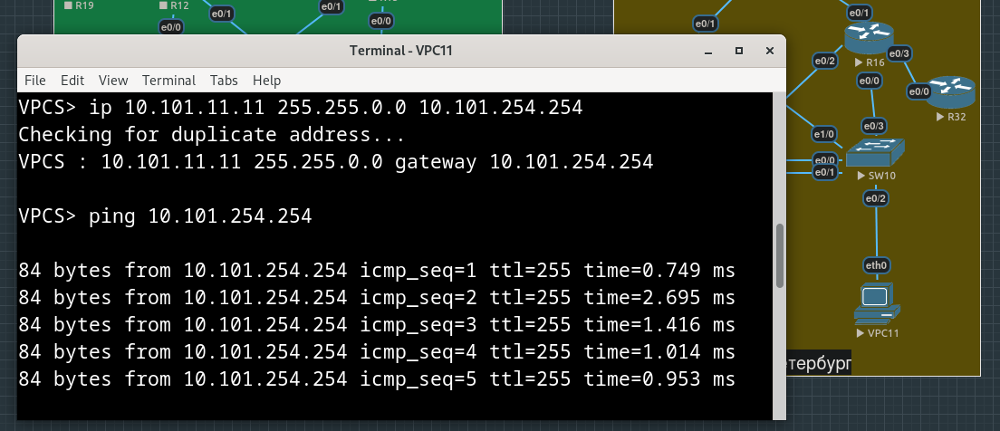

В локации Чокурдах нет VRRP:

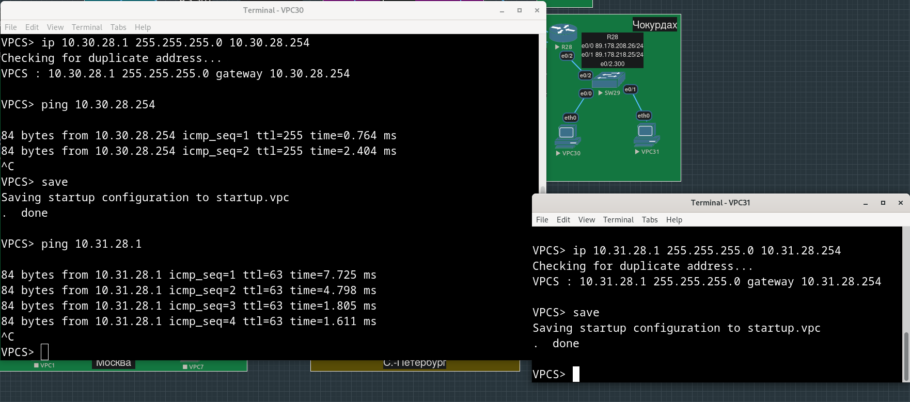

Проверяем возможность пропинговать с VPC managament-адреса коммутаторов (не забыли прописать дефолтный маршрут на коммутаторах):

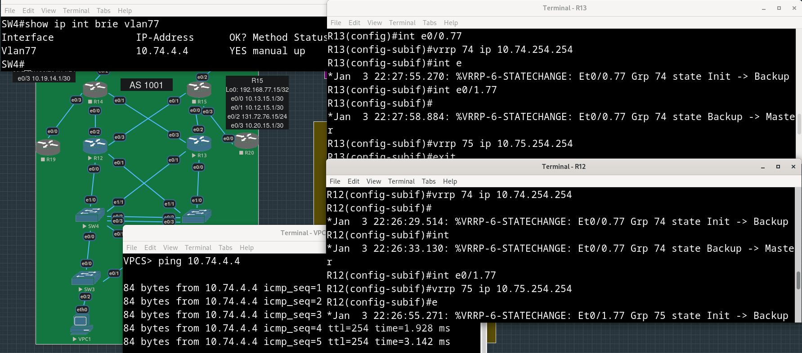

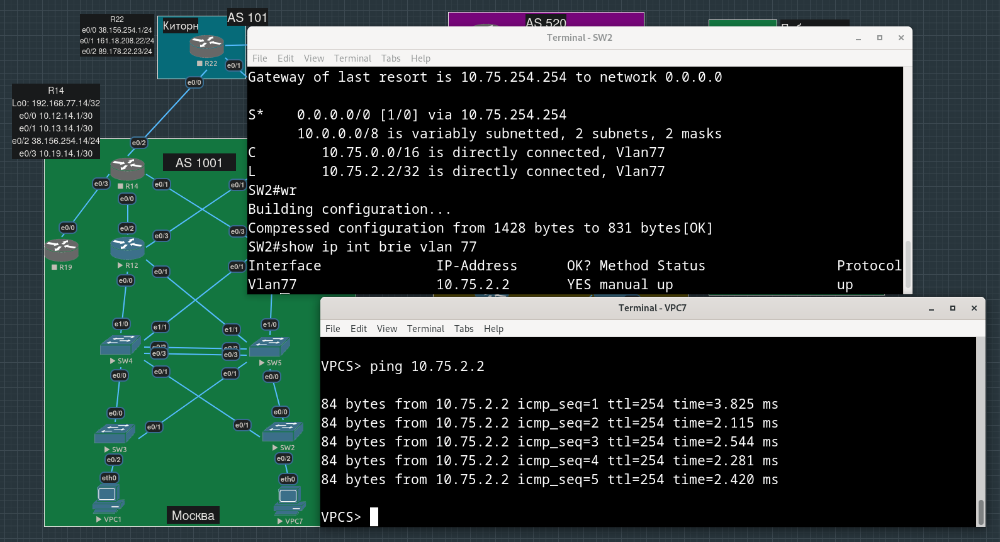

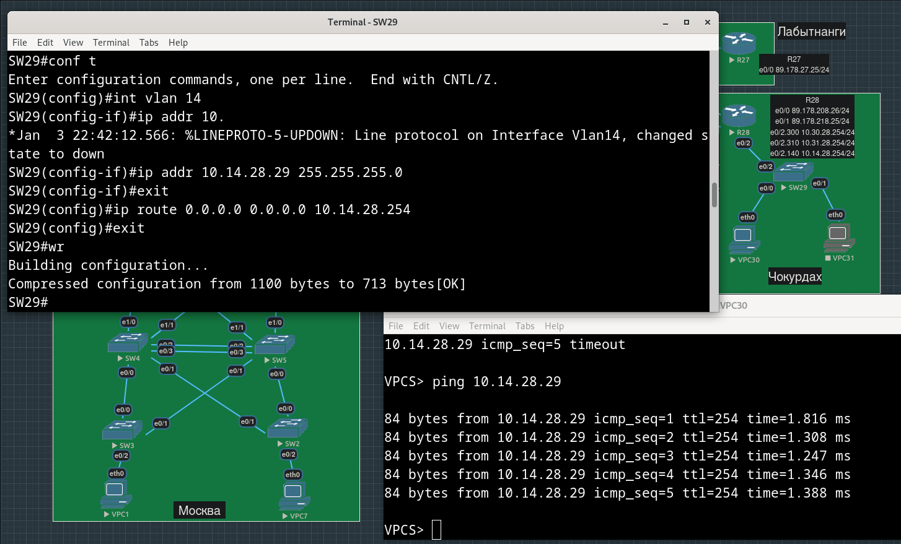

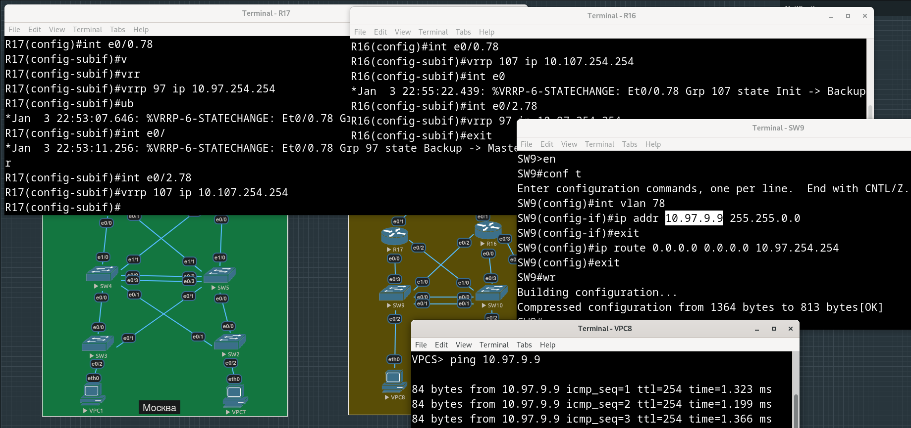