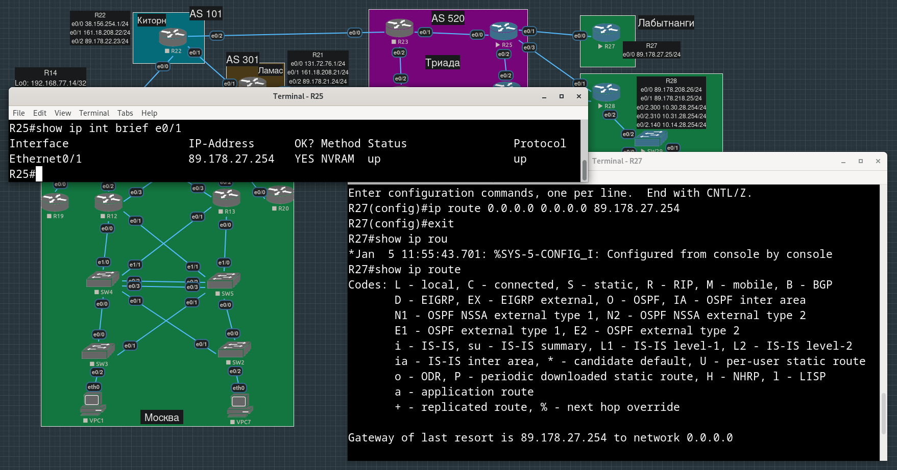
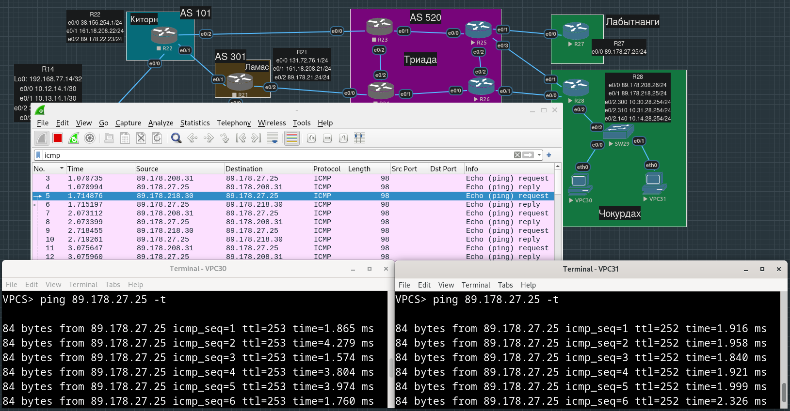

# Лабораторная работа №5. PBR   

**Цель**:

Настроить политику маршрутизации в офисе Чокурдах

Распределить трафик между 2 линками.

**Описание/Пошаговая инструкция выполнения домашнего задания**:

    В этой самостоятельной работе мы ожидаем, что вы самостоятельно:

    - Настроите политику маршрутизации для сетей офиса.
    - Распределите трафик между двумя линками с провайдером.
    - Настроите отслеживание линка через технологию IP SLA (только для IPv4).
    - Настройте для офиса Лабытнанги маршрут по-умолчанию.
    - План работы и изменения зафиксированы в документации.


- [Планирование](#планирование)
- [Подготовка](#подготовка)
- [Реализация source-based routing](#реализация-source-based-routing)
- [Включение IP SLA](#включение-ip-sla)
- [Конфиги устройств, использованных в работе](#конфиги-устройств-использованных-в-работе)


## Планирование

Пусть трафик от VPC30 идет через R26, а трафик от VPC31 - через R25.

Будем проверять это распределение трафика, пингуя с VPC30 и VPC31 маршрутизатор R27 в Лабытнанги. Для начала, пропишем на R28 два равнозначных статических маршрута на R28 (граничный маршрутизатор Чокурдах) к R27 через R26 и R25, также придется прописать маршрут и на R26. Нам также придется настроить дефолтный маршрут на R27, чтобы пинги возвращались на VPC Чокурдах.

Помним, что у VPC адреса выделены из приватного префикса `10.0.0.0/8`, так что нам придется добавить и NAT на R28.


## Подготовка

Прописываем два равнозначных маршрута на граничном маршрутизаторе Чокурдах до Лабытнанги:

```
R28(config)#ip route 89.178.27.0 255.255.255.0 89.178.208.254
R28(config)#ip route 89.178.27.0 255.255.255.0 89.178.218.254
```


Прописываем маршрут по умолчанию на R27 (это просто, т.к. этот маршрутизатор связан с остальным миром только через R25):

```
R27(config)#ip route 0.0.0.0 0.0.0.0 89.178.27.254
```



Теперь NAT. На данном этапе, для тестирования, хотим по пойманному трафику однозначно идентифицировать, какой из VPC является его отправителем/получателем, так что сделаем статическое преобразование внутренних адресов в уникальные внешние, из тех же префиксов, что и смотрящие наружу интерфейсы e0/0 и e0/1 маршрутизатора R28, причем так, чтобы путь к Лабытнанги (который нам еще предстоит организовать через PBR) был не таким же, как путь обратно: 

VPC30 -> R28 -> R26 -> R25 -> R27
R27 -> R25 -> R28 -> VPC30

VPC31 -> R28 -> R25 -> R27
R27 -> R25 -> R26 -> R28 -> VPC31

```
R28(config)#ip nat inside source static 10.30.28.1 89.178.218.30
R28(config)#ip nat inside source static 10.31.28.1 89.178.208.31
```

Обозначим, на каких интерфейсах R28 нужно делать трансляцию адресов:

```
R28(config)#int e0/0
R28(config-if)#ip nat outside 
R28(config-if)#int e0/1
R28(config-if)#ip nat outside 
R28(config-if)#int e0/2.300
R28(config-subif)#ip nat inside
R28(config-subif)#int e0/2.310
R28(config-subif)#ip nat inside
```


R25 должен знать, что маршрут до `89.178.208.0/24` лежит через e0/2 интерфейс R26, а R26 в свою очередь, что маршрут к `89.178.218.0/24` - через e0/2 интерфейс R25:

```
R25(config)#ip route 89.178.208.0 255.255.255.0 172.16.56.25
```

```
R26(config)#ip route 89.178.218.0 255.255.255.0 172.16.56.26
```


На R26 также нужно прописать маршрут к R27 через e0/2 интерфейс R25:

```
R26(config)#ip route 89.178.27.0 255.255.255.0 172.16.56.26 
```

Убеждаемся, что и VPC30 (адрес транслируется в `89.178.218.30`), и VPC31 (`89.178.218.31`) могут достучаться до R27 в Лабытнанги, и получать от него ответы:



Проверяем, что обратный путь действительно таков, каким мы его запланировали:

К VPC30 всего 3 хопа - напрямую через R25
R27 -> R25 -> R28 -> VPC30

К VPC31 4 хопа - через R26
R27 -> R25 -> R26 -> R28 -> VPC31


## Реализация source-based routing

Сейчас путь от VPC к R27 определяется внешним адресом, в который транслируется внутренний адрес VPC.


Мы хотим, чтобы путь от VPC30 (или, более широко, от устройств в VLAN 30) к R27 шел через R26, а путь от VPC31 (от устройств в VLAN 31) к R27 шел напрямую через R25.

Для этого настроим PBR на R28. 

Опытным путем (вместо того, чтобы заранее прочитать), установили, что трансляция адресов NAT происходит ПОСЛЕ манипуляций route-map, поэтому в ACL, которые будем использовать для наших правил маршрутизации, указываем внутренние, нетранслированные адреса:

```
R28(config)#ip access-list standard FOR_PBR_30
R28(config-std-nacl)#permit 10.30.0.0 0.0.255.255

R28(config)#ip access-list standard FOR_PBR_31
R28(config-std-nacl)#permit 10.31.0.0 0.0.255.255
```

Теперь сами политики маршрутизации:

Если источник - это транслированный адрес VPC30, то его следующим хопом должен быть интефейс e0/1 маршрутизатора R26 с адресом `89.178.208.254`.

Если источник - это транслированный адрес VPC31, то его следующим хопом должен быть интефейс e0/3 маршрутизатора R25 с адресом `89.178.218.254`:

```
R28(config)#route-map PBR_30
R28(config-route-map)#match ip address FOR_PBR_30
R28(config-route-map)#set ip next-hop 89.178.208.254

R28(config)#route-map PBR_31
R28(config-route-map)#match ip address FOR_PBR_31
R28(config-route-map)#set ip next-hop 89.178.218.254
```

Теперь накладываем route-map-ы на соответствующие входящие интерфейсы R28:

```
R28(config)#int e0/2.300
R28(config-subif)#ip policy route-map PBR_30

R28(config)#int e0/2.310
R28(config-subif)#ip policy route-map PBR_31
```

Смотрим, что результаты traceroute для VPC30 и VPC31 "поменялись местами" - теперь путь от VPC30 до R27 занимает четыре хопа, а от VPC31 до R27 - три:


Ловим пакеты wireshark-ом на e0/2 интерфейсе R26 - видим, что пакеты к R27 идут только от VPC30, а пакеты от R27 только возвращаются к VPC31:


## Включение IP SLA

Будем отслеживать состояние соединения между R28 и R27 через R25 и R26 с помощью того же ICMP. Назвали группы 30 и 31 вслед за теми VPC, трафик которых проходит через соотвествующий исходящий интерфейс R28:

```
R28(config)#ip sla 30
R28(config-ip-sla)#icmp-echo 89.178.27.25 source-interface e0/0
R28(config-ip-sla-echo)#exit
R28(config)#ip sla 31                                   
R28(config-ip-sla)#icmp-echo 89.178.27.25 source-interface e0/1
```

Специфичные для ip-sla-echo параметры мы не трогали.

Запускаем ip sla:

```
R28(config)#ip sla schedule 30 life ?
  <0-2147483647>  Life seconds (default 3600)
  forever         continue running forever

R28(config)#ip sla schedule 30 life fo
R28(config)#ip sla schedule 30 life forever ?
  ageout      How long to keep this Entry when inactive
  recurring   Probe to be scheduled automatically every day
  start-time  When to start this entry
  <cr>

R28(config)#ip sla schedule 30 life forever start-time now
R28(config)#ip sla schedule 31 life forever start-time now
```

Очевидно, для ответов на пинги специально настраивать ip sla responder на R27 не требуется (что, в общем-то, ожидаемо):


Попробуем настроить что-нибудь поинтересней:

```
R28(config)#ip sla 300
R28(config-ip-sla)#udp-jitter 89.178.27.25 65535 source-ip 89.178.208.26 codec g711ulaw

R28(config)#ip sla 310
R28(config-ip-sla)#udp-jitter 89.178.27.25 65535 source-ip 89.178.218.25 codec g711ulaw
R28(config-ip-sla-jitter)#
```

```
R28(config)#ip sla schedule 300 life forever start-time now            
R28(config)#ip sla schedule 310 life forever start-time now
```

В этот раз нам потребуется включить responder на "прощупываемом" устройстве:


```
R27(config)#ip sla responder 
```

Видим успешные пробы:


## Конфиги устройств, использованных в работе

[R25.conf](./configs/R25.conf)

[R26.conf](./configs/R26.conf)

[R27.conf](./configs/R27.conf)

[R28.conf](./configs/R28.conf)