# Лабораторная работа №6. OSPF   

**Цель**:

Настроить OSPF офисе Москва

Разделить сеть на зоны

Настроить фильтрацию между зонами

**Описание/Пошаговая инструкция выполнения домашнего задания**:

    - Маршрутизаторы R14-R15 находятся в зоне 0 - backbone.
    - Маршрутизаторы R12-R13 находятся в зоне 10. Дополнительно к маршрутам должны получать маршрут по умолчанию.
    - Маршрутизатор R19 находится в зоне 101 и получает только маршрут по умолчанию.
    - Маршрутизатор R20 находится в зоне 102 и получает все маршруты, кроме маршрутов до сетей зоны 101.
    - Настройка для IPv6 повторяет логику IPv4.
    - План работы и изменения зафиксированы в документации.


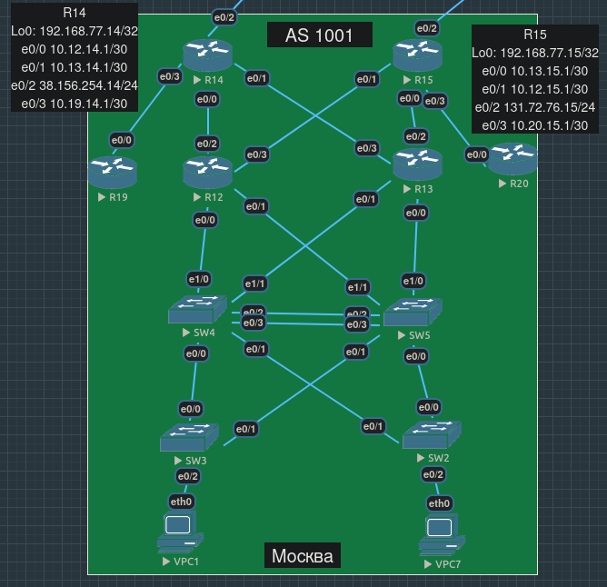


- [Планирование](#планирование)
- [Подготовка](#подготовка)
- [Реализация](#реализация)
  - [Настройка backbone area](#настройка-backbone-area)
  - [Настройка normal area 10](#настройка-normal-area-10)
  - [Настройка totally stub area 101](#настройка-totally-stub-area-101)
  - [Настройка normal area 102 с фильтрацией маршрутов из 101](#настройка-normal-area-102-с-фильтрацией-маршрутов-из-101)
- [Конфиги устройств, использованных в работе](#конфиги-устройств-использованных-в-работе)

## Планирование

> Маршрутизаторы R14-R15 находятся в зоне 0 - backbone

Добавляем в ospf все интерфейсы маршрутизаторов, не забывая loopback-интерфейсы, но кроме внешних e0/2, смотрящих в сторону провайдеров. При этом пропишем статические дефолтные маршруты именно через R22 и R21.

> Маршрутизаторы R12-R13 находятся в зоне 10. Дополнительно к маршрутам должны получать маршрут по умолчанию

Чтобы R12 и R13 получали дефолтные маршруты от R14 и R15, на R14 и R15 нужно прописать `default information originate`. Интерфейсы в сторону коммутаторов и рабочих компьютеров добавляем в ospf в зону 10, но пометим их как `passive`, ибо с этой стороны никаких LSA мы не ожидаем.

> Маршрутизатор R19 находится в зоне 101 и получает только маршрут по умолчанию

Поскольку R19 получает только дефолтный маршрут и ничего больше, можно сделать его зону totally stub - у него всего один интерфейс, через который он связан с остальным миром.

> Маршрутизатор R20 находится в зоне 102 и получает все маршруты, кроме маршрутов до сетей зоны 101

Для исключения маршрутов из определенной зоны придется настроить фильтрацию type 3 (summary) LSA на интерфейсе R20, смотрящем в сторону backbone.

По нашему замыслу, все интерфейсы между маршрутизаторами внутри офисов входят в префиксы `/30`, так что для ospf можем настроить их как point-to-point - нет смысла в нашем случае тратить время на выборы DR/BDR.

Я не уверен, что это правильно, и тем не менее, кажется, что в backbone area должны входить интерфейсы R19, R12, R13 и R20, которые соединяют эти маршрутизаторы с R14 и R15 (а не наоборот, чтобы у R14 и R15 были интерфейсы во всех зонах - тогда непонятно, что же тогда будет входить в area 0).

UPD: позже, чтобы прочувствовать смысл totally stub-зоны на R19, мы решим, что лучше вынести e0/3 R14 и e0/0 R19 из backbone area 0 в totally stub area 101, и аналогично, чтобы не видеть на R20 маршрутов из зоны 101, вынести e0/3 R15 и e0/0 R20 из backbone в зону 102 и настраивать фильтрацию на R15, а не R20.

## Подготовка

Прописываем статические дефолтные маршруты на R14 и R15 через Киторн и Ламас соответственно:

```
R14(config)#ip route 0.0.0.0 0.0.0.0 38.156.254.1
```
```
R15(config)#ip route 0.0.0.0 0.0.0.0 131.72.76.1
```

## Реализация

### Настройка backbone area

На R14:

Создаем процесс ospf и заставляем его прокидывать соседям дефолтный маршрут.

```
R14(config)#router ospf 1 
R14(config-router)#default-information originate

```

Добавляем интерфейсы в процесс ospf:

```
R14(config)#int range e0/0,e0/1,e0/3
R14(config-if-range)#ip ospf 1 area 0
R14(config-if-range)#ip ospf network point-to-point
```

Не забываем про loopback-интерфейс (кажется, что нет нужды настраивать его как пассивный интерфейс - скорее всего маршрутизатор понимает, что с этого интерфейса на самом деле ничто в любом случае никуда не отправляется):

```
R14(config)#int lo0
R14(config-if)#ip ospf 1 area 0
```

На R15 настройки аналогичны:

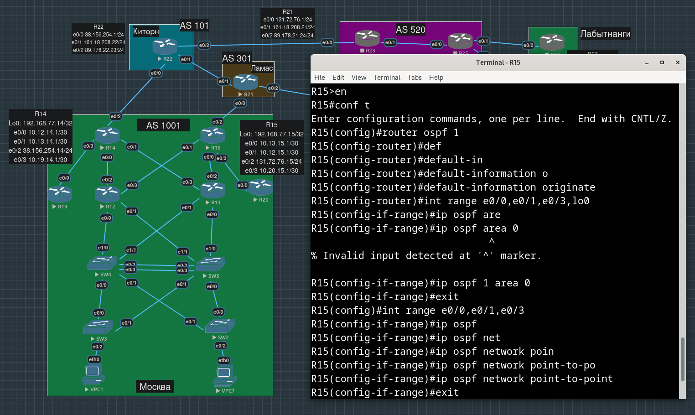

Теперь убедимся, что после добавления интерфейсов другого маршрутизатора в backbone area, он получит дефолтные маршруты от R14 и/или R15.

До настройки ospf на R12 дефолтного маршрута в его таблице маршрутизации не было:

```
R12#show ip route 0.0.0.0  
% Network not in table
```

Интерфейсы e0/2 и e0/3 R12 смотрят в сторону R14 и R15, поэтому по нашему замыслу должны входить в area 0:

```
R12(config)#int range e0/2-3
R12(config-if-range)#ip ospf 1 area 0
R12(config-if-range)#ip ospf network point-to-point
```

Видим, что после установления соседства с R14 и R15, настраиваемый маршрутизатор R12 получил равнозначные дефолтные маршруты:

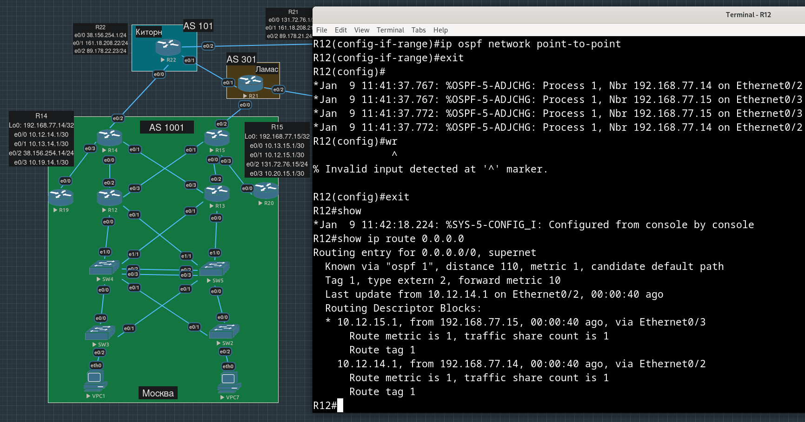

Повторяем настройки для интерфейсов в сторону R14 и R15 на всех оставшихся соединенных с ними московских маршрутизаторах.

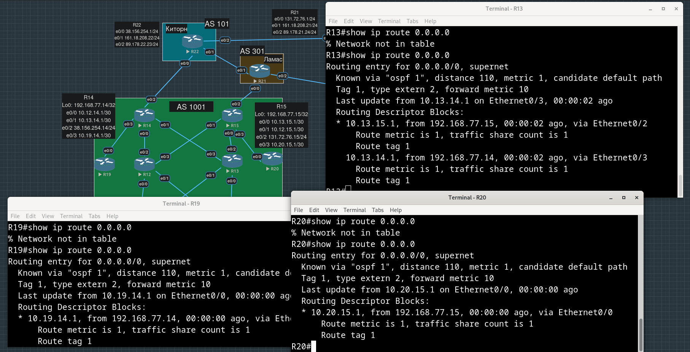

В `show ip protocols` можно заметить, что в качестве `router_id` были подставлены адреса на loopback-интерфейсах:

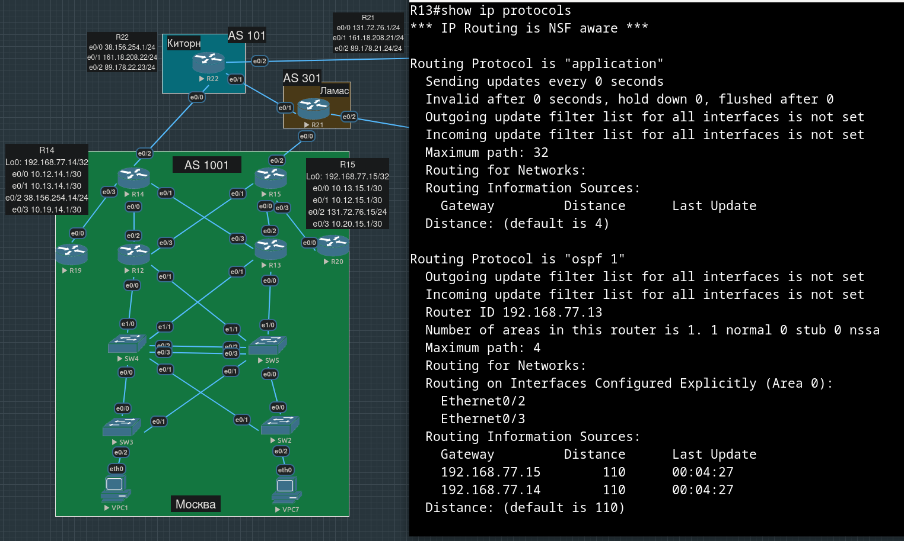


### Настройка normal area 10

По нашему плану, маршрутизаторы R12 и R13 должны рассказать остальным московским маршрутизатором (через `backbone area`) об адресах на их интерфейсах, смотрящих в сторону конечных устройств.

Для sub-интрефейсов перечисление в range не сработало, пришлось прописывать для каждого отдельно:

```
R13(config)#int e0/0.10
R13(config-subif)#ip ospf 1 area 10
R13(config-subif)#int e0/0.70
R13(config-subif)#ip ospf 1 area 10
R13(config-subif)#int e0/0.77
R13(config-subif)#ip ospf 1 area 10
R13(config-subif)#int e0/1.10
R13(config-subif)#ip ospf 1 area 10
R13(config-subif)#int e0/1.70
R13(config-subif)#ip ospf 1 area 10
R13(config-subif)#int e0/1.77
R13(config-subif)#ip ospf 1 area 10
R13(config-subif)#exit
```

```
R13(config)#router ospf 1
R13(config-router)#passive-interface e0/0.10        
R13(config-router)#passive-interface e0/0.70
R13(config-router)#passive-interface e0/0.77
R13(config-router)#passive-interface e0/1.10
R13(config-router)#passive-interface e0/1.70
R13(config-router)#passive-interface e0/1.77
R13(config-router)#exit
```

Также добавим loopback интерфейс в ospf зону 10, остальные должны знать и об этом адресе тоже, даже более того, именно он впоследствии и должен будет "протекать наружу".

```
R13(config)#int lo0
R13(config-if)#ip ospf 1 area 10
```

Вот что получилось:

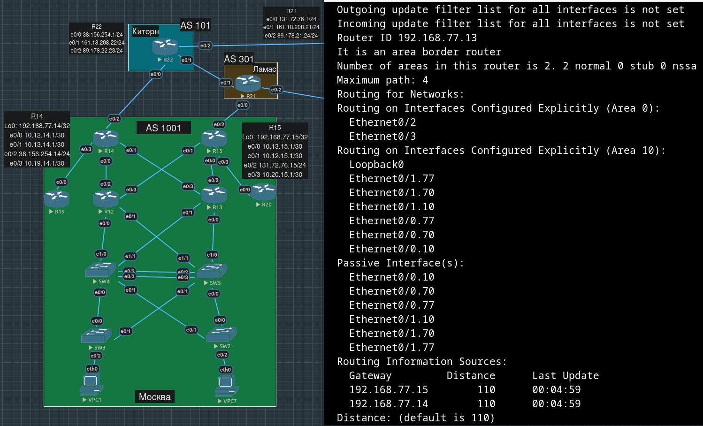

После выполнения настроек зоны 10 на обоих входящих в нее маршрутизаторах:

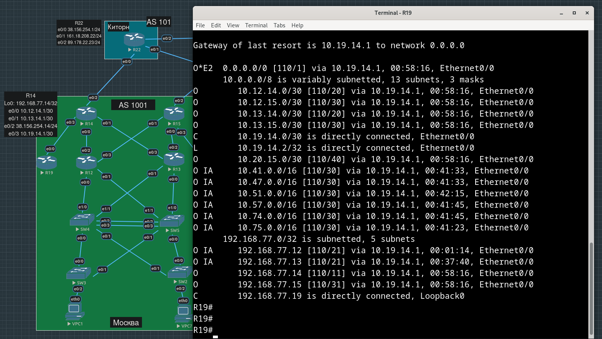

В качестве теста проверим, что, например, R19 узнал префикс, в котором находятся адреса VPC и SVI.

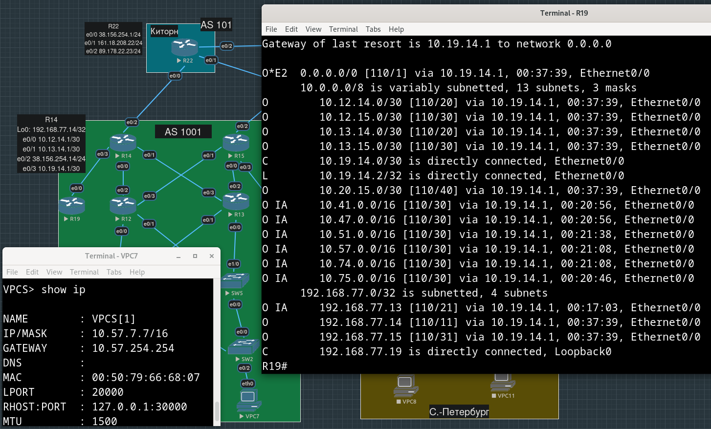

R19 успешно пингует VPC7 (R14 знает, как добраться до R19, так что никаких дополнительных манипуляций для получения ответа не понадобилось):

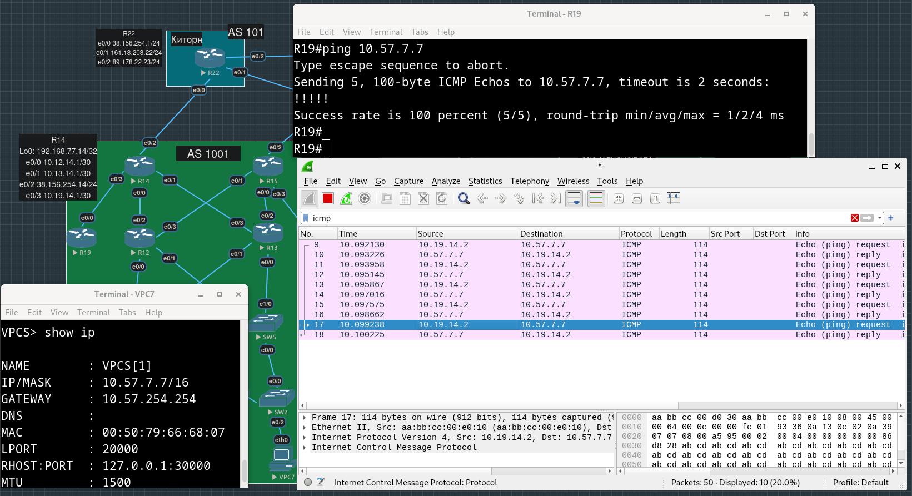


Итак, маршрутизаторы из `area 10` получают дефолтные маршруты от R14 и R15, и сообщают остальным о префиксах, в которые входят их интерфейсы.

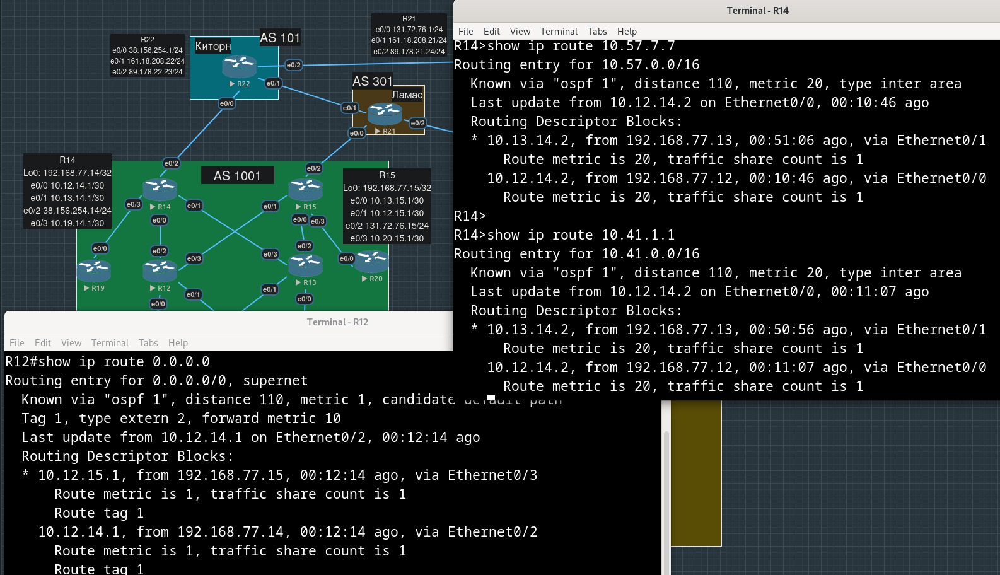

### Настройка totally stub area 101

```
R19(config)#router ospf 1
R19(config-router)#area 101 stub
R19(config-router)#exit
R19(config)#int lo0
R19(config-if)#ip ospf 1 area 101             
R19(config-if)#exit
```

Так мы, конечно, никакого эффекта от тупиковости зоны не увидим, все маршруты от R14 все равно будут известны, т.к. интерфейс e0/0 входит в backbone зону.

Переконфигурируем R14 и R19 так, чтобы их смотрящие друг на друга интерфейсы тоже входили в totally stub-зону 101.

```
R19(config)#int e0/0
R19(config-if)#ip ospf 1 area 101
R19(config-if)#exit
R19(config)#
*Jan  9 15:00:44.864: %OSPF-5-ADJCHG: Process 1, Nbr 192.168.77.14 on Ethernet0/0 from FULL to DOWN, Neighbor Down: Interface down or detached
*Jan  9 15:00:44.905: %OSPF-5-ADJCHG: Process 1, Nbr 192.168.77.14 on Ethernet0/0 from LOADING to FULL, Loading Done

```

```
R14(config)#int e0/3
R14(config-if)#ip ospf 1 area 101
R14(config-if)#exit
R14(config)#
*Jan  9 15:00:34.988: %OSPF-5-ADJCHG: Process 1, Nbr 192.168.77.19 on Ethernet0/3 from FULL to DOWN, Neighbor Down: Interface down or detached
R14(config)#
*Jan  9 15:00:39.340: %OSPF-4-ERRRCV: Received invalid packet: mismatched area ID from backbone area from 10.19.14.2, Ethernet0/3
R14(config)#
*Jan  9 15:00:44.904: %OSPF-5-ADJCHG: Process 1, Nbr 192.168.77.19 on Ethernet0/3 from LOADING to FULL, Loading Done


R14(config)#router ospf 1
R14(config-router)#area 101 stub no-summary 
```

Теперь в таблицу маршрутизации R19 попадает только один маршрут - дефолтный:

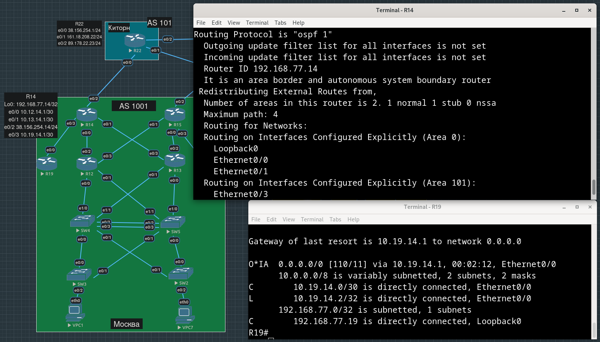


### Настройка normal area 102 с фильтрацией маршрутов из 101

Аналогично тому, что мы проделали на предыдущем шаге, уберем e0/3 R15 и e0/0 R20 из backbone-зоны и добавим их в зону 102.

```
R20(config)#int e0/0
R20(config-if)#ip ospf 1 area 102
```

```
R15(config)#int e0/3
R15(config-if)#ip ospf 1 area 102
```

Поскольку маршруты из зоны 101 должны попадать во все остальные зоны, фильтровать их надо на границе 0-102, т.е. теперь на интерфейсе e0/3 R15. К сожалению, во внутренностях LSA ничего нет о зонах, из которых маршруты стали известны, поэтому фильтрация происходит по префиксам, т.е. мы сами должны знать, какой префикс к какой зоне относится. 

До настройки фильтрации в таблице маршрутизации видим маршруты, о которых сообщает R19 (зона 101):

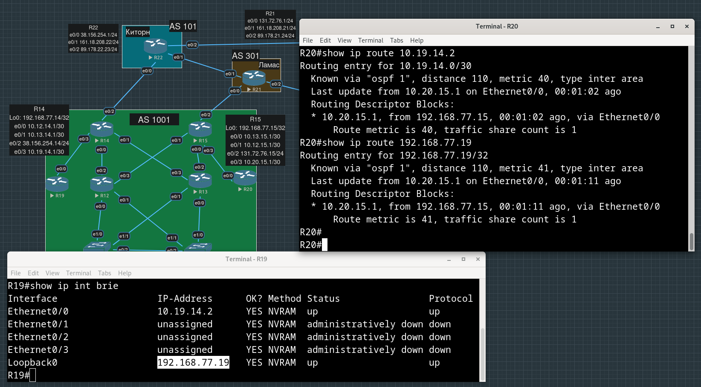

Конфигурируем фильтрацию (создаем список префиксов, который привяжем к фильтру конфигурируемой зоны 102, `in` - означает "в эту область", не "на маршрутизатор"):

```

R15(config)#ip prefix-list OSPF-FILTER deny 10.19.14.0/30
R15(config)#ip prefix-list OSPF-FILTER deny 192.168.77.19/32

R15(config)#router ospf 1
R15(config-router)#area 102 filter-list prefix OSPF_FILTER in
```

После чего перезагражуем процесс OSPF на R15, где только что добавли фильтр:

```
R15#clear ip ospf 1 process
```

Теперь R20 ничего не знает об адресах из зоны 101 (но их продолжают получать остальные):

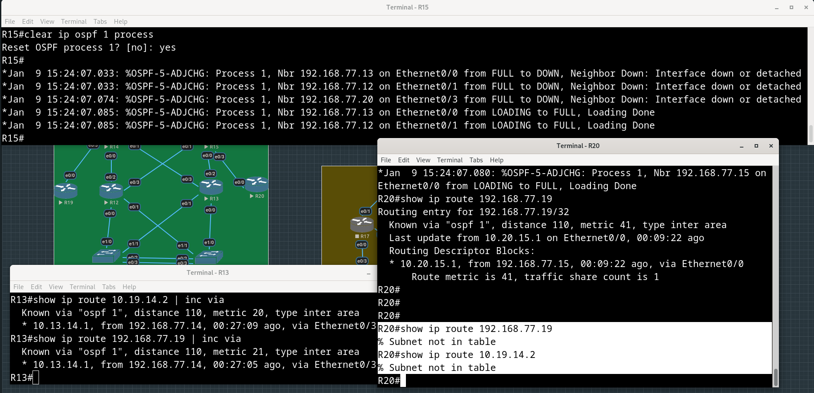


## Конфиги устройств, использованных в работе

[R12.conf](./configs/R12.conf)

[R13.conf](./configs/R13.conf)

[R14.conf](./configs/R14.conf)

[R15.conf](./configs/R15.conf)

[R19.conf](./configs/R19.conf)

[R20.conf](./configs/R20.conf)