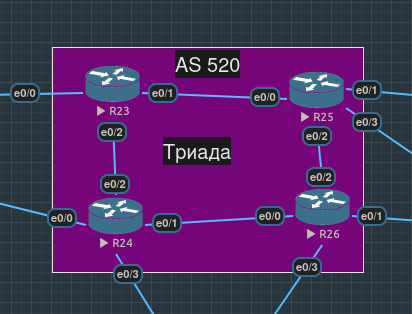
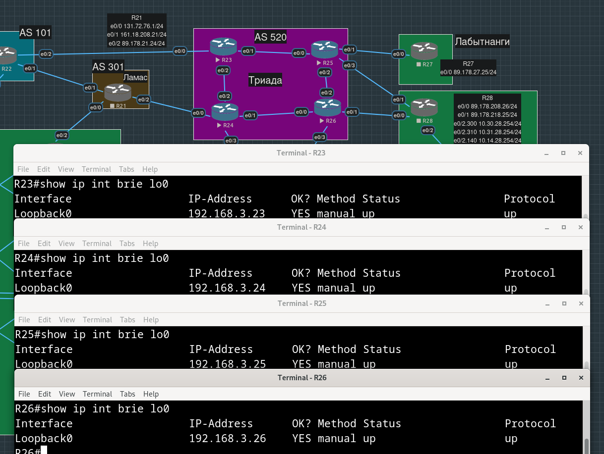
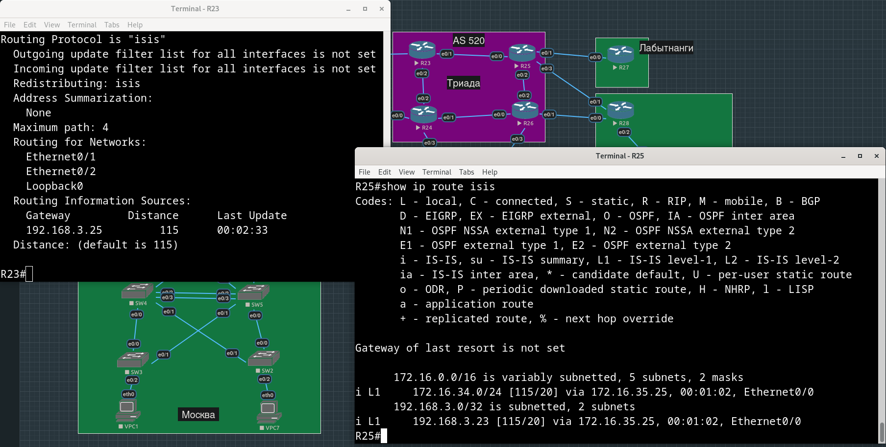
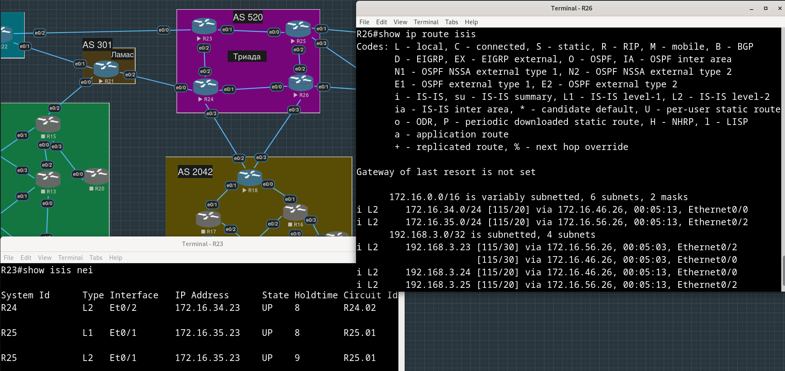
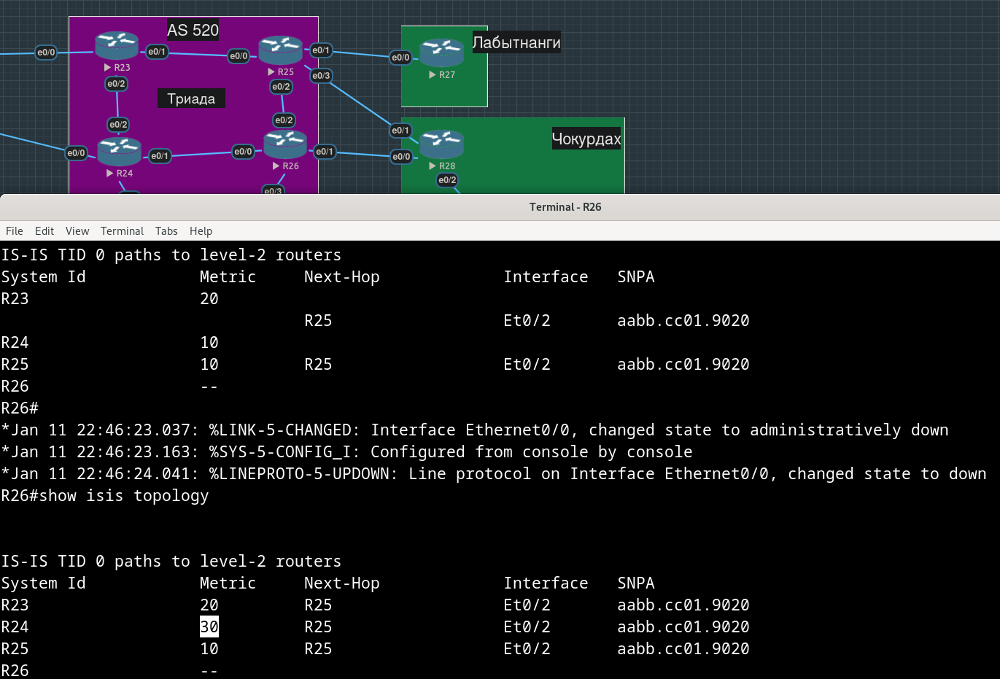
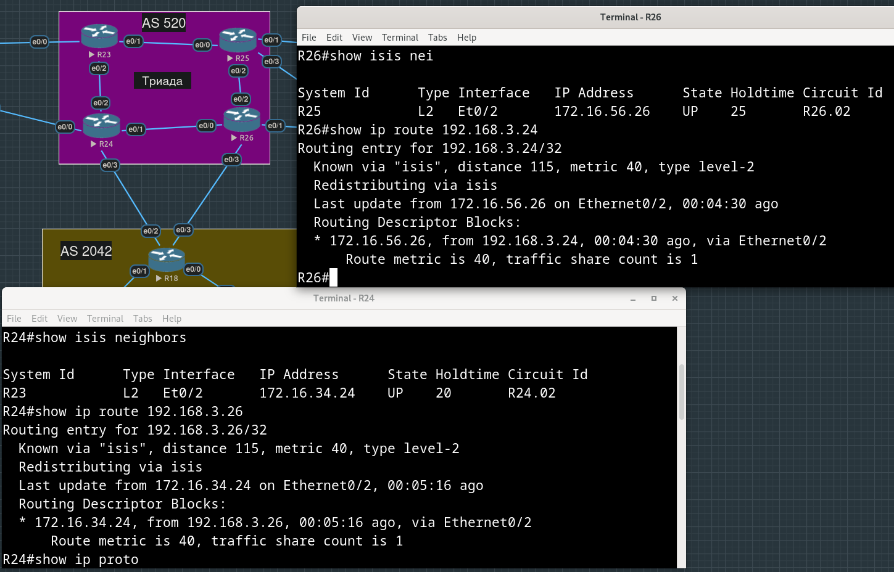
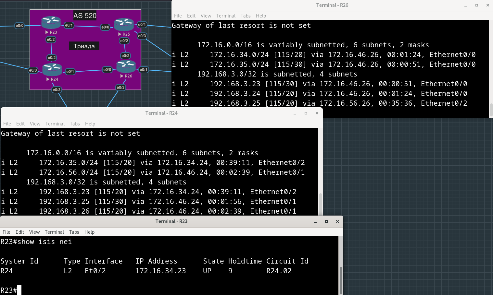
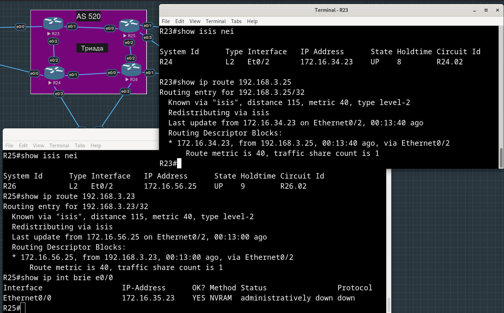
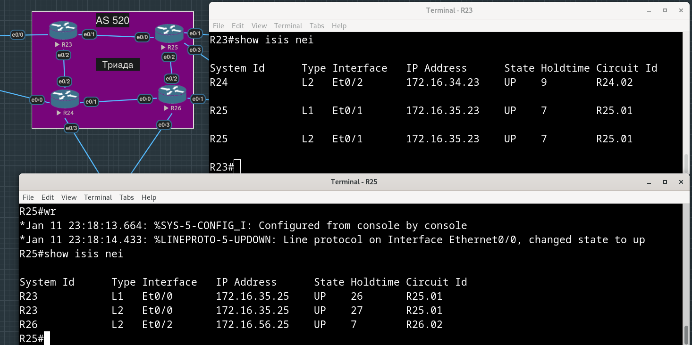

# Лабораторная работа №7. IS-IS

**Цель**:

Настроить IS-IS офисе Триада

**Описание/Пошаговая инструкция выполнения домашнего задания**:

    - Настроите IS-IS в ISP Триада.
    - R23 и R25 находятся в зоне 2222.
    - R24 находится в зоне 24.
    - R26 находится в зоне 26.



- [Планирование](#планирование)
- [Подготовка](#подготовка)
- [Реализация](#реализация)
  - [Настройка L1L2 маршрутизаторов](#настройка-L1L2-маршрутизаторов)
  - [Настройка L2 маршрутизаторов](#настройка-L2-маршрутизаторов)
- [Конфиги устройств, использованных в работе](#конфиги-устройств-использованных-в-работе)

## Планирование

В качестве идентификаторов маршрутизаторов в IS-IS используется Network Entity Title ("net"), который состоит из нескольких частей: Authority and Format Id (AFI), Area Id, System Id и N-Selector (NSEL).

AFI - приватный 49.

NSEL (аналог порта в протоколах транспортного уровня) всегда 00.

Мы можем получить шестибайтный System Id путем добавления нулей в четырехбайтный IPv4 адрес loopback-интерфейсов маршуртизаторов.

Назначим устройствам Триады адреса на loopback-интерфейсы (этого не было сделано в работе №4, мы посчитали, что Триада - это оборудование провайдера, и из наших городских офисов мы не сможем заходить туда, и что нас интересуют только адреса их интерфейсов, которые связывают нас с внешним миром).

| Устройство | Интерфейс | IP-адрес        |
| :--------- | :-------- | :-------------- |
| R23        | Loopback0 | 192.168.3.23/32 |
| R24        | Loopback0 | 192.168.3.24/32 |
| R25        | Loopback0 | 252.168.3.25/32 |
| R26        | Loopback0 | 192.168.3.26/32 |

Дополняем нулями IPv4 адреса loopback-интерфейсов таким образом, чтобы в каждом октете было по три цифры, после чего записываем получившиеся последовательности в виде трех групп из четырех цифр, разделенных точками:

192.168.3.23 -> 192.168.003.023 -> 1921.6800.3023

192.168.3.24 -> 192.168.003.024 -> 1921.6800.3024

192.168.3.25 -> 192.168.003.025 -> 1921.6800.3025

192.168.3.26 -> 192.168.003.026 -> 1921.6800.3026

Полученые последовательности и будут System Id.

Собираем все вместе:

| Устройство | Network Entity Title      |
| :--------- | :------------------------ |
| R23        | 49.2222.1921.6800.3023.00 |
| R24        | 49.24.1921.6800.3024.00   |
| R25        | 49.2222.1921.6800.3025.00 |
| R26        | 49.26.1921.6800.3026.00   |

Поскольку от нас требуется разделение на зоны, у маршрутизаторов должны быть прописаны роли - чтобы определенные маршрутизаторы занимались передачей маршрутов в  соседние зоны.

Пусть R23 и R25 будут маршрутизаторами L1L2 - они находятся в одной зоне, поэтому они должны быть L1 соседями, но при этом они соединены и с другими зонами, с маршрутизаторами из которых они могут быть только L2 соседями. R24 и R26 могут не иметь роль L1 - в их зонах нет других маршрутизаторов, с которыми можно было бы установить L1-соседство, но при этом они соединены друг с другом и с маршрутизаторами зоны 2222, поэтому они должны иметь роль L2.

| Устройство | Роль |
| :--------- | :--- |
| R23        | L1L2 |
| R24        | L2   |
| R25        | L1L2 |
| R26        | L2   |

## Подготовка

Пропишем адреса loopback-интерфейсов на маршрутизаторах Триады:

```
R23(config)#int lo0
R23(config-if)#ip address 192.168.3.23 255.255.255.255
```



## Реализация

### Настройка L1L2 маршрутизаторов

Сначала настроим R23:

```
R23(config)#router isis
R23(config-router)#net 49.2222.1921.6800.3023.00
R23(config-router)#is-type level-1-2
```

На R23 IS-IS должен работать только на интерфейсах, направленных в сторону других маршрутизаторов Триады и на Loopback-интерфейсе:

```
R23(config)#int range e0/1-2
R23(config-if-range)#ip router isis
R23(config-if-range)#exit

R23(config)#int lo0
R23(config-if)#ip router isis
```

Теперь R25:

```
R25(config)#router isis
R25(config-router)#net 49.2222.1921.6800.3025.00
R25(config-router)#is-type level-1-2
```

На интерфейсах:

```
R25(config)#int range e0/0,e0/2,lo0
R25(config-if-range)#ip router isis
```

На скриншоте видим, что R25 узнал от R23 через IS-IS маршрут до сети между R23 и R24 (172.16.34.0/24) и адрес loopback-интерфейса R24.




### Настройка L2 маршрутизаторов

Сначала настроим R24 (зона 24):

```
R24(config)#router isis
R24(config-router)#net 49.24.1921.6800.3024.00
R24(config-router)#is-type level-2-only
R24(config-router)#exit

R24(config)#int range e0/1-2,lo0
R24(config-if-range)#ip router isis
```

Теперь настроим R26 (зона 26):

```
R26(config)#router isis
R26(config-router)#net 49.26.1921.6800.3026.00
R26(config-router)#exit

R26(config)#int range e0/0,e0/2,lo0
R26(config-if-range)#ip router isis
```

Видим, что теперь R26 получает маршруты до loopback-интерфейсов всех маршрутизаторов Триады:



Тест: разорвем линк между R24 и R26 и убедимся, что после этого маршруты, известные R24, будут все так же известны R26 и наоборот.

```
R26(config)#int e0/0
R26(config-if)#shut
```

Видим, что после разрыва путь от R26 до R24 стал пролегать через R25.



Маршруты по-прежнему известны:



Восстановим разорванный линк:

```
R26(config)#int e0/0
R26(config-if)#no shut
```

Теперь разорвем линк между R23 и R25 и убедимся, что после этого маршруты, известные R24 продолжит сообщать R26 о маршрутах до R23, а R26 в свою очередь все также будет рассказывать R24 о R25.

```
R25(config)#int e0/0
R25(config-if)#shut
```

И действительно, R23 и R25 перестали быть соседями, но R24 и R26 используют свой L2 линк, через который сообщают о маршрутах до R23 и R25:





Подымем обратно интерфейс e0/0 на R25, чтобы соседство между R23 и R25 восстановилось:



## Конфиги устройств, использованных в работе

[R23.conf](./configs/R23.conf)

[R24.conf](./configs/R24.conf)

[R25.conf](./configs/R25.conf)

[R26.conf](./configs/R26.conf)
