# Лабораторная работа №8. EIGRP

**Цель**:

Настроить EIGRP в С.-Петербург

Использовать named EIGRP

**Описание/Пошаговая инструкция выполнения домашнего задания**:

    - В офисе С.-Петербург настроить EIGRP
    - R32 получает только маршрут по умолчанию
    - R16-17 анонсируют только суммарные префиксы
    - Использовать EIGRP named-mode для настройки сети

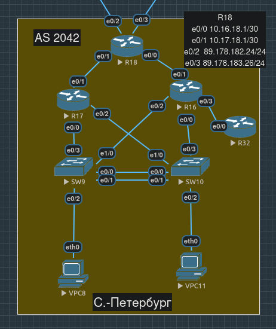

- [Планирование](#планирование)
- [Подготовка](#подготовка)
- [Реализация](#реализация)
  - [Настройка R18](#настройка-r18)
  - [Настройка R17](#настройка-r17)
  - [Настройка R16](#настройка-r16)
  - [Настройка R32](#настройка-r32)
- [Проверка](#проверка)
- [Конфиги устройств, использованных в работе](#конфиги-устройств-использованных-в-работе)

## Планирование

Поскольку за R17 и R32 нет других маршрутизаторов, можно сконфигурировать их как stub, но с разным типом маршрутов, о которых они будут рассказывать своим соседям - R17 только summary по условию, для R32 можем оставить дефолтное connected + summary.

R18 будет иметь два равнозначных статических маршрута по умолчанию через интерфейсы e0/2 и e0/3, интерфейсы же "вниз" e0/0 и e0/1 будут включены в EIGRP, для которого мы настроим redistribute static, чтобы они были проброшены всем соседям.

За R16 находится R32, который должен получать только маршрут по умолчанию, поэтому на интерфейсе R16, соединенном с R32, проделаем суммаризацию адресов - в качестве и ip, и маски укажем 0.0.0.0.

Для настройки EIGRP (в том числе, и для named-mode, о котором нас просят) на группе маршрутизаторов им потребуется общий номер autonomous system, который не обязан совпадать с autonomous system для BGP, тем не менее, можем выбрать именно его во избежание путаницы.

## Подготовка

Пропишем маршруты по умолчанию на R18:

```
R18(config)#ip route 0.0.0.0 0.0.0.0 89.178.182.254
R18(config)#ip route 0.0.0.0 0.0.0.0 89.178.183.254
```

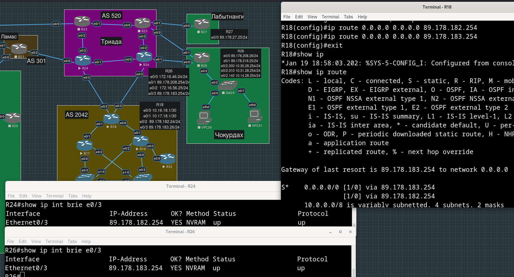

## Реализация

### Настройка R18

На R18 запустим EIGRP-процесс, добавим в него интерфейсы e0/0, e0/1 и lo0, и настроим редистрибуцию статических маршрутов, чтобы маршруты по умолчанию были проброшены его соседям.

```
R18(config)#router eigrp SPB-EIGRP 
R18(config-router)#address-family ipv4 unicast autonomous-system 2042
R18(config-router-af)#
```

Оказалось, что включить интерфейсы в охват EIGRP процесса (подобно тому, как мы это делали для OSPF) все-таки нельзя (похоже, это можно сделать только для ipv6):

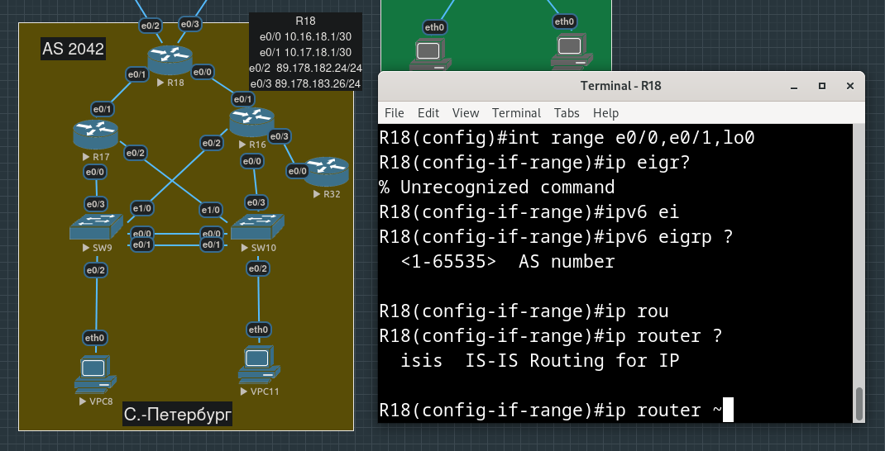

Придется настраивать с помощью команды `network`:

```
R18(config-router)#address-family ipv4 unicast autonomous-system 2042
R18(config-router-af)#network 10.0.0.0 ?
  A.B.C.D  EIGRP wild card bits
  <cr>

R18(config-router-af)#network 10.0.0.0 0.255.255.255
R18(config-router-af)#network 192.168.0.0 0.0.255.255
```

В `show ip eigrp interfaces` увидели все интерфейсы R18, которые и хотели добавить.

Чтобы настроить редистрибуцию маршрутов в named-mode EIGRP, нужно войти в режим `topology base`:

```
R18(config-router-af)#topology base
R18(config-router-af-topology)#redistribute static 
```

### Настройка R17

Теперь настроим EIGRP на R17, сделаем его stub-роутером и убедимся, что статические маршруты по умолчанию от R18 с помощью EIGRP попадают в таблицу маршрутизации R17.

Изначально маршрута по умолчанию у R17 нет:
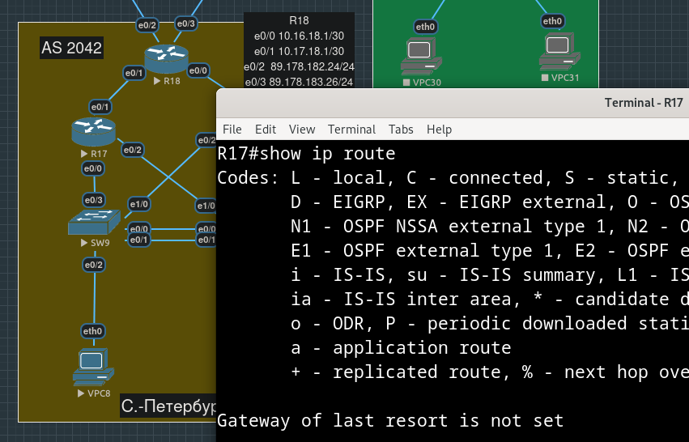

```
R17(config)#router eigrp SPB-EIGRP
R17(config-router)#address-family ipv4 unicast autonomous-system 2042
R17(config-router-af)#network 10.0.0.0 0.255.255.255
*Jan 19 19:29:59.680: %DUAL-5-NBRCHANGE: EIGRP-IPv4 2042: Neighbor 10.17.18.1 (Ethernet0/1) is up: new adjacency
R17(config-router-af)#network 192.168.0.0 0.0.255.255
```

За R17 нет других маршрутизаторов, к тому же по условию он должен передавать только суммарные префиксы:

```
R17(config-router-af)#eigrp stub summary
```

Очевидно, R17 установил соседство с R18 и в консоли стали видеть множество однотипных сообщений:

```
*Jan 19 19:34:22.166: %DUAL-6-NBRINFO: EIGRP-IPv4 2042: Neighbor 10.97.17.254 (Ethernet0/2.78) is blocked: not on common subnet (10.107.17.254/16)
R17(config-router-af)#   
*Jan 19 19:34:32.714: %DUAL-6-NBRINFO: EIGRP-IPv4 2042: Neighbor 10.91.17.254 (Ethernet0/2.110) is blocked: not on common subnet (10.101.17.254/16)
R17(config-router-af)#
*Jan 19 19:34:42.814: %DUAL-6-NBRINFO: EIGRP-IPv4 2042: Neighbor 10.107.17.254 (Ethernet0/0.78) is blocked: not on common subnet (10.97.17.254/16)
R17(config-router-af)#
*Jan 19 19:34:53.996: %DUAL-6-NBRINFO: EIGRP-IPv4 2042: Neighbor 10.98.17.254 (Ethernet0/2.80) is blocked: not on common subnet (10.108.17.254/16)
R17(config-router-af)#
*Jan 19 19:35:04.472: %DUAL-6-NBRINFO: EIGRP-IPv4 2042: Neighbor 10.97.17.254 (Ethernet0/2.78) is blocked: not on common subnet (10.107.17.254/16)
```

Обозначим интерфейсы в сторону конечных устройств как passive:

```
R17(config-router-af)#af-interface e0/0.78
R17(config-router-af-interface)#passive-interface
R17(config-router-af-interface)#
*Jan 19 19:36:52.057: %DUAL-6-NBRINFO: EIGRP-IPv4 2042: Neighbor 10.91.17.254 (Ethernet0/2.110) is blocked: not on common subnet (10.101.17.254/16)
R17(config-router-af-interface)#
*Jan 19 19:37:03.034: %DUAL-6-NBRINFO: EIGRP-IPv4 2042: Neighbor 10.98.17.254 (Ethernet0/2.80) is blocked: not on common subnet (10.108.17.254/16)
R17(config-router-af-interface)#exit
*Jan 19 19:37:13.926: %DUAL-6-NBRINFO: EIGRP-IPv4 2042: Neighbor 10.101.17.254 (Ethernet0/0.110) is blocked: not on common subnet (10.91.17.254/16)
R17(config-router-af)#af-interface e0/0.80
R17(config-router-af-interface)#passive-interface
R17(config-router-af-interface)#exit
R17(config-router-af)#af-interface e0/0.110
R17(config-router-af-interface)#
*Jan 19 19:37:24.717: %DUAL-6-NBRINFO: EIGRP-IPv4 2042: Neighbor 10.91.17.254 (Ethernet0/2.110) is blocked: not on common subnet (10.101.17.254/16)
R17(config-router-af-interface)#passive-interface
R17(config-router-af-interface)#exit
R17(config-router-af)#af-interface e0/2.78 
R17(config-router-af-interface)#passive-interface
R17(config-router-af-interface)#exit
R17(config-router-af)#af-interface e0/2.80
R17(config-router-af-interface)#passive-interface
R17(config-router-af-interface)#exit
R17(config-router-af)#af-interface e0/2.110
R17(config-router-af-interface)#passive-interface
```

Поток сообщений `is blocked: not on common subnet` прекратился.

Убеждаемся, что маршруты по умолчанию появились на R17:

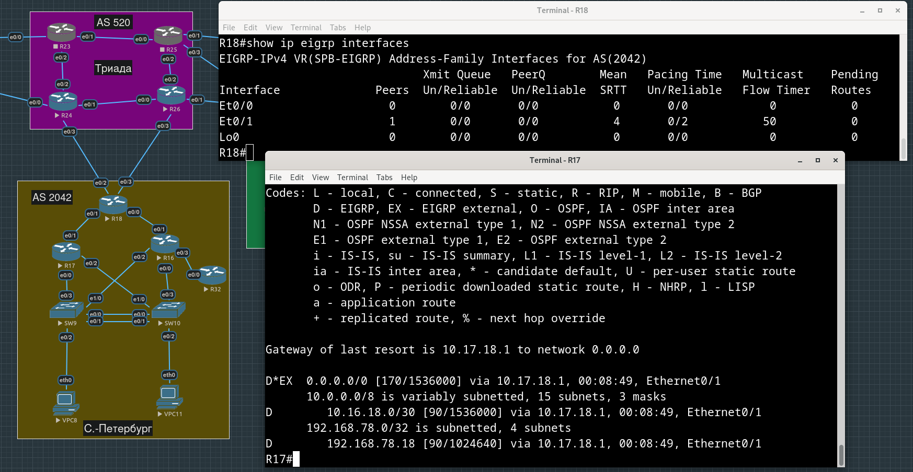

А вот маршруты от R17 в таблице маршрутизации R18 не появились:

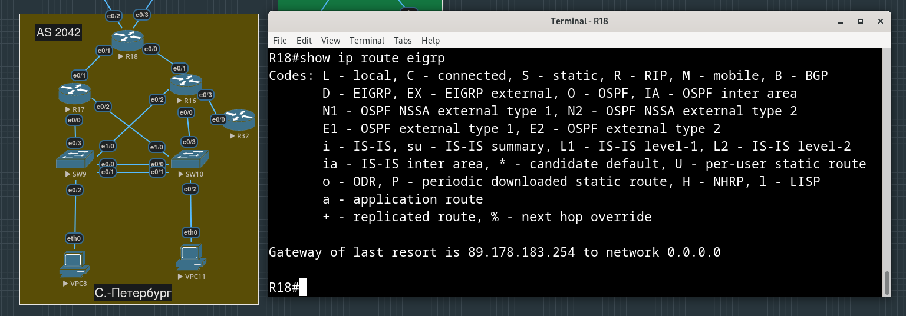

Почему?

Мы настроили R17 как stub, который передает только summary-префиксы, но при этом не настраивали сами summary на его интерфейсах.

Очевидно (убедились экспериментально), суммаризацию нужно настраивать на интерфейсе, смотрящем в сторону R18, т.е. на `e0/1`. "Суммировать" можно только в префикс, в который входит адрес на самом интерфейсе, т.е. придется брать широкий `10.0.0.0/8`, чтобы покрыть все адреса за sub-интерфейсами и VRRP, но при этом странно, что удалось "просуммировать" префикс `192.168.0.0/16`, который к `e0/1` отношения не имеет:

```
R17(config-router-af)#af-interface e0/1         
R17(config-router-af-interface)#summary-address 10.0.0.0/8
R17(config-router-af-interface)#summary-address 192.168.78.0/24
```

Маршруты появились на R18:

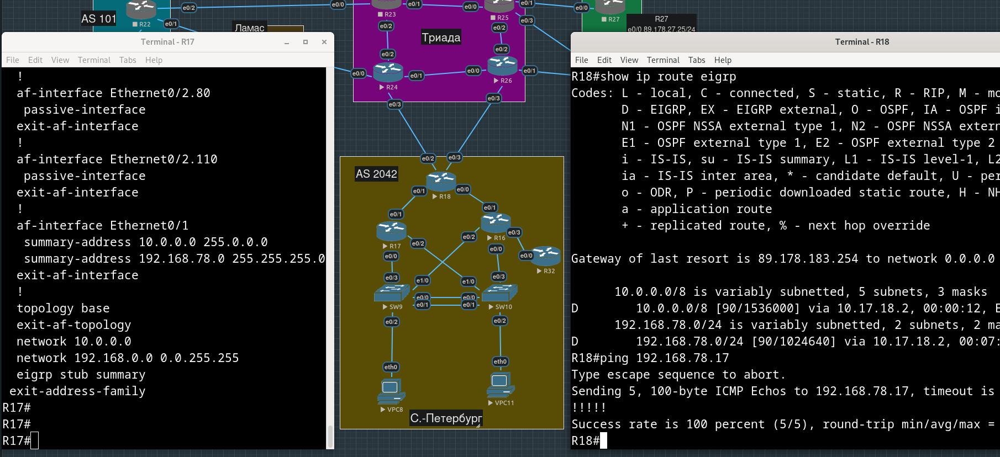

### Настройка R16

Настройка EIGRP на R16 будет похожа на то, что мы делали для R17, за исключением того, что за R16 есть еще и R32, который должен получать от него только маршрут по умолчанию.

```
R16(config)#router eigrp SPB-EIGRP
R16(config-router)#address-family ipv4 autonomous-system 2042
R16(config-router-af)#network 10.0.0.0 0.255.255.255
*Jan 19 21:02:50.330: %DUAL-5-NBRCHANGE: EIGRP-IPv4 2042: Neighbor 10.16.18.1 (Ethernet0/1) is up: new adjacency
*Jan 19 21:03:04.001: %DUAL-6-NBRINFO: EIGRP-IPv4 2042: Neighbor 10.101.16.254 (Ethernet0/2.110) is blocked: not on common subnet (10.91.16.254/16)
R16(config-router-af)#network 192.168.78.0 0.0.0.255
```

Настраиваем пассивные интерфейсы: в сторону конечных устройств нет нужды слать EIGRP-Hello:

```
R16(config)#router eigrp SPB-EIGRP
R16(config-router)#address-family ipv4 autonomous-system 2042
R16(config-router-af)#af-interface e0/0.78
R16(config-router-af-interface)#passive-interface
R16(config-router-af-interface)#exit
R16(config-router-af)#af-interface e0/0.80
R16(config-router-af-interface)#passive-interface
R16(config-router-af-interface)#exit
R16(config-router-af)#af-interface e0/0.110
R16(config-router-af-interface)#passive-interface
R16(config-router-af-interface)#exit
R16(config-router-af)#af-interface e0/2.78
R16(config-router-af-interface)#passive-interface
R16(config-router-af-interface)#exit
R16(config-router-af)#af-interface e0/2.80
R16(config-router-af-interface)#passive-interface
R16(config-router-af-interface)#exit
R16(config-router-af)#af-interface e0/2.110
R16(config-router-af-interface)#passive-interface
R16(config-router-af-interface)#exit
```

По условию, R16 тоже должен распространять соседям только summary адреса, сделаем его stub-ом, указав только такой тип анонсируемых маршрутов:

```
R16(config-router-af)#eigrp stub summary
R16(config-router-af)#
*Jan 19 21:10:57.441: %DUAL-5-NBRCHANGE: EIGRP-IPv4 2042: Neighbor 10.16.18.1 (Ethernet0/1) is down: peer info changed
*Jan 19 21:10:57.940: %DUAL-5-NBRCHANGE: EIGRP-IPv4 2042: Neighbor 10.16.18.1 (Ethernet0/1) is up: new adjacency
```

"Суммаризация" префиксов в сторону R18 настраиваем аналогично тому, как мы это делали на R17:

```
R16(config-router-af)#af-interface e0/1
R16(config-router-af-interface)#summary-address 10.0.0.0/8
*Jan 19 21:14:26.807: %DUAL-5-NBRCHANGE: EIGRP-IPv4 2042: Neighbor 10.16.18.1 (Ethernet0/1) is resync: summary configured
R16(config-router-af-interface)#summary-address 192.168.78.0/24 
R16(config-router-af-interface)#exit
R16(config-router-af)#
*Jan 19 21:14:32.693: %DUAL-5-NBRCHANGE: EIGRP-IPv4 2042: Neighbor 10.16.18.1 (Ethernet0/1) is resync: summary configured
```

Обратили внимание, что эта наша находка с "суммаризацией" на физическом интерфейсе "чужого" префикса (включающего адрес loopback-интерфейса) только мешается - мы не можем указать `/32` префиксы (они не "прорастают" в таблице маршрутизации R18), при этом указывание `192.168.78.0/24` сразу от двух соседей тоже некорректно (на скриншоте ниже пример с пингом): 

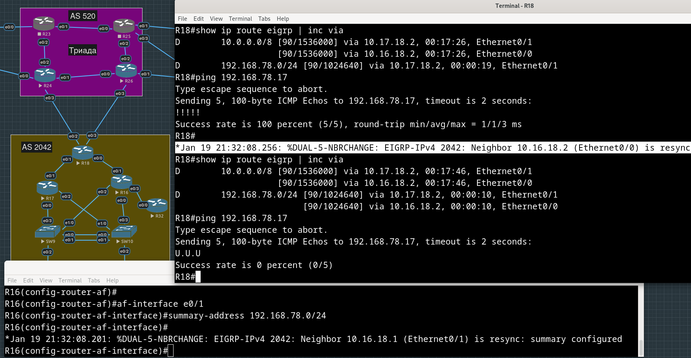


Видимо, придется вообще отказаться от идеи анонсировать loopback-адреса из `192.168.78.0/24` на R16 и R17 - удалили этот префикс из summary на обоих маршрутизаторах.

В R32 из `e0/3` должен уходить только маршрут по умолчанию, добьемся этого через суммаризацию:

```
R16(config-router-af-interface)#summary-address 0.0.0.0 0.0.0.0
R16(config-router-af-interface)#exit
```

### Настройка R32

Настроим EIGRP на R32 и удостоверимся, что он получает маршрут по умолчанию от R16.

```
R32(config)#router eigrp SPB-EIGRP
R32(config-router)#address-family ipv4 autonomous-system 2042
R32(config-router-af)#network 10.0.0.0 0.255.255.255
*Jan 19 21:44:29.097: %DUAL-5-NBRCHANGE: EIGRP-IPv4 2042: Neighbor 10.32.16.1 (Ethernet0/0) is up: new adjacency
R32(config-router-af)#network 192.168.78.0 0.0.0.255
```

Здесь нет условия, что маршрутизатор должен рассказывать только свои summary-префиксы, так что сделаем stub с настройками по умолчанию (summary + connected):

```
R32(config-router-af)#eigrp stub
```

Смотрим таблицу маршрутизации R32 - действительно, по EIGRP получаем только маршрут по умолчанию:

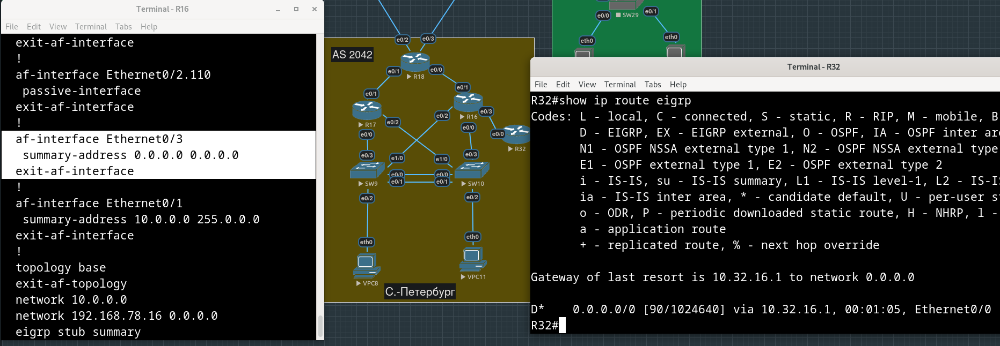

## Проверка

В качестве тестов, попробуем попинговать, например, с VPC8 маршрутизатор R32.

Сделать это нам не удается, анонсировать "суммарный" префикс можно только в случае, если адрес самого интерфейса, с которого будет отправляться анонс, входит в этот префикс. Чтобы в "сумму" входили все адреса за R16 и R17 - у которых номер каждого sub-интерфейса (соответствующих своим VLAN-ам) отражается во втором октете адреса, т.е. приходится брать самый широкий префикс `10.0.0.0/8` - при планировании адресного пространства мы пошли по пути большей предсказуемости адресов интерфейсов, пожертвовав возможностью сворачивать.

Пакет с VPC8 идет через R17 на R32 с адресом `10.32.16.2`. На R17 для такого dest есть только запись о суммарном префиксе `10.0.0.0/8`, которую мы добавили сами командой `summary-address` на интерфейсе в сторону R18, получив при этом в качестве следующего хопа Null0 (т.е. black hole - пакеты до `10.32.16.2` будут отброшены).

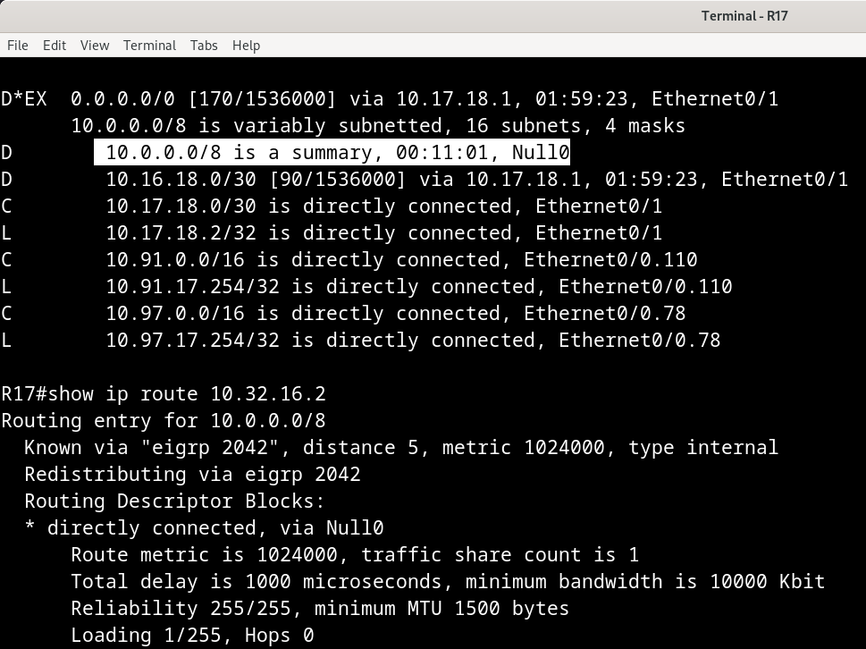

Поэтому условие "R16-17 анонсируют только суммарные префиксы" для распланированного ранее адресного пространства, где по придуманному нами "Правилу" можно восстановить адрес любого из интерфейсов любого офиса, подходит плохо.

Добавим к анонсам summary-префиксов еще и префиксов connected-сетей и уберем суммаризацию префиксов в `10.0.0.0/8` на `e0/1` R16 и R17:

```
R16(config-router-af)#eigrp stub summary connected
```

```
R17(config-router-af)#eigrp stub connected summary
```

```
R16(config-router-af-interface)#no summary-address 10.0.0.0 255.0.0.0
```

```
R17(config-router-af-interface)#no summary-address 10.0.0.0 255.0.0.0
```

При этом помним, что на R16 мы оставили суммаризацию дефолтного маршрута, который должен пробрасываться до R32:
```
  !       
  af-interface Ethernet0/3
   summary-address 0.0.0.0 0.0.0.0
  exit-af-interface
  !       
```
И тем самым мы заблэкхолили `0.0.0.0/0` на самом R16 (т.е. с R16 попинговать что-либо, не подключенное непосредственно к нему, не получится - по таблице маршрутизации попадем в запись c nexthop Null0):

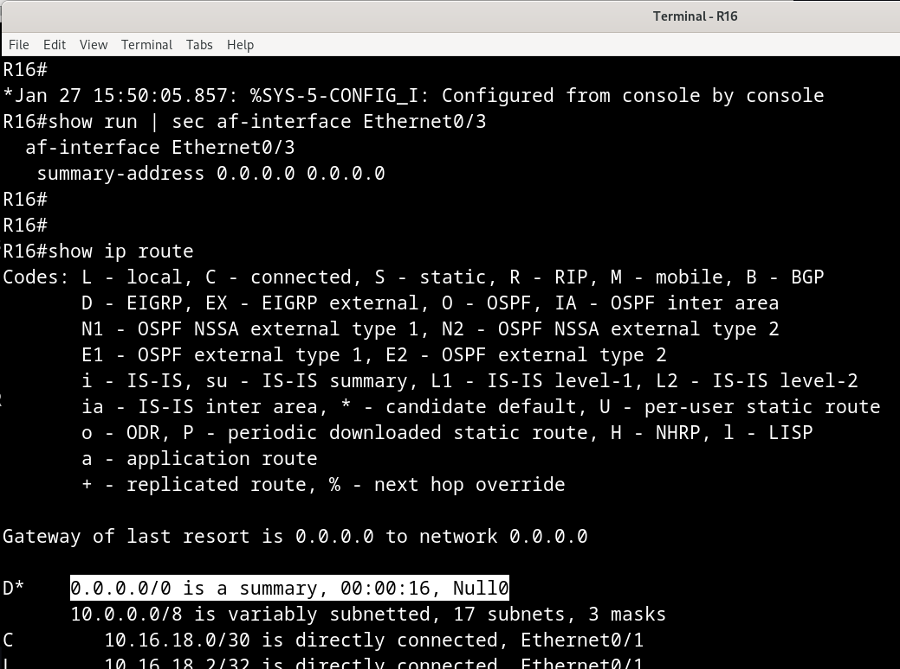

Если мы избавимся от этой суммаризации, R32 перестанет получать дефолт:

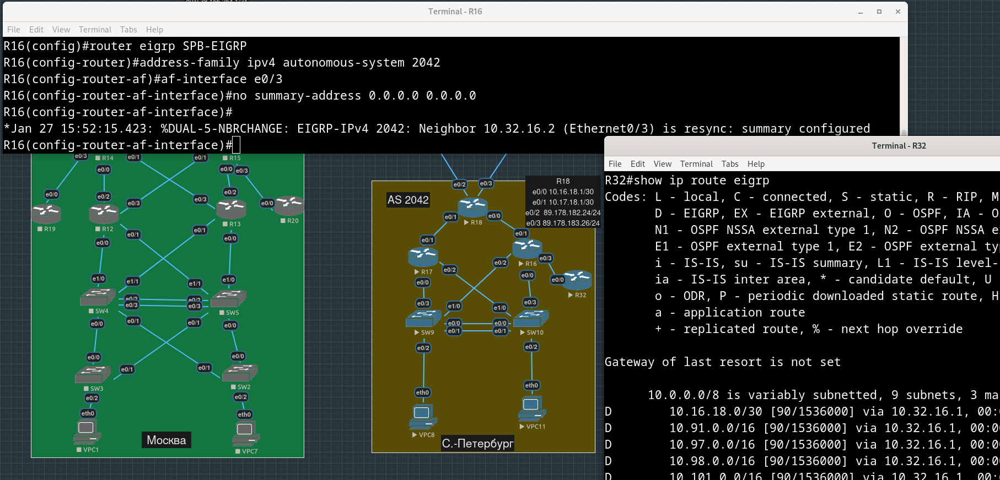

## Конфиги устройств, использованных в работе

[R16.conf](./configs/R16.conf)

[R17.conf](./configs/R17.conf)

[R18.conf](./configs/R18.conf)

[R32.conf](./configs/R32.conf)