# Лабораторная работа №9. BGP. Основы

**Цель**:

Настроить BGP между автономными системами
Организовать доступность между офисами Москва и С.-Петербург

**Описание/Пошаговая инструкция выполнения домашнего задания**:

    - Настроите eBGP между офисом Москва и двумя провайдерами - Киторн и Ламас.
    - Настроите eBGP между провайдерами Киторн и Ламас.
    - Настроите eBGP между Ламас и Триада.
    - Настроите eBGP между офисом С.-Петербург и провайдером Триада.
    - Организуете IP доступность между пограничным роутерами офисами Москва и С.-Петербург.
    - План работы и изменения зафиксированы в документации.

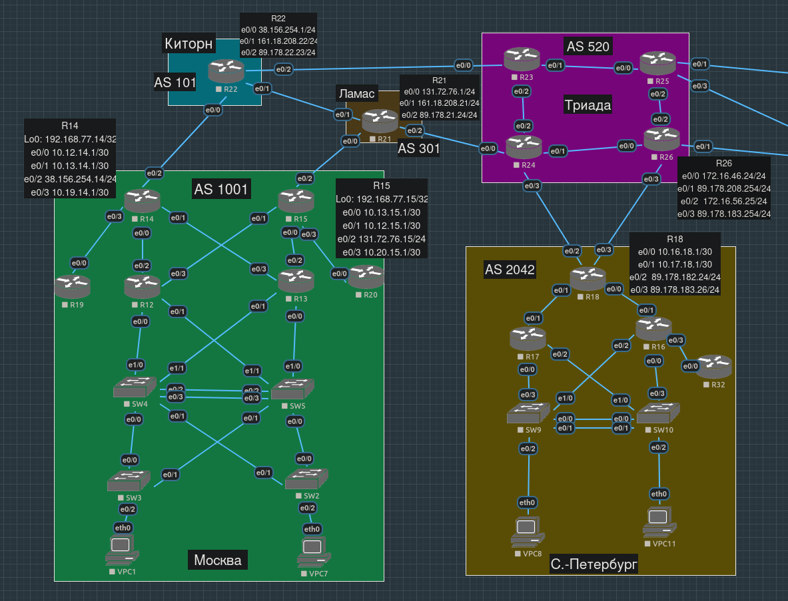

- [Настройка стыков Москва - Киторн и Москва - Ламас](#настройка-стыков-москва---киторн-и-москва---ламас)
  - [Стык R14 - R22](#стык-r14---r22)
  - [Стык R15 - R21](#стык-r15---r21)
- [Настройка стыка Киторн - Ламас](#настройка-стыка-киторн---ламас)
- [Настройка стыка Ламас - Триада](#настройка-стыка-ламас---триада)
- [Настройка стыка Триада - Петербург](#настройка-стыка-триада---петербург)
- [Проверка доступности бордеров Москва - Петербург](#проверка-доступности-бордеров-москва---петербург)
- [Конфиги устройств, использованных в работе](#конфиги-устройств-использованных-в-работе)

## Настройка стыков Москва - Киторн и Москва - Ламас

### Стык R14 - R22

Сначала настроим R14 - AS Московского офиса = 1001, ip-адрес BGP-пира (R22, Киторн) - 38.156.254.1:

```
R14(config)#router bgp 1001
R14(config-router)#neighbor 38.156.254.1 remote-as 101
```

На стороне R22 (AS Киторн = 101, адрес соединенного с ним интерфейса R14 - 38.156.254.14):

```
R22(config)#router bgp 101
R22(config-router)#neighbor 38.156.254.14 remote-as 1001
```

Пиринг, очевидно, установился (судим по выводу `show ip bgp nei`), никаких новых префиксов мы не получили - еще ничего не анонсировали:

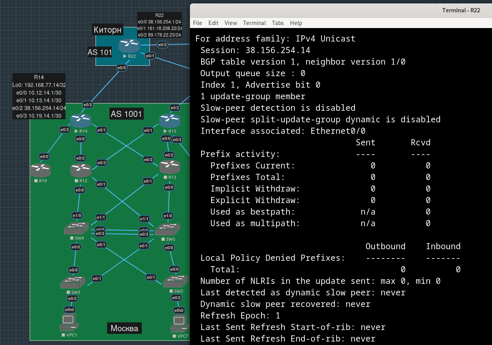

Мы знаем, что все loopback-интерфейсы устройств Московского офиса входят в префикс `192.168.77.0/24`. Анонсируем эту сеть на R14:

```R14(config-router)#network 192.168.77.0 mask 255.255.255.0```

На R22 `show ip bgp` ничего не показал. Из [статьи](https://linkmeup.ru/blog/1198/) про BGP цикла "Сети для самых маленьких":  "... в ту сеть, которую вы прописали командой network должен быть точный маршрут, иначе она не будет добавлена в таблицу BGP – это обязательное условие".

Вслед за ними пропишем маршрут в Null 0:

```R14(config)#ip route 192.168.77.0 255.255.255.0 null 0```

Теперь на R22 видим, что префикс появился

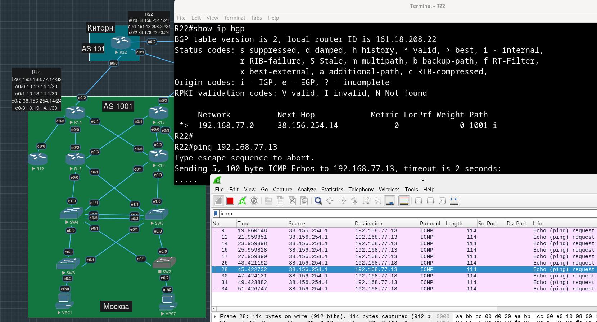

По крайней мере реквесты в сторону маршрутизаторов за R14 доезжают: на R12 и R13 есть два дефолта, для отправки респонса почему-то выбирается через R15, который мы еще не настраивали (на скриншоте трафик слушаем на e0/3 R12):

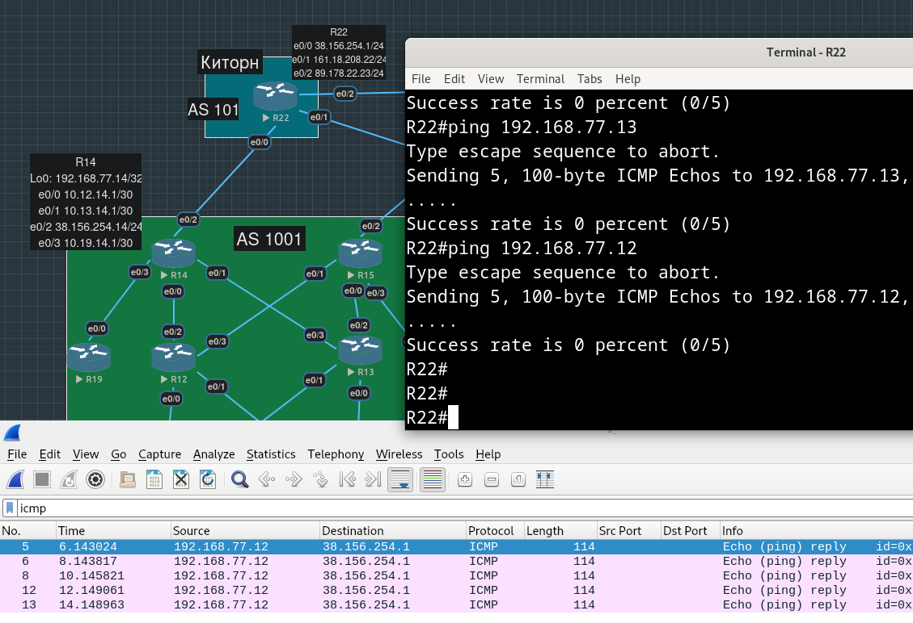

Добавим в анонсы на R14 сети, в которых находятся VPC Московского офиса, и пропишем blackhole-маршрут для них:

```
R14(config-router)#network 10.41.0.0 mask 255.255.0.0
R14(config-router)#network 10.57.0.0 mask 255.255.0.0
```

Прописывать blackhole-маршруты для этих сетей не нужно, они уже в таблице маршрутизации благодаря OSPF:

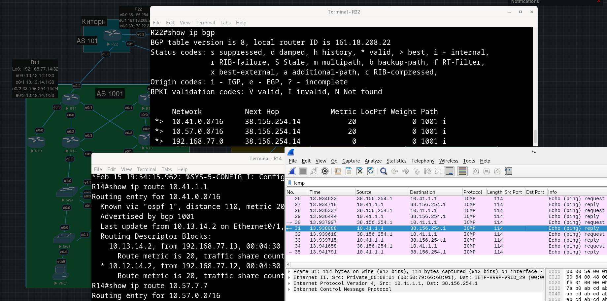

### Стык R15 - R21

Произведем аналогичные действия на R15 и R21:

```
R15(config)#router bgp 1001
R15(config-router)#neighbor 131.72.76.1 remote-as 301
R15(config-router)#network 192.168.77.0 mask 255.255.255.0
R15(config-router)#network 10.41.0.0 mask 255.255.0.0  
R15(config-router)#network 10.57.0.0 mask 255.255.0.0
R15(config-router)#exit
R15(config)#ip route 192.168.77.0 255.255.255.0 null 0
```

```
R21(config)#router bgp 301
R21(config-router)#neighbor 131.72.76.15 remote-as 1001
```

Проверяем - пингуем с R21 VPC7:

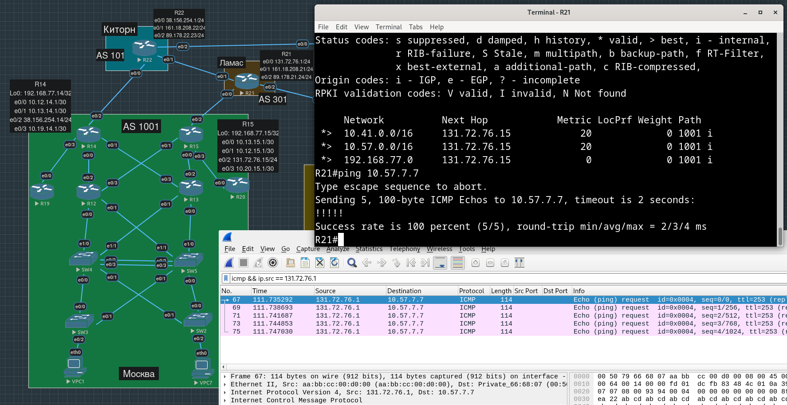

## Настройка стыка Киторн - Ламас

Теперь настроим BGP соседство между R21 и R22.

```
R21(config-router)#neighbor 161.18.208.22 remote-as 101
```

```
R22(config-router)#neighbor 161.18.208.21 remote-as 301
```

Увидели друг друга среди соседей:

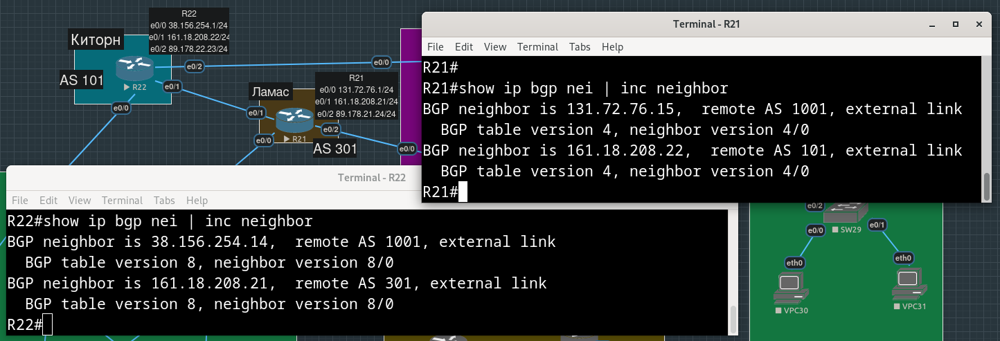

Чтобы R21 и R22 стали рассказывать друг другу о сетях в сторону Москвы делать ничего не надо, R14 и R15 сами должны анонсировать префиксы, в которые входят адреса их "внешних" интерфейсов.

Теперь, например, с R13 можно ходить на R22 через R15 и R21 (на скрине - пинги с R22 на R13 возвращаются через R21, на e0/1 которого слушаем трафик wireshark-ом):

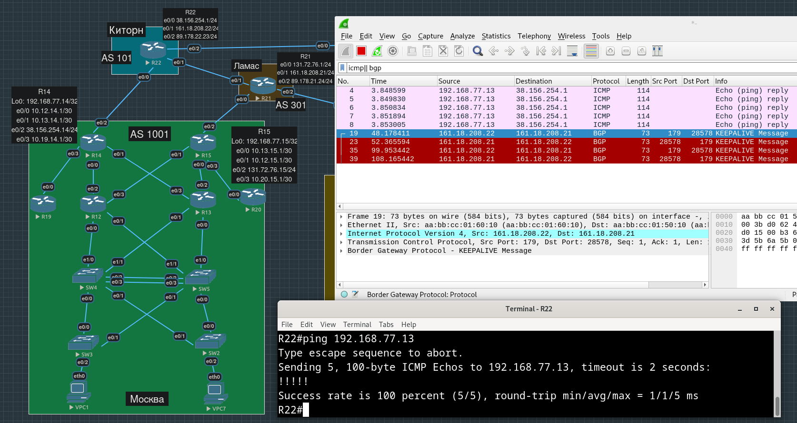

## Настройка стыка Ламас - Триада

На R24 пропишем в качестве BGP-пира адрес интерфейса R21, который соединен с R24:

```
R24(config)#router bgp 520
R24(config-router)#neighbor 89.178.21.24 remote-as 301
```

То же самое сделаем на R21 в отношении R24:

```
R21(config-router)#neighbor 89.178.21.254 remote-as 520
```

На R24 (Триада) видим префиксы, пришедшие через Ламас из других AS:

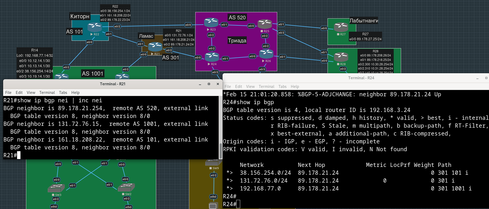


Для создания связности между граничным маршрутизаторами в Москве и Петербурге, нам нужно, чтобы им были известны адреса внешних интерфейсов друг друга.
На скрине выше видим, что маршрутизатор R21 уже анонсирует Триаде префиксы `38.156.254.0/24` (куда входит московский R14) и `131.72.76.0/24` (куда входит московский R15).

С другой стороны, маршрутизатор R24 должен анонсировать в Ламас сети, которыми он соединен с Петербургским офисом - `89.178.182.0/24`, для этого его должен анонсировать сам R18.


## Настройка стыка Триада - Петербург

Настроим соседство между R24 и R18:

```
R24(config-router)#neighbor 89.178.182.24 remote-as 2042
```

```
R18(config)#router bgp 2042
R18(config-router)#neighbor 89.178.182.254 remote-as 520
```

Добавим сеть `89.178.182.0/24` в анонс:

```
R18(config-router)#network 89.178.182.0 mask 255.255.255.0
```

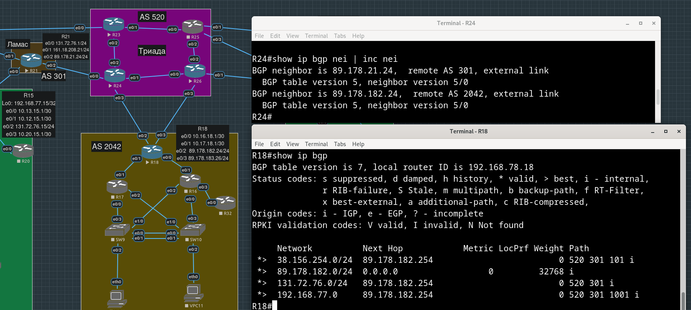

## Проверка доступности бордеров Москва - Петербург

Пингуем внешний интерфейс R18 с R14 и R15:

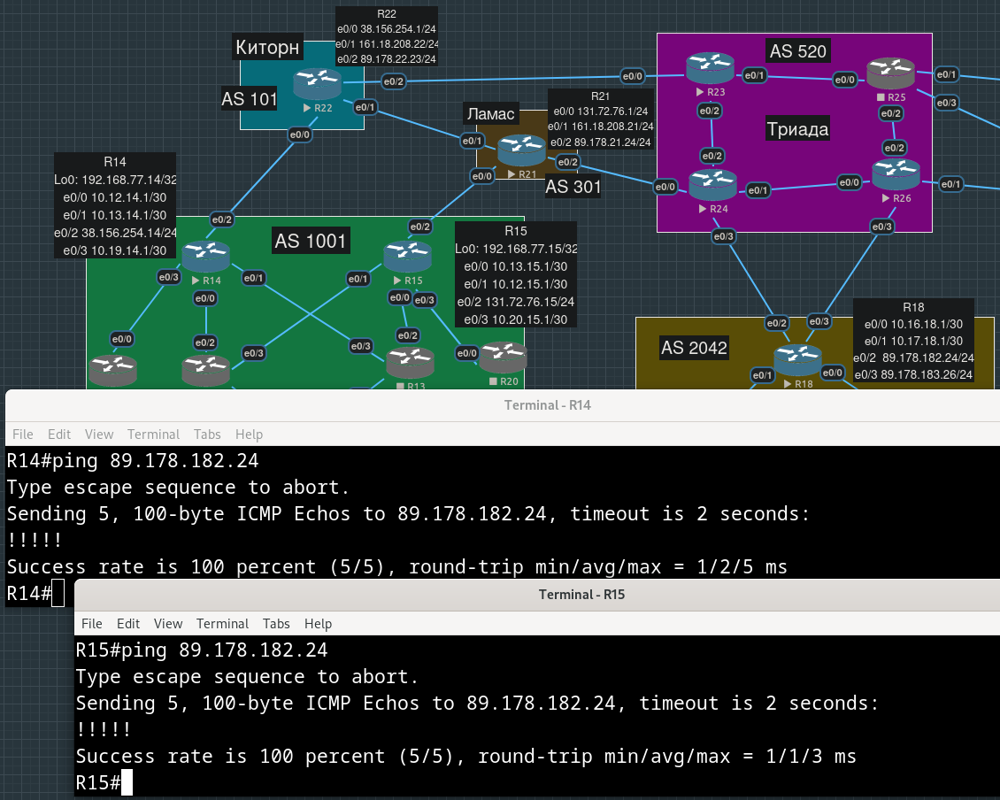

На маршрутизаторах, анонсирующих наружу сети, в которые входят их собственные интерфейсы, заметили в `show ip bgp` статусы RIB-Failure:

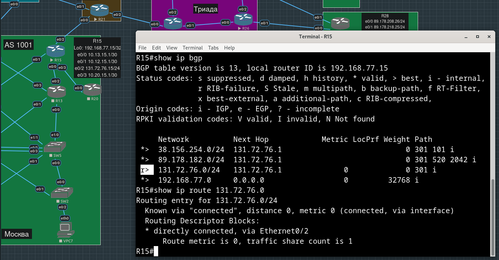

Пишут, что:
"If the Routing Table already has the same prefix/prefix-length entry with a lower Administrative Distance (AD) as seen in  show ip bgp, BGP marks the route received with RIB-Failure."

Адреса интерфейсов входят в эти префиксы, поэтому они известны с AD = 0 как Connected-сети. Видимо, вместо R15 его сеть анонсирует кто-то еще.

Исправим это:

```
R21(config-router)#no network 131.72.76.0 mask 255.255.255.0
```

То же самое на R14 и R22:

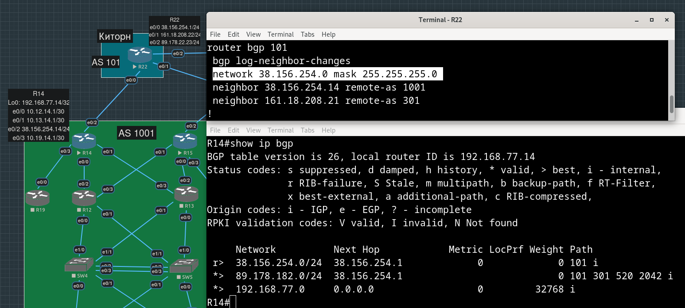


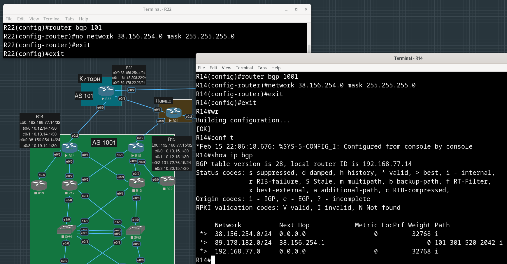


## Конфиги устройств, использованных в работе

[R14.conf](./configs/R14.conf)

[R15.conf](./configs/R15.conf)

[R21.conf](./configs/R21.conf)

[R22.conf](./configs/R22.conf)

[R24.conf](./configs/R24.conf)

[R18.conf](./configs/R18.conf)
