# Лабораторная работа №10. iBGP

**Цель**:

Настроить iBGP в офисе Москва
Настроить iBGP в сети провайдера Триада
Организовать полную IP связанность всех сетей

**Описание/Пошаговая инструкция выполнения домашнего задания**:

    - Настроите iBGP в офисе Москва между маршрутизаторами R14 и R15.
    - Настроите iBGP в провайдере Триада, с использованием RR.
    - Настройте офис Москва так, чтобы приоритетным провайдером стал Ламас.
    - Настройте офиса С.-Петербург так, чтобы трафик до любого офиса распределялся по двум линкам одновременно.
    - Все сети в лабораторной работе должны иметь IP связность.
    - План работы и изменения зафиксированы в документации.

- [Настройка iBGP между R14 и R15](#настройка-ibgp-между-r14-и-r15)
- [Настройка iBGP в провайдере Триада](#настройка-ibgp-в-провайдере-триада)
- [Настройка приоритета для Ламас в Москве](#настройка-приоритета-для-ламас-в-москве)
- [Проверка IP-связности](#проверка-ip-связности)
- [Конфиги устройств, использованных в работе](#конфиги-устройств-использованных-в-работе)

## Настройка iBGP между R14 и R15

Сейчас у R14 и R15 по одному внешнему eBGP-соседу - маршрутизаторы в Киторн и Ламас соответственно.

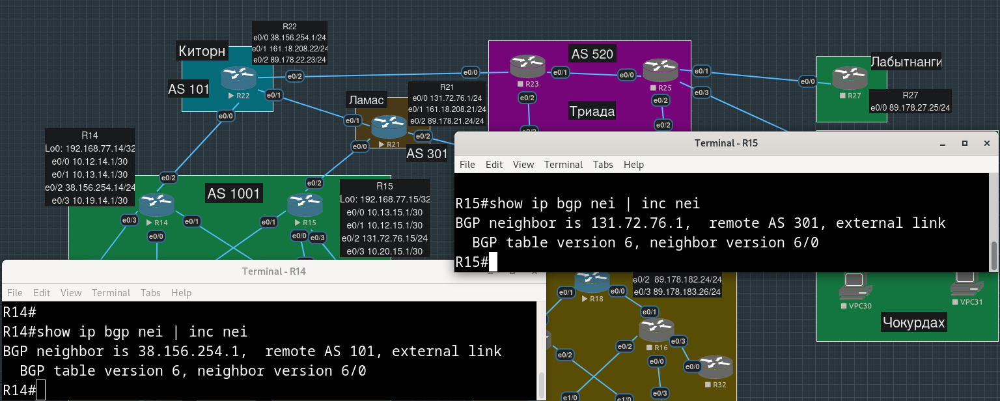

Сделаем их "внутренними" соседями друг друга, указав в качестве remote-as их общую 1001.

Устанавливать сессию будем не с ближайшего к соседу физического интерфейса, а с loopback-а, для этого надо явно указать `update-source` (имеется в виду интерфейс нашего, конфигурируемого в данный момент маршрутизатора).


```
R14(config-router)#neighbor 192.168.77.15 remote-as 1001
R14(config-router)#neighbor 192.168.77.15 update-source Loopback0
```

```
R15(config-router)#neighbor 192.168.77.14 remote-as 1001
R15(config-router)#neighbor 192.168.77.14 update-source Loopback0
```

Пришлось заодно удалить с R12 какой-то странный статический маршрут, который мешал установлению bgp-сессии:

```
S        192.168.77.14 is directly connected, Ethernet0/0.77
```

```
R12(config)#no ip route 192.168.77.14 255.255.255.255
```

Увидели установление соседства:

```
R15#
*Feb 16 19:44:56.799: %BGP-5-ADJCHANGE: neighbor 192.168.77.14 Up 
```

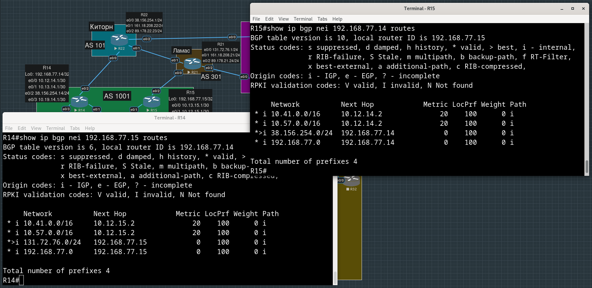

Видим, что R14 узнает от R15 о Ламас (131.72.76.0/24), а R15  от R14 - о Киторн (38.156.254.0/24).

## Настройка iBGP в провайдере Триада

Настроим сначала eBGP-соседство R23 с провайдером Киторн:

```
R23(config)#router bgp 520
R23(config-router)#neighbor 89.178.22.23 remote-as 101
```

Чтобы маршруты, полученные от внешних (про все адреса  внутри Триады, включая адреса всех Loopback-интерфейсов, мы знаем благордаря IS-IS) источников (анонсы eBGP соседей или статика от Чокурдах и Лабытнанги) стали известны всем внутри Триады настраиваем iBGP.

Чтобы не делать все маршрутизаторы Триады iBGP-соседями друг друга, подумаем о том, какой маршрутизатор в Триаде назначить Route Reflector-ом (RR-сервером).

Маршрутизаторы-клиенты не знают, кто является Route Reflector-ом (сервером), так что, наверное, для резервирования можно настроить два роут-рефлектора

У R25 нет eBGP соседей, так что точно не его. У R24 два eBGP соседа, у R23 и R26 - по одному. Выберем R24 и R26 (и они будут клиентами друг друга - о том, что петель не будет, позаботится атрибут originator_id).

```
R24(config)#router bgp 520
R24(config-router)#neighbor 192.168.3.23 remote-as 520
R24(config-router)#neighbor 192.168.3.23 route-reflector-client
R24(config-router)#neighbor 192.168.3.23 update-source Loopback 0
```

```
R24(config-router)#neighbor 192.168.3.25 remote-as 520
R24(config-router)#neighbor 192.168.3.25 route-reflector-client
R24(config-router)#neighbor 192.168.3.25 update-source Loopback 0
```

```
R24(config-router)#neighbor 192.168.3.26 remote-as 520  
R24(config-router)#neighbor 192.168.3.26 route-reflector-client
R24(config-router)#neighbor 192.168.3.26 update-source Loopback 0
```

Аналогичные действия проделаем на R26 (заодно сделаем его eBGP-соседом R18 - ну и на противоположной стороне, помним, что BGP не умеет в автоматическое определение соседства, не забудем анонсировать на R18 сеть `89.178.183.0/24`):

```
R26(config)#router bgp 520
R26(config-router)#neighbor 89.178.183.26 remote-as 2042
```

```
R18(config)#router bgp 2042
R18(config-router)#neighbor 89.178.183.254 remote-as 520
R18(config-router)#network 89.178.183.0 mask 255.255.255.0
```


```
R26(config-router)#neighbor 192.168.3.23 remote-as 520
R26(config-router)#neighbor 192.168.3.23 route-reflector-client
R26(config-router)#neighbor 192.168.3.23 update-source Loopback 0
```

```
R26(config-router)#neighbor 192.168.3.24 remote-as 520
R26(config-router)#neighbor 192.168.3.24 route-reflector-client
R26(config-router)#neighbor 192.168.3.24 update-source Loopback 0
```

```
R26(config-router)#neighbor 192.168.3.25 remote-as 520
R26(config-router)#neighbor 192.168.3.25 route-reflector-client
R26(config-router)#neighbor 192.168.3.25 update-source Loopback 0
```

На оставшихся маршрутизаторах в качестве соседей укажем только R24 и R26:

```
R23(config)#router bgp 520
R23(config-router)#neighbor 192.168.3.24 remote-as 520
R23(config-router)#neighbor 192.168.3.24 update-source Loopback 0
```

```
R23(config-router)#neighbor 192.168.3.26 remote-as 520  
R23(config-router)#neighbor 192.168.3.26 update-source Loopback 0
```

```
R25(config)#router bgp 520
R25(config-router)#neighbor 192.168.3.24 remote-as 520
R25(config-router)#neighbor 192.168.3.24 update-source Loopback 0
```

R26 и R25 должны анонсировать те сети, которые они статически получают от Чокурдах и Лабытнанги, добавим их с помощью `network`.

```
R25(config)#router bgp 520
R25(config-router)#network 89.178.27.0 mask 255.255.255.0
R25(config-router)#network 89.178.218.0 mask 255.255.255.0
```


```
R26(config)#router bgp 520
R26(config-router)#network 89.178.208.0 mask 255.255.255.0
```

Убеждаемся, что, например, на R24 эти анонсированные сети стали видны:

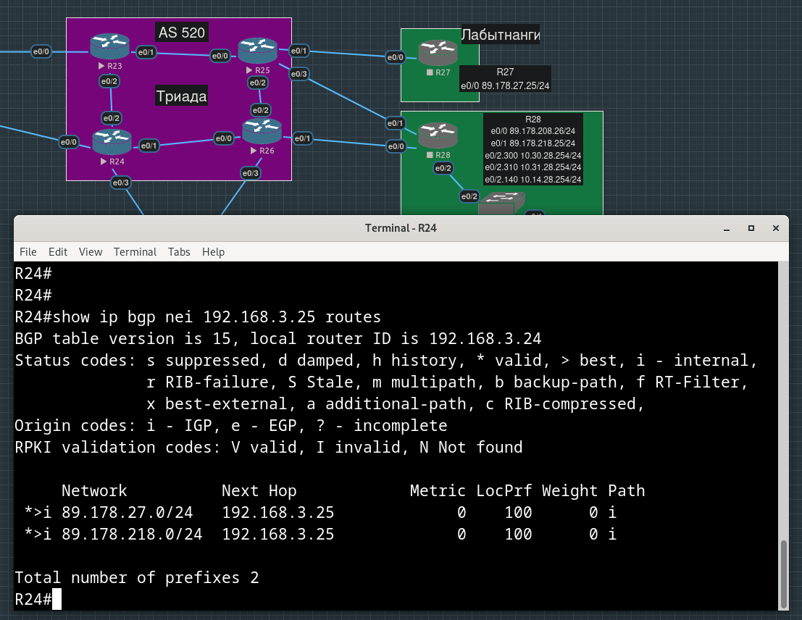

А, например, на московском бордере R15 видны внешние интерфейсы для офисов Петербурга (в третьем октете 182, 183), Чокурдах (208, 218) и Лабытнанги (27):

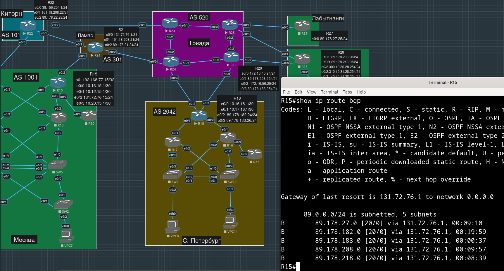

## Настройка приоритета для Ламас в Москве


На данный момент для доступа "наружу" на бордерах R14 и R15 прописаны статические дефолты, которые потом редистрибутятся в OSPF:

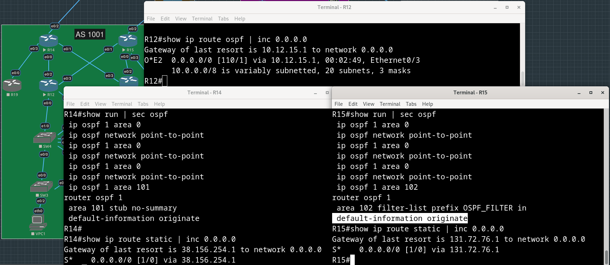

Чтобы приоритетным маршрутом наружу стал путь через Ламас, маршруту через R14 пропишем большую метрику.

```
R14(config-router)#default-information originate metric 255
```

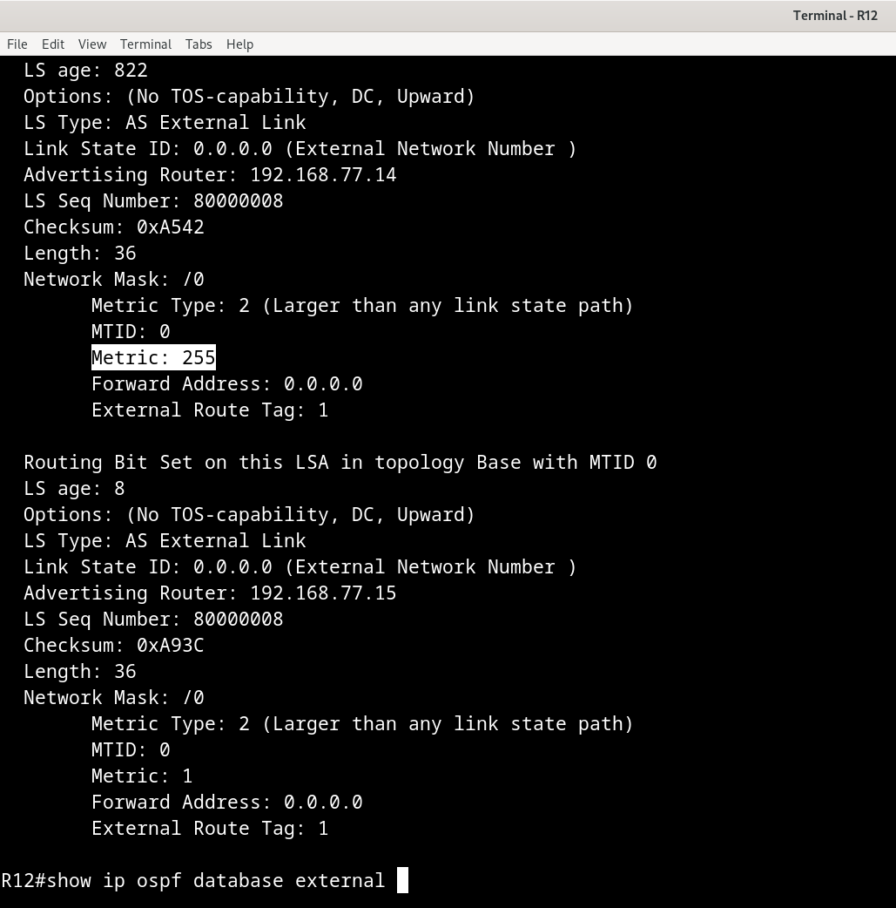

Кажется, что этого достаточно, чтобы получающие дефолты через OSPF маршрутизаторы отдавали предпочтение маршруту через R15 (через Ламас).

На скриншоте - больше никаких равнозначных маршрутов, только через R15:

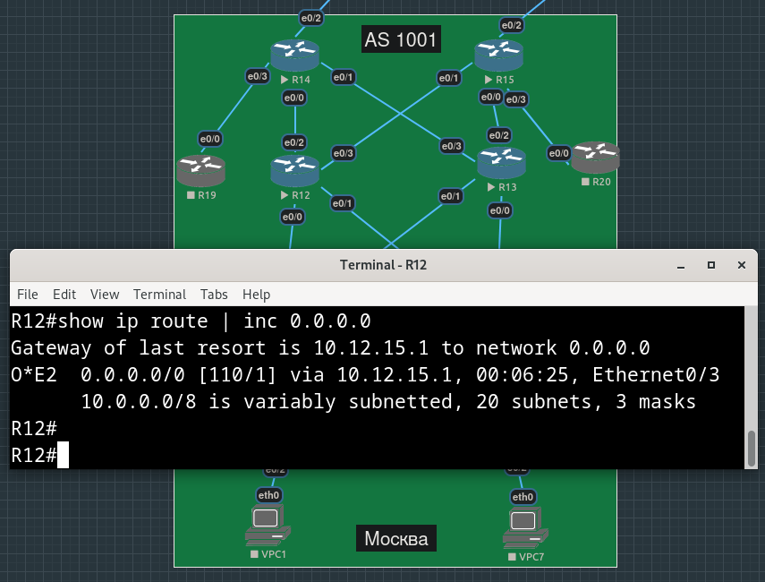

Я не уверен, что именно это требовалось в задании, все-таки лабораторная работа посвящена iBGP, видимо подразуемевается, что от нас хотят каких-то манипуляций с local preference, но с другой стороны все маршрутизаторы в московском офисе обмениваются маршртуами именно через OSPF.

То же самое про равномерное распределение трафика на бордере Петербурга - два дефолтных маршрута на R18 уже равнозначны.

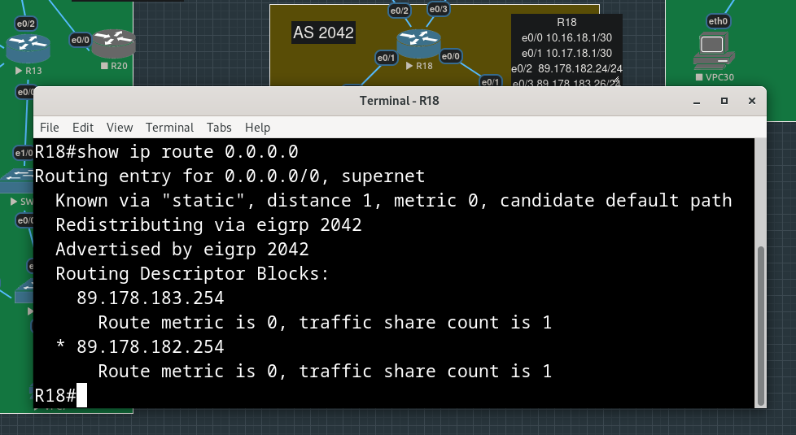

С бордера Петербурга пингуем loopback-интерфейс "менее приоритетного" бордера Москвы:

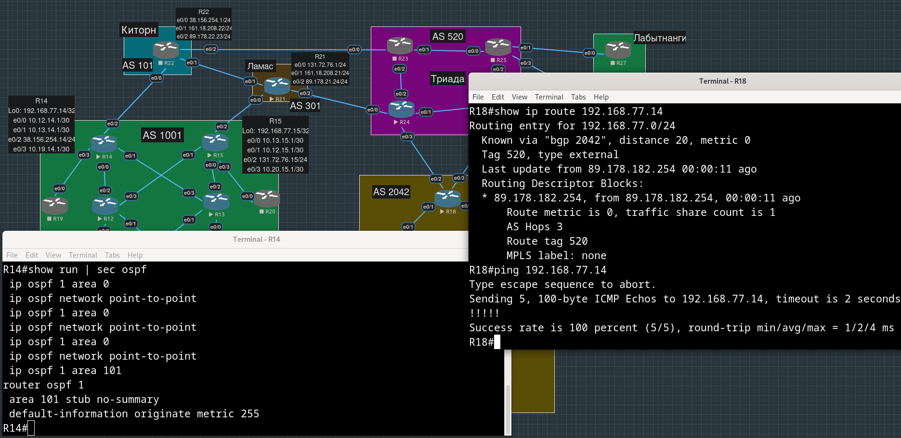

## Проверка IP-связности

Добавим в анонс бордера Петербурга сети, в которых находятся VPC и loopback-интерфейсы всех устройст офиса:

```
R18(config)#router bgp 2042
R18(config-router)#network 10.98.0.0 mask 255.255.0.0
R18(config-router)#network 10.101.0.0 mask 255.255.0.0
R18(config-router)#network 192.168.78.0 mask 255.255.255.0
```

Помним, что мы можем анонсировать только префиксы, которые содержатся в нашей таблице маршрутизации, т.е. добавим следующую запись:

```
R18(config)#ip route 192.168.78.0 255.255.255.0 null 0
```

Пингуем с машин Московского офиса машины Петерургского офиса и наоборот:

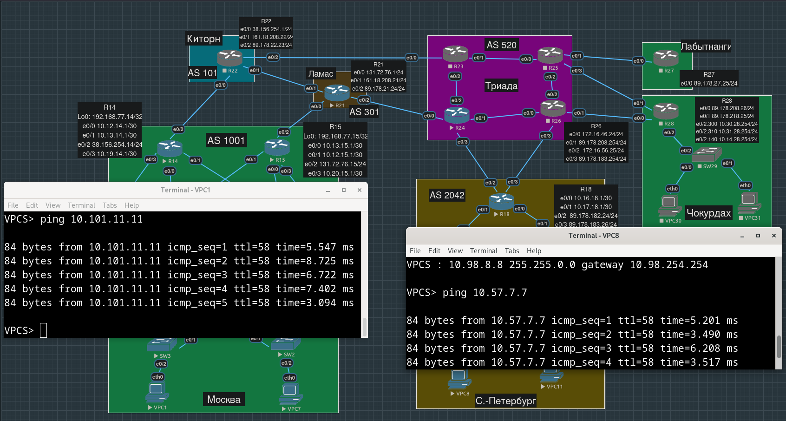

Пингуем с loopback-интерфейсов промежуточных маршрутизаторов Московского офиса loopback-интерфейсы промежуточных маршрутизаторов Петерургского офиса и наоборот:

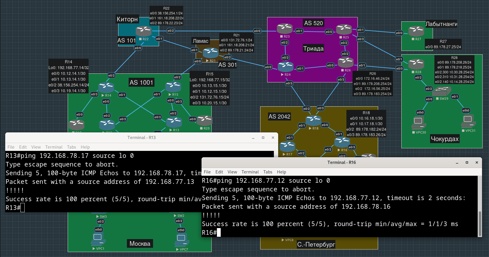

Для связности с Чокурдах и Лабытнанги - пусть R25 и R26 рассказывают о сетях, которыми они соединены с бордерами этих офисов:

```
R25(config)#router bgp 520
R25(config-router)#network 89.178.27.0 mask 255.255.255.0
R25(config-router)#network 89.178.218.0 mask 255.255.255.0
```

Также, похоже, на R26 и R24 забыли сделать nexthop-self - теперь R25 получает маршрут до R18 c nexthop-ом - самим адресом интерфейса R18, про который он ничего не знает:

```
R26(config)#router bgp 520
R26(config-router)#neighbor 192.168.3.25 next-hop-self
```

```
R24(config)#router bgp 520
R24(config-router)#neighbor 192.168.3.25 next-hop-self
```

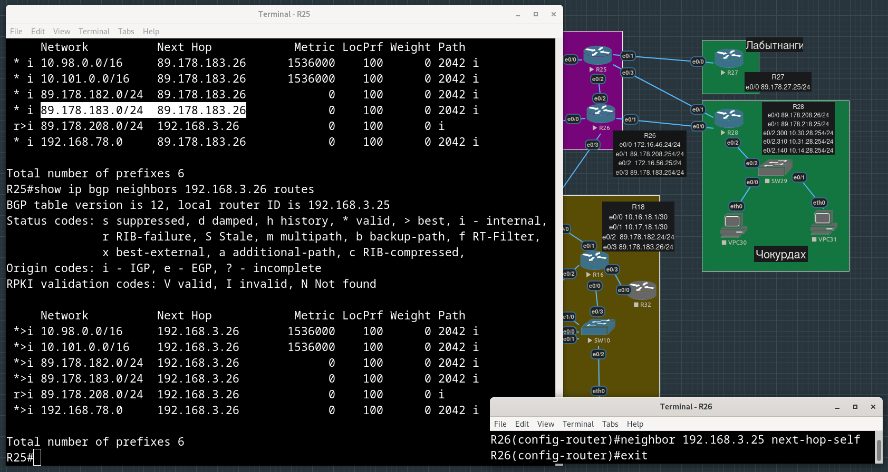

Теперь, когда на R25 и R26 мы анонсируем внешние сети в BGP, можно избавиться от статических машрутов (помечены как rib-failure при получении друг от друга)

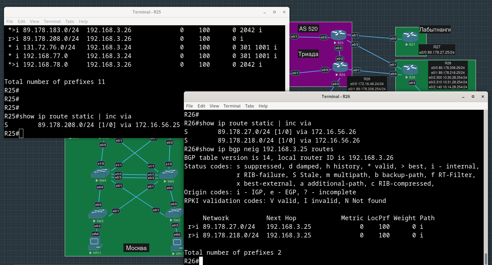

В Чокурдах (в отличие от Лабытнанги) почему-то не было дефолтов:

```
R28(config)#ip route 0.0.0.0 0.0.0.0 89.178.208.254
R28(config)#ip route 0.0.0.0 0.0.0.0 89.178.218.254
```

Пингуем с машин Москвы и Петербурга внешние интерфейсы Чокурдах и Лабытнанги:

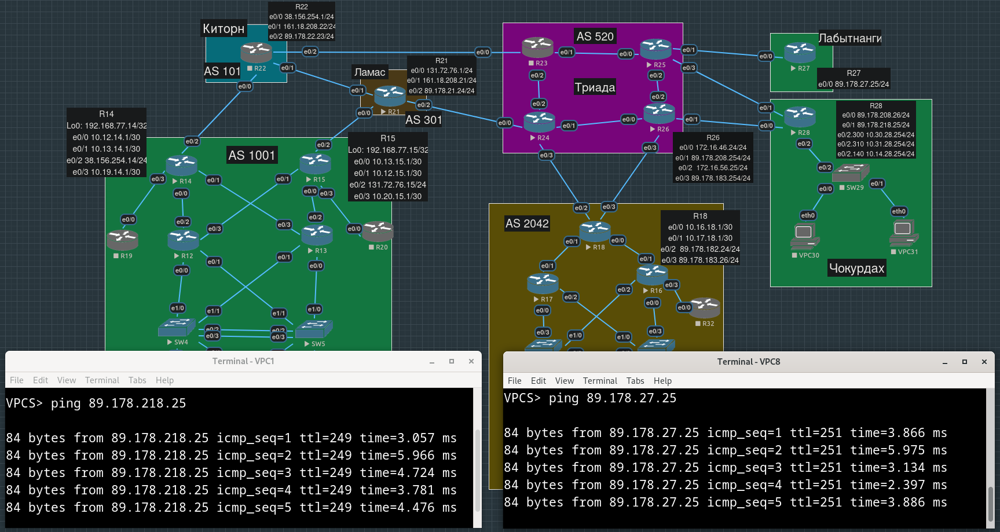

## Конфиги устройств, использованных в работе

Москва:

[R14.conf](./configs/R14.conf)

[R15.conf](./configs/R15.conf)

Петербург:

[R18.conf](./configs/R18.conf)

Триада:

[R24.conf](./configs/R24.conf)

[R25.conf](./configs/R25.conf)

[R26.conf](./configs/R26.conf)

Лабытнанги:

[R27.conf](./configs/R27.conf)

Чокурдах:

[R28.conf](./configs/R28.conf)

