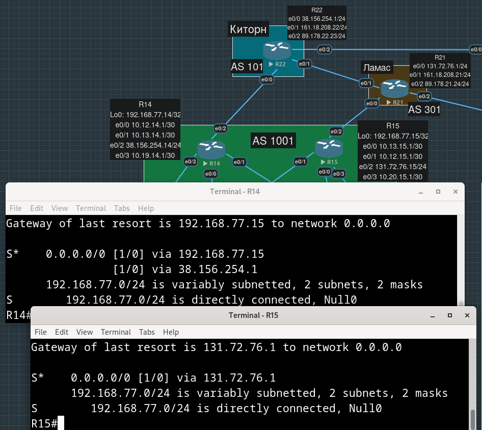
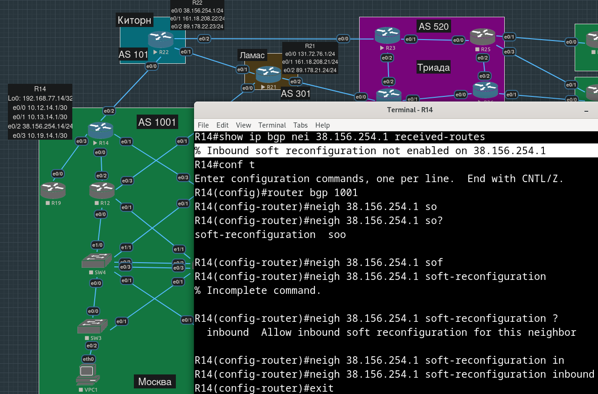
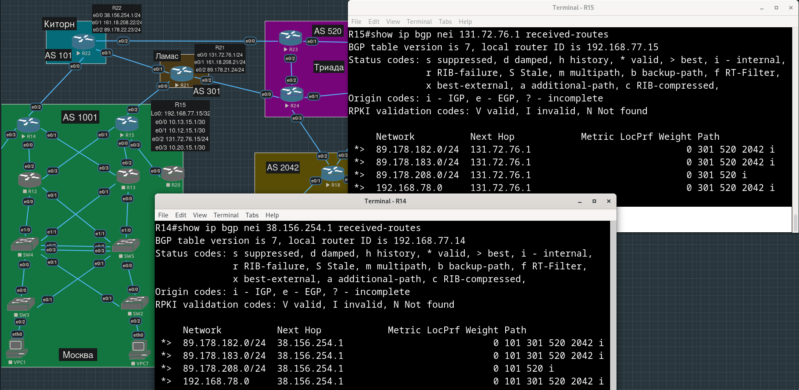
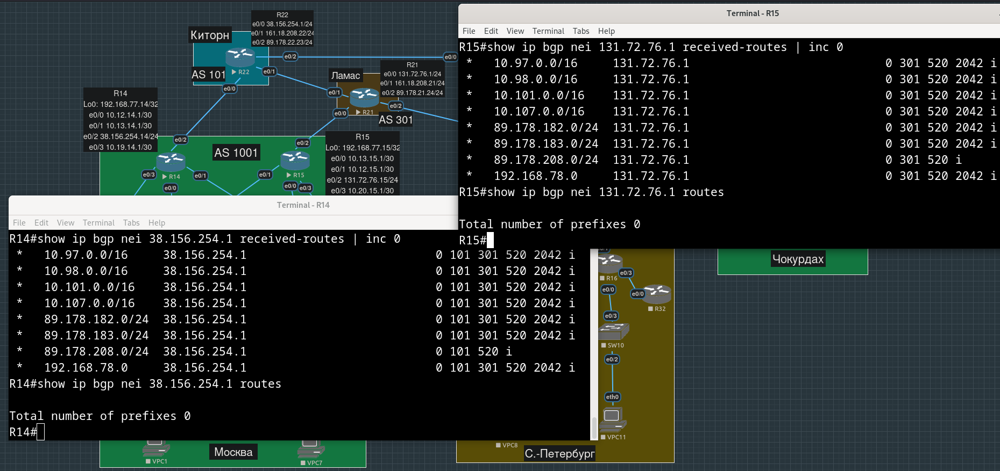
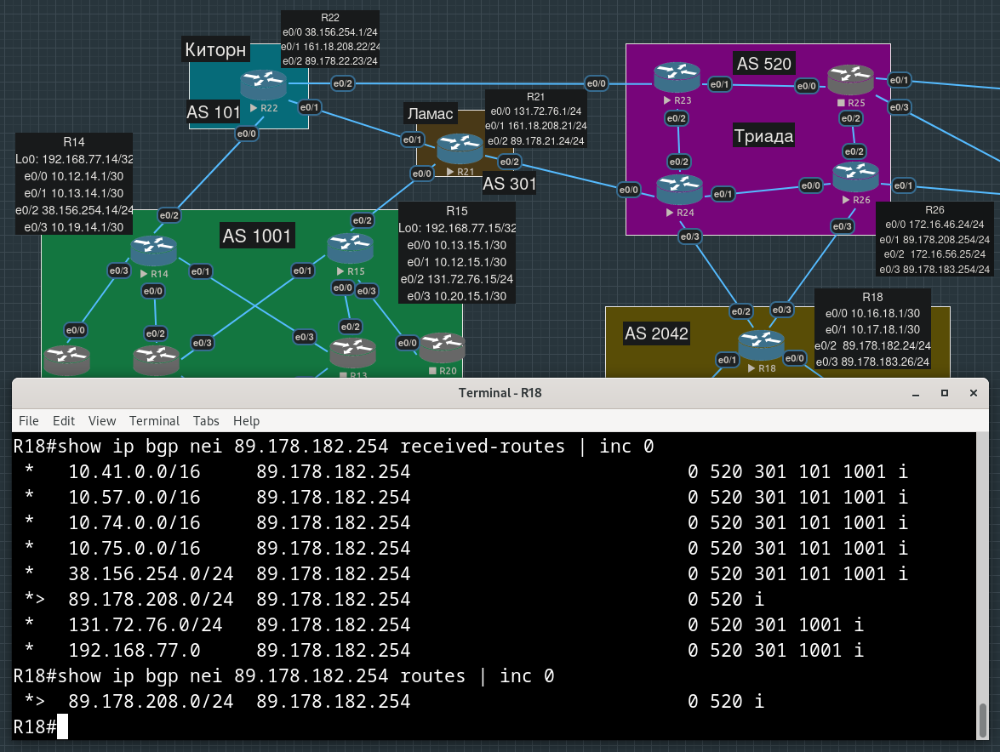
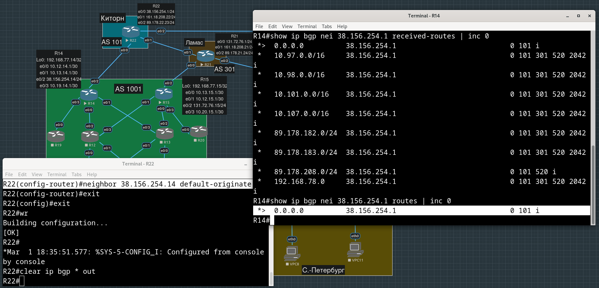
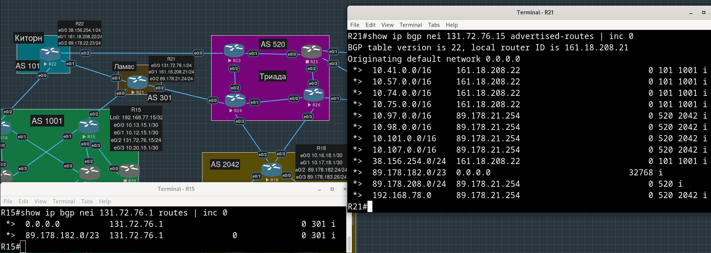
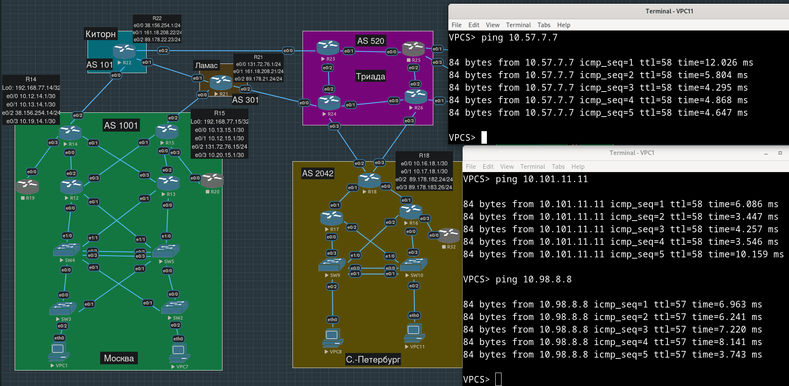

# Лабораторная работа №11. BGP. Фильтрация

**Цель**:

Настроить фильтрацию для офисе Москва
Настроить фильтрацию для офисе С.-Петербург

**Описание/Пошаговая инструкция выполнения домашнего задания**:

    - Настроить фильтрацию в офисе Москва так, чтобы не появилось транзитного трафика (As-path).
    - Настроить фильтрацию в офисе С.-Петербург так, чтобы не появилось транзитного трафика (Prefix-list).
    - Настроить провайдера Киторн так, чтобы в офис Москва отдавался только маршрут по умолчанию.
    - Настроить провайдера Ламас так, чтобы в офис Москва отдавался только маршрут по умолчанию и префикс офиса С.-Петербург.
    - Все сети в лабораторной работе должны иметь IP связность.

- [Настройка фильтрации в Москве](#настройка-фильтрации-в-москве)
- [Настройка фильтрации в Петербурге](#настройка-фильтрации-в-петербурге)
- [Настройка анонсов в Киторн](#настройка-анонсов-в-киторн)
- [Настройка анонсов в Ламас](#настройка-анонсов-в-ламас)
- [Конфиги устройств, использованных в работе](#конфиги-устройств-использованных-в-работе)

## Настройка фильтрации в Москве

От нас хотят "чтобы не появилось транзитного трафика(As-path)" - здесь имеется в виду, что мы можем получать маршруты, анонсированные только в соседней AS. Сейчас на граничных маршрутизаторах дефолты прописаны статически (через второй граничный маршрутизатор и через соединенного с ними самими провайдера):



Избавляемся от них:

```
R14(config)#no ip route 0.0.0.0 0.0.0.0 192.168.77.15
R14(config)#no ip route 0.0.0.0 0.0.0.0 38.156.254.1 
```

Теперь хотим посмотреть, какие префиксы мы получаем от соседа. Сконфигурим `soft-reconfiguration inbound`, чтобы видеть их в `received-routes`:



Теперь видим префиксы, полученные по BGP, в adj-RIB-in:



Очевидно, мы хотим добиться того, чтобы в таблицу loc-RIB не попали префиксы, оригинированные НЕ в AS провайдеров.

В регулярках указываем конкретные AS соединенных с московскими бордерами провайдеров
```
R14(config)#ip as-path access-list 1 permit ^101$
R14(config)#router bgp 1001
R14(config-router)#nei 38.156.254.1 filter-list 1 in
```

```
R15(config)#ip as-path access-list 1 permit ^301$
R15(config)#router bgp 1001
R15(config-router)#nei 131.72.76.1 filter-list 1 in
```

Заставим маршрутизаторы попросить соседей заново отправить маршруты (ROUTE-REFRESH):

```
R14#clear ip bgp * soft
```
```
R15#clear ip bgp * soft
```

Видим, что префиксы, впервые анонсированные не в AS провайдеров, в loc-RIB больше не попадают:



## Настройка фильтрации в Петербурге

Здесь фильтровать префиксы будем с помощью prefix-list-ов, т.е. все те префиксы, которые не принадлежат AS Триады, мы будем отбрасывать. Иными словами, будем оставлять только маршруты до устройств соседней AS, помним, что статический дефолт на R18 никуда не делся.

Сначала тоже сконфигурим для обоих соседей `soft-reconfiguration inbound`, чтобы потом сравнивать содержимое таблиц adj-RIB-in и loc-RIB:

```
R18(config)#router bgp 2042
R18(config-router)#nei 89.178.182.254 soft-reconfiguration inbound 
R18(config-router)#nei 89.178.183.254 soft-reconfiguration inbound
```

Теперь создадим prefix-list. Из лабораторной работы №4 вспоминаем, что все внешние префиксы Триады принадлежат сети `89.178.0.0/16`, но при этом все они `/24`. Так и напишем:

```
R18(config)#ip prefix-list ONLY_TRIAD_PREFIXES permit 89.178.0.0/16 ge 24
```

Навесим этот список на обоих соседей:

```
R18(config)#router bgp 2042
R18(config-router)#nei 89.178.182.254 prefix-list ONLY_TRIAD_PREFIXES in
R18(config-router)#nei 89.178.183.254 prefix-list ONLY_TRIAD_PREFIXES in
```

Попросим соседей переотправить префиксы

```
R15#clear ip bgp * soft
```

Сравниваем adj-RIB-in и loc-RIB, множество префиксов, рожденных не в соседней AS, фильтруются:



## Настройка анонсов в Киторн

На R22 в `show ip route` дефолта нет, но мы все равно хотим его проанонсировать.

```
R22(config)#router bgp 101
R22(config-router)#neighbor 38.156.254.14 default-originate
```

Обновим исходящие префиксы:

```
R22#clear ip bgp * out
```

Убеждаемся, что дефолт попал на московский бордер, соединенный с Киторн:



## Настройка анонсов в Ламас

Чтобы отдать дефолт московскому бордеру, тоже воспользуемся `default-originate`: 

```
R21(config)#router bgp 301
R21(config-router)#neighbor 131.72.76.15 default-originate
```

Чтобы передать московскому бордеру внешние адреса бордера петербургского бордера, воспользуеся `aggregate-address` БЕЗ опции `as-set` (в Москве мы фильтруем все маршруты, оригинированные не в соседних с ней AS, если укажем `as-set`, то AS_PATH сохранится)

Нам очень повезло, что в третьем октете (182 или 183) меняется только последний бит - можно отдать более широкий (на один бит) префикс `/23`:

```
R21(config-router)#aggregate-address 89.178.182.0 255.255.254.0 summary-only
```

Обновим анонсируемые наружу маршруты:

```
R21#clear ip bgp * out
```

Убеждаемся, что на R15 попали оба маршрута - дефолт и "просуммированный" `/23`:



Убеждаемся, что в результате наших действий связность между офисами не поломалась, пингуем машины Петербурга из Москвы и наоборот:



## Конфиги устройств, использованных в работе

Москва:

[R14.conf](./configs/R14.conf)

[R15.conf](./configs/R15.conf)

Петербург:

[R18.conf](./configs/R18.conf)

Киторн:

[R22.conf](./configs/R22.conf)

Ламас:

[R21.conf](./configs/R21.conf)