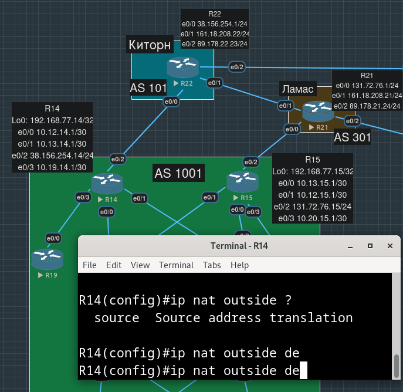

# Лабораторная работа №12. Основные протоколы сети интернет

**Цель**:

Настроить DHCP в офисе Москва
Настроить синхронизацию времени в офисе Москва
Настроить NAT в офисе Москва, C.-Петербург и Чокурдах

**Описание/Пошаговая инструкция выполнения домашнего задания**:

    - Настроить NAT(PAT) на R14 и R15. Трансляция должна осуществляться в адрес автономной системы AS1001.
    - Настроить NAT(PAT) на R18. Трансляция должна осуществляться в пул из 5 адресов автономной системы AS2042.
    - Настроить статический NAT для R20.
    - Настроить NAT так, чтобы R19 был доступен с любого узла для удаленного управления.
    - Настроить статический NAT(PAT) для офиса Чокурдах.
    - Настроить для IPv4 DHCP сервер в офисе Москва на маршрутизаторах R12 и R13. VPC1 и VPC7 должны получать сетевые настройки по DHCP.
    - Настроить NTP сервер на R12 и R13. Все устройства в офисе Москва должны синхронизировать время с R12 и R13.
    - Все сети в лабораторной работе должны иметь IP связность.

- [Настройка NAT на бордерах Москвы](#настройка-nat-на-бордерах-москвы)
- [Настройка NAT на бордере Петербурга](#настройка-nat-на-бордере-петербурга)
- [Настройка статического NAT на R20](#настройка-статического-nat-на-r20)
- [Настройка доступности R19 извне](#настройка-доступности-r19-извне)
- [Настройка PAT в Чохурдах](#настройка-pat-в-чохурдах)
- [Настройка DHCP в Москве](#настройка-dhcp-в-москве)
- [Настройка NTP-сервера в Москве](#настройка-ntp-сервера-в-москве)
- [Конфиги устройств, использованных в работе](#конфиги-устройств-использованных-в-работе)

## Настройка NAT на бордерах Москвы

Для R14 внешний IP, который видят провайдеры - это `38.156.254.14`, привязан к интерфейсу `e0/2`. Все остальные интерфейсы для NAT-а будут внутренними.

Сначала указываем "что" мы транслируем, потом "во что". Здесь "что" - это набор внутренних адресов, которые мы перечислим в списке ACL, "во что" - в данном случае от нас хотят PAT, т.е. в адрес внешнего интерфейса (каждая сессия с внутренним адресом будет иметь свой source port):

```
R14(config)#ip nat inside source list NAT-INSIDE-ADDRS int e0/2 overload
```

Создадим список с внутренними адресами (нам достаточно стандартного ACL), среди них адреса Loopback-интерфейсов маршрутизаторов, SVI-интерфейсов коммутаторов и адреса хостов:

```
R14(config)#ip access-list standard NAT-INSIDE-ADDRS
R14(config-std-nacl)#permit 192.168.77.0 0.0.0.255
R14(config-std-nacl)#permit 10.41.0.0 0.0.255.255
R14(config-std-nacl)#permit 10.57.0.0 0.0.255.255 
R14(config-std-nacl)#permit 10.74.0.0 0.0.255.255  
R14(config-std-nacl)#permit 10.75.0.0 0.0.255.255
```

Теперь укажем, какие интерфейсы для NAT внутренние, а какие - внешние:

```
R14(config)#int e0/2
R14(config-if)#ip nat outside
```

```
R14(config)#int range e0/0-1,e0/3
R14(config-if-range)#ip nat inside
```

Пробуем попинговать с VPC1 внешний адрес (R22 `38.156.254.1`). Нам не удается получить ответ, очевидно, R14 не отправляет ответы из-за наличия blackhole-маршрутов:

```
S        10.41.0.0/16 is directly connected, Null0
S        10.57.0.0/16 is directly connected, Null0
S        10.74.0.0/16 is directly connected, Null0
S        10.75.0.0/16 is directly connected, Null0
```

Судя по конфигам, это появилось в предыдущей работе, но комментариев я не оставил (видимо, нужно было анонсировать эти сети по BGP), при этом на R15 аналогичных маршрутов нет. Удалим их и с R14:

```
R14(config)#no ip route 10.41.0.0 255.255.0.0
R14(config)#no ip route 10.57.0.0 255.255.0.0
R14(config)#no ip route 10.74.0.0 255.255.0.0
R14(config)#no ip route 10.75.0.0 255.255.0.0
```

Видим, что теперь маршрут на R14 до VPC1 известен благодаря OSPF. Начинаем слушать wireshark-ом трафик на `e0/0` провайдерского маршрутизатора R22, который будем пинговать с VPC1:


Убеждаемся, что внутренний адрес `10.41.1.1` наружу не протекает, R22 получает пакеты с адресом R14 `38.156.254.14`.

Аналогичные действия производим на R15 (потеря слова `inside` в команде `ip nat inside source list...` привело к дополнительным мучениям с дебагом):

```
R15(config)#ip nat inside source list NAT-INTERNAL-ADDRS interface e0/2 overload
R15(config)#ip access-list standard NAT-INTERNAL-ADDRS 
R15(config-std-nacl)#permit 192.168.77.0 0.0.0.255  
R15(config-std-nacl)#permit 10.41.0.0 0.0.255.255 
R15(config-std-nacl)#permit 10.57.0.0 0.0.255.255
R15(config-std-nacl)#permit 10.74.0.0 0.0.255.255
R15(config-std-nacl)#permit 10.75.0.0 0.0.255.255
R15(config-std-nacl)#exit
R15(config)#int e0/2
R15(config-if)#ip nat outside
R15(config-if)#int range e0/0-1,e0/3
R15(config-if-range)#ip nat inside
R15(config-if-range)#exit
```


## Настройка NAT на бордере Петербурга

Здесь требуется настроить динамический NAT, т.е. вместо интерфейса нужно указать пул адресов, в которые будут транслироваться внутренние адреса. У нас два внешних интерфейса, для каждого будет свой пул, с адресами из тех сетей, в которые эти интерфейсы входят.

```
R18(config)#ip nat inside source list NAT-INS-ADDRS pool NAT-POOL-LEFT
R18(config)#ip nat inside source list NAT-INS-ADDRS pool NAT-POOL-RIGHT
```

```
R18(config)#ip nat pool NAT-POOL-LEFT 89.178.182.25 89.178.182.29 netmask 255.255.255.0
R18(config)#ip nat pool NAT-POOL-RIGHT 89.178.183.27 89.178.183.31 netmask 255.255.255.0

```

ACL с внутренними адресами, подлежащими трансляции:

```
R18(config)#ip access-list standard NAT-INS-ADDRS
R18(config-std-nacl)#permit 192.168.78.0 0.0.0.255
R18(config-std-nacl)#permit 10.97.0.0 0.0.255.255 
R18(config-std-nacl)#permit 10.107.0.0 0.0.255.255
R18(config-std-nacl)#permit 10.98.0.0 0.0.255.255 
R18(config-std-nacl)#permit 10.101.0.0 0.0.255.255
```

Привязываем направление трансляций к интерфейсам:

```
R18(config)#int range e0/0-1
R18(config-if-range)#ip nat inside
R18(config-if-range)#int range e0/2-3
R18(config-if-range)#ip nat outside
```

Пробуем пропинговать R24 и R26, убеждаемся, что трансляция во внешние адреса была произведена на R18:


## Настройка статического NAT на R20

Для проверки статического NAT-а будем пинговать R15 с loopback-интерфейса. 

Нам нужно выдать такой адрес, чтобы он сообщался OSPF-ом на соседний R15, это не BGP и мы НЕ можем прописать какой угодно адрес в `network` и статический маршрут в `null0`, чтобы OSPF его проанонсировал. Нужно брать адрес из префикса, в который входит интерфейс, который добавлен в OSPF, нам придется его расширить с `/30` хотя бы до `/29`.


```
R15(config)#int e0/3
R15(config-if)#no ip addr 10.20.15.1 255.255.255.252
*Mar 10 00:11:16.299: %OSPF-5-ADJCHG: Process 1, Nbr 192.168.77.20 on Ethernet0/3 from FULL to DOWN, Neighbor Down: Interface down or detached
R15(config-if)#ip addr 10.20.15.1 255.255.255.248   
```

```
R20(config)#int e0/0
R20(config-if)#no ip addr 10.20.15.2 255.255.255.252
*Mar 10 00:15:08.685: %OSPF-5-ADJCHG: Process 1, Nbr 192.168.77.15 on Ethernet0/0 from FULL to DOWN, Neighbor Down: Interface down or detached
R20(config-if)# ip addr 10.20.15.2 255.255.255.248
```

Прописываем статическую трансляцию одного адреса в другой:

```
R20(config)#ip nat inside source static 192.168.77.20 10.20.15.4
```

Привязываем направление трансляции к интерфейсам:

```
R20(config)#int lo0
R20(config-if)#ip nat inside 
R20(config-if)#int e0/0
R20(config-if)#ip nat outside 
```

Проверяем осуществление трансляции:


## Настройка доступности R19 извне

По заданию требуется, чтобы R19 был доступен с любого узла для удаленного управления. Это возможно и сейчас, для настройки этого маршртуизатора к нему можно обращаться по адресу Loopback-интерфейса, который входит в префикс `192.168.77.0/24`, анонсируемый наружу.


Так, конечно, быть не должно, и, видимо, предполагается, что у нас должна быть возможность достучаться на R19, используя внешний адрес московского офиса, например, из префикса `38.156.254.0/24`.

К сожалению, не похоже, что в cisco ios есть возможность сконфигурировать outside destination NAT (т.е. при обращении извне на граничном R14 должен подменяться именно dst-адрес).



## Настройка PAT в Чохурдах

Здесь тоже два внешних интерфейса и один внутренний.

```
R28(config)#ip nat inside source list NAT-INSIDE-ADDRS interface e0/0 overload
R28(config)#ip nat inside source list NAT-INSIDE-ADDRS interface e0/1 overload
```

```
R28(config)#ip access-list standard NAT-INSIDE-ADDRS 
R28(config-std-nacl)#permit 10.30.0.0 0.0.255.255
R28(config-std-nacl)#permit 10.31.0.0 0.0.255.255
```

Проверяем:


## Настройка DHCP в Москве

Помним, что на связке R12-R13 работает VRRP, т.е. продублируем одни и те же настройки на обоих маршрутизаторах:

VLAN 10:

```
R12(config)#ip dhcp pool VLAN10-DHCP-POOL
R12(dhcp-config)#network 10.41.1.0 255.255.0.0 
R12(dhcp-config)#default-router 10.41.254.254
```

```
R13(config)#ip dhcp pool VLAN10-DHCP-POOL
R13(dhcp-config)#network 10.41.1.0 255.255.0.0
R13(dhcp-config)#default-router 10.41.254.254
```

VLAN 70:

```
R12(config)#ip dhcp pool VLAN70-DHCP-POOL
R12(dhcp-config)#network 10.57.7.0 255.255.0.0
R12(dhcp-config)#default-router 10.57.254.254
```

```
R13(config)#ip dhcp pool VLAN70-DHCP-POOL
R13(dhcp-config)#network 10.57.7.0 255.255.0.0
R13(dhcp-config)#default-router 10.57.254.254
```

Почистим сохраненные на VPC настройки IP и default gateway:

```
VPCS> clear ip
```

Теперь адреса выдаются DHCP-сервером:


## Настройка NTP-сервера в Москве

Прописываем на маршрутизаторах R12 и R13 команду `ntp master`. Чтобы проверить, что другие устройства действительно считали время с NTP-серверов, выставим на них специально неправильное время:

```
R12#clock set 07:30:00 27 MAY 2017
```

```
R13#clock set 07:31:25 27 MAY 2017
```

```
R12#ntp master 2
```

```
R13#ntp master 2
```

Указываем, что R12 и R13 являются пирами друг друга:

```
R12(config)#ntp peer 192.168.77.13
```

```
R13(config)#ntp peer 102.168.77.12
```

Проверим получение времени на R14. На R12 доконфигурируем интерфейс в его сторону:

```
R12(config)#int e0/2
R12(config-if)#ntp broadcast
```


## Конфиги устройств, использованных в работе

NAT Москва

[R14.conf](./configs/R14.conf)

[R15.conf](./configs/R15.conf)

[R20.conf](./configs/R20.conf)

NAT Петербург

[R18.conf](./configs/R18.conf)

NAT Чокурдах

[R28.conf](./configs/R28.conf)

DHCP и NTP Москва

[R12.conf](./configs/R12.conf)

[R13.conf](./configs/R13.conf)

