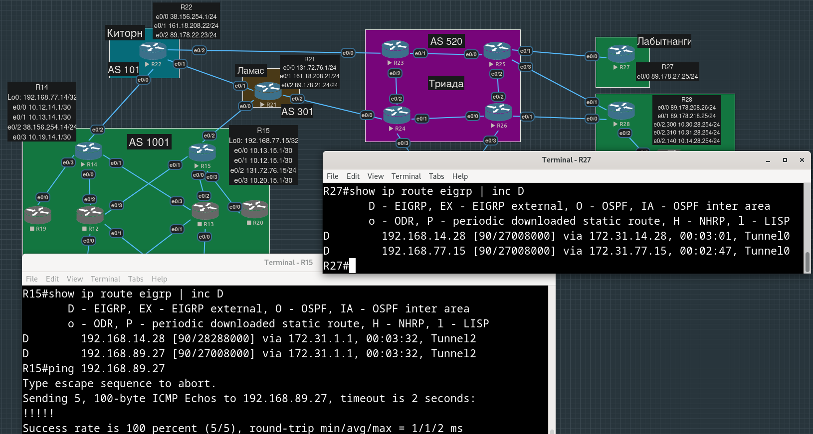

# Лабораторная работа №13. VPN. GRE. DmVPN

**Цель**:

Настроить GRE между офисами Москва и С.-Петербург
Настроить DMVPN между офисами Москва и Чокурдах, Лабытнанги

**Описание/Пошаговая инструкция выполнения домашнего задания**:

    - Настроите GRE между офисами Москва и С.-Петербург.
    - Настроите DMVMN между Москва и Чокурдах, Лабытнанги.
    - Все узлы в офисах в лабораторной работе должны иметь IP связность.
    - План работы и изменения зафиксированы в документации.

- [Настройка GRE-туннелей между Москвой и Петербургом](#настройка-gre-туннелей-между-москвой-и-петербургом)
  - [e0/2 R15 - e0/2 R18](#e02-r15---e02-r18)
  - [e0/2 R15 - e0/3 R18](#e02-r15---e03-r18)
  - [e0/2 R14 - e0/2 R18](#e02-r14---e02-r18)
  - [e0/2 R14 - e0/3 R18](#e02-r14---e03-r18)
- [Настройка DMVPN между Москвой и Чокурдах и Лабытнанги](#настройка-dmvpn-между-москвой-и-чокурдах-и-лабытнанги)

- [Конфиги устройств, использованных в работе](#конфиги-устройств-использованных-в-работе)

## Настройка GRE-туннелей между Москвой и Петербургом

### e0/2 R15 - e0/2 R18

Сначала поднимем туннель между e0/2 R15 и e0/2 R18.

Убеждаемся, что между ними есть связность:


Пусть внутренний адрес на R15 будет `172.16.18.15/16`, а на R18 `172.16.15.18/16`:

```
R15(config)#int tunnel 0
R15(config-if)#
*Apr  7 16:37:40.046: %LINEPROTO-5-UPDOWN: Line protocol on Interface Tunnel0, changed state to down
R15(config-if)#tunnel mode gre ip
R15(config-if)#ip addr 172.16.18.15 255.255.0.0  
R15(config-if)#
R15(config-if)#tunnel source 131.72.76.15
R15(config-if)#tunnel destination 89.178.182.24
```

```
R18(config)#int tunnel 0
R18(config-if)#tunnel mode gre ip
*Apr  7 16:45:44.702: %LINEPROTO-5-UPDOWN: Line protocol on Interface Tunnel0, changed state to down
R18(config-if)#ip addr 172.16.15.18 255.255.255.252
R18(config-if)#tunnel source 89.178.182.24
R18(config-if)#tunnel destination 131.72.76.15
R18(config-if)#
*Apr  7 16:46:34.560: %LINEPROTO-5-UPDOWN: Line protocol on Interface Tunnel0, changed state to up
```

Добавили статические маршруты для "туннельной" сети:

```
R15(config)#ip route 172.16.0.0 255.255.0.0 tun 0
```

```
R18(config)#ip route 172.16.0.0 255.255.0.0 tunnel 0
```

Проверяем:


Хотим, чтобы трафик между loopback-адресами наших офисных устройств хотил через туннель:

```
R15(config)#ip route 192.168.78.0 255.255.255.0 172.16.15.18
```

```
R18(config)#ip route 192.168.77.0 255.255.255.0 172.16.18.15
```

Пробуем попинговать с loopback-интерфейс R15 loopback-интерфейс R18:


Видим, что внешний IP-заголовок содержит адреса внешних физических интерфейсов - концов GRE-туннеля.

### e0/2 R15 - e0/3 R18

Теперь поднимем туннель между e0/2 R15 и e0/3 R18.


Пусть внутренний адрес на R15 будет `172.17.18.15/16`, а на R18 `172.17.15.18/16`:

```
R15(config)#interface Tunnel1
R15(config-if)# ip address 172.17.18.15 255.255.0.0
R15(config-if)# tunnel source 131.72.76.15
R15(config-if)# tunnel destination 89.178.183.26
```

```
R18(config)#interface Tunnel1
R18(config-if)# ip address 172.17.15.18 255.255.0.0
R18(config-if)# tunnel source 89.178.183.26
R18(config-if)# tunnel destination 131.72.76.15
```

Добавляем статические маршруты для второго туннеля:

```
R15(config)#ip route 172.17.0.0 255.255.0.0 tun 1
```

```
R18(config)#ip route 172.17.0.0 255.255.0.0 tun 1
```


Добавляем маршруты до loopback-интерфейсов через второй туннель:

```
R15(config)#ip route 192.168.78.0 255.255.255.0 172.17.15.18
```

```
R18(config)#ip route 192.168.77.0 255.255.255.0 172.17.18.15
```

Чтобы увидеть load-balancing равнозначных (ECMP) маршрутов до `192.168.78.0/24` на R15 пришлось отключить CEF:

```
R15(config)#no ip cef
```

Видим, что используются оба внешних адреса R18:


### e0/2 R14 - e0/2 R18

Теперь проделаем аналогичные действия, но со вторым московским граничным маршрутизатором R14.

Убеждаемся, что он может достучаться до обоих внешних интерфейсов R18:


```
R14(config)#int tunnel 0
R14(config-if)#
*Apr  7 18:18:06.063: %LINEPROTO-5-UPDOWN: Line protocol on Interface Tunnel0, changed state to down
R14(config-if)#tunnel mode gre ip
R14(config-if)#ip addr 172.24.18.14 255.255.0.0  
R14(config-if)#tunnel source 38.156.254.14
R14(config-if)#tunnel destination 89.178.182.24
R14(config-if)#
*Apr  7 18:19:53.938: %LINEPROTO-5-UPDOWN: Line protocol on Interface Tunnel0, changed state to up
```

```
R18(config)#int tun 2
R18(config-if)#tunnel mode gre ip
R18(config-if)#ip addr 172.24.14.18 255.255.0.0  
R18(config-if)#tunnel source 89.178.182.24
R18(config-if)#tunnel destination 38.156.254.14
```

Прописываем статические маршруты до "туннельной" сети:

```
R14(config)#ip route 172.24.0.0 255.255.0.0 tun 0
```

```
R18(config)#ip route 172.24.0.0 255.255.0.0 tun 2
```


Прописываем статические маршруты до loopback-интерфесов:

```
R14(config)#ip route 192.168.78.0 255.255.255.0 172.24.14.18
```

```
R18(config)#ip route 192.168.77.0 255.255.255.0 172.24.18.14
```

Не хотим, чтобы трафик из внешнего мира шел на R14  через внутренние офисные маршрутизаторы (сделали в рамках lab10, приоритетность Ламас):
```
R14(config)#router ospf 1                           
R14(config-router)#no default-information originate metric 255
R14(config-router)#default-information originate              
R14(config-router)#exit
```


### e0/2 R14 - e0/3 R18

Теперь сделаем второй туннель от R14 до второго внешнего интерфейса R18:

```
R14(config)#int tun 1
R14(config-if)#
Apr  7 19:19:27.420: %LINEPROTO-5-UPDOWN: Line protocol on Interface Tunnel1, changed state to down
R14(config-if)# ip address 172.25.18.14 255.255.0.0
R14(config-if)# tunnel source 38.156.254.14
R14(config-if)# tunnel destination 89.178.183.26
```

```
R18(config)#int tunnel 3
R18(config-if)#
*Apr  7 19:18:59.848: %LINEPROTO-5-UPDOWN: Line protocol on Interface Tunnel3, changed state to down
R18(config-if)#ip address 172.25.14.18 255.255.0.0
R18(config-if)#tunnel source 89.178.183.26
R18(config-if)#tunnel destination 38.156.254.14
R18(config-if)#
*Apr  7 19:21:38.377: %LINEPROTO-5-UPDOWN: Line protocol on Interface Tunnel3, changed state to up
```

Прописываем статические маршруты:

```
R14(config)#ip route 172.25.0.0 255.255.0.0 tun 1
R14(config)#ip route 192.168.78.0 255.255.255.0 172.25.15.18
R14(config)#no ip cef
```

```
R18(config)#ip route 172.25.0.0 255.255.0.0 tun 3
R18(config)#ip route 192.168.77.0 255.255.255.0 172.25.18.14
```

Заодно поправили еще одну ошибку:

```
R18(config)#no ip route 172.17.0.0 255.255.0.0 Tunnel0
R18(config)# ip route 172.17.0.0 255.255.0.0 Tunnel1  
```

Видим по различным внешним dst-адресам в разных пакетах, что балансировка работает:


UPD: ну и конечно мы забыли о рассказанном на лекции - полезно было бы прописать ограничения на mtu и mss пакетов/сегментов внутри туннеля, чтобы при не был превышен mtu внешнего пакета (т.е. GRE-заголовок + внутренний IP-пакет).

```
R15(config)#int tun 0
R15(config-if)#ip mtu 1400
R15(config-if)#ip tcp adjust-mss 1360
```

## Настройка DMVPN между Москвой и Чокурдах и Лабытнанги

Пусть маршрутизатор в Лабытнанги будет hub-ом, а маршрутизаторы в Чокурдах и Москве - spoke-ами. При этом туннели должны быть построены и от Москвы до Чокурдах напрямую, минуя Лабытнанги, он просто должен сообщать адреса концов туннелей.

Настроим hub:

```
R27(config)#int tun 0
R27(config-if)#
*Apr  7 20:04:35.956: %LINEPROTO-5-UPDOWN: Line protocol on Interface Tunnel0, changed state to down

R27(config-if)#tunnel mode gre multipoint
R27(config-if)#tunnel source 89.178.27.25
R27(config-if)#
*Apr  7 20:12:36.165: %LINEPROTO-5-UPDOWN: Line protocol on Interface Tunnel0, changed state to up

R27(config-if)#ip nhrp network-id ?      
  <1-4294967295>  Network identifier

R27(config-if)#ip nhrp network-id 777
R27(config-if)#ip nhrp map multicast dynamic
R27(config-if)#ip addr 172.31.1.1 255.255.0.0
```

Теперь настроим spoke в Чокурдах:

```
R28(config)#int tun 0
R28(config-if)#
*Apr  7 20:25:03.942: %LINEPROTO-5-UPDOWN: Line protocol on Interface Tunnel0, changed state to down
R28(config-if)#
R28(config-if)#tunnel mode gre multipoint 
R28(config-if)#ip addr 172.31.14.28 255.255.0.0
R28(config-if)#tunnel source e0/0
R28(config-if)#
*Apr  7 20:26:27.976: %LINEPROTO-5-UPDOWN: Line protocol on Interface Tunnel0, changed state to up
R28(config-if)#
R28(config-if)#ip nhrp network-id 777
R28(config-if)#ip nhrp nhs 172.31.1.1
R28(config-if)#ip nhrp map 172.31.1.1 89.178.27.25
R28(config-if)#exit
R28(config)#exit
```

Пока просто убеждаемся, что туннель работает:


Настроим spoke в Москве на R15:

```
R15(config)#int tun 2                    
R15(config-if)#
*Apr  7 21:34:29.726: %LINEPROTO-5-UPDOWN: Line protocol on Interface Tunnel2, changed state to down
R15(config-if)#tunnel mode gre multipoint 
R15(config-if)#ip addr 172.31.77.15 255.255.0.0
R15(config-if)#tunnel source e0/2
R15(config-if)#
*Apr  7 21:35:08.719: %LINEPROTO-5-UPDOWN: Line protocol on Interface Tunnel2, changed state to up
R15(config-if)#ip nhrp network-id 777
R15(config-if)#ip nhrp nhs 172.31.1.1
R15(config-if)#ip nhrp map 172.31.1.1 89.178.27.25
```

В `show ip nhrp` на hub-е появилась еще одна запись, соответствующая новому клиенту:


Никаких маршрутов от spoke-а до spoke-а у нас пока нет, руками мы их не прописывали. Добавим их, как на лекции,с помощью EIGRP (видимо, берем EIGRP, а не OSPF, из-за того, что, будучи Distance Vector - протоколом использует подход "routing by rumor" и не знает о всей сети, нам в данном случае этого и не нужно):

Добавляем loopback-интерфейсы и туннельные интерфейсы в EIGRP, чтобы о их сетях узнали соседи:

На hub-е:

```
R27(config)#router eigrp 131 
R27(config-router)#network 172.31.1.1  
R27(config-router)#network 192.168.89.0 0.0.0.255
```

```
R28(config)#router eigrp 131
R28(config-router)#network 172.31.14.28
R28(config-router)#network 192.168.14.0
```

На spoke-е R15:

```
R15(config)#router eigrp 131
R15(config-router)#network 172.31.77.15
R15(config-router)#network 192.168.77.15
```

Убедимся, что соседство установилось с помощью `show ip eigrp neighbors`

Потеряли строчку при конфигурации spoke-ов `ip nhrp map multicast 89.178.27.25`. Без этого никаких маршрутов в EIGRP не появится:



Пингуем loopback-и spoke-ов:


Сейчас маршруты известны через hub, а мы хотим общения spoke-ов напрямую.

Избавимся от `split-horizon`, чтобы маршруты, полученные из туннеля, переанонсировались другим spoke-ам:

```
R27(config)#int tun 0 
R27(config-if)#no ip split-horizon eigrp 131
```

При этом нам также не нужно, чтобы hub указывал в этих передаваемых маршрутах себя в качестве nexthop-а, иначе трафик от spoke-а к spoke-у все равно будет ходить через него, нужно 

```
R27(config)#int tun 0 
R27(config-if)#no ip next-hop-self eigrp 131 
```


Видим, что в traceroute шаг с hub-ом исчез.

## Конфиги устройств, использованных в работе

[R14.conf](./configs/R14.conf)

[R15.conf](./configs/R15.conf)

[R18.conf](./configs/R18.conf)

[R27.conf](./configs/R27.conf)

[R28.conf](./configs/R28.conf)