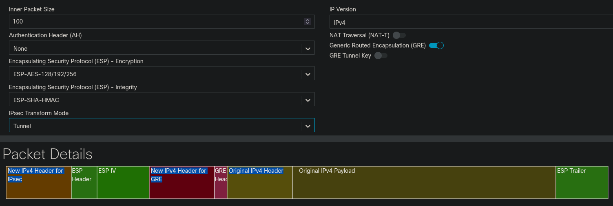
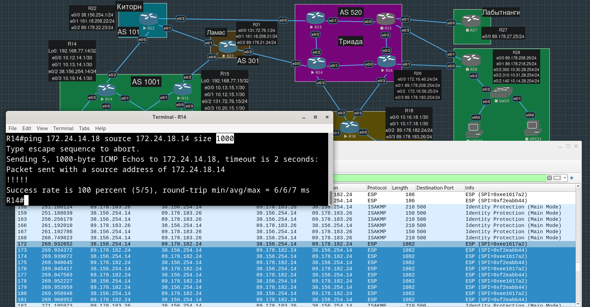
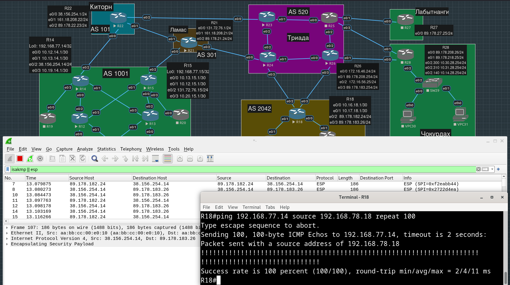
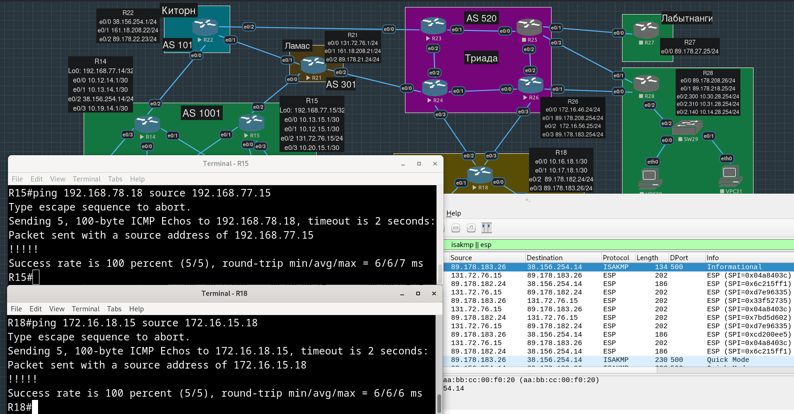
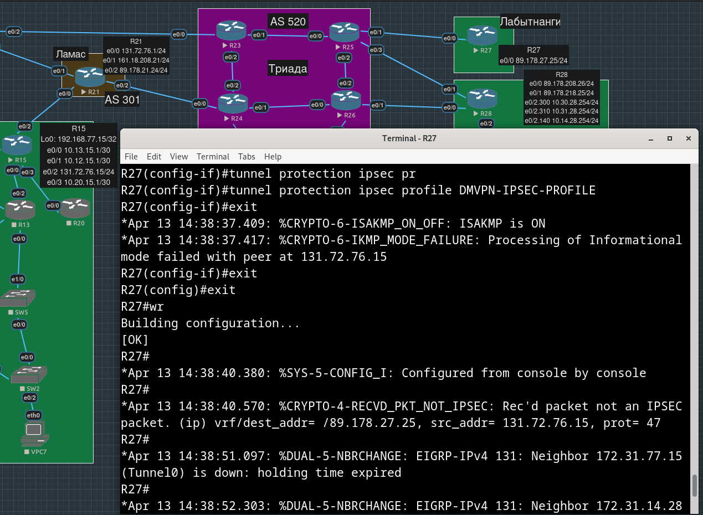
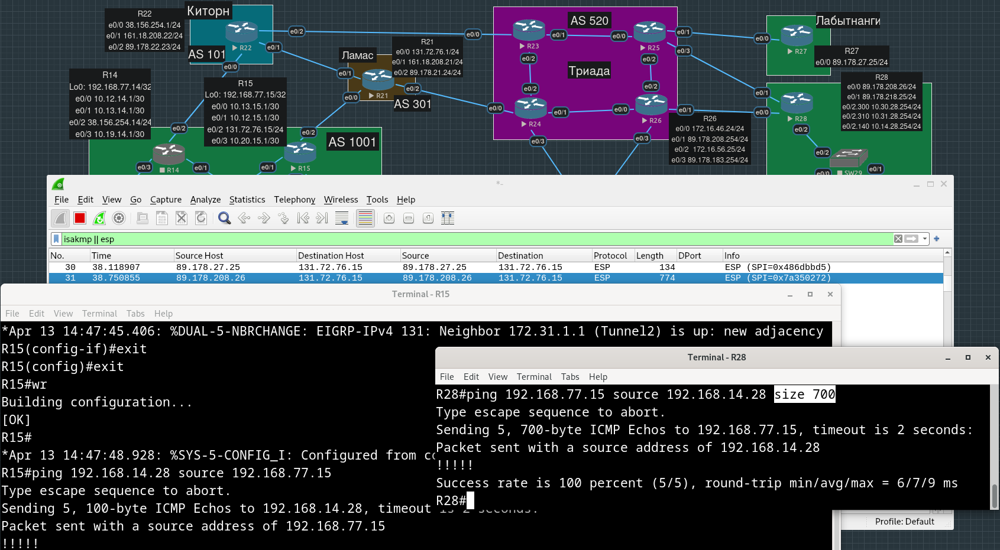

# Лабораторная работа №14. DmVPN over IPsec

**Цель**:

Настроить GRE поверх IPSec между офисами Москва и С.-Петербург
Настроить DMVPN поверх IPSec между офисами Москва и Чокурдах, Лабытнанги

**Описание/Пошаговая инструкция выполнения домашнего задания**:

    - Настройте GRE поверх IPSec между офисами Москва и С.-Петербург.
    - Настройте DMVPN поверх IPSec между Москва и Чокурдах, Лабытнанги.
    - Все узлы в офисах в лабораторной работе должны иметь IP связность.
    - План работы и изменения зафиксированы в документации.

- [Мотивация](#мотивация)
- [Настройка GRE-over-IPsec между Москвой и Петербургом](#настройка-gre-over-ipsec-между-москвой-и-петербургом)
  - [R14 - R18](#r14---r18)
  - [R15 - R18](#r15---r18)
- [Настройка DMVPN-over-IPsec между Москвой и Чокурдах и Лабытнанги](#настройка-dmvpn-over-ipsec-между-москвой-и-чокурдах-и-лабытнанги)
- [Конфиги устройств, использованных в работе](#конфиги-устройств-использованных-в-работе)

## Мотивация

Зачем нам нужен был GRE (и DmVPN, который использует GRE)? Мы, находясь в одном из наших офисов, хотим обращаться к оборудованию из разных офисов по приватным адресам (например, у всех наших офисных маршрутизаторов Loopback-интерфейсы имеют адреса в префиксе `192.168.0.0/16`). Для этих целей нам недостаточно иметь NAT на границе офиса, только наш приватный src-адрес будет подменен, на какой адрес подменить приватный dst мы не знаем, и не можем просто указать публичный адрес бордера другого офиса, который воспримет пакет с таким dst ip как предназначенный ему самому. Т.е. при выходе "в мир" нам нужно обернуть наш исходный пакет с приватными ip-адресами в заголовки с публичными адресами, чтобы в Интернете наш пакет дошел от бордера одного офиса к бордеру другого, где этот внешний заголовок будет снят, и пакет отправится дальше к нужному внутреннему устройству, к которому мы и хотели обратиться. Например, сейчас в Москве и Петербурге маршрутизация настроена таким образом, что на бордерах пакеты с определенными приватными адресами назначения (по третьему октету dst ip можно понять, какой именно это офис) направляются в туннельный интерфейс. В предыдущей работе мы пинговали адреса loopback-интерфейсов одного офиса с loopback-интерфейсов другого.

Зачем нам нужен был DmVPN? Мы хотим строить туннели динамически, а не от каждого граничного маршрутизатора нашего офиса с каждым другим граничным маршрутизатором каждого другого нашего офиса. С GRE маршрутизаторы думают, что они соединены напрямую, хотя их разделяют множество сетей (например, Киторн - Триада) и множество маршрутизаторов. На туннельных интерфейсах поднята динамическая маршрутизация, т.е. внутри туннелей маршрутизаторы обмениваются маршрутной информацией, как если бы они физически были соседями.

Зачем теперь нам GRE внутри IPsec (GRE-over-IPsec, GRE "поверх" IPsec-а, хотя по существующему GRE-gпакету "проходимся" IPsec-ом, будто бы естественнее звучало бы, что это IPsec "накладывается" поверх GRE, заголовки IPsec действительно будут "перед" заголовков GRE, так что перевод с "поверх" несколько запутывает)? GRE обвешивает исходные IP-пакеты своими заголовками (благодаря внешнему IP-заголовку обернутый пакет и доходит через провайдеров до противоположного конца туннеля), но любой промежуточный узел на пути обернутого пакета может увидеть его содержимое, а мы этого не хотим. GRE ничего не шифрует, но зато это сделает IPsec.

Поскольку мы хотим динамическое построение туннелей (а не ручное прописывание каждого-с-каждым), и чтобы Hub и Spoke-и обменивались маршрутной информацией, мы не можем использовать просто IPsec (без GRE, сам по себе) - он не поддерживает multicast-трафик (в предыдущей работе мы видели EIGRP пакеты на мультикастовый адрес `224.0.0.10`).

## Настройка GRE-over-IPsec между Москвой и Петербургом

На туннелях R14-R18 будем настраивать IKEv1.

### R14 - R18

Настроим первую фазу IKE (HAGLE) для установления вспомогательного "настроечного" туннеля (L - lifetime не конфигурируем):

```
R14(config)#crypto isakmp policy 10
R14(config-isakmp)#hash sha256
R14(config-isakmp)#authentication pre-share
R14(config-isakmp)#group 21
R14(config-isakmp)#encryption aes 256
```

Сконфигурируем общий для всех пароль/ключ:

```
R14(config)#crypto isakmp key 6 supersecurepassword address 0.0.0.0 0.0.0.0
```

Настроим вторую фазу IKE: "настроечный" туннель поднялся, участники аутентифицировались, теперь договариваемся о построении основного туннеля - будет выбран режим работы (транспортный или туннельный), протокол (AH или ESP) и снова (не имеют отношения к первой фазе) алгоритмы для encryption, authentication, группа Диффи-Хеллмана. Комбинация этих настроек собрана в `transform-set`:

```
R14(config)#crypto ipsec transform-set R18-TRANSFORM-SET esp-aes 256 esp-sha256-hmac
R14(cfg-crypto-trans)#mode transport
```

Почему взяли `mode transport` - зачем нам еще один IP-заголовок, который был бы навешан в `mode tunnel`? У нас и так есть внутренний IP-заголовок, и внешний, который добавляется GRE.



Создаем профиль IPsec и привязываем к нему только что созданный `transform-set`:

```
R14(config)#crypto ipsec profile R18-IPSEC-PROFILE 
R14(ipsec-profile)#set transform-set R18-TRANSFORM-SET
```

Теперь привязываем этот профиль к нужным туннельным интерфейсам:

```
R14(config)#int range tun0-1                      
R14(config-if-range)#tunnel protection ipsec profile R18-IPSEC-PROFILE
R14(config-if-range)#
*Apr 13 12:17:52.281: %CRYPTO-6-ISAKMP_ON_OFF: ISAKMP is ON
```

Очевидно, в нашем случае мы настроили route-based IPsec, а не policy-based: то, какие пакеты пойдут через туннель определяется таблицей маршрутизации (добавляли статические маршруты c nexthop-ами - адресами противоположных концов туннелей в предыдущей работе), никаких `crypto map` мы не создавали и к физическим интерфейсам их не привязывали.

Проделаем все то же самое на R18:

IKEv1 фаза 1:

```
R18(config)#crypto isakmp policy 10
R18(config-isakmp)#hash sha256
R18(config-isakmp)#authentication pre-share
R18(config-isakmp)#group 21
R18(config-isakmp)#encryption aes 256
```

```
R18(config)#crypto isakmp key 6 supersecurepassword address 0.0.0.0 0.0.0.0
```

IKEv1 фаза 2 - создаем transform-set:

```
R18(config)#crypto ipsec transform-set R14-TRANSFORM-SET esp-aes 256 esp-sha256-hmac
R18(cfg-crypto-trans)#mode transport
```

Создаем IPsec-профиль и привязываем к нему transform-set:

```
R18(config)#crypto ipsec profile R14-IPSEC-PROFILE 
R18(ipsec-profile)#set transform-set R14-TRANSFORM-SET
```

Привязываем IPsec-профиль к туннельным интерфейсам:

```
R18#show ip int brie | inc Tun
Tunnel0                    172.16.15.18    YES NVRAM  up                    up      
Tunnel1                    172.17.15.18    YES NVRAM  up                    up      
Tunnel2                    172.24.14.18    YES NVRAM  up                    up      
Tunnel3                    172.25.14.18    YES NVRAM  up                    up      

R18#conf t                    
Enter configuration commands, one per line.  End with CNTL/Z.
R18(config)#int range Tun 2-3                     
R18(config-if-range)#tunnel protection ipsec profile R14-IPSEC-PROFILE
R18(config-if-range)#
*Apr 13 12:56:53.245: %CRYPTO-6-ISAKMP_ON_OFF: ISAKMP is ON
```

Пустим трафик (специально поставили размер пингов в 1000 байт, чтобы заметить в дампе):



Пингуем loopback-интерфейс - прицепились wireshark-ом к e0/1 интерфейсу R14, очевидно, трафик все равно ходит через R15 и внутренние роутеры (до их включения возникали проблемы с потерями), что не очень хорошо, хотя мы и пытались с этим разобраться в предыдущей работе.



### R15 - R18

На туннелях R15-R18 будем настраивать IKEv2.

Создаем proposal:
```
R15(config)#crypto ikev2 proposal R18-PHASE1-PROPOSAL
IKEv2 proposal MUST either have a set of an encryption algorithm other than aes-gcm, an integrity algorithm and a DH group configured or 
 encryption algorithm aes-gcm, a prf algorithm and a DH group configured
R15(config-ikev2-proposal)#encryption aes-cbc-256 
R15(config-ikev2-proposal)#integrity sha256
R15(config-ikev2-proposal)#group 19
```

Создаем policy и привязываем к нему proposal:

```
R15(config)#crypto ikev2 policy R18-IKEV2-POLICY
R15(config-ikev2-policy)#proposal R18-PHASE1-PROPOSAL
```

Создаем IKEv2-профиль (это не IPsec профиль!) с ключем/паролем:

```
R15(config)#crypto ikev2 profile R18-IKEV2-PROFILE
IKEv2 profile MUST have:
   1. A local and a remote authentication method.
   2. A match identity or a match certificate or match any statement.
R15(config-ikev2-profile)#authentication local pre-share key anothersecurepassword
R15(config-ikev2-profile)#authentication remote pre-share key anothersecurepassword
R15(config-ikev2-profile)#match identity remote any
```

Cоздаем transform-set:

```
R15(config)#crypto ipsec transform-set R18-TRANSFORM-SET esp-aes 256 esp-sha512-hmac
R15(cfg-crypto-trans)#mode transport
```

Создаем профиль IPsec и привязываем к нему transform-set и ikev2-профиль:

```
R15(config)#crypto ipsec profile R18-IPSEC-PROFILE
R15(ipsec-profile)#set ikev2-profile R18-IKEV2-PROFILE
R15(ipsec-profile)#set transform-set R18-TRANSFORM-SET
```

Привязываем IPsec-профиль к туннельным интерфейсам:

```
R15(config)#int range tun 0-1
R15(config-if-range)#tunnel protection ipsec profile R18-IPSEC-PROFILE
R15(config-if-range)#
*Apr 13 13:44:50.917: %CRYPTO-6-ISAKMP_ON_OFF: ISAKMP is ON
```

Проделаем все то же самое на R18:

```
R18(config)#crypto ikev2 proposal R15-PHASE1-PROPOSAL
IKEv2 proposal MUST either have a set of an encryption algorithm other than aes-gcm, an integrity algorithm and a DH group configured or 
 encryption algorithm aes-gcm, a prf algorithm and a DH group configured
R18(config-ikev2-proposal)#encryption aes-cbc-256         
R18(config-ikev2-proposal)#integrity sha256
R18(config-ikev2-proposal)#group 19
```

```
R18(config)#crypto ikev2 policy R15-IKEV2-POLICY
IKEv2 policy MUST have atleast one complete proposal attached 
R18(config-ikev2-policy)#proposal R15-PHASE1-PROPOSAL
```

```
R18(config)#crypto ikev2 profile R15-IKEV2-PROFILE 
IKEv2 profile MUST have:
   1. A local and a remote authentication method.
   2. A match identity or a match certificate or match any statement.
R18(config-ikev2-profile)#authentication local pre-share key anothersecurepassword
R18(config-ikev2-profile)#$authentication remote pre-share key anothersecurepassword
R18(config-ikev2-profile)#match identity remote any
```

```
R18(config)#crypto ipsec transform-set R15-TRANSFORM-SET esp-aes 256 esp-sha512-hmac
R18(cfg-crypto-trans)#mode transport
```

```
R18(config)#crypto ipsec profile R15-IPSEC-PROFILE
R18(ipsec-profile)#set ikev2-profile R15-IKEV2-PROFILE
R18(ipsec-profile)#set transform-set R15-TRANSFORM-SET
```

```
R18(config)#int range tun 0-1
R18(config-if-range)#tunnel protection ipsec profile R15-IPSEC-PROFILE
```

Проверяем (wireshark на e0/2 интерфейсе R15 - среди пакетов есть и принадлежащие R14):



## Настройка DMVPN-over-IPsec между Москвой и Чокурдах и Лабытнанги

Настройки для IPsec в DmVPN не будут отличаться от тех, которые мы использовали для GRE-over-IPsec (сертификаты мы настраивать не будем).

На hub-е:

```
R27(config)#crypto isakmp policy 5
R27(config-isakmp)#hash sha512
R27(config-isakmp)#authentication pre-share 
R27(config-isakmp)#group 21
R27(config-isakmp)#encryption aes
```

```
R27(config)#crypto isakmp key dmvpnpassword address 0.0.0.0 0.0.0.0
```

Используем GCM - не нужно отдельно указывать алгоритмы для шифрования и хэширования.

```
R27(config)#crypto ipsec transform-set DMVPN-TRANSFORM-SET esp-gcm 256
R27(cfg-crypto-trans)#mode transport
```

```
R27(config)#crypto ipsec profile DMVPN-IPSEC-PROFILE
R27(ipsec-profile)#set transform-set DMVPN-TRANSFORM-SET
```

```
R27(config)#int tu 0
R27(config-if)#tunnel protection ipsec profile DMVPN-IPSEC-PROFILE
```

Как только применили настройки - EIGRP-соседство предсказуемо развалилось:



Повторяем эти же настройки на spoke-ах.

Проверяем: пингуем spoke-ом spoke-а:



## Конфиги устройств, использованных в работе

[R14.conf](./configs/R14.conf)

[R15.conf](./configs/R15.conf)

[R18.conf](./configs/R18.conf)

[R27.conf](./configs/R27.conf)

[R28.conf](./configs/R28.conf)