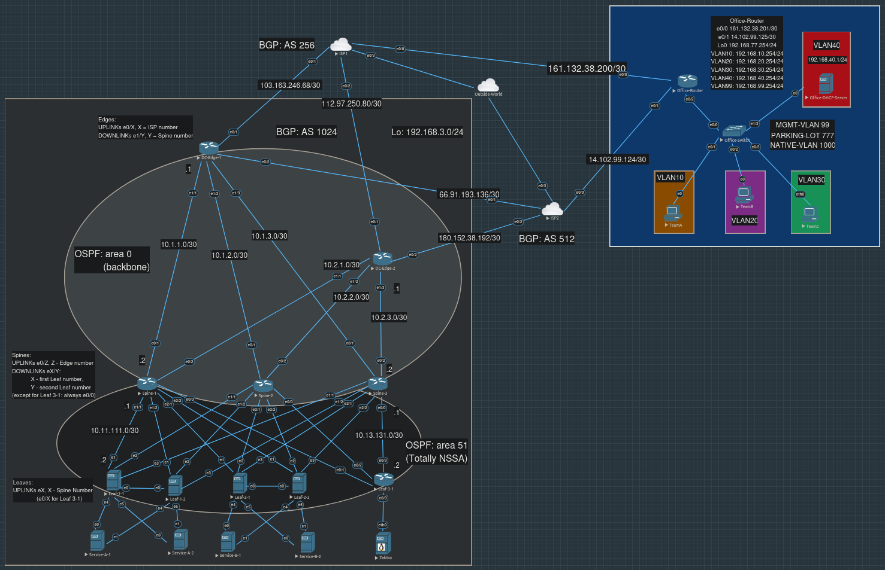
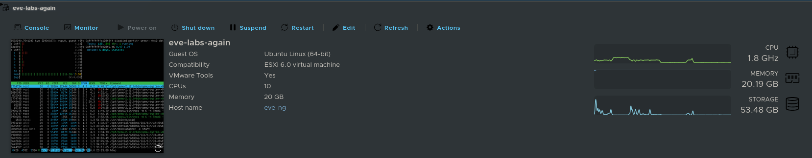
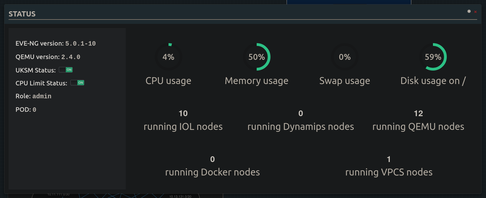

# Проектная работа

## "Построение сети из соединенных туннелями сегментов офиса и дата-центра, в котором реализованы балансировка нагрузки между реальными серверами пользовательских сервисов и мониторинг"

В работе планировалось обеспечить пользователям офиса доступ к сервисам, находящимся в дата-центре.

Пользователи находятся в разных VLAN-ах, получают адрес с помощью DHCP-сервера и находятся за NAT-ом, что позволяет им выходить в Интернет, не имея публичных IP. Все устройства в Дата-Центре имеют на своих loopback или dummy интерфейсах адреса из того же приватного префикса, что и машины в офисе.

Туннелирование обеспечено через поднятые на граничных маршрутизаторах обеих локаций DMVPN, трафик внутри туннелей зашифрован IPsec.

В Дата-Центре построено некое подобие Leaf-Spine архитектуры. Только Leaf-ы из пары, обслуживающей один сервис, соединены между собой линком, который используется для обмена VRRP-сообщений, с его помощью запущенный на Leaf-ах keepalived определяет, жив ли парный Leaf, и не пора ли добавлять в динамическую маршрутизацию виртуальный ip-адрес сервиса.

Keepalived функционирует и как балансировщик, отслеживая tcp health check-ами состояние реальных серверов, на которых и запущен наш простой самописный сервис, возвращающий назад отправителю его же сообщение.

За одним из Leaf-ов находится сервер с zabbix-ом, который периодически пингует все машины внутри ДЦ по их loopback/dummy адресам, и отправляет уведомление, если на некоторое количество пингов подряд каким-то хостом не было отправлено ответов. 

В лабораторной работе задействовано несколько протоколов динамической маршрутизации: многозонный OSPF внутри Дата-Центра (Totally-NSSA зона между Leaf-ами и Spine-ами, в которую "сверху" отдается только маршрут по умолчанию, и из которой сообщаются перераспреденные, внешние для OSPF маршруты), BGP между ДЦ и провайдерами (с его помощью мы анонсируем публичный адрес "сервиса") и EIGRP на концах туннелей. На Linux-машинах (ими является большинство Leaf-ов) в качестве демона маршрутизации используется bird.

В работе осталось еще какое-то количество проблем: требуется убедиться, что оба, а не только нижний, IPsec туннеля работают (возможно, стоит еще раз убедиться для DMVPN, что dst-адреса пакетов действительно совпадают с адресами исходящих интерфейсов), что вторая пара Leaf-ов и Real-ов для Service-B корректно настроены, и что при падении-восстановлении всех сразу (а не одного по очереди) Real-ов сервис снова становится доступен, остались сомнения по "крест-накрест" соединению Real-ов.



Разделы расположены в порядке, в каком они хронологически выполнялись:

- [Офис](./office-internal/README.md)

- [Дата-Центр](./dc-internal/README.md)

- [Стык "Дата-Центр - Провайдеры"](./dc-to-providers/README.md)

- [Сервисы в Дата-Центре](./dc-services/README.md)

- [Мониторинг в Дата-Центре](./dc-monitoring/README.md)

- [Туннели между Офисом и Дата-Центром](./office-to-dc/README.md)

Работа выполнялась в eve-ng 5.0.1-10, развернутом на арендованном VMware ESXi 8.

```
Ubuntu 20.04.4 LTS (GNU/Linux 5.17.8-eve-ng-uksm-wg+ x86_64)
...
root@eve-ng:~# dpkg -l eve-ng | grep eve
ii  eve-ng         5.0.1-10     amd64        A new generation software for networking labs.
```

```
[root@42077:~] esxcli system version get
   Product: VMware ESXi
   Version: 8.0.3
   Build: Releasebuild-24280767
   Update: 3
   Patch: 35
```



Помимо образов cisco, в работе использовались копии образов ubuntu-22.04, взятых с курса "Сети в Линукс для самых маленьких" на платформе [Slurm](https://slurm.io/linux-networking), ubuntu-18.04 (образ `qcow2` был взят с сайта eve-ng, никаких предварительных действий кроме удаления пользователя eve `deluser eve` и графической оболочки `systemctl disable lightdm` скорее всего не совершалось, а то, что совершалось, [было давно и единственный раз](https://www.eve-ng.net/index.php/documentation/howtos/howto-save-your-settings-to-be-as-default-on-qemu-node/)) и образ с zabbix с их же сайта zabbix.com (дополнительно добавляли темплейт в `/opt/unetlab/html/templates/intel/`, взятый [отсюда](https://gitlab.com/eve-ng-dev/templates/-/blob/master/intel/zabbix.yml)). Из настроек на самом eve-ng можно выделить разве что исправление пары строчек конфига `/etc/ssh/sshd_config` с включением TcpKeepAlive и выставлением какого-то периода в ClientAliveInterval, чтобы ssh-сессия не отсыхала. Пришлось также добавить еще один жесткий диск, первые 60 Гб быстро забились (чем?).

<details>
<summary>
Картинка с выводом Status - количество хостов и используемых ресурсов:</summary>


</details>

Образы виртуалок:
```
root@eve-ng:~# ls /opt/unetlab/addons/qemu/
linux-ubuntu-18.04-server  linux-ubuntu-22.04-server  zabbix-6.0.33
```

Идейно работа во многом построена на проектной работе предыдущего курса.