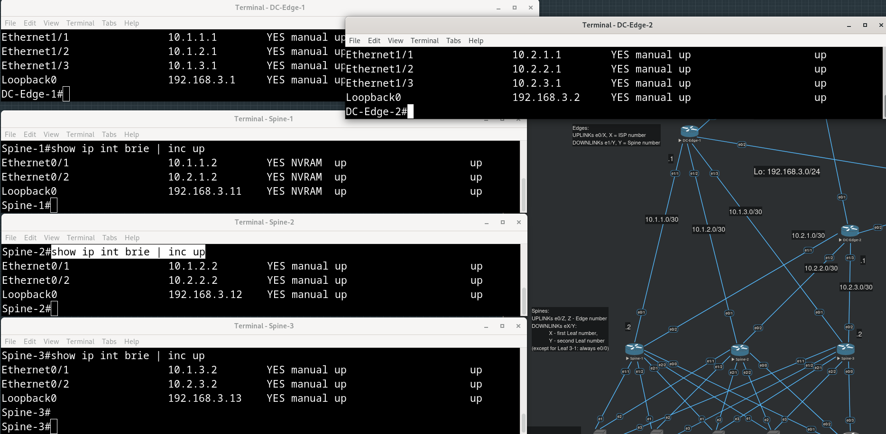

# Дата-Центр

- [Описание](#описание)
- [Конфигурирование DC-Edge-1: адреса внешних интерфейсов](#конфигурирование-dc-edge-1-адреса-внешних-интерфейсов)
- [Конфигурирование DC-Edge-2: адреса внешних интерфейсов](#конфигурирование-dc-edge-2-адреса-внешних-интерфейсов)
- [Конфигурирование DC-Edge-1: адреса внутренних интерфейсов](#конфигурирование-dc-edge-1-адреса-внутренних-интерфейсов)
- [Конфигурирование DC-Edge-2: адреса внутренних интерфейсов](#конфигурирование-dc-edge-2-адреса-внутренних-интерфейсов)
- [Конфигурирование uplink-адресов на Spine-ах](#конфигурирование-uplink-адресов-на-spine-ах)
- [Конфигурирование адресов loopback-интерфейсов на Spine-ах](#конфигурирование-адресов-loopback-интерфейсов-на-spine-ах)
- [Конфигурирование downlink-адресов на Spine-ах](#конфигурирование-downlink-адресов-на-spine-ах)
- [Конфигурирование OSPF на Spine-ах и Edge-ах](#конфигурирование-ospf-на-spine-ах-и-edge-ах)
- [Конфигурирование uplink-адресов и OSPF Totally-Not-So-Stubby-Area 51 на Leaf-ах](#конфигурирование-uplink-адресов-и-ospf-totally-not-so-stubby-area-51-на-leaf-ах)
  - [Leaf-3-1](#leaf-3-1)
  - [Leaf-1-1](#leaf-1-1)
  - [Leaf-1-2](#leaf-1-2)
  - [Leaf-2-1](#leaf-2-1)
  - [Leaf-2-2](#leaf-2-2)
- [Трансляция приватных IP-адресов при выходе в Интернет](#трансляция-приватных-ip-адресов-при-выходе-в-интернет)
- [Таблица адресов интерфейсов](#таблица-адресов-интерфейсов)
- [Конфиги устройств](#конфиги-устройств)


## Описание

В дата-центре расположены два граничных маршрутизатора, соединенные с двумя провайдерами (теми же, которые соединены с офисом?), а также три Spine-а и пять Leaf-ов, несколько реальных серверов (Real Servers), на которых будут крутиться наши сервисы, и один мониторинговый (zabbix).

Два Leaf-а обслуживают по два реальных сервера (если это не Leaf, за которым находится zabbix). Планируется, что на такой паре Leaf-ов будет запущен keepalived, который будет "прощупывать" состояние соседа (VRRP) и состояние Real Server-ов, чтобы балансировать входящие запросы между ними.

В один момент времени только один из пары Leaf-ов - активный. Именно он будет добавлять общий для пары виртуальный ip-адрес (VRRP) в OSPF, работа которого будет обеспечиваться демоном маршрутизации bird.

OSPF многозонный, Backbone-зона между Edge-ами и Spine-ами, Totally-NSSA-зона между Spine-ами и Leaf-ами. Все соединения point-to-point, так что выборы DR/BDR не требуются.

Адресация внутри датацентра - loopback-интерфейсы в том же префиксе `192.168.0.0/16` (взяли `192.168.3.0/24` - одна цифра в третьем октете, чтобы отличаться от офисных двузначных), что и приватные адреса в офисе. Адреса на физических интерфейсах (кроме внешних интерфейсов граничных маршрутизаторов) нарезаны из сети `10.0.0.0/8`.

#### Правило назначения адресов на loopback-и:
Если это Edge, то в четвертом октете - номер Edge-а
Если это Spine, то в четвертом октете - номер Spine-а + 10, например, у Spine-3 `192.168.3.13/32`
Если это Leaf, то для management-адреса в четвертом октете - 100 + 10 * первый номер Leaf-а (номер, общий для пары) + второй номер Leaf-а (номер Leaf-а внутри пары), например, у Leaf-2-1 `192.168.3.121/32`.

У Leaf-ов, очевидно, появятся также [общий виртуальный ip](../dc-services/README.md#конфигурирование-keepalived-на-leaf-ах-и-real-ов-сервиса-a), который становится доступным на активном из пары Leaf-ов. Их адрес зависит от номера сервиса (номер сервиса - номер пары Leaf-ов), например, `192.168.3.201/32`.

#### Правило назначения адресов на физические интерфейсы:

Для `10.X.Y.Z/30` - X определяет устройство сверху, Y - устройство снизу, Z - 1 для downlink, 2 для uplink.
X или Y в случае Edge - сам номер Edge-а, в случае Spine - (номер Spine-а + 10), Leaf - (100 + 10 * первый номер Leaf-а (номер, общий для пары) + второй номер Leaf-а (номер Leaf-а внутри пары)) - таким же образом выбирается 4ый октет в адресах loopback-интерфейсов (см. выше). Проиллюстрировано в [таблице](#таблица-адресов-интерфейсов).

Очевидно, нам потребуется проделать тот же трюк с route-map-ами на граничных маршрутизаторах, что и в офисе, если мы хотим также выпускать какой-то трафик с `192.168.3.0/24` (также после подмены src ip) наружу (а мы хотим, по крайней мере, для линуксовых машин).

Трафик, оригинированный на физических интерфейсах промежуточных маршрутизаторов (`10.0.0.0/8`), как и трафик с loopback-ов (`192.168.3.0/24`), не NAT-ированный и не направленный в [туннель до офиса](../office-to-dc/README.md), должен будет фильтроваться ACL-ями на выходе (out) из внешних интерфейсов граничных маршрутизаторов.

## Конфигурирование DC-Edge-1: адреса внешних интерфейсов

<details>
<summary>
Предварительные настройки DC-Edge-1:</summary>

```
Router(config)#hostname DC-Edge-1
DC-Edge-1(config)#no ip domain-lookup 
DC-Edge-1(config)#line console 0
DC-Edge-1(config-line)#exec-timeout 0 0 
DC-Edge-1(config-line)#logging synchronous
```
</details>

Решили, что номера интерфейсов `eX/Y` для Edge-маршрутизаторов будут определяться по следующему правилу:  если первая цифра `X` = 0 - то это uplink в сторону провайдера, номер провайдера определяет вторую цифру `Y`, если первая цифра `X` = 1 - то это downlink в сторону Spine-ов, номер Spine-а определяет вторую цифру `Y`.

<details>
<summary>
DC-Edge-1, интерфейс e0/1 (в сторону IPS1):</summary>

```
DC-Edge-1(config)#int e0/1
DC-Edge-1(config-if)#ip addr 103.163.246.69 255.255.255.252
DC-Edge-1(config-if)#no shut
```
</details>

<details>
<summary>
DC-Edge-1, интерфейс e0/2 (в сторону IPS2):</summary>

```
DC-Edge-1(config-if)#int e0/2   
DC-Edge-1(config-if)#ip addr 66.91.193.137 255.255.255.252
DC-Edge-1(config-if)#no shut
```
</details>

<details>
<summary>
DC-Edge-1, интерфейс lo0:</summary>

```
DC-Edge-1(config)#int lo0
DC-Edge-1(config-if)#ip addr
*Apr 17 11:46:27.779: %LINEPROTO-5-UPDOWN: Line protocol on Interface Loopback0, changed state to up 
DC-Edge-1(config-if)#ip addr 192.168.3.1 255.255.255.255 
```
</details>

<details>
<summary>
Настроим интерфейсы на противоположной стороне:</summary>

```
ISP1(config)#int e0/1
ISP1(config-if)#ip addr 103.163.246.70 255.255.255.252
ISP1(config-if)#no shut
```

```
ISP2(config)#int e0/1
ISP2(config-if)#ip addr 69.91.193.138 255.255.255.252
ISP2(config-if)#no shut
```
</details>

<details>
<summary>
Временно прописываем дефолты через обоих провайдеров (потом будем получать маршруты по BGP):</summary>

```
DC-Edge-1(config)#ip route 0.0.0.0 0.0.0.0 66.91.193.138
DC-Edge-1(config)#ip route 0.0.0.0 0.0.0.0 103.163.246.70
```
</details>

<details>
<summary>
*Добавим эти адреса для NAT-ирования в iptables на гипервизоре eve, и специфичные маршруты для них:</summary>

```
root@eve-ng:~# iptables -t nat -A POSTROUTING -j SNAT -s 66.91.193.136/30 --to-source X.X.X.X
root@eve-ng:~# iptables -t nat -A POSTROUTING -j SNAT -s 103.163.246.68/30 --to-source X.X.X.X
root@eve-ng:~# netfilter-persistent save
```

```
root@eve-ng:~# ip route add 66.91.193.136/30 via 10.0.0.2
root@eve-ng:~# ip route add 103.163.246.68/30 via 10.0.0.1
```
</details>

## Конфигурирование DC-Edge-2: адреса внешних интерфейсов

<details>
<summary>
DC-Edge-2, интерфейс e0/1 (в сторону IPS1):</summary>

```
DC-Edge-2(config)#in e0/1
DC-Edge-2(config-if)#ip addr 112.97.250.81 255.255.255.252
DC-Edge-2(config-if)#no shut
```
</details>

<details>
<summary>
DC-Edge-2, интерфейс e0/2 (в сторону IPS2):</summary>

```
DC-Edge-2(config)#int e0/2
DC-Edge-2(config-if)#ip addr 180.152.38.193 255.255.255.252
DC-Edge-2(config-if)#no shut
```
</details>

<details>
<summary>
Соответствующие интерфейсы на стороне провайдеров:</summary>

```
ISP1(config)#int e0/2
ISP1(config-if)#
ISP1(config-if)#no shut
```

```
ISP2(config)#int e0/2
ISP2(config-if)#ip addr 180.152.38.194 255.255.255.252
ISP2(config-if)#no shut
```
</details>


<details>
<summary>
DC-Edge-1, интерфейс lo0:</summary>

```
DC-Edge-2(config)#int lo0
*Apr 17 12:40:07.111: %LINEPROTO-5-UPDOWN: Line protocol on Interface Loopback0, changed state to up
DC-Edge-2(config-if)#ip addr 192.168.3.2 255.255.255.255
```
</details>

<details>
<summary>
Временные дефолты через обоих провайдеров:</summary>

```
DC-Edge-2(config)#ip route 0.0.0.0 0.0.0.0 180.152.38.194
DC-Edge-2(config)#ip route 0.0.0.0 0.0.0.0 112.97.250.82
```
</details>

Прописываем все необходимое на гипервизоре eve, убеждаемся, что внешний мир для DC-Edge-2 стал доступен. Зачем мы вообще это делаем? Нам скорее всего пригодится выход в Интернет в процессе настройки линуксовых машин.

## Конфигурирование DC-Edge-1: адреса внутренних интерфейсов

Заполним адреса в соответствии [с правилом выше](#правило-назначения-адресов-на-физические-интерфейсы):

Интерфейс `e1/1` - первая цифра - номер Edge, вторая - номер Spine.
В первом октете всегда 10, во втором - номер устройства сверху в этом соединении, в данном случае, это настраиваемый DC-Edge-1, т.е. 1. В третьем октете - 1, потому что для нас это downlink.

<details>
<summary>
Сами настройки:</summary>

```
DC-Edge-1(config)#int e1/1
DC-Edge-1(config-if)#ip addr 10.1.1.1 255.255.255.252
DC-Edge-1(config-if)#no shut
```
</details>

<details>
<summary>
Все оставшиеся интерфейсы в сторону Spine-ов - это downlink-и, так что меняться будет только цифра в третьем октете:</summary>

```
DC-Edge-1(config-if)#int e1/2
DC-Edge-1(config-if)#ip addr 10.1.2.1 255.255.255.252
DC-Edge-1(config-if)#no shut
DC-Edge-1(config-if)#int e1/3                        
DC-Edge-1(config-if)#ip addr 10.1.3.1 255.255.255.252
DC-Edge-1(config-if)#no shut
```
</details>

## Конфигурирование DC-Edge-2: адреса внутренних интерфейсов

Используем то же самое [правило](#правило-назначения-адресов-на-физические-интерфейсы).

<details>
<summary>
Настройки аналогичны DC-Edge-1, единственное отличие - у нас поменяется только цифра во втором октете, все остальное то же самое, номера Spine-ов те же, соединения в сторону Spine-ов для Edge-маршртутизатора - это downlink ("от" внешнего мира вниз):</summary>

```
DC-Edge-2(config)#int e1/1
DC-Edge-2(config-if)#ip addr 10.2.1.1 255.255.255.252
DC-Edge-2(config-if)#no shut
DC-Edge-2(config-if)#int e1/2                        
DC-Edge-2(config-if)#
*Apr 17 14:11:32.534: %LINK-3-UPDOWN: Interface Ethernet1/1, changed state to up
*Apr 17 14:11:33.536: %LINEPROTO-5-UPDOWN: Line protocol on Interface Ethernet1/1, changed state to up
DC-Edge-2(config-if)#ip addr 10.2.2.1 255.255.255.252
DC-Edge-2(config-if)#no shut
DC-Edge-2(config-if)#int e1/3                        
DC-Edge-2(config-if)#
*Apr 17 14:11:43.987: %LINK-3-UPDOWN: Interface Ethernet1/2, changed state to up
*Apr 17 14:11:44.991: %LINEPROTO-5-UPDOWN: Line protocol on Interface Ethernet1/2, changed state to up
DC-Edge-2(config-if)#ip addr 10.2.3.1 255.255.255.252
DC-Edge-2(config-if)#no shut
DC-Edge-2(config-if)#exit
DC-Edge-2(config)#
*Apr 17 14:11:55.732: %LINK-3-UPDOWN: Interface Ethernet1/3, changed state to up
*Apr 17 14:11:56.737: %LINEPROTO-5-UPDOWN: Line protocol on Interface Ethernet1/3, changed state to up
```
</details>

## Конфигурирование uplink-адресов на Spine-ах

Теперь пропишем адреса на противоположных концах соединения с Edge-маршрутизаторами (их мы конфигурировали в предыдущем пункте), т.е. на Spine-ах. Здесь направление трафика будет "вверх" во внешний мир, т.е. uplink, в соответствии с [придуманным нами правилом](#правило-назначения-адресов-на-физические-интерфейсы) это означает, что в четвертом октете адресов будет стоять 2. Цифры во втором и третьем октете одинаковые для обоих концов соединений (что вобщем-то неудивительно для префикса `/30`).

<details>
<summary>
Spine-1:</summary>

```
Spine-1(config)#int e0/1
Spine-1(config-if)#ip addr 10.1.1.2 255.255.255.252
Spine-1(config-if)#no shut
Spine-1(config-if)#
*Apr 17 14:47:23.034: %LINK-3-UPDOWN: Interface Ethernet0/1, changed state to up
*Apr 17 14:47:24.038: %LINEPROTO-5-UPDOWN: Line protocol on Interface Ethernet0/1, changed state to up
Spine-1(config-if)#
Spine-1(config-if)#int e0/2
Spine-1(config-if)#ip addr 10.2.1.2 255.255.255.252
Spine-1(config-if)#no shut
Spine-1(config-if)#
*Apr 17 14:48:37.163: %LINK-3-UPDOWN: Interface Ethernet0/2, changed state to up
*Apr 17 14:48:38.168: %LINEPROTO-5-UPDOWN: Line protocol on Interface Ethernet0/2, changed state to up
```
</details>

<details>
<summary>
Spine-2:</summary>

```
Spine-2(config)#int e0/1
Spine-2(config-if)#ip addr 10.1.2.2 255.255.255.252
Spine-2(config-if)#no shut
Spine-2(config-if)#
*Apr 17 15:07:04.790: %LINK-3-UPDOWN: Interface Ethernet0/1, changed state to up
*Apr 17 15:07:05.794: %LINEPROTO-5-UPDOWN: Line protocol on Interface Ethernet0/1, changed state to up
Spine-2(config-if)#
Spine-2(config-if)#int e0/2
Spine-2(config-if)#ip addr 10.2.2.2 255.255.255.252
Spine-2(config-if)#no shut
Spine-2(config-if)#exit
Spine-2(config)#
*Apr 17 15:07:20.421: %LINK-3-UPDOWN: Interface Ethernet0/2, changed state to up
*Apr 17 15:07:21.425: %LINEPROTO-5-UPDOWN: Line protocol on Interface Ethernet0/2, changed state to up
```
</details>

<details>
<summary>
Spine-3:</summary>

```
Spine-3(config)#int e0/1
Spine-3(config-if)#ip addr 10.1.3.2 255.255.255.252
Spine-3(config-if)#no shut
Spine-3(config-if)#
*Apr 17 15:14:15.665: %LINK-3-UPDOWN: Interface Ethernet0/1, changed state to up
*Apr 17 15:14:16.670: %LINEPROTO-5-UPDOWN: Line protocol on Interface Ethernet0/1, changed state to up
Spine-3(config-if)#
Spine-3(config-if)#int e0/2
Spine-3(config-if)#ip addr 10.2.3.2 255.255.255.252
Spine-3(config-if)#no shut
*Apr 17 15:14:45.927: %LINK-3-UPDOWN: Interface Ethernet0/2, changed state to up
*Apr 17 15:14:46.933: %LINEPROTO-5-UPDOWN: Line protocol on Interface Ethernet0/2, changed state to up
```
</details>


## Конфигурирование адресов loopback-интерфейсов на Spine-ах

Принятое нами [правило](#правило-назначения-адресов-на-loopback-и) гласит, что для Spine-ов в третьем октете адреса loopback-интерфейса должно быть число, получаемое по формуле 10 + номер Spine-а (т.е. по сути содержимое второго октета адресов физических downlink интерфейсов этого Spine-а, которые мы будем назначать в следующем пункте).

<details>
<summary>
Spine-1:</summary>

```
Spine-1(config)#int lo 0 
*Apr 17 14:51:50.329: %LINEPROTO-5-UPDOWN: Line protocol on Interface Loopback0, changed state to up
Spine-1(config-if)#ip addr 192.168.3.11 255.255.255.255
Spine-1(config-if)#exit
```
</details>

<details>
<summary>
Spine-2:</summary>

```
Spine-2(config)#int lo 0
Spine-2(config-if)#
*Apr 17 15:07:25.992: %LINEPROTO-5-UPDOWN: Line protocol on Interface Loopback0, changed state to up
Spine-2(config-if)#ip addr 192.168.3.12 255.255.255.255
Spine-2(config-if)#exit
```
</details>

<details>
<summary>
Spine-3:</summary>

```
Spine-3(config-if)#int lo 0
Spine-3(config-if)#ip ad 
*Apr 17 15:16:46.822: %LINEPROTO-5-UPDOWN: Line protocol on Interface Loopback0, changed state to up
Spine-3(config-if)#ip addr 192.168.3.13 255.255.255.255
```

</details>




## Конфигурирование downlink-адресов на Spine-ах

По [нашему правилу выдачи адресов на физические интерфейсы](#правило-назначения-адресов-на-физические-интерфейсы), в случае dowlink-ов Spine-ов, во втором октете будет содержаться (номер Spine-а + 10), в третьем октете - (100 + 10 * первый номер Leaf-а (номер, общий для пары) + второй номер Leaf-а (номер Leaf-а внутри пары)), в четвертом октете всегда будет 1.

Первая цифра интерфейса соответствует первому номеру Leaf-а, вторая - второму, но это не относится к Leaf-у 3-1 - он особенный. Все Spine-ы соединены с Leaf-ом 3-1 через интерфейс `e0/0`. 

<details>
<summary>
Spine-1:</summary>

```
Spine-1(config)#int e1/1 
Spine-1(config-if)#ip addr 10.11.111.1 255.255.255.252
Spine-1(config-if)#no shut
Spine-1(config-if)#
*Apr 17 15:57:42.822: %LINK-3-UPDOWN: Interface Ethernet1/1, changed state to up
*Apr 17 15:57:43.826: %LINEPROTO-5-UPDOWN: Line protocol on Interface Ethernet1/1, changed state to up
Spine-1(config-if)#
Spine-1(config-if)#int e1/2
Spine-1(config-if)#ip addr 10.11.112.1 255.255.255.252
Spine-1(config-if)#no shut
Spine-1(config-if)#
*Apr 17 15:58:03.301: %LINK-3-UPDOWN: Interface Ethernet1/2, changed state to up
*Apr 17 15:58:04.302: %LINEPROTO-5-UPDOWN: Line protocol on Interface Ethernet1/2, changed state to up
Spine-1(config-if)#
Spine-1(config-if)#int e2/1
Spine-1(config-if)#ip addr 10.11.121.1 255.255.255.252 
Spine-1(config-if)#no shut
Spine-1(config-if)#
*Apr 17 15:58:51.740: %LINK-3-UPDOWN: Interface Ethernet2/1, changed state to up
*Apr 17 15:58:52.747: %LINEPROTO-5-UPDOWN: Line protocol on Interface Ethernet2/1, changed state to up
Spine-1(config-if)#
Spine-1(config-if)#int e2/2
Spine-1(config-if)#ip addr 10.11.122.1 255.255.255.252
Spine-1(config-if)#no shut
Spine-1(config-if)#
*Apr 17 15:59:13.627: %LINK-3-UPDOWN: Interface Ethernet2/2, changed state to up
*Apr 17 15:59:14.631: %LINEPROTO-5-UPDOWN: Line protocol on Interface Ethernet2/2, changed state to up
Spine-1(config-if)#
Spine-1(config-if)#int e0/0
Spine-1(config-if)#ip addr 10.11.131.1 255.255.255.252
Spine-1(config-if)#no shut
*Apr 17 16:01:02.552: %LINK-3-UPDOWN: Interface Ethernet0/0, changed state to up
*Apr 17 16:01:03.552: %LINEPROTO-5-UPDOWN: Line protocol on Interface Ethernet0/0, changed state to up

```
</details>

<details>
<summary>
Spine-2:</summary>

```
Spine-2(config)#int e1/1
Spine-2(config-if)#ip addr 10.12.111.1 255.255.255.252
Spine-2(config-if)#no shut
Spine-2(config-if)#
*Apr 17 16:09:10.845: %LINK-3-UPDOWN: Interface Ethernet1/1, changed state to up
*Apr 17 16:09:11.849: %LINEPROTO-5-UPDOWN: Line protocol on Interface Ethernet1/1, changed state to up
Spine-2(config-if)#
Spine-2(config-if)#int e1/2
Spine-2(config-if)#ip addr 10.12.112.1 255.255.255.252
Spine-2(config-if)#no shut
Spine-2(config-if)#
*Apr 17 16:09:24.690: %LINK-3-UPDOWN: Interface Ethernet1/2, changed state to up
*Apr 17 16:09:25.695: %LINEPROTO-5-UPDOWN: Line protocol on Interface Ethernet1/2, changed state to up
Spine-2(config-if)#
Spine-2(config-if)#int e2/1
Spine-2(config-if)#ip addr 10.12.121.1 255.255.255.252
Spine-2(config-if)#no shut
Spine-2(config-if)#
*Apr 17 16:09:36.699: %LINK-3-UPDOWN: Interface Ethernet2/1, changed state to up
*Apr 17 16:09:37.699: %LINEPROTO-5-UPDOWN: Line protocol on Interface Ethernet2/1, changed state to up
Spine-2(config-if)#
Spine-2(config-if)#int e2/2
Spine-2(config-if)#ip addr 10.12.122.1 255.255.255.252
Spine-2(config-if)#no shut
Spine-2(config-if)#
*Apr 17 16:09:49.382: %LINK-3-UPDOWN: Interface Ethernet2/2, changed state to up
*Apr 17 16:09:50.386: %LINEPROTO-5-UPDOWN: Line protocol on Interface Ethernet2/2, changed state to up
Spine-2(config-if)#
Spine-2(config-if)#int e0/0
Spine-2(config-if)#ip addr 10.12.131.1 255.255.255.252
Spine-2(config-if)#no shut
Spine-2(config-if)#
*Apr 17 16:10:14.482: %LINK-3-UPDOWN: Interface Ethernet0/0, changed state to up
*Apr 17 16:10:15.486: %LINEPROTO-5-UPDOWN: Line protocol on Interface Ethernet0/0, changed state to up

```
</details>

<details>
<summary>
Spine-3:</summary>

```
Spine-3(config)#int e1/1
Spine-3(config-if)#ip addr 10.13.111.1 255.255.255.252
Spine-3(config-if)#no shut
Spine-3(config-if)#
*Apr 17 16:18:01.394: %LINK-3-UPDOWN: Interface Ethernet1/1, changed state to up
*Apr 17 16:18:02.398: %LINEPROTO-5-UPDOWN: Line protocol on Interface Ethernet1/1, changed state to up
Spine-3(config-if)#
Spine-3(config-if)#int e1/2
Spine-3(config-if)#ip addr 10.13.112.1 255.255.255.252
Spine-3(config-if)#no shut
Spine-3(config-if)#
*Apr 17 16:18:19.620: %LINK-3-UPDOWN: Interface Ethernet1/2, changed state to up
*Apr 17 16:18:20.628: %LINEPROTO-5-UPDOWN: Line protocol on Interface Ethernet1/2, changed state to up
Spine-3(config-if)#
Spine-3(config-if)#int e2/1
Spine-3(config-if)#ip addr 10.13.121.1 255.255.255.252
Spine-3(config-if)#no shut
Spine-3(config-if)#
*Apr 17 16:18:37.019: %LINK-3-UPDOWN: Interface Ethernet2/1, changed state to up
*Apr 17 16:18:38.023: %LINEPROTO-5-UPDOWN: Line protocol on Interface Ethernet2/1, changed state to up
Spine-3(config-if)#
Spine-3(config-if)#int e2/2
Spine-3(config-if)#ip addr 10.13.122.1 255.255.255.252
Spine-3(config-if)#no shut
Spine-3(config-if)#
*Apr 17 16:18:53.349: %LINK-3-UPDOWN: Interface Ethernet2/2, changed state to up
*Apr 17 16:18:54.349: %LINEPROTO-5-UPDOWN: Line protocol on Interface Ethernet2/2, changed state to up
Spine-3(config-if)#
Spine-3(config-if)#int e0/0
Spine-3(config-if)#ip addr 10.13.131.1 255.255.255.252
Spine-3(config-if)#no shut
Spine-3(config-if)#
*Apr 17 16:19:20.795: %LINK-3-UPDOWN: Interface Ethernet0/0, changed state to up
*Apr 17 16:19:21.803: %LINEPROTO-5-UPDOWN: Line protocol on Interface Ethernet0/0, changed state to up

```
</details>


## Конфигурирование OSPF на Spine-ах и Edge-ах

При конфигурировании uplink интерфейсов на Leaf-ах возникло желание упросить им доступ во внешний мир уже сейчас. Имея такое большое количество интерфейсов, естественно, кажется разумным позволить какому-нибудь протоколу динамической маршрутизации построить маршруты до каждого из них. Решили взять протокол OSPF.

Очевидно, что Leaf-маршрутизаторам нет нужды знать о чем бы то ни было, находящимся выше Spine-ов (достаточно получать дефолты), но при этом, возможно, нам [придется инжектировать](../dc-services/README.md#leaf-1-1) [external-маршруты](../dc-services/README.md#real-a-2) в OSPF (потенциально, все Leaf-ы в нашем случае могут быть ASBR-ами), поэтому интерфейсы между Leaf-ами и Spine-ами можно настроить в Totally-Not-So-Stubby-Area - нам достаточно одного Type 3 LSA c дефолтным машрутом до ABR-а (NSSA нам не подойдет, потому что маршруты, полученные из-за пределов Edge-ей редистрибутятся в OSPF и находятся в сообщениях Type 5 LSA, а такой тип не попадает внутрь NSSA, в случае Totally-NSSA такие перераспределенные маршруты будут свернуты ABR-ом в один дефолт).

У нас не планиурется других зон, откуда могли бы приехать "суммарные" Type 3 LSA, так что нет разницы между тем, будет ли зона 51 Not-So-Stubby-Area или Totally-Not-So-Stubby-Area.

Поскольку все Leaf-ы и смотрящие в их сторону интерфейсы Spine-ов находятся в одной OSPF-зоне, они будут знать друг о друге через Type 1 LSA.

Мы планируем настроить point-to-point на всех интерфейсах, участвующих в OSPF-процессе, поэтому Type 2 LSA с информацией о DR-ах не появится (у нас нигде больше двух маршрутизаторов не находится в одном broadcast-домене).

Маршрутизаторы Spine находятся одновременно в обеих зонах разными интерфейсами, поэтому они будут ABR-ами.


<details>
<summary>
Конфигурируем OSPF area 0 на Edge-ах, временно пропишем default-information originate (позже дефолты будут приезжать от провайдеров через BGP, выше были добавлены статически):</summary>

```
DC-Edge-1(config)#router ospf 1
DC-Edge-1(config-router)#default-information originate
DC-Edge-1(config-router)#exit
DC-Edge-1(config)#
DC-Edge-1(config)#int range e1/1-3
DC-Edge-1(config-if-range)#ip ospf 1 area 0
DC-Edge-1(config-if-range)#ip ospf network point-to-point
DC-Edge-1(config-if-range)#exit
DC-Edge-1(config)#int lo 0                      
DC-Edge-1(config-if)#ip ospf 1 area 0
DC-Edge-1(config-if)#ip ospf network point-to-point
```

```
DC-Edge-2(config)#router ospf 1
DC-Edge-2(config-router)#default-information originate 
DC-Edge-2(config)#int range e1/1-3,lo0
DC-Edge-2(config-if-range)#ip ospf 1 area 0
DC-Edge-2(config-if-range)#ip ospf network point-to-point
```
</details>

<details>
<summary>
Конфигурируем OSPF area 0 на uplink-интерфейсах и loopback-ах Spine-ов:</summary>

```
Spine-1(config)#router ospf 1 
Spine-1(config-router)#exit
Spine-1(config)#int range e0/1-2,lo0
Spine-1(config-if-range)#ip ospf 1 area 0
Spine-1(config-if-range)#ip ospf network point-to-point
```

```
Spine-2(config)#router ospf 1  
Spine-2(config-router)#exit
Spine-2(config)#int range e0/1-2,lo0
Spine-2(config-if-range)#ip ospf 1 area 0
Spine-2(config-if-range)#ip ospf network point-to-point
Spine-2(config-if-range)#exit
```
</details>


Видим, что соседство между Edge-ами и Spine-ами установилось и редистрибученные из статики дефолты доехали по OSPF:


<details>
<summary>
Теперь сконфигурируем Totally Not So Stubby Area 51 на downlink-интерфейсах и loopback-ах Spine-ов:</summary>

```
Spine-1(config)#router ospf 1
Spine-1(config-router)#area 51 nssa no-summary 
Spine-1(config-router)#exit
Spine-1(config)#int range e1/1-2,e2/1-2,e0/0,lo0
Spine-1(config-if-range)#ip ospf 1 area 51
Spine-1(config-if-range)#ip ospf network point-to-po
Spine-1(config-if-range)#ip ospf network point-to-point 
```

```
Spine-2(config)#router ospf 1
Spine-2(config-router)#area 51 nssa no-summary 
Spine-2(config-router)#exit
Spine-2(config)#int range e1/1-2,e2/1-2,e0/0,lo0
Spine-2(config-if-range)#ip ospf 1 area 51
Spine-2(config-if-range)#ip ospf network point-to-point
```

```
Spine-3(config)#router ospf 1
Spine-3(config-router)#area 51 nssa no-summary 
Spine-3(config-router)#exit
Spine-3(config)#int range e0/0,e1/1-2,e2/1-2,lo0
Spine-3(config-if-range)#ip ospf 1 area 51 
Spine-3(config-if-range)#ip ospf network point-to-point 
```
</details>

## Конфигурирование uplink-адресов и OSPF Totally-Not-So-Stubby-Area 51 на Leaf-ах

Из [нашего правила](#правило-назначения-адресов-на-физические-интерфейсы), можно вывести, что для uplink адресов Leaf-ов всегда третий и четвертый октет будут содержать одни и те же значения для соединений с любым из Spine-ов (третий октет получается из суммы номеров самого Leaf-а, четвертый - всегда 2, потому что так мы договорились для uplink-ов).

### Leaf-3-1

<details>
<summary>
Проще всего начать с Leaf-3-1, это cisco router в отличие от других Leaf-ов, вторая цифра в его интерфейсах e0/X соответствует номеру Spine-а, с которым данный интерфейс соединен:</summary>

```
Leaf-3-1(config)#int e0/1
Leaf-3-1(config-if)#ip addr 10.11.131.2 255.255.255.252
Leaf-3-1(config-if)#no shut
Leaf-3-1(config-if)#
*Apr 17 16:44:30.880: %LINK-3-UPDOWN: Interface Ethernet0/1, changed state to up
*Apr 17 16:44:31.887: %LINEPROTO-5-UPDOWN: Line protocol on Interface Ethernet0/1, changed state to up
Leaf-3-1(config-if)#
Leaf-3-1(config-if)#int e0/2
Leaf-3-1(config-if)#ip addr 10.12.131.2 255.255.255.252
Leaf-3-1(config-if)#no shut
Leaf-3-1(config-if)#
*Apr 17 16:44:47.151: %LINK-3-UPDOWN: Interface Ethernet0/2, changed state to up
*Apr 17 16:44:48.155: %LINEPROTO-5-UPDOWN: Line protocol on Interface Ethernet0/2, changed state to up
Leaf-3-1(config-if)#
Leaf-3-1(config-if)#int e0/3
Leaf-3-1(config-if)#ip addr 10.13.131.2 255.255.255.252
Leaf-3-1(config-if)#no shut
Leaf-3-1(config-if)#
*Apr 17 16:45:05.290: %LINK-3-UPDOWN: Interface Ethernet0/3, changed state to up
*Apr 17 16:45:06.292: %LINEPROTO-5-UPDOWN: Line protocol on Interface Ethernet0/3, changed state to up
Leaf-3-1(config-if)#
Leaf-3-1(config-if)#int lo 0
Leaf-3-1(config-if)#ip addr 192.168.3.131 255.255.255.255
Leaf-3-1(config-if)#
*Apr 17 16:45:12.105: %LINEPROTO-5-UPDOWN: Line protocol on Interface Loopback0, changed state to up
```
</details>


<details>
<summary>
Добавим Leaf-3-1 в OSPF Totally Not So Stubby Area 51:</summary>

```
Leaf-3-1(config)#router ospf 1
Leaf-3-1(config-router)#area 51 nssa no-summary 
Leaf-3-1(config-router)#exit
Leaf-3-1(config)#int range e0/1-3,lo0
Leaf-3-1(config-if-range)#ip ospf 1 area 51
Leaf-3-1(config-if-range)#ip ospf network point-to-point
```
</details>

Сравним вывод `show ip route ospf` на Leaf-3-1 и Spine-1:


Видим, что в таблицу маршрутизации Leaf-а конкретные маршруты до Edge-ей (`10.1.1.1.` и `10.1.2.1`) не протекают.


Проверим теперь, достаточно ли маршрутной информации известно всем участникам цепочки от Leaf-ов до внешнего мира.

<details>
<summary>
Похоже, недостает маршрутов в наш префикс 192.168.3.0/24 - временно пропишем этот маршрут на провайдерских маршрутизаторах, уберем его, когда на границах ДЦ появится NAT.</summary>

```
ISP1(config)#ip route 192.168.3.0 255.255.255.0 103.163.246.69
ISP1(config)#ip route 192.168.3.0 255.255.255.0 112.97.250.81 
```

```
ISP2(config)#ip route 192.168.3.0 255.255.255.0 180.152.38.193
ISP2(config)#ip route 192.168.3.0 255.255.255.0 66.91.193.137
```
</details>


Доступ в Интернет работает, теперь можно заняться настройкой Leaf-ов на базе Linux.

### Leaf-1-1

Пока Leaf-ы на Linux-е не умеют добавлять свои интерфейсы в OSPF, соответственно, никто из расположенных "выше" не знает маршрутов до этих Leaf-ов.

<details>
<summary>
Добавим временный статический маршрут и редистрибутим его в OSPF (в случае Spine-1 это единственный статический маршрут):</summary>

```
Spine-1(config)#ip route 192.168.3.111 255.255.255.255 10.11.111.2
Spine-1(config)#router ospf 1                                     
Spine-1(config-router)#redistribute static 
```
</details>

<details>
<summary>
UPD: сразу я не смог догадаться, что полезно было бы сделать этот маршрут с бОльшим значением Administrative Distance, чем у OSPF (взяли 254) - т.н. "floating static route" - чтобы он подбирался в таблицу маршрутизации только в случае, если более приоритетный тот же маршрут, полученный от OSPF, пропадет:
</summary>

```
Spine-1(config)#ip route 192.168.3.111 255.255.255.255 10.11.111.2 254
```
</details>

Теперь нам наконец-то удалось зайти на линуксовый Leaf-1-1!


На Leaf-1-1 уже были проведены настройки netplan в конфиге `/etc/netplan/01-netcfg.yaml` и добавлен адрес DNS-сервера в `/etc/systemd/resolved.conf`:

<details>
<summary>
Содержимое /etc/netplan/01-netcfg.yaml на Leaf-1-1 (некоторые закомментированные строки с неудачными попытками были удалены):</summary>

```
root@Leaf-1-1:~# cat /etc/netplan/01-netcfg.yaml 
# This file describes the network interfaces available on your system
# For more information, see netplan(5).
network:
  version: 2
  renderer: NetworkManager
  ethernets:
    eth1:
      addresses:
       - 10.11.111.2/30
      gateway4: 10.11.111.1
      routes:
       - to: 192.168.3.11/32
         via: 10.11.111.1
       - to: 0.0.0.0/.0
         via: 10.11.111.1
    eth2:
      addresses:
       - 10.12.111.2/30
      routes:
       - to: 192.168.3.12/32
         via: 10.12.111.1
    eth3:
      addresses:
       - 10.13.111.2/30
      routes:
       - to: 192.168.3.13/32
         via: 10.13.111.1
  bridges:
    dummy0:
      addresses:
       - 192.168.3.111/32
      gateway4: 192.168.3.11
      routes:
       - to: 0.0.0.0/0
         via: 192.168.3.11
```
</details>

Пришлось приложить немало усилий, прописать костыльные временные (во всяком случае, хочется в это верить) статические маршруты на нескольких промежуточных узлах, чтобы добиться резолва DNS-имен на линуксовой машине в ДЦ:


Попробуем установить и настроить демон маршрутизации bird.

<details>
<summary>
Конфиг /etc/bird/bird.conf, в который мы добавили протокол ospf и интерфейсы, на которых он должен работать:</summary>

```
root@Leaf-1-1:/etc/bird# cat bird.conf
router id 192.168.3.111;

log "/var/log/bird.log" { info, warning, error, fatal };
protocol ospf v2 {
    area 51 {
	nssa;
	summary off; # totally not-so-stubby-area
        interface "eth1" {
            type ptp;        # Point-to-Point: no DR/BDP selection
            cost 10;         # Interface metric
            hello 10;        # same as it is configured at Spine 1 e1/1
        };
        interface "eth2" {
            type ptp;
            cost 10;
            hello 10;
        };
        interface "eth3" {
            type ptp;
            cost 10;
            hello 10;
        };
        interface "dummy0" {
	        stub;
        };
    };
}

# The Device protocol is not a real routing protocol. It doesn't generate any
# routes and it only serves as a module for getting information about network
# interfaces from the kernel.
protocol device {
}

# The Kernel protocol is not a real routing protocol. Instead of communicating
# with other routers in the network, it performs synchronization of BIRD's
# routing tables with the OS kernel.
protocol kernel {
	metric 64;	# Use explicit kernel route metric to avoid collisions
			# with non-BIRD routes in the kernel routing table
	import none;
#	export all;	# Actually insert routes into the kernel routing table
}
```
</details>

Проверяем работу floating static route: когда bird на Leaf-1-1 выключен, соседство OSPF разрывается и маршрут, полученный от bird-а, пропадает на Spine-1, поэтому используется статический маршрут с бОльшей Administrative Distance, когда bird снова включаем - OSPF-соседство восстанавливается и приоритетным становится маршрут, полученный от bird-а:


<details>
<summary>
После манипуляций с bird-ом, подчистили конфиг netplan от статических маршрутов. При этом записть export all в протоколе kernel в конфиге bird-а раскомментировали:</summary>

```
network:
  version: 2
  renderer: NetworkManager
  ethernets:
    eth1:
      addresses:
       - 10.11.111.2/30
    eth2:
      addresses:
       - 10.12.111.2/30
    eth3:
      addresses:
       - 10.13.111.2/30
  bridges:
    dummy0:
     addresses:
       - 192.168.3.111/32
```

```
protocol kernel {
	metric 64;	# Use explicit kernel route metric to avoid collisions
			# with non-BIRD routes in the kernel routing table
	import none;
	export all;	# Actually insert routes into the kernel routing table
}
```
</details>

Таблица маршрутизации после ребута машины Leaf-1-1:


UPD: после перезагрузки всей лабы оказалось, что не получается достучаться именно до dummy-адреса Leaf-1-1 откуда бы то ни было, помогло включение опций ядра (почему помогло, и что происходило - предстоит разобраться)

```
root@Leaf-1-1:~# sysctl net.ipv4.conf.all.arp_ignore=1
root@Leaf-1-1:~# sysctl net.ipv4.conf.all.arp_announce=2
root@Leaf-1-1:~# sysctl net.ipv4.conf.all.rp_filter=2
```

<details>
<summary>
На этой машине тоже завели файл /etc/sysctl.d/12-stuff.conf для сохранения выставленных опций:</summary>

```
net.ipv4.ip_forward=1
net.ipv4.conf.all.arp_ignore=1
net.ipv4.conf.all.arp_announce=2
net.ipv4.conf.all.rp_filter=2
```
</details>

### Leaf-1-2

Настроим второй Leaf в первой паре.

В прошлый раз для Leaf-1-1 нам потребовалось добавить floating static route на Spine и дефолт на Leaf-е через этот Spine, чтобы попасть на Leaf по его management-адресу до того, как там заработает динамическая маршрутизация. Нам также пришлось прописать временный (в нем отпадет необходимость после появления NAT) статический маршрут на провайдерах до адреса физического интерфейса Leaf-1-1 `10.11.111.2` (позже пришлось прописать ВСЕ физические интерфейсы - исходящие с Leaf-1-1 пакеты стали выбирать другой Spine для выхода из ДЦ), потому что, очевидно, `apt install` ходит в репозитории не с loopback-овых src. На гипервизоре eve пришлось также временно добавить физический адрес в nat-таблицу для iptables.

Проделаем все то же самое для Leaf-1-2.

<details>
<summary>
Пропишем адреса uplink-интерфейсов на самом Leaf-1-2,применим его (netplan try - все хорошо - Enter): </summary>

```
network:
  version: 2
  renderer: NetworkManager
  ethernets:
    eth1:
      addresses: [10.11.112.2/30]
      gateway4: 10.11.112.1
    eth2:
      addresses: [10.12.112.2/30]
      gateway4: 10.12.112.1
    eth3:
      addresses: [10.13.112.2/30]
      gateway4: 10.13.112.1
  bridges:
    dummy0:
      addresses: [192.168.3.112/32]
```
</details>

<details>
<summary>
Временные статические маршруты на провайдерах (маршруты на loopback-и 192.168.3.0/24 мы уже добавляли):</summary>

```
ISP1(config)#ip route 10.11.112.2 255.255.255.255 103.163.246.69
ISP1(config)#ip route 10.11.112.2 255.255.255.255 112.97.250.81  
ISP1(config)#ip route 10.12.112.2 255.255.255.255 112.97.250.81
ISP1(config)#ip route 10.12.112.2 255.255.255.255 103.163.246.69 
ISP1(config)#ip route 10.13.112.2 255.255.255.255 103.163.246.69
ISP1(config)#ip route 10.13.112.2 255.255.255.255 112.97.250.81
```

```
ISP2(config)#ip route 10.11.112.2 255.255.255.255 180.152.38.193
ISP2(config)#ip route 10.11.112.2 255.255.255.255 66.91.193.137
ISP2(config)#ip route 10.12.112.2 255.255.255.255 66.91.193.137
ISP2(config)#ip route 10.12.112.2 255.255.255.255 180.152.38.193
ISP2(config)#ip route 10.13.112.2 255.255.255.255 180.152.38.193
ISP2(config)#ip route 10.13.112.2 255.255.255.255 66.91.193.137
```
</details>


<details>
<summary>
Временные правила для iptables на гипервизоре eve:</summary>

```
root@eve-ng:~# iptables -t nat -A POSTROUTING -s 10.11.112.2/32 -j SNAT --to-source X.X.X.X
root@eve-ng:~# iptables -t nat -A POSTROUTING -s 10.12.112.2/32 -j SNAT --to-source X.X.X.X
root@eve-ng:~# iptables -t nat -A POSTROUTING -s 10.13.112.2/32 -j SNAT --to-source X.X.X.X
```
</details>

<details>
<summary>
Floating static route на Spine-ах:</summary>

```
Spine-1(config)#ip route 192.168.3.112 255.255.255.255 10.11.112.2 254
```

```
Spine-2(config)#ip route 192.168.3.112 255.255.255.255 10.12.112.2 254
```

```
Spine-3(config)#ip route 192.168.3.112 255.255.255.255 10.13.112.2 254
```

</details>


<details>
<summary>
Пропишем только один временный статический маршрут на Leaf-1-1 - до Leaf-1-2 (прописываем через ip route add, так что он не переживет ребут).</summary>

```
root@Leaf-1-1:~/stuff# ip route add 192.168.3.112/32 via 10.12.111.1
root@Leaf-1-1:~/stuff# ping 192.168.3.112
PING 192.168.3.112 (192.168.3.112) 56(84) bytes of data.
64 bytes from 192.168.3.112: icmp_seq=1 ttl=63 time=0.637 ms
```
</details>


<details>
<summary>
Скачаем и скопируем deb-пакет (и заодно конфиг bird-а) с Leaf-1-1 на Leaf-1-2 через SCP:</summary>

```
root@Leaf-1-1:~/stuff# apt download bird
root@Leaf-1-1:~/stuff# ls
bird_1.6.3-3_amd64.deb

root@Leaf-1-1:~/stuff# scp bird_1.6.3-3_amd64.deb  root@192.168.3.112:/tmp
root@192.168.3.112's password: 
bird_1.6.3-3_amd64.deb                100%  353KB  38.6MB/s   00:00 

root@Leaf-1-1:~/stuff# scp /etc/bird/bird.conf  root@192.168.3.112:/tmp
```
</details>

<details>
<summary>
Добавление опций ядра в /etc/sysctl.d/ - скопировали файл с Leaf-1-1:</summary>

```
root@Leaf-1-1:~/stuff# scp /etc/sysctl.d/12-stuff.conf root@192.168.3.112:/tmp

```
</details>

<details>
<summary>
Заходим на Leaf-1-2 и устанавливаем bird из перенесенного deb-пакета:</summary>

```
root@ubuntu-server:/tmp# hostnamectl set-hostname Leaf-1-2
root@ubuntu-server:/tmp# apt install ./bird_1.6.3-3_amd64.deb
```
</details>


<details>
<summary>
Кажется, что в конфиге достаточно было подменить только router-id, все остальные настройки ничего специфичного для хоста не содержат:</summary>

```
root@Leaf-1-2:/etc/bird# cat bird.conf
router id 192.168.3.112;

log "/var/log/bird.log" { info, warning, error, fatal };
protocol ospf v2 {
    area 51 {
	nssa;
	summary off; # totally not-so-stubby-area
        interface "eth1" {
            type ptp;        # Point-to-Point: no DR/BDP selection
            cost 10;         # Interface metric
            hello 10;        # same as it is configured at Spine 1 e1/1
        };
	interface "eth2" {
	   type ptp;
	   cost 10;
	   hello 10;
	};
	interface "eth3" {
	   type ptp;
	   cost 10;
	   hello 10;
	};
        interface "dummy0" {
	    stub;
        };
    };
}

# The Device protocol is not a real routing protocol. It doesn't generate any
# routes and it only serves as a module for getting information about network
# interfaces from the kernel.
protocol device {
}

# The Kernel protocol is not a real routing protocol. Instead of communicating
# with other routers in the network, it performs synchronization of BIRD's
# routing tables with the OS kernel.
protocol kernel {
	metric 64;	# Use explicit kernel route metric to avoid collisions
			# with non-BIRD routes in the kernel routing table
	import none;
	export all;	# Actually insert routes into the kernel routing table
}
```
</details>

<details>
<summary>
Ребутнем Leaf-1-2 и попробуем подключиться к нему снаружи:</summary>

```
root@Leaf-1-2:/etc/bird# reboot
Connection to 192.168.3.112 closed by remote host.
Connection to 192.168.3.112 closed.
```

```
root@eve-ng:~# ssh root@192.168.3.112
The authenticity of host '192.168.3.112 (192.168.3.112)' can't be established.
ECDSA key fingerprint is SHA256:8JjZudIowJh/ziV7lTw+BFKHga+Z7YQww34rjd6kTN0.
Are you sure you want to continue connecting (yes/no/[fingerprint])? yes
Warning: Permanently added '192.168.3.112' (ECDSA) to the list of known hosts.
root@192.168.3.112's password: 
Welcome to Ubuntu 18.04.4 LTS (GNU/Linux 4.15.0-96-generic x86_64)
```
</details>

<details>
<summary>
Несколько мелочей, мешавших службе запуститься:</summary>

```
root@Leaf-1-2:/etc/bird# chown bird bird.conf && chgrp bird bird.conf
root@Leaf-1-2:/etc/bird# chown bird /var/log/bird.log && chgrp bird /var/log/bird.log
```
</details>

Видим, что OSPF-соседство до Spine-ов проросло:


В дальнейшем мы хотим воспользоваться тем фактом, что добавляя/удаляя адрес на dummy-интерфейсе (с помощью `ip addr add / ip addr del`), маршрут до него пропадает на OSPF-соседях (bird перестает рассказывать рассказывать соседям об этом адресе).

### Leaf-2-1

<details>
<summary>
Конфиг netplan на Leaf-2-1 - дописываем и применяем: </summary>

```
root@Leaf-2-1:~# cat /etc/netplan/00-installer-config.yaml 
# This is the network config written by 'subiquity'
network:
  ethernets:
    ens4:
      addresses: [10.11.121.2/30]
      gateway4: 10.11.121.1
    ens5:
      addresses: [10.12.121.2/30]
      gateway4: 10.12.121.1
    ens6:
      addresses: [10.13.121.2/30]
      gateway4: 10.13.121.1
  bridges:
    dummy0:
      addresses: [192.168.3.121/32]
  version: 2
```
</details>

<details>
<summary>
Временные статические маршруты на провайдерах:</summary>

```
ISP1(config)#ip route 10.11.121.2 255.255.255.255 103.163.246.69
ISP1(config)#ip route 10.11.121.2 255.255.255.255 112.97.250.81
ISP1(config)#ip route 10.12.121.2 255.255.255.255 112.97.250.81
ISP1(config)#ip route 10.12.121.2 255.255.255.255 103.163.246.69
ISP1(config)#ip route 10.13.121.2 255.255.255.255 103.163.246.69
ISP1(config)#ip route 10.13.121.2 255.255.255.255 112.97.250.81
```

```
ISP2(config)#ip route 10.11.121.2 255.255.255.255 180.152.38.193
ISP2(config)#ip route 10.11.121.2 255.255.255.255 66.91.193.137
ISP2(config)#ip route 10.12.121.2 255.255.255.255 66.91.193.137
ISP2(config)#ip route 10.12.121.2 255.255.255.255 180.152.38.193
ISP2(config)#ip route 10.13.121.2 255.255.255.255 180.152.38.193
ISP2(config)#ip route 10.13.121.2 255.255.255.255 66.91.193.137
```
</details>


<details>
<summary>
Временные правила для iptables на гипервизоре eve:</summary>

```
root@eve-ng:~# iptables -t nat -A POSTROUTING -s 10.11.121.2/32 -j SNAT --to-source X.X.X.X
root@eve-ng:~# iptables -t nat -A POSTROUTING -s 10.12.121.2/32 -j SNAT --to-source X.X.X.X
root@eve-ng:~# iptables -t nat -A POSTROUTING -s 10.13.121.2/32 -j SNAT --to-source X.X.X.X
```
</details>

<details>
<summary>
Floating static route на Spine-ах:</summary>

```
Spine-1(config)#ip route 192.168.3.121 255.255.255.255 10.11.121.2 254
```

```
Spine-2(config)#ip route 192.168.3.121 255.255.255.255 10.12.121.2 254
```

```
Spine-3(config)#ip route 192.168.3.121 255.255.255.255 10.13.121.2 254
```

</details>

<details>
<summary>
Временный маршрут до Leaf-2-1 на Leaf-1-1 для прокидывания deb-пакета и конфигов:</summary>

```
root@Leaf-1-1:~# ip route add 192.168.3.121/32 via 10.12.111.1
```
</details>

<details>
<summary>
Прокидываем конфиг для sysctl с опциями ядра:</summary>

```
root@Leaf-1-1:/tmp# scp /etc/sysctl.d/12-stuff.conf root@192.168.3.121:/tmp
```
</details>

<details>
<summary>
Прокидываем конфиг bird-а (deb-пакет с ubuntu-18.04 здесь не подошел):</summary>

```
root@Leaf-1-1:~# scp /etc/bird/bird.conf  root@192.168.3.121:/tmp
root@192.168.3.121's password: 
bird.conf                             100% 1203     1.2MB/s   00:00    
```
</details>

<details>
<summary>
Заходим на Leaf-2-1, устанавливаем пакет, подменяем конфиг, поправив там router_id и имена интерфейсов eth1 -> ens4 и т.п.:</summary>

```
root@Leaf-1-1:~/stuff# ssh root@192.168.3.121
root@192.168.3.121's password: 
Welcome to Ubuntu 22.04 LTS (GNU/Linux 5.15.0-27-generic x86_64)

root@ubuntu22-server:~# hostnamectl set-hostname Leaf-2-1

root@ubuntu22-server:/tmp# ping ya.ru
ping: ya.ru: Temporary failure in name resolution
root@ubuntu22-server:/tmp# vim /etc/resolv.conf 
root@ubuntu22-server:/tmp# ping ya.ru
PING ya.ru (5.255.255.242) 56(84) bytes of data.
64 bytes from ya.ru (5.255.255.242): icmp_seq=1 ttl=53 time=12.2 ms
^C
....
root@ubuntu22-server:/tmp# apt install bird
....
root@ubuntu22-server:/tmp# vim bird.conf 
root@ubuntu22-server:/tmp# chown bird bird.conf && chgrp bird bird.conf 
root@ubuntu22-server:/tmp# ls -lh bird.conf 
-rw-r----- 1 bird bird 1.2K Apr 18 15:38 bird.conf
root@ubuntu22-server:/tmp# cp /etc/bird/bird.conf /etc/bird/bird.conf.bkp
root@ubuntu22-server:/tmp# mv bird.conf /etc/bird/bird.conf
root@ubuntu22-server:/tmp# systemctl restart bird
root@ubuntu22-server:/tmp# chown bird /var/log/bird.log && chgrp bird /var/log/bird.log 
root@ubuntu22-server:/tmp# ls -lh /var/log/bird.log
-rw-r--r-- 1 bird bird 0 Apr 18 15:39 /var/log/bird.log
root@ubuntu22-server:/tmp# systemctl restart bird
```
</details>

Теперь Leaf-2-1 появился в списке соседей OSPF.

Ребутнем Leaf-2-1 и посмотрим на таблицы маршрутизации.


### Leaf-2-2

<details>
<summary>
Конфиг netplan на Leaf-2-2 - дописываем и применяем: </summary>

```
root@Leaf-2-2:~# cat /etc/netplan/00-installer-config.yaml 
# This is the network config written by 'subiquity'
network:
  ethernets:
    ens4:
      addresses: [10.11.122.2/30]
      gateway4: 10.11.122.1
    ens5:
      addresses: [10.12.122.2/30]
      gateway4: 10.12.122.1
    ens6:
      addresses: [10.13.122.2/30]
      gateway4: 10.13.122.1
  bridges:
    dummy0:
      addresses: [192.168.3.122/32]
  version: 2
```
</details>

<details>
<summary>
Временные статические маршруты на провайдерах:</summary>

```
ISP1(config)#ip route 10.11.122.2 255.255.255.255 103.163.246.69
ISP1(config)#ip route 10.11.122.2 255.255.255.255 112.97.250.81
ISP1(config)#ip route 10.12.122.2 255.255.255.255 112.97.250.81
ISP1(config)#ip route 10.12.122.2 255.255.255.255 103.163.246.69
ISP1(config)#ip route 10.13.122.2 255.255.255.255 103.163.246.69
ISP1(config)#ip route 10.13.122.2 255.255.255.255 112.97.250.81
```

```
ISP2(config)#ip route 10.11.122.2 255.255.255.255 180.152.38.193
ISP2(config)#ip route 10.11.122.2 255.255.255.255 66.91.193.137
ISP2(config)#ip route 10.12.122.2 255.255.255.255 66.91.193.137
ISP2(config)#ip route 10.12.122.2 255.255.255.255 180.152.38.193
ISP2(config)#ip route 10.13.122.2 255.255.255.255 180.152.38.193
ISP2(config)#ip route 10.13.122.2 255.255.255.255 66.91.193.137
```
</details>

<details>
<summary>
Временные правила для iptables на гипервизоре eve:</summary>

```
root@eve-ng:~# iptables -t nat -A POSTROUTING -s 10.11.122.2/32 -j SNAT --to-source X.X.X.X
root@eve-ng:~# iptables -t nat -A POSTROUTING -s 10.12.122.2/32 -j SNAT --to-source X.X.X.X
root@eve-ng:~# iptables -t nat -A POSTROUTING -s 10.13.122.2/32 -j SNAT --to-source X.X.X.X
root@eve-ng:~# netfilter-persistent save
run-parts: executing /usr/share/netfilter-persistent/plugins.d/15-ip4tables save
run-parts: executing /usr/share/netfilter-persistent/plugins.d/25-ip6tables save
root@eve-ng:~# iptables-save > rules.txt
```
</details>

<details>
<summary>
Floating static route на Spine-ах:</summary>

```
Spine-1(config)#ip route 192.168.3.122 255.255.255.255 10.11.122.2 254
```

```
Spine-2(config)#ip route 192.168.3.122 255.255.255.255 10.11.122.2 254
```

```
Spine-3(config)#ip route 192.168.3.122 255.255.255.255 10.11.122.2 254
```

</details>

<details>
<summary>
Временный маршрут до Leaf-2-2 на Leaf-1-1 для прокидывания конфигов:</summary>

```
root@Leaf-1-1:/tmp# ip route add 192.168.3.122/32 via 10.13.111.1
```
</details>

<details>
<summary>
Прокидываем bird.conf и конфиг с опциями ядра:</summary>
```
root@Leaf-1-1:/tmp# scp /tmp/bird.conf  root@192.168.3.122:/tmp
root@192.168.3.122's password: 
bird.conf                             100% 1203     1.5MB/s   00:00    
root@Leaf-1-1:/tmp# scp /etc/sysctl.d/12-stuff.conf  root@192.168.3.122:/tmp
root@192.168.3.122's password: 
12-stuff.conf                         100%  116   122.6KB/s   00:00 
```
</details>

<details>
<summary>
Заходим на Leaf-2-2, устанавливаем bird, переносим и правим конфиги и пермишены к ним:</summary>

```
root@ubuntu22-server:~# hostnamectl set-hostname Leaf-2-2
root@ubuntu22-server:~# cd /tmp
root@ubuntu22-server:/tmp# mv 12-stuff.conf /etc/sysctl.d/
root@ubuntu22-server:/tmp# vim /etc/resolv.conf 
root@ubuntu22-server:/tmp# ping ya.ru
PING ya.ru (5.255.255.242) 56(84) bytes of data.
64 bytes from ya.ru (5.255.255.242): icmp_seq=1 ttl=53 time=12.4 ms
....
root@ubuntu22-server:/tmp# vim bird.conf 
root@ubuntu22-server:/tmp# apt install bird
....
root@ubuntu22-server:/tmp# systemctl stop bird
root@ubuntu22-server:/tmp# cp /etc/bird/bird.conf /etc/bird/bird.conf.bkp
root@ubuntu22-server:/tmp# mv bird.conf /etc/bird/bird.conf
root@ubuntu22-server:/tmp# chown bird /etc/bird/bird.conf && chgrp bird /etc/bird/bird.conf
root@ubuntu22-server:/tmp# systemctl start bird
root@ubuntu22-server:/tmp# chown bird /var/log/bird.log && chgrp bird /var/log/bird.log
root@ubuntu22-server:/tmp# reboot
```
</details>

Соседи Spine-ов - Edge-и и все Leaf-ы, соседи Leaf-ов - только все Spine-ы:


## Трансляция приватных IP-адресов при выходе в Интернет

Проделаем те же действия, что и на граничном офисном маршрутизаторе, чтобы внутренние приватные адреса при выходе во внешний мир подменялись на оба адреса внешних интерфейсов в зависимости от исходящего интерфейса. 

<details>
<summary>
Создадим access-list-ы, в которые будут входить приватные адреса (сделаем их отдельными, чтобы, например, один из них можно было временно убрать из условия NAT-ирования - если хотим продолжать ходить с гипервизора eve по SSH на их внутренние адреса):</summary>

```
DC-Edge-1(config)#ip access-list standard INTERNAL_ETH_IPS             
DC-Edge-1(config-std-nacl)#permit 10.0.0.0 0.255.255.255
DC-Edge-1(config-std-nacl)#exit
DC-Edge-1(config)#ip access-list standard INTERNAL_LO_IPS 
DC-Edge-1(config-std-nacl)#permit 192.168.3.0 0.0.0.255
```

```
DC-Edge-2(config)#ip access-list standard INTERNAL_ETH_IPS
DC-Edge-2(config-std-nacl)#permit 10.0.0.0 0.255.255.255
DC-Edge-2(config-std-nacl)#exit
DC-Edge-2(config)#ip access-list standard INTERNAL_LO_IPS
DC-Edge-2(config-std-nacl)#permit 192.168.3.0 0.0.0.255 
DC-Edge-2(config-std-nacl)#exit
DC-Edge-2(config)#exit
```
</details>

<details>
<summary>
Кроме удовлетворения условию ACL для подмены src-адреса на конкретный адрес внешнего интерфейса должно выполняться и условие на исходящий интерфейс (через какой интерфейс пакет маршрутизируется, на его адрес мы и подменяем src):</summary>

```
DC-Edge-1(config)#route-map NAT-FOR-ETH-0-1 permit
DC-Edge-1(config-route-map)#match interface e0/1
DC-Edge-1(config-route-map)#match ip address INTERNAL_ETH_IPS
DC-Edge-1(config-route-map)#match ip address INTERNAL_LO_IPS
DC-Edge-1(config-route-map)#exit
DC-Edge-1(config)#route-map NAT-FOR-ETH-0-2 permit
DC-Edge-1(config-route-map)#match interface e0/2
DC-Edge-1(config-route-map)#match ip address INTERNAL_ETH_IPS
DC-Edge-1(config-route-map)#match ip address INTERNAL_LO_IPS
```
</details>

<details>
<summary>
Привязываем route-map-ы к адресам, принадлежащим интерфейсам (каждая мапа - к своему интерфейсу):</summary>

```
DC-Edge-1(config)#ip nat inside source route-map NAT-FOR-ETH-0-1 interface e0/1 overload
DC-Edge-1(config)#ip nat inside source route-map NAT-FOR-ETH-0-2 interface e0/2 overload
```

```
DC-Edge-2(config)#ip nat inside source route-map NAT-FOR-ETH-0-1 interface e0/1 overload
DC-Edge-2(config)#ip nat inside source route-map NAT-FOR-ETH-0-2 interface e0/2 overload
```
</details>

<details>
<summary>
Указываем "направление" - какие интерфейсы являются "входящими" для трансляции, а какие - "исходящими" (т.е. по выходу из которых адрес должен быть подменен):</summary>

```
DC-Edge-1(config)#int range e0/1-2
DC-Edge-1(config-if-range)#ip nat outside
DC-Edge-1(config-if-range)#int range e1/1-3
DC-Edge-1(config-if-range)#ip nat inside
```

```
DC-Edge-2(config)#int range e1/1-3
DC-Edge-2(config-if-range)#ip nat inside
DC-Edge-2(config-if-range)#int range e0/1-2
DC-Edge-2(config-if-range)#ip nat outside
```
</details>

Убеждаемся, что трансляции работают - src ip исходящего пакета подменяется на адрес именно того внешнего интерфейса граничного маршрутизатора, с которого пакет уходит наружу:


## Таблица адресов интерфейсов

### Edge

| Name        | Interface   | IP-address        |
| :---------- | :---------- | :---------------- |
| DC-Edge-1   |             |                   |
|             | lo 0        | 192.168.3.1/32    |
|             | e0/1        | 103.163.246.69/30 |
|             | e0/2        | 66.91.193.137/30  |
|             | e1/1        | 10.1.1.1/30       |
|             | e1/2        | 10.1.2.1/30       |
|             | e1/3        | 10.1.3.1/30       |
| DC-Edge-2   |             |                   |
|             | lo 0        | 192.168.3.2/32    |
|             | e0/1        | 112.97.250.81/30  |
|             | e0/2        | 180.152.38.193/30 |
|             | e1/1        | 10.2.1.1/30       |
|             | e1/2        | 10.2.2.1/30       |
|             | e1/3        | 10.2.3.1/30       |

### Spine

| Name        | Interface       | IP-address      |
| :---------- | :-------------- | :-------------- |
| Spine-1     |                 |                 |
|             | lo 0            | 192.168.3.11/32 |
|             | e0/0 (Leaf-3-1) | 10.11.131.1/30  |
|             | e0/1 (Edge-1)   | 10.1.1.2/30     |
|             | e0/2 (Edge-2)   | 10.2.1.2/30     |
|             | e1/1 (Leaf-1-1) | 10.11.111.1/30  |
|             | e1/2 (Leaf-1-2) | 10.11.112.1/30  |
|             | e2/1 (Leaf-2-1) | 10.11.121.1/30  |
|             | e2/2 (Leaf-2-2) | 10.11.122.1/30  |
| Spine-2     |                 |                 |
|             | lo 0            | 192.168.3.12/32 |
|             | e0/0 (Leaf-3-1) | 10.12.131.1/30  |
|             | e0/1 (Edge-1)   | 10.1.2.2/30     |
|             | e0/2 (Edge-2)   | 10.2.2.2/30     |
|             | e1/1 (Leaf-1-1) | 10.12.111.1/30  |
|             | e1/2 (Leaf-1-2) | 10.12.112.1/30  |
|             | e2/1 (Leaf-2-1) | 10.12.121.1/30  |
|             | e2/2 (Leaf-2-2) | 10.12.122.1/30  |
| Spine-3     |                 |                 |
|             | lo 0            | 192.168.3.13/32 |
|             | e0/0 (Leaf-3-1) | 10.13.131.1/30  |
|             | e0/1 (Edge-2)   | 10.1.3.2/30     |
|             | e0/2 (Edge-2)   | 10.2.3.2/30     |
|             | e1/1 (Leaf-1-1) | 10.13.111.1/30  |
|             | e1/2 (Leaf-1-2) | 10.13.112.1/30  |
|             | e2/1 (Leaf-2-1) | 10.13.121.1/30  |
|             | e2/2 (Leaf-2-2) | 10.13.122.1/30  |

### Leaf

Downlink-интрефейсы и допольнительные dummy-интерфейсы на данном этапе еще не конфигурировались.

| Name        | Interface       | IP-address       |
| :---------- | :-------------- | :--------------- |
| Leaf-1-1    |                 |                  |
|             | dummy0          | 192.168.3.111/32 |
|             | eth1 (Spine-1)  | 10.11.111.2/30   |
|             | eth2 (Spine-2)  | 10.12.111.2/30   |
|             | eth3 (Spine-3)  | 10.13.111.2/30   |
| Leaf-1-2    |                 |                  |
|             | dummy0          | 192.168.3.112/32 |
|             | eth1 (Spine-1)  | 10.11.112.2/30   |
|             | eth2 (Spine-2)  | 10.12.112.2/30   |
|             | eth3 (Spine-3)  | 10.13.112.2/30   |
| Leaf-2-1    |                 |                  |
|             | dummy0          | 192.168.3.121/32 |
|             | ens4 (Spine-1)  | 10.11.121.2/30   |
|             | ens5 (Spine-2)  | 10.12.121.2/30   |
|             | ens6 (Spine-3)  | 10.13.121.2/30   |
| Leaf-2-2    |                 |                  |
|             | dummy0          | 192.168.3.122/32 |
|             | ens4 (Spine-1)  | 10.11.122.2/30   |
|             | ens5 (Spine-2)  | 10.12.122.2/30   |
|             | ens6 (Spine-3)  | 10.13.122.2/30   |
| Leaf-3-1    |                 |                  |
|             | lo 0            | 192.168.3.131/32 |
|             | e0/1 (Spine-1)  | 10.11.131.2/30   |
|             | e0/2 (Spine-2)  | 10.12.131.2/30   |
|             | e0/3 (Spine-3)  | 10.13.131.2/30   |

## Конфиги устройств

### Edge
На момент выполнения этого этапа, туннели и динамическая маршрутизация с провайдерами еще не сконфигурирована:

[DC-Edge-1.conf](./configs/DC-Edge-1.conf)

[DC-Edge-2.conf](./configs/DC-Edge-2.conf)

### Spine

[Spine-1.conf](./configs/Spine-1.conf)

[Spine-2.conf](./configs/Spine-2.conf)

[Spine-3.conf](./configs/Spine-3.conf)

### Leaf-3-1

[Leaf-3-1.conf](./configs/Leaf-3-1.conf)

