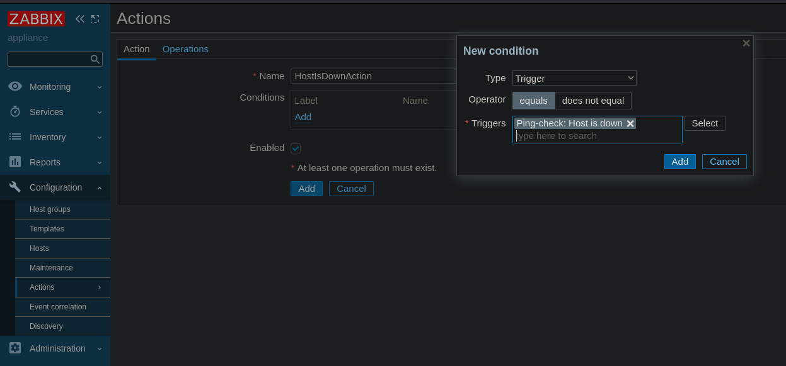

# Мониторинг в Дата-Центре

- [Описание](#описание)
- [Настройка адресов внутри ДЦ для мониторингого сервиса](#настройка-адресов-внутри-дц-для-мониторингого-сервиса)
- [Настройка destination NAT на гипервизоре eve для доступа на веб-интерфейс Zabbix извне](#настройка-destination-nat-на-гипервизоре-eve-для-доступа-на-веб-интерфейс-zabbix-извне)
- [Добавление графиков и алертов](#добавление-графиков-и-алертов)
- [Таблица адресов интерфейсов](#таблица-адресов-интерфейсов)
- [Конфиги устройств](#конфиги-устройств)

## Описание

Хотим получать алерты, если какой-то из хостов внутри ДЦ перестал пинговаться по своему loopback-интерфейсу (или dummy в случае с линуксовыми машинами). Для этого настроим zabbix, сервер с которым мы расположили за Leaf-3-1. 

## Настройка адресов внутри ДЦ для мониторингого сервиса

Пропишем адрес на downlink-интерфейсе Leaf-3-1 и адреса uplink и dummy интерфейсов машины с zabbix-ом (похоже, если прибьем адрес именно к lo-интерфейсу, то он будет аналогичен адресу из `127.0.0.0/24`, т.е. будем взаимодействовать сами с собой).

Правило, по которому можно предсказать адрес того или иного интерфейса в зависимости от его роли и направления, осталось [тем же](../dc-internal/README.md/#правило-назначения-адресов-на-физические-интерфейсы), что и для остальных устройств внутри ДЦ.

<details>
<summary>
Адрес donwlink-интерфейса на Leaf-3-1:</summary>

```
Leaf-3-1(config)#int e0/0
Leaf-3-1(config-if)#ip addr 10.131.231.1 255.255.255.252
Leaf-3-1(config-if)#no shut
Leaf-3-1(config-if)#
*Apr 21 11:30:51.390: %LINK-3-UPDOWN: Interface Ethernet0/0, changed state to up
*Apr 21 11:30:52.394: %LINEPROTO-5-UPDOWN: Line protocol on Interface Ethernet0/0, changed state to up
```
</details>

<details>
<summary>
Добавим интерфейс e0/0 в OSPF и пометим его как пассивный (OSPF пакеты с него, вниз слать не нужно, но мы хотим, чтобы все остальные маршрутизаторы с включенным OSPF узнали о том, что за этим интерфейсом находится такой префикс):</summary>

```
Leaf-3-1(config)#router ospf 1
Leaf-3-1(config-router)#passive-interface e0/0
```

```
Leaf-3-1(config)#int e0/0
Leaf-3-1(config-if)#ip ospf 1 area 51
```
</details>

<details>
<summary>
Зададим адреса на интерфейсах машины с zabbix-ом, для dummy интерфейса-а выбрали последний адрес в префиксе 192.168.3.0/24, особенному "сервису" - особенный адрес. Для eth-интерфейса заодно пропишем адрес DNS-сервера:</summary>

Uplink:
```
[root@appliance ~]# vi /etc/sysconfig/network-scripts/ifcfg-eth0
DEVICE="eth0"
BOOTPROTO=none
IPADDR=10.131.231.2
PREFIX=30
GATEWAY=10.131.231.1
NM_CONTROLLED="no"
PERSISTENT_DHCLIENT=1
ONBOOT="yes"
TYPE=Ethernet
DEFROUTE=yes
PEERDNS=yes
PEERROUTES=yes
IPV4_FAILURE_FATAL=yes
NAME="eth0"
DNS1="1.1.1.1"
```

Рестарт uplink-интерфейса:
```
[root@appliance ~]# ifdown eth0
[root@appliance ~]# ifup eth0
```

Dummy (захардкодили, надо переписать нормально):
```
[root@appliance ~]# vi /etc/sysconfig/network-scripts/ifup-dummy 
ip link add dummy0 type dummy
ip addr add 192.168.3.254/32 dev dummy0

```

```
[root@appliance ~]# ifup dummy
```

</details>

<details>
<summary>
Пропишем на Leaf-3-1 маршрут до адреса loopback-интерфейса машины с zabbix-ом, и добавим в OSPF редистрибуцию статических маршрутов.</summary>

```
Leaf-3-1(config)#ip route 192.168.3.254 255.255.255.255 10.131.231.2
Leaf-3-1(config)#router ospf 1
Leaf-3-1(config-router)#redistribute static 
```
</details>


## Настройка destination NAT на гипервизоре eve для доступа на веб-интерфейс Zabbix извне

Нам потребуется заходить на web-интерфейс через браузер. У нас есть внешний ip-адрес, указав который вместе с портом 80 в браузере, мы попадаем на страницу с топологией.

Хотим, чтобы указывая тот же внешний адрес, но какой-нибудь другой порт, мы попадали на веб-интерфейса Zabbix-а, для этого нужно, чтобы сам гипервизор eve подменял destination в пакетах, полученных на внешнем адресе и указанном порту.

<details>
<summary>
Прописываем правила в iptables:
</summary>

```
root@eve-ng:~# iptables -t nat -A PREROUTING -p tcp --destination X.X.X.X --dport 8080 -j DNAT --to-destination 192.168.3.254:80 
```
</details>

Помним, что указанный в правиле адрес `--to-destination` - временное решение, т.к. после появления [туннелей](../office-to-dc/README.md#маршрутизация-в-туннельные-интерфейсы) и возвращения [NAT-а и запрещающих списков ACL](../office-to-dc/README.md#фильтрация-исходящего-трафика-на-граничных-маршрутизаторах-с-помощью-acl) внешние адреса приватных сетей должны стать недоступными. 

Удалось зайти в web-интерфейс.


## Добавление графиков и алертов

Добавим группы хостов "Configuration" -> "Host groups" -> "Create host group".


Создадим шаблоны, который привяжем к группам "Configuration" -> "Templates" -> "Create template"


Находим созданный шаблон в списке, переходим в нем во вкладку "Items", добавим item с помощью "Create item"

В "Type" выбираем "Simple check", в "Key" - "icmppingsec[]", "Update interval" - 5s.


Теперь добавим устройства в созданные группы "Configuration" -> "Hosts" -> "Create hosts". В Interfaces добавляем "Agent" и прописываем адрес loopback-интерфейса. В "Templates" указываем созданный нами шаблон.


Во вкладке "Monitoring" -> "Dashboards" можно создать доску с графиком ("Add Widget"), где будут выбранные нами item-ы (в item pattern прописали имя созданного нами item-а "Ping-simple-check") выбранных нами host-ов (ищем по именам групп, ставим галки), в Draw выбрали Points:


Создадим триггер, который будет срабатывать, когда хосты перестают пинговаться.

Выберем созданный нами шаблон в "Configuration" -> "Templates", для него во вкладке "Trigger" -> "Create triggers". Дадим ему имя "Host is down", выставим Severity в High, в Expression для item-а "Ping-simple-check" выберем функцию "last() - Last(most recent) T value" с Result-ом = 0. В "OK event generation" выберем "Recovery expression" c тем же выражением для того же item-а, но с Result > 0:


UPD: все-таки один пропущенный пинг не должен быть проблемой, поставили last 5 и для problem expression, и для recovery expression:

```last(/Ping-check/icmpping[],#5)=0```

```last(/Ping-check/icmpping[],#5)>0```

В "Configuration" -> "Actions" -> "Create action" создадим действие, ассоциированное со срабатыванием нашего триггера.



Во вкладке "Operations" добавим сами действия, которые должны происходить при срабатывании триггера и при recovery (когда отпустило). Хотим в обоих случаях отправлять сообщение в бота Telegram.


Чтобы это работало, надо как-то привязать бота к пользователю, которого мы только что выбрали в "Send to users".

В "Administration" -> "Media Types" находим "Telegram", в окне Description есть описание того, как создать бота и получить необходимые IDшники, которые здесь же и нужно указать:


В "Administration" -> "Users" -> "Admin" -> "Media" -> "Add" добавляем Media - Telegram, указывая ID бота, который нам выдали ранее


Проверяем, что получилось - отключим один из добавленных хостов и посмотрим, приедет ли уведомление в Telegram:


## Таблица адресов интерфейсов

| Name        | Interface      | IP-address       |
| :---------- | :------------- | :--------------- |
| Leaf-3-1    |                |                  |
|             | lo 0           | 192.168.3.131/32 |
|             | e0/0           | 10.131.231.1/30  |
| zabbix      |                |                  |
|             | dummy 0        | 192.168.3.254/32 |
|             | eth4 (real 1)  | 10.131.231.2/30  |

## Конфиги устройств

[Leaf-3-1.conf](./configs/Leaf-3-1.conf)

Машина с zabbix-ом:

[ifcfg-eth0](./configs/ifcfg-eth0)

[ifup-dummy](./configs/ifup-dummy)