# Сервисы в Дата-Центрах

- [Описание](#описание)
- [*Подготовительные действия](#подготовительные-действия)
- [Конфигурирование uplink-адресов и management-адресов на Real-ах](#конфигурирование-uplink-адресов-и-management-адресов-на-real-ах)
  - [Service-A](#service-a)
    - [Leaf-1-1](#leaf-1-1)
    - [Leaf-1-2](#leaf-1-2)
    - [Real-A-1](#real-a-1)
    - [Real-A-2](#real-a-2)
  - [Service-B](#service-B)
    - [Leaf-2-1](#leaf-2-1)
    - [Leaf-2-2](#leaf-2-2)
    - [Real-B-1](#real-b-1)
    - [Real-B-2](#real-b-2)
- [Конфигурирование keepalived на Leaf-ах и Real-ов сервиса A](#конфигурирование-keepalived-на-leaf-ах-и-real-ов-сервиса-a)
    - [VRRP](#vrrp)
    - [Запуск эхо-сервиса на Real-ах](#запуск-эхо-сервиса-на-Real-ах)
    - [TCP Health Check](#tcp-health-check)
- [Таблица адресов интерфейсов](#таблица-адресов-интерфейсов)
    - [Leaf dummies and downlinks](#leaf-dummies-and-downlinks)
    - [Real servers](#real-servers)
    - [Virtual IPs](#virtual-ips)
    - [Links for VRRP](#links-for-vrrp)
- [Конфиги устройств](#конфиги-устройств)

## *Подготовительные действия

<details>
<summary>
Временное отключение NAT-ирования приватных адресов для доступа на машины внутри ДЦ с гипервизора eve:</summary>

```
DC-Edge-1(config)#route-map NAT-FOR-ETH-0-2 permit
DC-Edge-1(config-route-map)#no match ip address INTERNAL_LO_IPS
DC-Edge-1(config-route-map)#route-map NAT-FOR-ETH-0-1 permit   
DC-Edge-1(config-route-map)#no match ip address INTERNAL_LO_IPS
```

```
DC-Edge-2(config)#route-map NAT-FOR-ETH-0-1 permit
DC-Edge-2(config-route-map)#no match ip address INTERNAL_LO_IPS
DC-Edge-2(config-route-map)#route-map NAT-FOR-ETH-0-2 permit   
DC-Edge-2(config-route-map)#no match ip address INTERNAL_LO_IPS
DC-Edge-2(config-route-map)#exit
```
</details>

## Конфигурирование uplink-адресов и management-адресов на Real-ах

Договоримся о том, по какому принципу будут задаваться правила назначения downlink-адресов на Leaf-ах и на uplink-ах серверов за ними.

#### Правило назначения адресов на физические интерфейсы:

Также, как и [для остальных устройств внутри ДЦ](../dc-internal/README.md/#правило-назначения-адресов-на-физические-интерфейсы), для `10.X.Y.Z/30` - X определяет устройство сверху, Y - устройство снизу, Z - 1 для downlink, 2 для uplink.

X = (100 + 10 * (номер сервиса, т.е. номер, общий для пары Leaf-ов, обслуживающих один и тот же сервис) + номер конкретного Leaf-а внутри пары).
Y = 200 + 10 * (номер сервиса) + номер Real-а.

У нас не так много сервисов, так что любое значение Y поместится в октет.

Например, адрес Leaf-2-1, смотрящий в сторону Real-а Service-B-2 будет выглядеть так:

X = 100 + 10 * 2 (номер сервиса, номер пары Leaf-ов) + 1 (номер Leaf-а в паре) = 100 + 20 + 1 = 121
Y = 200 + 10 * (номер сервиса) + 2 (номер Real-а) = 200 + 10 * 2 + 2
Z = 1 (downlink)

Итого, `10.121.222.1/30`

Соединенный с ним интерфейс на стороне Service-B-2 будет иметь адрес `10.121.222.2/30` - отличие только в четвертом октете, для сервера это uplink.

Все адреса приведены в [таблице ниже](#таблица-адресов-интерфейсов).

#### Правило назначения адресов на dummy интерфейсы Real-ов:

Эти интерфейсы будут использоваться как management-интерфейсы и принадлежать префиксу `192.168.3.0/24`, куда входят все подобные адреса устройств внутри ДЦ.

Число в четвертом октете будет определяться по той же формуле, что и Y [выше](#правило-назначения-адресов-на-физические-интерфейсы): 200 + 10 * (номер сервиса) + (номер Real-а).

Например, для Real-а Service-C-1 (единственный за Lead-3-1): 200 + 10 * 3 + 1 = 231 

В итоге получаем `192.168.3.231/32`.

Пропишем эти адреса в конфиги всех устройств, применяем через `netplan apply` и `systemctl restart bird`.

На real-серверы не запущены никакие демоны динамической маршрутизации, поэтому маршрут до их management-интерфейсов мы пропишем статически в конфиге bird-а, который прокинет их в OSPF. 

### Service-A

#### Leaf-1-1

<details>
<summary>
В /etc/netplan/01-netcfg.yaml:</summary>

```
    eth4:
      addresses:
       - 10.111.211.1/30
    eth5:
      addresses:
       - 10.111.212.1/30
```
</details>

<details>
<summary>
В /etc/bird/bird.conf для area 51 добавили stub-интерфейсы, экспорт статических маршрутов до management-интерфейсов Real-ов, которые прописали здесь же, в protocol static (экспериментально убедились, что лучше явно писать nexthop, чем интерфейс):</summary>

```
protocol ospf v2 {
    import all;
    export all;
    area 51 {
        ....

        ....
        interface "eth4" {
            stub;
        };
        interface "eth5" {
            stub;
        };
    };
}
```

```
protocol static {
    export all;
    route 192.168.3.211/32 via 10.111.211.2;
    route 192.168.3.212/32 via 10.111.212.2;
}
```
</details>

#### Leaf-1-2

<details>
<summary>
В /etc/netplan/01-netcfg.yaml:</summary>

```
    eth4:
      addresses: [10.112.211.1/30]
    eth5:
      addresses: [10.112.212.1/30]
```
</details>

<details>
<summary>
В /etc/bird/bird.conf для area 51 (поменялся nexthop в статических маршрутах):</summary>

```
protocol ospf v2 {
    import all;
    export all;
    area 51 {
        ....

        ....
        interface "eth4" {
            stub;
        };
        interface "eth5" {
            stub;
        };
    };
}
```

```
protocol static {
    export all;
    route 192.168.3.211/32 via 10.112.211.2;
    route 192.168.3.212/32 via 10.112.212.2;
}
```
</details>

#### Real-A-1

<details>
<summary>
Прописываем адреса и default gateway-и в конфиге netplan:</summary>

```
root@Service-A-1:~# cat /etc/netplan/01-netcfg.yaml 
# This file describes the network interfaces available on your system
# For more information, see netplan(5).
network:
  version: 2
  renderer: NetworkManager
  ethernets:
    eth0:
      addresses: [10.111.211.2/30]
      gateway4: 10.111.211.1
    eth1:
      addresses: [10.112.211.2/30]
      gateway4: 10.112.211.1
  bridges:
    dummy0:
      addresses: [192.168.3.211/32]
```
</details>

На Real-ах помимо адреса нужно добавить те же опции ядра, что мы [добавляли для Leaf-ов ранее в /etc/sysctl.d/12-stuff.conf](../dc-internal/README.md#leaf-1-1), чтобы пакеты могли перекладываться из интерфейса в интерфейс:

<details>
<summary>
Скопируем c Leaf-1-1 на Service-A-1 конфиг с опциями ядра:</summary>

```
root@Leaf-1-1:~# scp /etc/sysctl.d/12-stuff.conf root@10.111.211.2:/tmp
```
</details>

Положим конфиг в /etc/sysctl.d, ребутнем Real-, и проверим, что до его management-интерфейса можно достучаться (удалось после манипуляций c import/export в конфиге bird-а).

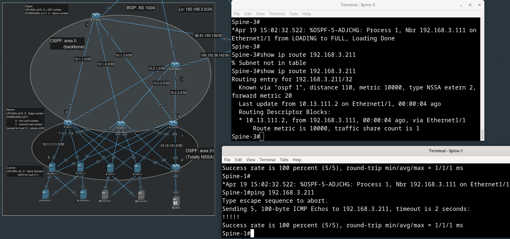

#### Real-A-2

<details>
<summary>
Добавим временный адрес и дефолтный маршрут на eth0, чтобы сразу скопировать все нужные нам конфиги:</summary>

```
root@Service-A-2:~# ip addr add 10.111.212.2/30 dev eth0
root@Service-A-2:~# ip route add default via 10.111.212.1
```
</details>

<details>
<summary>
Перенесем конфиги с Real-A-1:</summary>

```
root@Leaf-1-1:~# scp /tmp/01-netcfg.yaml root@10.111.212.2:/etc/netplan/01-netcfg.yaml
root@10.111.212.2's password: 
01-netcfg.yaml                        100%  379   612.4KB/s   00:00    
root@Leaf-1-1:~# scp root@10.111.211.2:/etc/sysctl.d/12-stuff.conf /tmp/ 
root@10.111.211.2's password: 
12-stuff.conf                         100%  116   219.4KB/s   00:00    
root@Leaf-1-1:~# scp /tmp/12-stuff.conf  root@10.111.212.2:/etc/sysctl.d/
root@10.111.212.2's password: 
12-stuff.conf   
```
</details>

<details>
<summary>
Зайдем на Real-A-2 и внесем правки:</summary>

```
root@Leaf-1-1:~# ssh root@10.111.212.2
root@Service-A-2:~# vim /etc/netplan/01-netcfg.yaml 
# This file describes the network interfaces available on your system
# For more information, see netplan(5).
network:
  version: 2
  renderer: NetworkManager
  ethernets:
    eth0:
      addresses: [10.111.212.2/30]
      gateway4: 10.111.212.1
    eth1:
      addresses: [10.112.212.2/30]
      gateway4: 10.112.212.1
  bridges:
    dummy0:
      addresses: [192.168.3.212/32]
root@Service-A-2:~# netplan try
Do you want to keep these settings?
```
</details>

Проверяем:

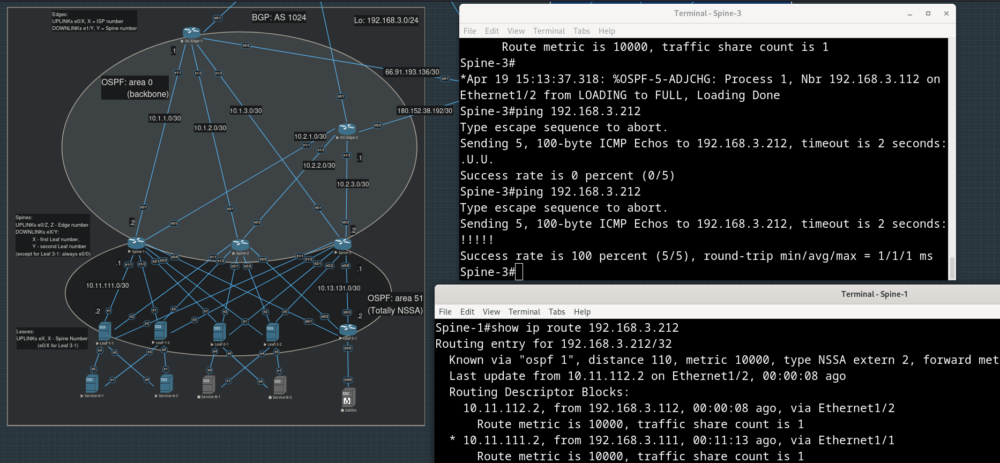

Чтобы убедиться, что статический маршрут, редистрибученный в OSPF в Totally Not-So-Stubby-Area, смог оказаться за пределами этой зоны, посмотрим таблицу маршрутизации на DC-Edge-1, который целиком находится в Backbone Area:

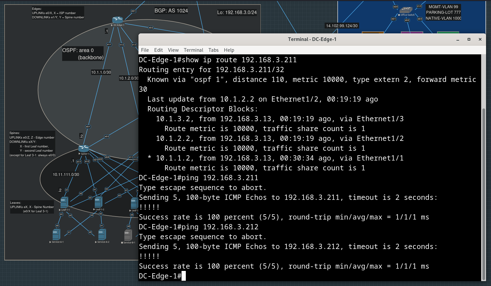

### Service-B

#### Leaf-2-1

<details>
<summary>
В /etc/netplan/01-netcfg.yaml:</summary>

```
    ens7:
      addresses: [10.121.221.1/30]
    ens8:
      addresses: [10.121.222.1/30]
```
</details>

<details>
<summary>
В /etc/bird/bird.conf для area 51:</summary>

```
protocol ospf v2 {
    import all;
    export all;
    area 51 {
        ....

        ....
        interface "ens7" {
            stub;
        };
        interface "ens8" {
            stub;
        };
    };
}
```

```
protocol static {
    export all;
    route 192.168.3.221/32 via 10.121.221.2;
    route 192.168.3.222/32 via 10.121.222.2;
}
```
</details>

### Leaf-2-2

<details>
<summary>
Забираем конфиги с Leaf-2-1 и кладем на Leaf-2-2:</summary>

```
root@Leaf-2-1:~# scp /etc/netplan/00-installer-config.yaml root@192.168.3.122:/tmp
root@192.168.3.122's password: 
00-installer-config.yaml          100%  452   625.3KB/s   00:00
root@Leaf-2-1:~# scp /etc/bird/bird.conf root@192.168.3.122:/tmp
root@192.168.3.122's password: 
bird.conf                         100% 1430     1.5MB/s   00:00
```
</details>

<details>
<summary>
Заходим на Leaf-2-2, правим и применяем конфиги:</summary>

```
root@eve-ng:~# ssh 192.168.3.122
root@192.168.3.122's password:

root@Leaf-2-2:~# vim /etc/netplan/00-installer-config.yaml 
# This is the network config written by 'subiquity'
network:
  ethernets:
    ens4:
      addresses: [10.11.122.2/30]
      gateway4: 10.11.122.1
    ens5:
      addresses: [10.12.122.2/30]
      gateway4: 10.12.122.1
    ens6:
      addresses: [10.13.122.2/30]
      gateway4: 10.13.122.1
    ens7:
      addresses: [10.122.221.1/30]
    ens8:
      addresses: [10.122.222.1/30]
  bridges:
    dummy0:
      addresses: [192.168.3.122/32]
  version: 2

root@Leaf-2-2:~# vim /etc/bird/bird.conf

router id 192.168.3.122;

log "/var/log/bird.log" { info, warning, error, fatal };
protocol ospf v2 {
    import all;
    export all;
    area 51 {
	nssa;
	summary off; # totally not-so-stubby-area
        interface "ens4" {
            type ptp;        # Point-to-Point: no DR/BDP selection
            cost 10;         # Interface metric
            hello 10;        # same as it is configured at Spine 1 e1/1
        };
	interface "ens5" {
	   type ptp;
	   cost 10;
	   hello 10;
	};
	interface "ens6" {
	   type ptp;
	   cost 10;
	   hello 10;
	};
        interface "dummy0" {
	    stub;
        };
	interface "ens7" {
	    stub;
	};
	interface "ens8" {
	    stub;
	};
    };
}

protocol static {
    export all;
    route 192.168.3.221/32 via 10.122.221.2;
    route 192.168.3.222/32 via 10.122.222.2;
}

# The Device protocol is not a real routing protocol. It doesn't generate any
# routes and it only serves as a module for getting information about network
# interfaces from the kernel.
protocol device {
}

# The Kernel protocol is not a real routing protocol. Instead of communicating
# with other routers in the network, it performs synchronization of BIRD's
# routing tables with the OS kernel.
protocol kernel {
	metric 64;	# Use explicit kernel route metric to avoid collisions
			# with non-BIRD routes in the kernel routing table
	import none;
	export all;	# Actually insert routes into the kernel routing table
}

root@Leaf-2-2:~# netplan try
root@Leaf-2-2:~# systemctl restart bird
```
</details>

#### Real-B-1

<details>
<summary>
Прописали временный адрес и дефолтный маршрут:</summary>

```
root@Service-B-1:~# ip addr add 10.121.221.2/30 dev eth0
root@Service-B-1:~# ip route add default via 10.121.221.1
```
</details>

<details>
<summary>
Переносим конфиги с другого Real-а:</summary>

```
root@Leaf-1-1:~# scp root@10.111.211.2:/etc/netplan/01-netcfg.yaml /tmp
root@10.111.211.2's password: 
01-netcfg.yaml                        100%  379   749.4KB/s   00:00

root@Leaf-1-1:~# scp /tmp/01-netcfg.yaml root@10.121.221.2:/tmp
root@10.121.221.2's password: 
01-netcfg.yaml                        100%  494   573.3KB/s   00:00

root@Leaf-1-1:~# scp root@10.111.211.2:/etc/sysctl.d/12-stuff.conf /tmp
root@10.111.211.2's password: 
12-stuff.conf                         100%  116   224.1KB/s   00:00
root@Leaf-1-1:~# scp /tmp/12-stuff.conf root@10.121.221.2:/tmp
root@10.121.221.2's password: 
12-stuff.conf                         100%  116   133.2KB/s   00:00
root@Leaf-1-1:~# 
```
</details>

<details>
<summary>
На Real-е подправили конфиги и перенесли в нужные директории:</summary>

```
root@Service-B-1:/tmp# vim 01-netcfg.yaml
# This file describes the network interfaces available on your system
# For more information, see netplan(5).
network:
  version: 2
  renderer: NetworkManager
  ethernets:
    eth0:
      addresses: [10.121.221.2/30]
      gateway4: 10.121.221.1
    eth1:
      addresses: [10.122.221.2/30]
      gateway4: 10.122.221.1
  bridges:
    dummy0:
      addresses: [192.168.3.221/32]
root@Service-B-1:/tmp# mv 01-netcfg.yaml /etc/netplan/
root@Service-B-1:/tmp# mv 12-stuff.conf /etc/sysctl.d/
```
</details>

Ребутаем Real и проверяем доступность его management-адреса.

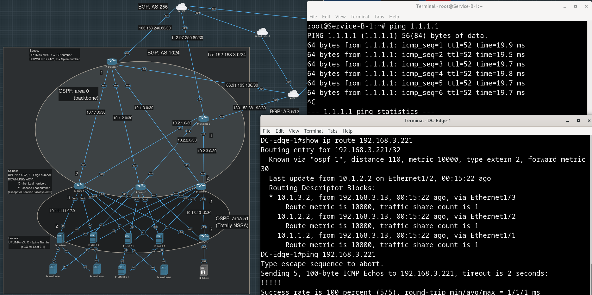

#### Real-B-2

<details>
<summary>
Прописали временный (до первого ребута) адрес и дефолтный маршрут:</summary>

```
root@Service-B-2:~# ip a add 10.121.222.2/30 dev eth0
root@Service-B-2:~# ip r add default via 10.121.222.1
```
</details>

<details>
<summary>
Переносим конфиги с соседнего Real-а:</summary>

```
root@Service-B-1:~# scp /etc/netplan/01-netcfg.yaml root@10.121.222.2:/tmp
root@10.121.222.2's password: 
01-netcfg.yaml                    100%  379   488.0KB/s   00:00
root@Service-B-1:~# scp /etc/sysctl.d/12-stuff.conf  root@10.121.222.2:/tmp
root@10.121.222.2's password: 
12-stuff.conf                     100%  116   119.3KB/s   00:00
```
</details>

<details>
<summary>
Заходим на Service-B-2, подправляем адрес в конфиге netplan, применяем и ребутаем хост:</summary>

```
root@Service-B-1:~# ssh root@10.121.222.2
root@10.121.222.2's password: 

root@Service-B-2:~# vim /tmp/01-netcfg.yaml 

# This file describes the network interfaces available on your system
# For more information, see netplan(5).
network:
  version: 2
  renderer: NetworkManager
  ethernets:
    eth0:
      addresses: [10.121.222.2/30]
      gateway4: 10.121.222.1
    eth1:
      addresses: [10.122.222.2/30]
      gateway4: 10.122.222.1
  bridges:
    dummy0:
      addresses: [192.168.3.222/32]

root@Service-B-2:~# mv /tmp/01-netcfg.yaml /etc/netplan/
root@Service-B-2:~# netplan try
Do you want to keep these settings?
root@Service-B-2:~# mv /tmp/12-stuff.conf /etc/sysctl.d/
root@Service-B-2:~# reboot
```
</details>

Проверяем доступность его management-интерфейса:

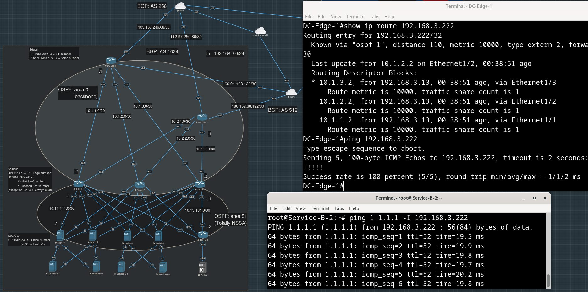


## Конфигурирование keepalived на Leaf-ах и Real-ов сервиса A

### VRRP

<details>
<summary>
Сначала установим демона keepalived на оба Leaf-а, обсулживающие сервис A:</summary>

```
root@Leaf-1-2:~# apt install update 
root@Leaf-1-2:~# apt install keepalived
```
</details>

<details>
<summary>
Добавим в конфиг netplan еще один dummy интерфейс, на котором будем добавлять/удалять ip-адрес, в зависимости от перехода демона на данном Leaf-е в состояние MASTER/BACKUP/FAULT.</summary>

```
root@Leaf-1-1:~# vim /etc/netplan/01-netcfg.yaml
....
  bridges:
  ....
    dummy1:
      addresses: []
```
</details>

Пусть первый Leaf из пары всегда будет master-ом, второй - backup-ом.

Помним, что раньше с VRRP мы сталкивались, когда резервировали адрес default gateway - он работает на ARP-ах, когда в broadcast-домене некто отправляет ARP с просьбой узнать MAC-адрес, принадлежащий устройству с определенным IP, именно маршрутизатор из VRRP-пары в состоянии master (active), ответит на этот ARP, указав в ответе свой MAC.

Соединим Leaf-ы в одной паре линком, который будет использоваться для VRRP, интерфейсы eth0 как раз не заняты. Поскольку адреса на этих интерфейсах не будут протекать в OSPF, можем взять любые адреса.

Соединяя Leaf-ы друг с другом, кажется, мы нарушаем идею топологии Клоза, что Leaf-ы могут быть соединены только со Spine-ами, но будем считать пару Leaf-ов с одним общим виртуальным IP-адресом, обслуживающую один сервис, эдаким "коллективным" одним Leaf-ом.

<details>
<summary>
Конфиг /etc/keepalived/keepalived.conf на Leaf-1-1:</summary>

```
vrrp_instance through-eth-0 {
   interface eth0

   state MASTER
   virtual_router_id 101
   priority 200
   preempt

   virtual_ipaddress { 
     192.168.3.101 dev dummy1
   }

   notify /usr/local/bin/keepalived_notify.sh
}

```
</details>

<details>
<summary>
Конфиг /etc/keepalived/keepalived.conf на Leaf-1-2:</summary>

```
vrrp_instance through-eth-0 {
   interface eth0

   state BACKUP
   virtual_router_id 101
   priority 100
   preempt

   virtual_ipaddress {
     192.168.3.101 dev dummy1
   }

   notify /usr/local/bin/keepalived_notify.sh
}
```
</details>

<details>
<summary>
Пока скрипт, выполняемый при переходе состояния VRRP-инстанса, выглядит так - просто пишет состояние в файл:</summary>

```
root@Leaf-1-2:~# cat /usr/local/bin/keepalived_notify.sh 
#!/bin/bash

TYPE=$1
NAME=$2
STATE=$3

echo $STATE > /var/run/keepalived.state
```
</details>

<details>
<summary>
Запустим демонов на обоих Leaf-ах и посмотрим, что будет:</summary>

```
root@Leaf-1-1:~# systemctl start keepalived.service
```

```
root@Leaf-1-2:~# systemctl start keepalived.service
```
</details>

Экспериментально убедились, что скрипт добавления адреса на dummy-интерфейс не нужен - очевидно, это делает сам keepalived в состоянии MASTER.

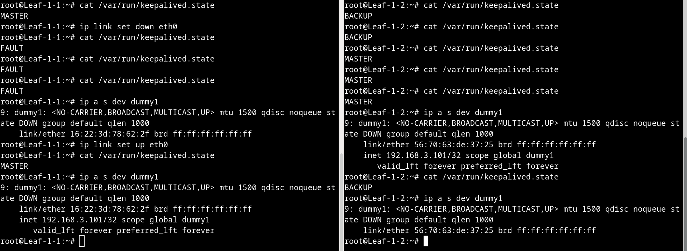

На скриншоте видим, что если на Leaf-1-1, изначально бывшем MASTER-ом, гасим интерфейс, на котором запущен VRRP, то VIP снимается с dummy-интерфейса, а Leaf-1-1 переходит в состояние FAULT. При этом Leaf-1-2, который изначально был BACKUP-ом, перестает получать VRRP-пакеты от Leaf-1-1, и становится MASTER-ом сам, добавляя VIP на свой dummy-интерфейс. Когда на Leaf-1-1 возвращаем интерфейс, связывающий его с Leaf-1-2, в состояние up, то Leaf-1-1 снова становится MASTER-ом, а Leaf-1-2 - BACKUP-ом (в конфиге выставлена опция preempt), а VIP "перетекает" на dummy-интерфейс Leaf-1-1.

<details>
<summary>
Не забудем добавить ip-адреса на eth0 в конфиг netplan:</summary>

```
root@Leaf-1-1:~# cat /etc/netplan/01-netcfg.yaml
....
network:
  version: 2
  renderer: NetworkManager
  ethernets:
....
    eth0:
      addresses: [10.0.101.1/30]
....
```

```
root@Leaf-1-2:~# cat /etc/netplan/01-netcfg.yaml 
....
network:
  version: 2
  renderer: NetworkManager
  ethernets:
....
    eth0:
      addresses: [10.0.101.2/30]
....
```
</details>

### Запуск эхо-сервиса на Real-ах

В качестве сервиса будем использовать простой tcp-шный эхо-сервер, обрабатывающий входящие подключения с помощью poll(): [исходный код на Си](./src/tcp_echo_server_with_poll.c) 

<details>
<summary>Заливаем код и systemd-шный unit-файл нашего сервиса на Real-ы:</summary>

```
root@Leaf-1-1:~# scp /tmp/tcp_echo_server_with_poll.c  root@192.168.3.211:/tmp
root@192.168.3.211's password: 
tcp_echo_server_with_poll.c           100% 7607     9.5MB/s   00:00    
root@Leaf-1-1:~# scp tcp-echo.service root@192.168.3.212:/tmp
root@192.168.3.212's password: 
tcp-echo.service                      100%  152   214.7KB/s   00:00    
```

```
root@Leaf-1-1:~# cat tcp-echo.service 
[Unit]
Description=Tcp Echo Server
After=network.target

[Service]
ExecStart=/usr/sbin/tcp_echo_server 0.0.0.0 80

[Install]
WantedBy=multi-user.target
root@Leaf-1-1:~# 
```

Чтобы сервис мог воскреснуть после ребута, сделаем enable

```
root@Service-A-2:~# systemctl status tcp-echo.service 
● tcp-echo.service - Tcp Echo Server
   Loaded: loaded (/lib/systemd/system/tcp-echo.service; disabled; vendor preset: enabled)
   Active: inactive (dead)
root@Service-A-2:~# systemctl enable tcp-echo.service 
Created symlink /etc/systemd/system/multi-user.target.wants/tcp-echo.service → /lib/systemd/system/tcp-echo.service.

```
</details>

<details>
<summary>
На Real-ах компилируем код и кладем полученный бинарь и systemd-шный unit-файл в нужные директории:</summary>

```
root@Service-A-2:/tmp# gcc -o tcp_echo_server tcp_echo_server_with_poll.c 
root@Service-A-2:/tmp# mv tcp_echo_server /usr/sbin
root@Service-A-2:/tmp# mv tcp-echo.service /lib/systemd/system
root@Service-A-2:/tmp# systemctl start tcp-echo
root@Service-A-2:/tmp# systemctl status tcp-echo
```
</details>

Запускаем сервисы на обоих Real-ах, тестируем "эхо", подключаясь к Real-ам с Leaf-1-1 с помощью netcat:

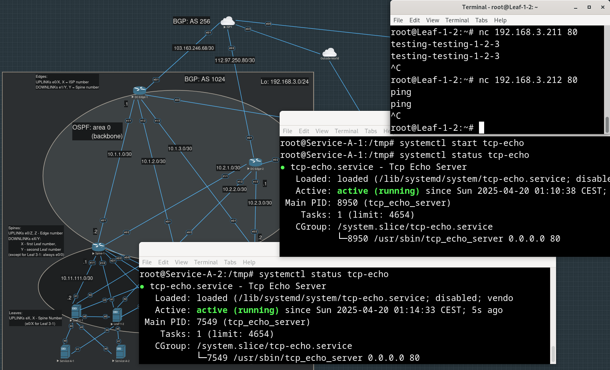

### TCP Health Check

<details>
<summary>
Теперь, когда на Real-ах есть сервис, который сможет отвечать на "пробы", который будет отправлять keepalived, мы можем указать Real-ы в конфиге keepalived.
</summary>

```
root@Leaf-1-1:~# cat /etc/keepalived/keepalived.conf 
vrrp_instance through-eth-0 {
   interface eth0

   state MASTER
   virtual_router_id 101
   priority 200
   preempt

   virtual_ipaddress { 
     192.168.3.101 dev dummy1
   }

   notify /usr/local/bin/keepalived_notify.sh
}

virtual_server 192.168.3.101 80 {
    lb_algo rr
    lb_kind NAT
    protocol TCP

    real_server 192.168.3.211 80 {
        weight 1
        TCP_CHECK {
            connect_port 80
            connect_timeout 3
        }
    }

    real_server 192.168.3.212 80 {
        weight 1
        TCP_CHECK {
            connect_port 80
            connect_timeout 3
        }
    }
}
```
</details>

<details>
<summary>
Добавляем интерфейс dummy1 в OSPF, иначе bird не сможет рассказать внешнему миру о сервисе, когда виртуальный IP-адрес (VIP) будет добавлен на этот интерфейс keepalived-ом:</summary>

```
....
protocol ospf v2 {
    import all;
    export all;
    area 51 {
        ....
        interface "dummy1" {
            stub;
        };
    };
}
....
```
</details>

<details>
<summary>
Делаем birdc configure, чтобы не рестартовать сервис:</summary>

```
root@Leaf-1-1:~# birdc configure
BIRD 1.6.3 ready.
Reading configuration from /etc/bird/bird.conf
Reconfigured
```
</details>

Проверяем работу сервиса, обращаюсь к нему через виртуальный IP, пока что с Leaf-2-2 - соседний сервис (позже, после появления туннелей между офисов и ДЦ будем проверять с офисных машин). 

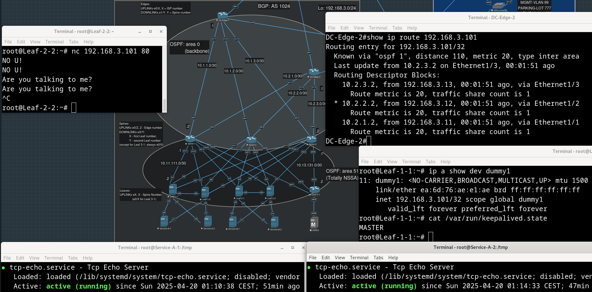

Повторяем все то же самое на втором Leaf-е (Leaf-1-2):

<details>
<summary>
Добавляем секцию, посвященную Real-ам, в конфиг keepalived:</summary>

```
root@Leaf-1-2:~# vim /etc/keepalived/keepalived.conf
....
virtual_server 192.168.3.101 80 {
    lb_algo rr
    lb_kind NAT
    protocol TCP

    real_server 192.168.3.211 80 {
        weight 1
        TCP_CHECK {
            connect_port 80
            connect_timeout 3
        }
    }

    real_server 192.168.3.212 80 {
        weight 1
        TCP_CHECK {
            connect_port 80
            connect_timeout 3
        }
    }
}

```
</details>

<details>
<summary>
Добавляем интерфейс dummy1 в конфиг bird-а:</summary>

```
root@Leaf-1-2:~# vim /etc/bird/bird.conf
router id 192.168.3.112;

log "/var/log/bird.log" { info, warning, error, fatal };
protocol ospf v2 {
    import all;
    export all;
    area 51 {
        .....
        interface "dummy1" {
            stub;
        };
    };
}
....
```
</details>

<details>
<summary>
Заставляем bird перечитать конфиг:</summary>

```
root@Leaf-1-2:~# birdc configure
BIRD 1.6.3 ready.
Reading configuration from /etc/bird/bird.conf
Reconfigured
root@Leaf-1-2:~# 
```
</details>

Проверяем - снова погасим eth0 на мастере - Leaf-1-1, и убедимся, что сервис продолжит работать через Leaf-1-2.

Столкнулись с  проблемой - кажется, Real всегда отвечает через один и тот же Leaf, даже если тот перестал быть мастером, соответственно, он обратную подстановку NAT не делает (увидели с помощью tcpdump, что при смене keepalived MASTER-а поменялся src пойманных ответов с VIPа на RIP - IP Real-а).

Как это выглядит (в tcpdump-е видно, что при перекючении MASTER-а с Leaf-1-1 на Leaf-1-2 в src входящих на Leaf-2-1 (откуда коннектимся через netcat, окно в правом нижнем углу) респонcов остается ip Real-а `192.168.3.212`, при этом до переключения, выше dst ip в ответах - `192.168.3.101`):

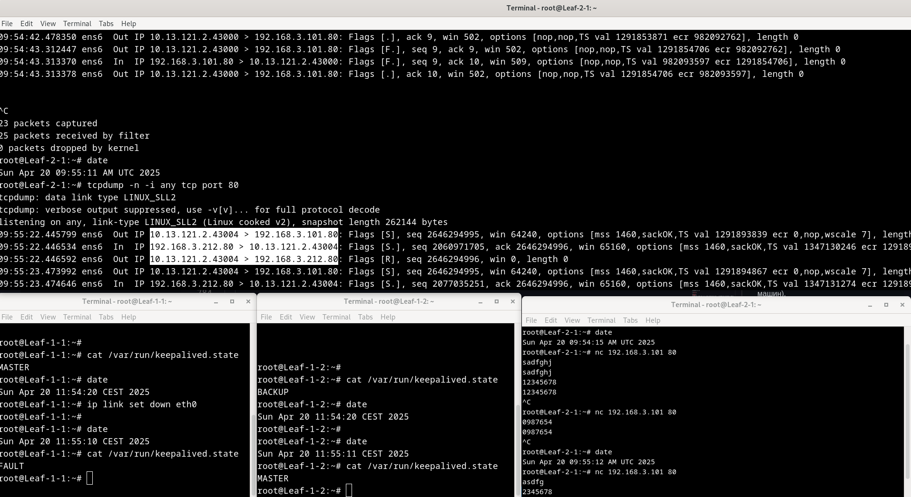

<details>
<summary>
Проверим нашу гипотезу - добавим более приоритетные дефолты на рилах через Leaf-1-2 (который так и остался MASTER-ом): </summary>

```
root@Service-A-1:~# ip route add default via 10.112.211.1 metric 90
```
```
root@Service-A-2:~# ip route add default via 10.112.212.1 metric 90
```
</details>

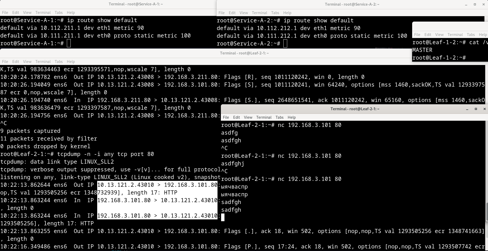

Гипотеза подтвердилась - видим, что и в tcpdump в ответных пакетах dst - это именно виртуальный ip сервиса, и netcat стал получать ответы в виде эха своих сообщений.

Нужно каким-то образом заставлять Real всегда отсылать респонс в тот же интерфейс, через который был получен реквест.

Пробовали попытаться направлять ответ через разные таблицы маршрутизации с разными дефолтными маршрутами с помощью навешивания fwmark-и через iptables (таблица mangle), но это не помогло.

Нам удалось придумать два варианта решения: первый - настроить динамическую маршрутизацию на Real-ах - дефолт будем получать от Leaf-а, тот его прокидывает только если перешел в состояние master (перешел в backup - дефолт снимает), но это противоречит принципу разделения ответственности: представляется, что все, чем должны заниматься машины с Real-ами - это крутить сервисы, они ничего не должны знать об устройстве сети над ними.

Второй вариант- самый простой - мы откажемся от "крест-накрест" соединения Real-ов с Leaf-ами, нам придется смириться с тем, что если Leaf, обслуживающий несколько Real-ов, станет BACKUP-ом, то его Real-ы будут простаивать, при этом никогда НЕ возникнет ситуации, когда ответы будут идти каким-то другим путем по сравнению с запросами (т.к. у Real-ов БЕЗ кросс-коннекта к Leaf-ам будет всегда всего один дефолтный маршрут), и, соответственно, их dst всегда будут NAT-ированы обратно. 

Как такое будет выглядеть:

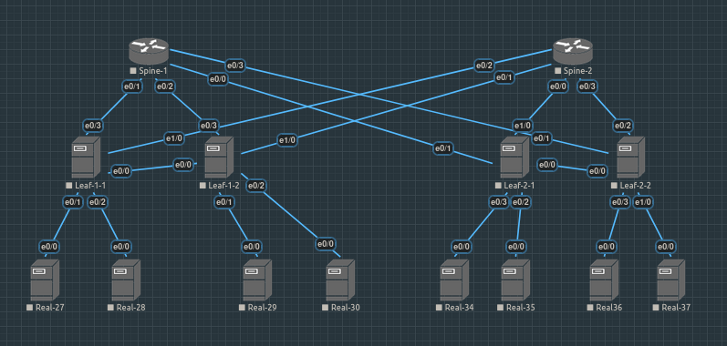

Убедимся, что балансировка работает:

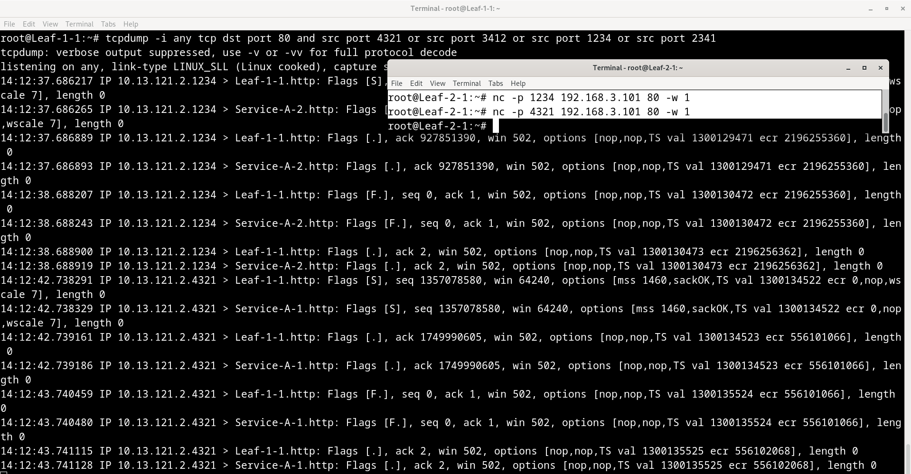

Убедимся, что keepalived замечает, что число Real-ов уменьшилось - для этого остановим наш сервис на одном из них.

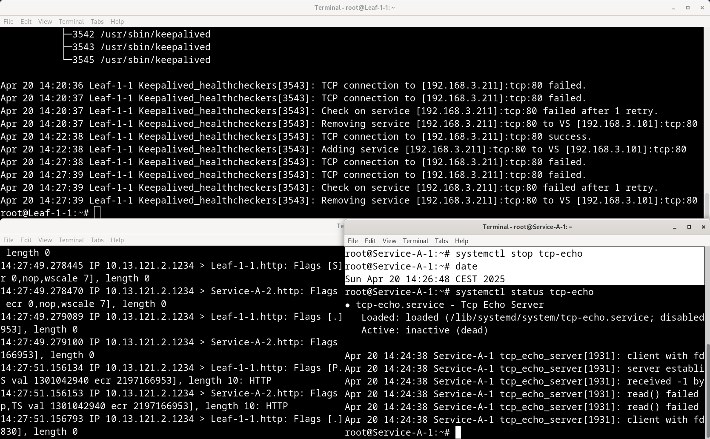

## Таблица адресов интерфейсов

### Leaf dummies and downlinks

| Name        | Interface      | IP-address       |
| :---------- | :------------- | :--------------- |
| Leaf-1-1    |                |                  |
|             | dummy 0 (mgmt) | 192.168.3.111/32 |
|             | eth4 (real 1)  | 10.111.211.1/30  |
|             | eth5 (real 2)  | 10.111.212.1/30  |
| Leaf-1-2    |                |                  |
|             | dummy 0 (mgmt) | 192.168.3.112/32 |
|             | eth4 (real 1)  | 10.112.211.1/30  |
|             | eth5 (real 2)  | 10.112.212.1/30  |
| Leaf-2-1    |                |                  |
|             | dummy 0 (mgmt) | 192.168.3.121/32 |
|             | eth4 (real 1)  | 10.121.221.1/30  |
|             | eth5 (real 2)  | 10.121.222.1/30  |
| Leaf-2-2    |                |                  |
|             | dummy 0 (mgmt) | 192.168.3.122/32 |
|             | eth4 (real 1)  | 10.122.221.1/30  |
|             | eth5 (real 2)  | 10.122.222.1/30  |
| Leaf-3-1    |                |                  |
|             | lo 0 (mgmt)    | 192.168.3.122/32 |
|             | e0/0 (real 1)  | 10.131.231.1/30  |

### Real servers

| Name        | Interface       | IP-address       |
| :---------- | :-------------- | :--------------- |
| Service-A-1 |                 |                  |
|             | dummy 0 (mgmt)  | 192.168.3.211/32 |
|             | eth4 (leaf-1-1) | 10.111.211.2/30  |
|             | eth5 (leaf-1-2) | 10.112.211.2/30  |
| Service-A-2 |                 |                  |
|             | dummy 0 (mgmt)  | 192.168.3.212/32 |
|             | eth4 (leaf-1-1) | 10.111.212.2/30  |
|             | eth5 (leaf-1-2) | 10.112.212.2/30  |
| Service-B-1 |                 |                  |
|             | dummy 0 (mgmt)  | 192.168.3.221/32 |
|             | eth4 (leaf-2-1) | 10.121.221.2/30  |
|             | eth5 (leaf-2-2) | 10.122.221.2/30  |
| Service-B-2 |                 |                  |
|             | dummy 0 (mgmt)  | 192.168.3.222/32 |
|             | eth4 (leaf-2-1) | 10.121.222.2/30  |
|             | eth5 (leaf-2-2) | 10.122.222.2/30  |

### Virtual IPs

| Name      | Interface | IP-address       |
| :-------- | :-------- | :--------------- |
| Service-A | dummy 1   | 192.168.3.101/32 |
| Service-B | dummy 1   | 192.168.3.102/32 |

### Links for VRRP

| Name      | Interface | IP-address    |
| :-------- | :-------- | :------------ |
| Leaf-1-1  | eth0      | 10.0.101.1/30 |
| Leaf-1-2  | eth0      | 10.0.101.2/30 |
| Leaf-2-1  | eth0      | 10.0.102.1/30 |
| Leaf-2-2  | eth0      | 10.0.102.2/30 |

## Конфиги устройств

### Leaf-1-1

[sysctl oprtions](./configs/Leaf-1-1/12-stuff.conf)

[netplan](./configs/Leaf-1-1/01-netcfg.yaml)

[bird.conf](./configs/Leaf-1-1/bird.conf)

[keepalived.conf](./configs/Leaf-1-1/keepalived.conf)

### Leaf-1-2

[sysctl oprtions](./configs/Leaf-1-2/12-stuff.conf)

[netplan](./configs/Leaf-1-2/01-netcfg.yaml)

[bird.conf](./configs/Leaf-1-2/bird.conf)

[keepalived.conf](./configs/Leaf-1-2/keepalived.conf)

### Service-A-1

Real 1

[sysctl oprtions](./configs/Service-A-1/12-stuff.conf)

[netplan](./configs/Service-A-1/01-netcfg.yaml)

### Service-A-2

Real 2

[sysctl oprtions](./configs/Service-A-2/12-stuff.conf)

[netplan](./configs/Service-A-2/01-netcfg.yaml)

### Leaf-2-1

TODO: еще один dummy-интерфейс для keepalive

[sysctl oprtions](./configs/Leaf-2-1/12-stuff.conf)

[netplan](./configs/Leaf-2-1/00-installer-config.yaml)

[bird.conf](./configs/Leaf-2-1/bird.conf)

### Leaf-2-2

TODO: еще один dummy-интерфейс для keepalive

[sysctl oprtions](./configs/Leaf-2-2/12-stuff.conf)

[netplan](./configs/Leaf-2-2/00-installer-config.yaml)

[bird.conf](./configs/Leaf-2-2/bird.conf)