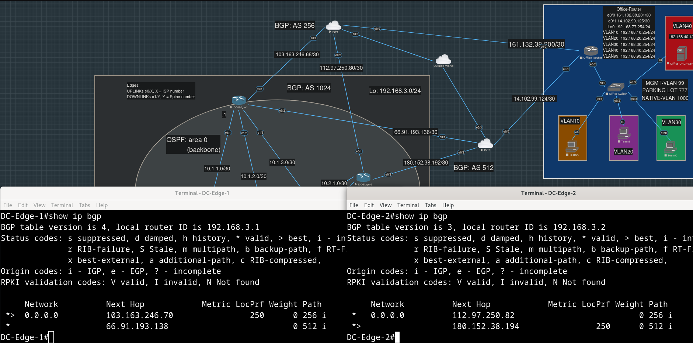

# Стык "Дата-центр - Провайдеры"

- [Описание](#описание)
- [Настройка BGP на граничных маршрутизаторах Дата-Центра](#настройка-bgp-на-граничных-маршрутизаторах-дата-центра)
 - [Настройка BGP на маршрутизаторах Провайдеров](#настройка-bgp-на-маршрутизаторах-провайдеров)
 - [Настройка local-preference для манипуляции выбором лучшего маршрута](#настройка-local-preference-для-манипуляции-выбором-лучшего-маршрута)
 - [Фильтрация маршрутов, переанонсируемых ДЦ](#фильтрация-маршрутов-переанонсируемых-дц)
 - [Конфиги устройств](#конфиги-устройств)

## Описание

Граничные маршрутизаторы дата-центра находятся в BGP-area 1024, соединенные с ними маршрутизаторы провайдеров - в зонах 256 и 512.

Провайдеры анонсируют только дефолтный маршрут граничным маршрутизаторам дата-центра.

Граничные маршрутизаторы, в свою очередь, должны редистрибьютить полученный дефолт в OSPF, подставляя себя в качестве nexthop-а.

Планируется, что некоторые сервисы, живущие внутри ДЦ, должны быть доступны не только сотрудникам, находящемся в нашем же офисе, [но и пользователям во внешнем мире](../dc-monitoring/README.md#настройка-destination-nat-на-гипервизоре-eve-для-доступа-на-веб-интерфейс-zabbix-извне), так что какие-то адреса сервисов должны будут анонсироваться с помощью BGP.

В нашем случае будем анонсировать адрес, который внутри ДЦ будет маршрутизироваться на машину с zabbix-ом - так и будем заходить на его веб-морду (в iptables на гипервизоре eve также придется добавить еще одно правило DNAT для этого адреса).

## Настройка BGP на граничных маршрутизаторах Дата-Центра

<details>
<summary>
Сначала избавимся от прописанных ранее статических дефолтных маршрутов:</summary>

```
DC-Edge-1(config)#no ip route 0.0.0.0 0.0.0.0
```

```
DC-Edge-2(config)#no ip route 0.0.0.0 0.0.0.0
```

</details>

Пока удалили статические маршруты на одном из Edge-ей - тут же приехали еще не удаленные дефолты от второго Edge-а по OSPF.

<details>
<summary>
Указываем BGP-соседей и AS, в которых они находятся:</summary>

```
DC-Edge-1(config)#router bgp 1024            
DC-Edge-1(config-router)#neighbor 103.163.236.70 remote-as 256
DC-Edge-1(config-router)#neighbor 66.91.193.138 remote-as 512 
```

```
DC-Edge-2(config)#router bgp 1024
DC-Edge-2(config-router)#neighbor 112.97.250.82 remote-as 256
DC-Edge-2(config-router)#neighbor 180.152.38.194 remote-as 512
```
</details>

## Настройка BGP на маршрутизаторах Провайдеров

<details>
<summary>
Симметричные предыдущему шагу настройки проделаем на провайдерском оборудовании:</summary>

```
ISP1(config)#router bgp 256
ISP1(config-router)#neighbor 103.163.246.69 remote-as 1024
ISP1(config-router)#neighbor 112.97.250.81 remote-as 1024
```

```
ISP2(config)#router bgp 512
ISP2(config-router)#neighbor 66.91.193.137 remote-as 1024
ISP2(config-router)#
*Apr 18 22:37:09.960: %BGP-5-ADJCHANGE: neighbor 66.91.193.137 Up
ISP2(config-router)#neighbor 180.152.38.193 remote-as 1024
ISP2(config-router)#
*Apr 18 22:37:30.950: %BGP-5-ADJCHANGE: neighbor 180.152.38.193 Up
```

</details>

<details>
<summary>
Анонсируем дефолты на провайдерах:</summary>

```
ISP1(config-router)#neighbor 103.163.246.69 default-originate 
ISP1(config-router)#neighbor 112.97.250.81 default-originate
```

```
ISP2(config-router)#neighbor 66.91.193.137 default-originate             
ISP2(config-router)#neighbor 180.152.38.193 default-originate
```
</details>

<details>
<summary>
Обновляем исходящие префиксы и смотрим в таблицы bgp граничных маршрутизаторов ДЦ:</summary>

```
ISP1#clear ip bgp * out
```

```
ISP2#clear ip bgp * out
```
</details>


Т.е. лучшим маршрутом на обоих граничных маршрутизаторах ДЦ становится тот, что проходит через первого провайдера.

Чтобы дефолт попал в OSPF, оставляем [ранее примененную](../dc-internal/README.md#конфигурирование-ospf-на-spine-ах-и-edge-ах) команду `default-information originate`, никаких `redistribute bgp 1024 subnets` добавлять не надо.

## Настройка local-preference для манипуляции выбором лучшего маршрута

Хотим, чтобы лучшим маршрутом для DC-Edge-1 был маршрут через AS 256, а лучшим маршрутом для DC-Edge-2 был маршрут через AS 512.

Для этого выставим желаемым маршрутам большее значение local preference.

Значение local preference будет определяться, по сути, соседом, т.е. не будет отличаться для разных префиксов.

<details>
<summary>
Префикс-лист, куда попадают все маршруты:</summary>

```
DC-Edge-1(config)#ip prefix-list BEST-FROM-E01 seq 5 permit 0.0.0.0/0 le 32 
```

```
DC-Edge-2(config)#ip prefix-list BEST-FROM-E02 seq 5 permit 0.0.0.0/0 le 32 
```
</details>

<details>
<summary>
Route-map, которая свяжет префикс-лист и local-preference:</summary>

```
DC-Edge-1(config)#route-map BEST-FROM-E01-LOCAL-PREF permit
DC-Edge-1(config-route-map)#match ip address prefix-list BEST-FROM-E01
DC-Edge-1(config-route-map)#set local-preference 250
```
```
DC-Edge-2(config)#route-map BEST-FROM-E02-LOCAL-PREF permit                 
DC-Edge-2(config-route-map)#match ip address prefix-list BEST-FROM-E02
DC-Edge-2(config-route-map)#set local-preference 250
```
</details>

<details>
<summary>
Привяжем route-map к нужному соседу для входящих маршрутов:</summary>

```
DC-Edge-1(config)#router bgp 1024
DC-Edge-1(config-router)#neig 103.163.246.70 route-map BEST-FROM-E01-LOCAL-PREF in

DC-Edge-1#clear ip bgp * soft
```

```
DC-Edge-2(config-route-map)#router bgp 1024
DC-Edge-2(config-router)#neig 180.152.38.194 route-map BEST-FROM-E02-LOCAL-PREF in

DC-Edge-2#clear ip bgp * soft
```
</details>



## Фильтрация маршрутов, переанонсируемых ДЦ

Сейчас в выводе `show ip bgp` на ISP1 видим маршруты с пометкой RIB-Failure, при этом в качестве nexthop-ов указаны наши же собственные адреса.


<details>
<summary>
Настроим граничные маршрутизаторы ДЦ так, чтобы они не отдавали соседям маршруты, AS-PATH которых не пустой:</summary>

```
DC-Edge-1(config)#ip as-path access-list 499 permit ^$
DC-Edge-1(config)#router bgp 1024                     
DC-Edge-1(config-router)#neig 103.163.246.70 filter-list 499 out
DC-Edge-1(config-router)#nei 66.91.193.138 filter-list 499 out  
```

```
DC-Edge-2(config)#ip as-path access-list 499 permit ^$
DC-Edge-2(config)#router bgp 1024 
DC-Edge-2(config-router)#nei 112.97.250.82 filter-list 499 out
DC-Edge-2(config-router)#nei 180.152.38.194 filter-list 499 out
```
</details>

Дефолтные маршруты, полученные от соседнего провайдера через ДЦ, ушли:


## Конфиги устройств

[DC-Edge-1.conf](./configs/DC-Edge-1.conf)

[DC-Edge-2.conf](./configs/DC-Edge-2.conf)

Временные статические маршруты, которые мы добавили [на предыдущем шаге](../dc-internal/README.md#конфигурирование-uplink-адресов-и-ospf-totally-not-so-stubby-area-51-на-leaf-ах), пока не удаляли:

[ISP1.conf](./configs/ISP1.conf)

[ISP2.conf](./configs/ISP2.conf)