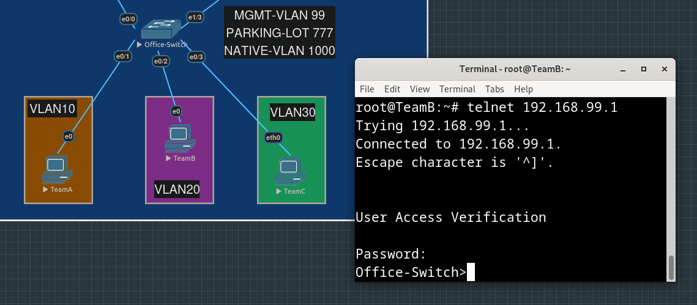
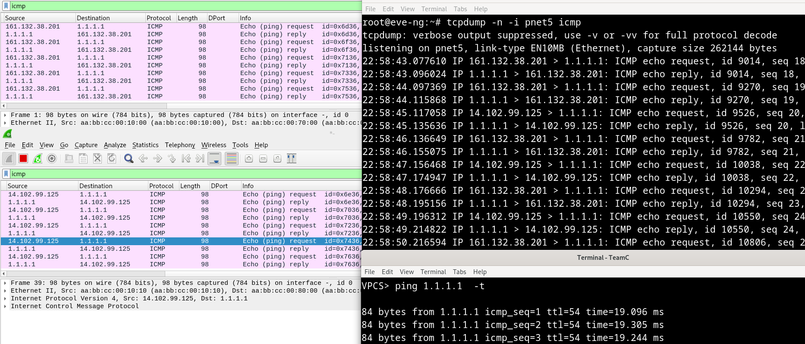

# Офис

- [Описание](#описание)
- [Конфигурирование Office-Switch](#конфигурирование-office-switch)
- [Конфигурирование Office-Router: Router-On-A-Stick](#конфигурирование-office-router-router-on-a-stick)
- [Конфигурирование Office-Router: DHCP relay-agent](#конфигурирование-office-router-dhcp-relay-agent)
- [Конфигурирование DHCP-сервера](#конфигурирование-dhcp-сервера)
- [Конфигурирование Office-Switch: использование Management-интерфейса](#конфигурирование-office-switch-использование-management-интерфейса)
- [Конфигурирование Office-Switch: DHCP snooping](#конфигурирование-office-switch-dhcp-snooping)
- [Конфигурирование Office-Router: внешние интерфейсы и маршрут по умолчанию](#конфигурирование-office-router-внешние-интерфейсы-и-маршрут-по-умолчанию)
- [Обеспечение доступа виртуалок из лабы во внешний мир](#обеспечение-доступа-виртуалок-из-лабы-во-внешний-мир)
- [Конфигурирование Office-Router: NAT](#конфигурирование-office-router-nat)
- [Таблица адресов, VLAN-ов и пулов](#таблица-адресов-vlan-ов-и-пулов)
- [Конфиги устройств](#конфиги-устройств)


## Описание

В офисном сегменте располагаются маршрутизатор, соединенный с двумя провайдерами, коммутатор, отдельный DHCP-сервер на ubuntu 22.04 и несколько пользовательских машин, принадлежащих разным командам, каждая команда находится в своем VLAN-е.

На каждый vlan на маршрутизаторе выделен subinterface - router-on-a-stick. Соответственно, интерфейс коммутатора, соединеняющий его с маршрутизатором, настроен как trunk.

Машины сотрудников офиса получают свои ip-адреса от DHCP-сервера, маршрутизатор выступает как relay-агент. Поскольку каждому VLAN-у соответствует своя подсеть, каждой будет выделен свой пул адресов, которые DHCP-сервер сможет назначать пользователям из каждого VLAN-а, в качестве default-gateway - адрес соответствующего subinterface-а "роутера-на-палочке".

На маршрутизаторе статически прописаны два маршрута по умолчанию, через обоих провайдеров.

Если dst - это адрес из приватной сети `192.168.0.0/16`, и при этом не нашлось более точного (longest prefix match) маршрута (что возможно, если адрес назначения принадлежит машине внутри офиса), то пакет с таким dst будет направлен в [один из туннелей](../office-to-dc/README.md##статические-маршруты-в-туннельные-интерфейсы) [DMVPN](../office-to-dc/README.md#dmvpn-адреса-туннельных-интерфейсов), который соединяет офис с дата-центром.

Внутри туннелей работает протокол динамической маршрутизации [EIGRP](../office-to-dc/README.md#dmvpn-динамическая-маршрутизация).

Трафик, идущий через туннели, зашифрован [IPsec](../office-to-dc/README.md#ipsec).

Если dst - это какой-то внешний адрес, а src - адрес из приватной сети, то src должен быть подменен (NAT с перегрузкой, src превратится в адрес исходящего интерфейса маршрутизатора, и исходящий порт будет подменен, чтобы отличать соединения с различными клиентами). С помощью route-map-ов добиваемся того, что внутренние адреса транслируются в оба внешних адреса, а не только в один из них.

## Конфигурирование Office-Switch

<details>
<summary> Несколько предварительных настроек для нашего дальшнейшего удобства: </summary>
```
Switch#conf t
Enter configuration commands, one per line.  End with CNTL/Z.
Switch(config)#hostname Office-Switch
Office-Switch(config)#no ip domain-lookup 
Office-Switch(config)#line console 0
Office-Switch(config-line)#exec-timeout 0 0
Office-Switch(config-line)#logging synchronous 
```
</details>

<details>
<summary> Создадим VLANы и присвоим им имена:</summary>
```
Office-Switch(config)#vlan 10
Office-Switch(config-vlan)#name TEAM-A
Office-Switch(config-vlan)#vlan 20
Office-Switch(config-vlan)#name TEAM-B
Office-Switch(config-vlan)#vlan 30
Office-Switch(config-vlan)#name TEAM-C
Office-Switch(config-vlan)#vlan 40
Office-Switch(config-vlan)#name SERVICES
Office-Switch(config-vlan)#vlan 99
Office-Switch(config-vlan)#name MGMT
Office-Switch(config-vlan)#vlan 777
Office-Switch(config-vlan)#name PARKING-LOT
Office-Switch(config-vlan)#vlan 1000
Office-Switch(config-vlan)#name NATIVE
```
</details>

<details>
<summary> Привяжем VLAN-ы к конкретным access-портам :</summary>
```
Office-Switch(config)#int e0/1
Office-Switch(config-if)#switchport mode access
Office-Switch(config-if)#switchport access vlan 10
Office-Switch(config-if)#int e0/2
Office-Switch(config-if)#switchport mode access   
Office-Switch(config-if)#switchport access vlan 20
Office-Switch(config-if)#int e0/3                 
Office-Switch(config-if)#switchport mode access   
Office-Switch(config-if)#switchport access vlan 30
Office-Switch(config-if)#int e1/3    
Office-Switch(config-if)#switchport mode access              
Office-Switch(config-if)#switchport access vlan 40
```
</details>

<details>
<summary> Создадим trunk-овый порт, перечислим разрешенные VLAN-ы и native VLAN:</summary>
```
Office-Switch(config-if)#int e0/0
Office-Switch(config-if)#switchport trunk encapsulation dot1q
Office-Switch(config-if)#switchport mode trunk
*Apr 16 12:50:07.547: %LINEPROTO-5-UPDOWN: Line protocol on Interface Ethernet0/0, changed state to down

*Apr 16 12:50:10.549: %LINEPROTO-5-UPDOWN: Line protocol on Interface Ethernet0/0, changed state to up

Office-Switch(config-if)#switchport trunk allowed vlan 10,20,30,40,99,1000
Office-Switch(config-if)#switchport trunk native vlan 1000
</details>

Поскольку мы явно задали режимы работы интерфейсов (access/trunk), мы НЕ выключем DTP (dynamic trunking protocol) на них явным образом через `switchport nonegotiate`.

<details>
<summary> Создадим Managment-интерфейс (SVI):</summary>

```
Office-Switch(config)#int vlan 99
Office-Switch(config-if)#ip a
*Apr 16 12:53:53.358: %LINEPROTO-5-UPDOWN: Line protocol on Interface Vlan99, changed state to down
Office-Switch(config-if)#ip addr 192.168.99.1 255.255.255.0
Office-Switch(config-if)#exit   
Office-Switch(config)#ip default-gateway 192.168.99.254
```

UPD (после шага с попытками зайти через telnet): снова прописали дефолтный маршрут явно - не могли достучаться до адреса снаружи (уже сталкивались с тем, что команды ip default-gateway не хватает) 

```
Office-Switch(config)#ip route 0.0.0.0 0.0.0.0 192.168.99.254
```
</details>

Прописали адрес SVI-интерфейса и default gateway руками, потому что нет уверенности, что коммутатор сможет их получить через DHCP.


<details>
<summary> Переместим неиспользуемые порты в специальный VLAN Parking Lot (он же "blackhole VLAN"):</summary>
```
Office-Switch(config)#int range e1/0-2   
Office-Switch(config-if-range)#switchport access vlan 777
Office-Switch(config-if-range)#shut
```
</details>


## Конфигурирование Office-Router: Router-On-A-Stick

<details>
<summary> Несколько предварительных настроек для нашего дальшнейшего удобства: </summary>

```
Router#conf t
Enter configuration commands, one per line.  End with CNTL/Z.
Router(config)#hostname Office-Router
Office-Router(config)#no ip domain-lookup
Office-Router(config)#line console 0
Office-Router(config-line)#logging synchronous 
Office-Router(config-line)#exec-timeout 0 0
```
</details>

<details>
<summary> Настройка subinterface-ов: </summary>

<details>
<summary> e0/2.10 VLAN10 TeamA </summary>

```
Office-Router(config)#int e0/2.10
Office-Router(config-subif)#encapsulation dot1Q 10
Office-Router(config-subif)#description VLAN10
Office-Router(config-subif)#ip addr 192.168.10.254 255.255.255.0 
Office-Router(config-subif)#no shut
```
</details>

<details>
<summary> e0/2.20 VLAN20 TeamB </summary>

```
Office-Router(config-subif)#int e0/2.20                         
Office-Router(config-subif)#encapsulation dot1Q 20              
Office-Router(config-subif)#description VLAN20                  
Office-Router(config-subif)#ip addr 192.168.20.254 255.255.255.0
Office-Router(config-subif)#no shut
```
</details>

<details>
<summary> e0/2.30 VLAN30 TeamC </summary>

```
Office-Router(config-subif)#int e0/2.30                         
Office-Router(config-subif)#description VLAN30                  
Office-Router(config-subif)#encapsulation dot1Q 30              
Office-Router(config-subif)#ip addr 192.168.30.254 255.255.255.0
Office-Router(config-subif)#no shut
```
</details>

<details>
<summary> e0/2.40 VLAN40 Services </summary>

```
Office-Router(config-subif)#int e0/2.40                         
Office-Router(config-subif)#description VLAN40                  
Office-Router(config-subif)#encapsulation dot1Q 40              
Office-Router(config-subif)#ip addr 192.168.40.254 255.255.255.0
Office-Router(config-subif)#no shut
```
</details>

<details>
<summary> e0/2.99 VLAN99 Management </summary>

```
Office-Router(config-subif)#int e0/2.99                         
Office-Router(config-subif)#description VLAN99                  
Office-Router(config-subif)#encapsulation dot1Q 99              
Office-Router(config-subif)#ip addr 192.168.99.254 255.255.255.0
Office-Router(config-subif)#no shut
```
</details>

<details>
<summary> e0/2.1000 VLAN1000 Native </summary>

```
Office-Router(config-subif)#int e0/2.1000
Office-Router(config-subif)#encapsulation dot1Q 1000 native 
Office-Router(config-subif)#description Native VLAN1000
Office-Router(config-subif)#no shut
Office-Router(config-subif)#exit
```
</details>

</details>

<details>
<summary> Поднимаем интерфейс в сторону коммутатора:</summary>

```
Office-Router(config)#int e0/2 
Office-Router(config-if)#no shut
Office-Router(config-if)#
*Apr 16 13:27:05.761: %LINK-3-UPDOWN: Interface Ethernet0/2, changed state to up
*Apr 16 13:27:06.762: %LINEPROTO-5-UPDOWN: Line protocol on Interface Ethernet0/2, changed state to up
Office-Router(config-if)#
```
</details>

## Конфигурирование Office-Router: DHCP relay-agent

Поскольку маршрутизатор будет получать DHCP-запросы на subinterface-ах в каждом VLAN-е, в которых находятся машины пользователей, а DHCP-сервер расположен не на самом маршрутизаторе, то он должен уметь прокидывать эти запросы из интерфейса в интерфейс.

<details>
<summary> Прописываем helper-address на всех subinterface-ах: </summary>

```
Office-Router(config)#int e0/2.10
Office-Router(config-subif)#ip helper-address 192.168.40.1
Office-Router(config-subif)#int e0/2.20
Office-Router(config-subif)#ip helper-address 192.168.40.1
Office-Router(config-subif)#int e0/2.30                   
Office-Router(config-subif)#ip helper-address 192.168.40.1
Office-Router(config-subif)#int e0/2.99
Office-Router(config-subif)#ip helper-address 192.168.40.1
```
</details>

## Конфигурирование DHCP-сервера

Поменяли имя сервера в `/etc/hostname` на Office-DHCP-Server.

Прописываем ip-адрес и маршруты:

<details>
<summary> Содержимое /etc/netplan/00-config-with-no-name.yaml: </summary>

```
network:
  ethernets:
    ens3:
      addresses:
        - 192.168.40.1/24
      routes:
        - to: 192.168.40.0/24
          via: 192.168.40.1
        - to: default
          via: 192.168.40.254
  version: 2
```
</details>


<details>
<summary> Применение конфига netplan: </summary>

```
root@Office-DHCP-server:~# vim /etc/netplan/00-config-with-no-name.yaml 
root@Office-DHCP-server:~# netplan try
Do you want to keep these settings?

Press ENTER before the timeout to accept the new configuration

Changes will revert in 119 seconds
Configuration accepted.
root@Office-DHCP-server:~# 
```
</details>

Убеждаемся, что можем достучаться до subinterface-а маршрутизатора, принадлежащего другому VLAN-у:


<details>
<summary> Забэкапим исходный конфиг:</summary> 

```
root@Office-DHCP-server:~# cp /etc/dhcp/dhcpd.conf /etc/dhcp/dhcpd.conf.bkp
```
</details>

<details>
<summary>Настроим конфиг DHCP-сервера:</summary> 

```
root@Office-DHCP-server:~# vim /etc/dhcp/dhcpd.conf
# dhcpd.conf

# option definitions common to all supported networks...
option domain-name-servers 8.8.8.8;

default-lease-time 600;
max-lease-time 7200;

# VLAN 10 Team A
subnet 192.168.10.0 netmask 255.255.255.0 {
  range 192.168.10.100 192.168.10.150;
  option routers 192.168.10.254;
}

# VLAN 20 Team B
subnet 192.168.20.0 netmask 255.255.255.0 {
  range 192.168.20.100 192.168.20.150;
  option routers 192.168.20.254;
}

# VLAN 30 Team C
subnet 192.168.30.0 netmask 255.255.255.0 {
  range 192.168.30.100 192.168.30.150;
  option routers 192.168.30.254;
}

# VLAN 40 Services - MANUALLY configured
subnet 192.168.40.0 netmask 255.255.255.0 {
}

# VLAN 99 Management - MANUALLY configured
subnet 192.168.99.0 netmask 255.255.255.0 {
}

# original config leftovers...
# The ddns-updates-style parameter controls whether or not the server will
# attempt to do a DNS update when a lease is confirmed. We default to the
# behavior of the version 2 packages ('none', since DHCP v2 didn't
# have support for DDNS.)
ddns-update-style none;
```
</details>

<details>
<summary>Перезапустим службу DHCP-сервера:</summary>

```
root@Office-DHCP-server:~# systemctl restart isc-dhcp-server
```
</details>

Проверяем работу DHCP сервера и заодно маршрутизацию между хостами, расположенными в разных VLAN-ах:


<details>
<summary>
На машине TeamA (linux) тоже можем убедиться, что адреса был получен от DHCP-сервера:</summary>

```
root@TeamA:~# journalctl -efu systemd-networkd

Apr 16 15:03:22 TeamA systemd[1]: Starting Network Configuration...
Apr 16 15:03:22 TeamA systemd-networkd[583]: lo: Link UP
Apr 16 15:03:22 TeamA systemd-networkd[583]: lo: Gained carrier
Apr 16 15:03:22 TeamA systemd-networkd[583]: Enumeration completed
Apr 16 15:03:22 TeamA systemd[1]: Started Network Configuration.
Apr 16 15:03:22 TeamA systemd-networkd[583]: ens3: Link UP
Apr 16 15:03:22 TeamA systemd-networkd[583]: ens3: Gained carrier
Apr 16 15:03:22 TeamA systemd-networkd[583]: ens3: DHCPv4 address 192.168.10.100/24 via 192.168.10.254
```
</details>

<details>
<summary>
На машине TeamB (linux) запросили явно с помощью dhclient, нам выдали второй адрес (видим запись в /var/lib/dhcp/dhcpd.leases):</summary>


</details>


## Конфигурирование Office-Switch: использование Management-интерфейса

<details>
<summary>
Зададим на коммутаторе пароль на VTY линиях и попробуем зайти туда через telnet с пользовательской машины:</summary>

```
Office-Switch(config)#line vty 0 4
Office-Switch(config-line)#password Test123
Office-Switch(config-line)#login
Office-Switch(config-line)#exit
Office-Switch(config)#service password-encryption
Office-Switch(config)#int vlan 99 
Office-Switch(config-if)#no shut 
Office-Switch(config-if)#exit
Office-Switch(config)#e
*Apr 16 15:30:55.191: %LINK-3-UPDOWN: Interface Vlan99, changed state to up
*Apr 16 15:30:56.195: %LINEPROTO-5-UPDOWN: Line protocol on Interface Vlan99, changed state to up
Office-Switch(config)#exit
```

</details>



## Конфигурирование Office-Switch: DHCP snooping

Мы можем явно указать, за каким портом находится DHCP-сервер, чтобы никто другой не смог выдать себя за него.

<details>
<summary>
Включаем dhcp snooping и помечаем порты, на которые могут приходить DHCP offer-ы и acknowledge-ы:</summary>

```
Office-Switch(config)#ip dhcp snooping 
Office-Switch(config)#int e1/3
Office-Switch(config-if)#ip dhcp snooping trust
Office-Switch(config)#int e0/0
Office-Switch(config-if)#ip dhcp snooping trust
```
</details>

<details>
<summary>
Укажем VLAN-ы, на которых должен работать dhcp snooping:</summary>

```
Office-Switch(config)#ip dhcp snooping vlan 10,20,30,40,99,1000
```
</details>

Есть подозрение, что после включения `dhcp snooping` коммутатор стал отбрасывать все сообщения с 82ой опцией - при явном запрашивании очередного адреса TeamB так и не дожидается его получения:  


<details>
<summary>
Заставим коммутатор не реагировать на наличие 82ой опции:</summary>

```
Office-Switch(config)#no ip dhcp snooping information option
```
</details>

<details>
<summary>
Установим лимит на количество DHCP сообщений в секунду:</summary>

```
Office-Switch(config)#int range e0/1-3 
Office-Switch(config-if-range)#ip dhcp snooping limit rate 2
```
</details>

Опытным путем убедились, что `limit rate 1` - слишком мало, все пользовательские порты перешли в состояние err-disabled:


<details>
<summary>
Разрешим портам восстанавливаться при такой причине переключения в err-disabled:</summary>

```
Office-Switch(config)#errdisable recovery cause dhcp-rate-limit
Office-Switch(config)#errdisable recovery interval 30
```
</details>

<details>
<summary>
А пока, в первый раз, нам придется вручную выключить-включить задизейбленные порты:</summary>

```
Office-Switch(config)#int range e0/1-3
Office-Switch(config-if-range)#shut
Office-Switch(config-if-range)#no shut
```
</details>


## Конфигурирование Office-Router: внешние интерфейсы и маршрут по умолчанию

Пришло время задать адреса для внешних интерфейсов маршрутизатора, смотрящих в сторону провайдеров.


<details>
<summary>
Пропишем маршруты по умолчанию через оба внешних интерфейса:</summary>

```
Office-Router(config)#ip route 0.0.0.0 0.0.0.0 161.132.38.202
Office-Router(config)#ip route 0.0.0.0 0.0.0.0 14.102.99.126
```
</details>

## Обеспечение доступа виртуалок из лабы во внешний мир

\*** (я не уверен, что этот раздел стоило добавлять, будто бы, то, что происходит за пределами офисного и внешних ДЦ-маршрутизаторов, не должно нас волновать)

Хронологически нижеприведенные действия выполнялись параллельно с настройкой DHCP-сервера, как раз чтобы тот мог достучаться до репозиториев ubuntu и сделать `apt install isc-dhcp-server` (впрочем, для этого понадобилось еще и прописать адрес DNS-сервера в конфиге `/etc/systemd/resolved.conf` и перезапустить службу `systemctl restart systemd-resolved.service`).

<details>
<summary>
Соединили провайдеров с объектом Network - Cloud 5, который соответствует интерфейсу pnet5 гипервизора eve, который нам предварительно пришлось создать:</summary>

```
root@eve-ng:~# ip link add pnet5 type bridge
```
</details>

Я не уверен, что "гипервизор eve" - корректный термин, на всякий случай поясню, что имеется в виду машина, на которой собственно и развернута лаба с нашими виртуальными маршрутизаторами/коммутаторами/серверами.

<details>
<summary>
В /etc/network/interfaces на гипервизоре eve указали bridge_ports eth0:</summary>

```
iface eth5 inet manual
auto pnet5
iface pnet5 inet manual
    bridge_ports eth0
    bridge_ports none
    bridge_stp off
```
</details>


<details>
<summary>
Прописали адрес на нашем "промежуточном" интерфейсе:</summary>

```
root@eve-ng:~# ip addr add 10.0.0.5/24 dev pnet5
```
</details>


<details>
<summary>
И рестартанули интерфейс: </summary>

```
root@eve-ng:~# ip link set up pnet5
```
</details>


<details>
<summary>
Чтобы линуксовая машина (которой является наш гипервизор eve) могла перекладывать пакеты из интерфейса в интерфейс, выставим соответствующую опцию ядра:</summary>

```
root@eve-ng:~# sysctl net.ipv4.ip_forward=1
net.ipv4.ip_forward = 1
```
</details>

<details>
<summary>
Чтобы опция переживала ребут, добавим ее в новый конфиг для sysctl:</summary>

```
root@eve-ng:~# grep -r ip_forward /etc/sysctl.d/
/etc/sysctl.d/12-stuff.conf:net.ipv4.ip_forward=1
```
</details>

<details>
<summary>
Добавили маршруты до провайдеров (наши внутренние адреса):</summary>

```
root@eve-ng:~# ip route add 161.132.38.200/30 via 10.0.0.1
root@eve-ng:~# ip route add 14.102.99.124/30 via 10.0.0.2
```
</details>

<details>

<summary>
На провайдерских маршрутизаторах, естественно, маршруты по умолчанию направляются через Cloud 5 (он же pnet5 интерфейс гипервизора eve):</summary>

```
ISP1(config)#ip route 0.0.0.0 0.0.0.0 10.0.0.5
```
```
ISP2(config)#ip route 0.0.0.0 0.0.0.0 10.0.0.5
```
</details>

<details>
<summary>
В iptables в таблицу nat, цепочку POSTROUTING добавляем правила, по которым наши внутренние "лабораторные" адреса будут подменяться:</summary>

```
root@eve-ng:~# iptables -t nat -A POSTROUTING -s 161.132.38.200/30 -j SNAT --to-source X.X.X.X
root@eve-ng:~# iptables -t nat -A POSTROUTING -s 14.102.99.124/30 -j SNAT --to-source X.X.X.X
```
</details>

<details>
<summary>
Сохраняем правила через netfilter-save, чтобы они  пережили перезагруку:</summary>

```
root@eve-ng:~# netfilter-persistent save
```
</details>

<details>
<summary>
Пример промежуточных проверок доступа лабораторных виртуалок во внешний мир (на ранних этапах выполнения работы):</summary>


</details>

## Конфигурирование Office-Router: NAT

При выполнении проектной работы на предыдущем курсе мы столкнулись со следующей проблемой - несмотря на то, что оба дефолтных маршрута на офисном маршрутизаторе равнозначны (ECMP), и оба внешних интерфейса являются исходящими для трансляции, всегда выбирался только один и тот же адрес, хотя access-листы для обоих интерфейсов были идентичными.


Сначала настроим NAT на обоих интерфейсах без route-map-ов и убедимся, что проблема есть.

<details>
<summary>Конфигурируем ACL, куда будут входить все внутренние адреса, которые мы хотим транслировать во внешние при выходе из офиса:</summary>

```
Office-Router(config)#ip access-list standard INTERNAL_IPS_TO_BE_TRANSLATED
Office-Router(config-std-nacl)#permit 192.168.0.0 0.0.255.255 
```
</details>


<details>
<summary>
Привязываем ACL к адресам интерфейсов, в которые будем транслировать внутренние адреса:</summary>

```
Office-Router(config)#$ip nat inside source list INTERNAL_IPS_TO_BE_TRANSLATED interface e0/0 overload
Office-Router(config)#$ip nat inside source list INTERNAL_IPS_TO_BE_TRANSLATED interface e0/1 overload
```
</details>


<details>
<summary>
Указываем на самих интерфейсах, являются ли они входящими/исходящими для трансляции (к сожалению, int range не работает для subinterface-ов):</summary>

```
Office-Router(config)#int range e0/2.10   
Office-Router(config-if-range)#ip nat inside
Office-Router(config-if-range)#int range e0/2.20
Office-Router(config-if-range)#ip nat inside    
Office-Router(config-if-range)#int range e0/2.30
Office-Router(config-if-range)#ip nat inside
Office-Router(config-if-range)#int range e0/2.40
Office-Router(config-if-range)#ip nat inside
Office-Router(config-if-range)#int range e0/2.99
Office-Router(config-if-range)#ip nat inside
```

```
Office-Router(config-if)#int range e0/0-1
Office-Router(config-if-range)#ip nat outside
```
</details>


Теперь попингуем какой-нибудь внешний адрес, и прицепимся tcpdump-ом на "промежуточном" интерфейсе гипервизора eve, чтобы увидеть, в какой внешний адрес транслировался внутренний офисный адрес:


Как видим, во всех пакетах src-адрес заменился на один и тот же `161.132.38.201`

<details>
<summary>
Специально отключили CEF на офисном маршрутизаторе (на случай, если все последующие пакеты с той же комбинацией src-dst будут направляться через один и тот же интерфейс, несмотря на равнозначность маршрутов) и временно исключили интерфейс e0/2.30 192.168.30.254/24 из входящих для трансляции:</summary>

```
Office-Router(config)#no ip cef
Office-Router(config)#int e0/2.30     
Office-Router(config-subif)#no ip nat inside
```

</details>

Ловим трафик на обоих провайдерских маршрутизаторах (замечаем, что реквесты балансируются, а респонсы идут всегда через одного и того же провайдера):


Возвращаем интерфейс в трансляцию, CEF остался выключенным.


Т.е. трафик идет все-таки через оба интерфейса, но транслируемый адрес всегда один и тот же (даже если идем через второго провайдера, src адрес будет подставляться с интерфейса, соединяющего офисный маршрутизатор с первым провайдером). Этот пример также демонстрирует, что сначала происходит выбор nexthop-а, а уже потом трансляция src-адреса.

Очевидно, проблема существует. Попробуем решить ее с помощью route-map.

<details>
<summary>
Удалим привязки access-листов к интерфейсам для NAT-ирования с перегрузкой (применилась всего одна - вот зачем мы дублировали ACL-и в предыдущей работе):</summary>

```
Office-Router(config)#no ip nat inside source list INTERNAL_IPS_TO_BE_TRANSLATED interface Ethernet0/0 overload

Dynamic mapping in use, do you want to delete all entries? [no]: yes
Office-Router(config)#
```
</details>


<details>
<summary>
Создадим route-map-ы для обоих интерфейсов, смотрящих на каждого из обоих провайдеров, и привяжем из ОДНОВРЕМЕННО и к исходящему интерфейсу, и к списку ACL:</summary>

```
Office-Router(config)#route-map NAT-FOR-ISP1 permit
Office-Router(config-route-map)#match ip address INTERNAL_IPS_TO_BE_TRANSLATED
Office-Router(config-route-map)#match interface e0/0
```

```
Office-Router(config-route-map)#route-map NAT-FOR-ISP2 permit
Office-Router(config-route-map)#match ip address INTERNAL_IPS_TO_BE_TRANSLATED
Office-Router(config-route-map)#match interface e0/1
```
</details>

<details>
<summary>
Осталось сделать привязку полученных route-map к трансляциям NAT overload:</summary>

```
Office-Router(config)#ip nat inside source route-map NAT-FOR-ISP1 interface e0/0 overload
Office-Router(config)#$ip nat inside source route-map NAT-FOR-ISP2 interface e0/1 overload
```
</details>

Теперь видим, что подмененные исходящие адреса в пакетах, отправляемых за пределы офиса, чередуются, при этом ответы возвращаются через тот же интерфейс, с которого был отправлен запрос:




## Таблица адресов, VLAN-ов и пулов

| VLAN | Name        | DHCP-pool                       | IP-address   | Default Gateway   |
| :----| :---------- | :------------------------------ | :----------- | :---------------- |
| 10   | Team A      | 192.168.10.100 - 192.168.10.150 | -            | 192.168.10.254/24 |
| 20   | Team B      | 192.168.20.100 - 192.168.20.150 | -            | 192.168.20.254/24 | 
| 30   | Team C      | 192.168.30.100 - 192.168.30.150 | -            | 192.168.30.254/24 |
| 40   | Services    | -                               | 192.168.40.1 | 192.168.40.254/24 |
| 99   | Management  | -                               | 192.168.99.1 | 192.168.99.254/24 |
| 777  | Parking_lot | -                               | -            | -                 |
| 1000 | Native      | -                               | -            | -                 |

## Конфиги устройств

[Office-Switch.conf](./configs/Office-Switch.conf)

Конфиг маршрутизатора представлен на момент до того, как было реализовано туннельное взаимодействие с Дата-Центром:

[Office-Router.conf](./configs/Office-Router.conf)
