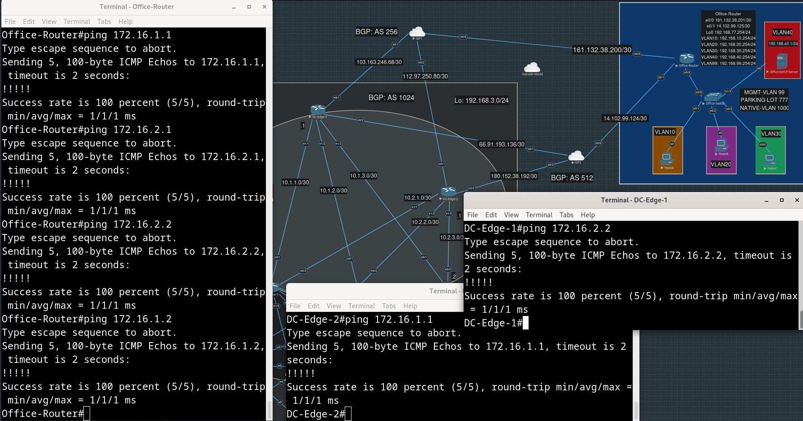

# Туннели между Офисом и Дата-Центром

- [Описание](#описание)
- [DMVPN: адреса туннельных интерфейсов](#dmvpn-адреса-туннельных-интерфейсов)
- [Маршрутизация в туннельные интерфейсы](#маршрутизация-в-туннельные-интерфейсы)
- [IPsec](#ipsec)
- [Фильтрация исходящего трафика на граничных маршрутизаторах с помощью ACL](#фильтрация-исходящего-трафика-на-граничных-маршрутизаторах-с-помощью-acl)
- [Анонс внешнего сервиса](#анонс-внешнего-сервиса)
- [Чистка маршрутов до приватных адресов на промежуточных устройствах](#чистка-маршрутов-до-приватных-адресов-на-промежуточных-устройствах)
- [Конфиги устройств](#конфиги-устройств)


## Описание

Мы хотим, чтобы к машинам, живущим внутри ДЦ, был доступ из офиса по их приватному адресу, как если бы  офис и ДЦ были соединены напрямую и находились в сети `192.168.0.0/16`. Поскольку это не так, нам предстоит настроить DMVPN на граничных маршрутизаторах обоих локаций. Чтобы трафик от Spoke-а к Spoke-у мог ходить напрямую, а не через Hub, настроим EIGRP. Чтобы зашифровать внутренности пакетов, проходящих через построенные GRE-туннели, настроим IPsec.

Вернем [ранее временно отключенное NAT-ирование](../dc-services/README.md#подготовительные-действия) приватных адресов на границе ДЦ и настроим ACL для фильтрации исходящего из ДЦ трафика с src адресами из приватных префиксов `10.0.0.0/8` и `192.168.3.0/24`. При этом в туннельные интерфейсы должны попадать пакеты с src из `192.168.3.0/24` и дропаться с src из `10.0.0.0/8`.

Чтобы продолжать иметь возможность попадать на сервер zabbix-а после того, как на провайдерских маршрутизаторах пропадут наши "читерские" маршруты до `192.168.3.0/24`, в BGP будем анонсировать белый адрес, который будет маршрутизироваться на правильный хост внутри ДЦ.

Наконец, избавимся от [множества](../dc-internal/README.md#leaf-1-2) [лишних](../dc-internal/README.md#leaf-2-1) [правил](../dc-internal/README.md#leaf-2-2) iptables на гипервизоре eve и [статических](../dc-internal/README.md#leaf-3-1) [маршрутов](../dc-internal/README.md#leaf-1-2) на провайдеских маршрутизаторах, которые мы добавляли на ранних этапах для удобства тестирования.

## DMVPN: адреса туннельных интерфейсов

На каждом из устройств, смотрящем во внешний мир, есть по два внешних интерфейса. Настроим на каждом из них свой инстанс DMVPN с уникальным для него network-id (для удобства, 1 - через ISP1, 2 - через ISP2). Адреса внутри туннелей будут назначаться из префикса `172.16.1.0/24` для первой сети, `172.16.2.0/24` для второй. Число в четвертом октете будет соответствовать номеру DC-Edge, в случае офисного маршрутизатора - будет брать равным 3. Каждый из DC-Edge-ей будет Hub-ом в одном из инстансов DMVPN-а - в сети, с совпадющим числом в третьем октете с номером DC-Edge.

<details>
<summary>
Настроим Hub на DC-Edge-1 для network-id 1 (исходящий адрес 103.163.246.69):</summary>

```
DC-Edge-1(config)#int tun 1
DC-Edge-1(config-if)#
*Apr 22 03:13:50.342: %LINEPROTO-5-UPDOWN: Line protocol on Interface Tunnel1, changed state to down
DC-Edge-1(config-if)#
DC-Edge-1(config-if)#tunnel mode gre multipoint
DC-Edge-1(config-if)#ip nhrp network-id 1
DC-Edge-1(config-if)#tunnel source 103.163.246.69
DC-Edge-1(config-if)#
*Apr 22 03:14:27.480: %LINEPROTO-5-UPDOWN: Line protocol on Interface Tunnel1, changed state to up
DC-Edge-1(config-if)#
DC-Edge-1(config-if)#ip nhrp map multicast dynamic
DC-Edge-1(config-if)#ip addr 172.16.1.1 255.255.255.0
```
</details>


<details>
<summary>
Настроим Hub на DC-Edge-2 для network-id 2 через ISP2 (исходящий адрес 180.152.38.193):</summary>

```
DC-Edge-2(config)#int tun 2
*Apr 22 03:02:53.078: %LINEPROTO-5-UPDOWN: Line protocol on Interface Tunnel2, changed state to down
DC-Edge-2(config-if)#
DC-Edge-2(config-if)#tunnel mode gre multipoint
DC-Edge-2(config-if)#ip nhrp network-id 2      
DC-Edge-2(config-if)#tunnel source 180.152.38.193 
DC-Edge-2(config-if)#
*Apr 22 03:03:38.810: %LINEPROTO-5-UPDOWN: Line protocol on Interface Tunnel2, changed state to up
DC-Edge-2(config-if)#
DC-Edge-2(config-if)#ip nhrp map multicast dynamic 
DC-Edge-2(config-if)#ip addr 172.16.2.2 255.255.255.0
```
</details>


<details>
<summary>
Настроим Spoke на DC-Edge-1 для network-id 2 (исходящий адрес 66.91.193.137):</summary>

```
DC-Edge-1(config)#int tun 2
DC-Edge-1(config-if)#
*Apr 22 03:18:28.392: %LINEPROTO-5-UPDOWN: Line protocol on Interface Tunnel2, changed state to down
DC-Edge-1(config-if)#tunnel mode gre multipoint
DC-Edge-1(config-if)#ip nhrp network-id 2            
DC-Edge-1(config-if)#tunnel source 66.91.193.137     
DC-Edge-1(config-if)#
*Apr 22 03:18:49.193: %LINEPROTO-5-UPDOWN: Line protocol on Interface Tunnel2, changed state to up
DC-Edge-1(config-if)#ip address 172.16.1.1 255.255.255.0
```

Указываем адрес Hub-а в network 2 и адрес интерфейса вне туннеля:

```
DC-Edge-1(config-if)#ip nhrp map 172.16.2.2 180.152.38.193
DC-Edge-1(config-if)#ip nhrp nhs 172.16.2.2
```
</details>

<details>
<summary>
Настроим Spoke на DC-Edge-2 для network-id 1 (исходящий адрес 112.97.250.81):</summary>
```
DC-Edge-2(config)#int tun 1
DC-Edge-2(config-if)#
*Apr 22 03:23:11.757: %LINEPROTO-5-UPDOWN: Line protocol on Interface Tunnel1, changed state to down
DC-Edge-2(config-if)#tunnel mode gre multipoint
DC-Edge-2(config-if)#ip nhrp network-id 1
DC-Edge-2(config-if)#tunnel source 112.97.250.81
DC-Edge-2(config-if)#
*Apr 22 03:23:55.067: %LINEPROTO-5-UPDOWN: Line protocol on Interface Tunnel1, changed state to up
DC-Edge-2(config-if)#ip addr 172.16.1.2 255.255.255.0
```
Указываем адрес Hub-а в network 1 и адрес интерфейса вне туннеля:
```
DC-Edge-2(config-if)#ip nhrp map 172.16.1.1 103.163.246.69
DC-Edge-2(config-if)#ip nhrp nhs 172.16.1.1
```
</details>

<details>
<summary>
Настроим Spoke на Office-Router: для network-id 1 (исходящий адрес 161.132.38.201):</summary>

```
Office-Router(config)#int tun 1
Office-Router(config-if)#
*Apr 22 03:42:16.525: %LINEPROTO-5-UPDOWN: Line protocol on Interface Tunnel1, changed state to down
Office-Router(config-if)#tunnel mode gre multipoint
Office-Router(config-if)#ip nhrp network-id 1
Office-Router(config-if)#tunnel source e0/0
Office-Router(config-if)#
*Apr 22 03:43:02.077: %LINEPROTO-5-UPDOWN: Line protocol on Interface Tunnel1, changed state to up
Office-Router(config-if)#
Office-Router(config-if)#ip nhrp map 172.16.1.1 103.163.246.69
Office-Router(config-if)#ip nhrp nhs 172.16.1.1
Office-Router(config-if)#ip addr 172.16.1.3 255.255.255.0
```
</details>

<details>
<summary>
Настроим Spoke на Office-Router: для network-id 2 (исходящий адрес 14.102.99.125):</summary>

```
Office-Router(config)#int tun 2
Office-Router(config-if)#
*Apr 22 03:44:19.412: %LINEPROTO-5-UPDOWN: Line protocol on Interface Tunnel2, changed state to down
Office-Router(config-if)#tunnel mode gre multipoint
Office-Router(config-if)#ip nhrp network-id 2
Office-Router(config-if)#tunnel source e0/1
Office-Router(config-if)#
*Apr 22 03:44:36.757: %LINEPROTO-5-UPDOWN: Line protocol on Interface Tunnel2, changed state to up
Office-Router(config-if)#ip nhrp map 172.16.2.2 180.152.38.193
Office-Router(config-if)#ip nhrp nhs 172.16.2.2
Office-Router(config-if)#ip addr 172.16.2.3 255.255.255.0
```
</details>

Кажется, на провайдерских роутерах не хватало "крест-накрест" маршрутов, например, ISP1 ничего не знает про адрес e0/2 DC-Edge-2, который смотрит на ISP2, и про адрес e0/2 Office-Router.

Чтобы убедиться в этом, оторвали линки в Outside-World, очевидно, иногда на наши пинги отвечали реальные хосты xD.


<details>
<summary>
Делаем redistribute connected на обоих провайдерских маршрутизаторах:</summary>

```
ISP1(config)#router bgp 256
ISP1(config-router)#redistribute connected 
ISP1(config-router)#exit
ISP1(config)#exit
ISP1#wr
Building configuration...
[OK]
ISP1#
*Apr 22 07:59:13.006: %SYS-5-CONFIG_I: Configured from console by console
ISP1#clear ip bgp *
```

```
ISP2(config)#router bgp 512
ISP2(config-router)#redistribute connected 
ISP2(config-router)#exit
ISP2(config)#exit
ISP2#wr
Building configuration...
[OK]
ISP2#
*Apr 22 08:00:02.835: %SYS-5-CONFIG_I: Configured from console by console
ISP2#clear ip bgp *
```
</details>




## Маршрутизация в туннельные интерфейсы

Теперь нам нужно добиться того, чтобы пакет с dst из префикса `192.168.0.0/16`, попавший на граничный маршрутизатор, был направлен в туннель, если для него не нашело более точного маршрута с более узким префиксом (на офисном маршрутизаторе, например, таких маршрутов много).

Чтобы не прописывать статические маршруты, можно поднять на туннельных интерфейсах протокол динамической маршрутизации, и направить в него маршруты с адресами loopback/dummy интерфейсов.

Будем использовать EIGRP.

<details>
<summary>
На Office-Router:</summary>

```
Office-Router(config)#router eigrp 192
Office-Router(config-router)#network 192.168.0.0 0.0.255.255
Office-Router(config-router)#network 172.16.0.0 0.0.255.255
```
</details>

<details>
<summary>
На DC-Edge-1:</summary>

```
DC-Edge-1(config)#router eigrp 192
DC-Edge-1(config-router)#network 192.168.0.0 0.0.255.255
DC-Edge-1(config-router)#network 172.16.0.0 0.0.255.255
```
</details>

<details>
<summary>
На DC-Edge-2:</summary>

```
DC-Edge-2(config)#router eigrp 192
DC-Edge-2(config-router)#network 192.168.0.0 0.0.255.255
DC-Edge-2(config-router)#network 172.16.0.0 0.0.255.255
```
</details>

Снова забыли добавить `ip nhrp map multicast <hub ip>`

<details>
<summary>
Сделаем это:</summary>

```
Office-Router(config)#int tun 1
Office-Router(config-if)#ip nhrp map multicast 103.163.246.69
Office-Router(config-if)#int tun 2
Office-Router(config-if)#ip nhrp map multicast 180.152.38.193 
```

```
DC-Edge-2(config)#int tun 1
DC-Edge-2(config-if)#ip nhrp map multicast 103.163.246.69
```

```
DC-Edge-1(config)#int tun 2
DC-Edge-1(config-if)#ip nhrp map multicast 180.152.38.193
```
</details>

На офисном маршрутизаторе появились маршруты только до loopback-ов самих DC-Edge-ей. Нам нужно редистрибутить из OSPF в EIGRP все, что знаем. При этом офисный маршрутизатор добавил в EIGRP все свои connected-сети - мы взяли достаточно широкую маску.

<details>
<summary>
Добавляем редистрибуцию из OSPF в EIGRP, нужно указывать всю комбинацию параметров bandwidth, delay, reliability, load, MTU:</summary>

```
DC-Edge-1(config)#router eigrp 192                     
DC-Edge-1(config-router)#redistribute ospf 1 metric 1500 10 255 1 1500
```

```
DC-Edge-2(config)#router eigrp 192
DC-Edge-2(config-router)#redistribute ospf 1 metric 1500 10 255 1 1500
```
</details>

Пропинговать из офиса машины в ДЦ не получается.
Похоже, что выбирается адрес одного внешнего интерфейса, в то время как сам пакет направляется через другой (такое уже видели раньше с NAT-ом без route-map-ов):

##### проблема с NAT-ом


<details>
<summary>
Но похоже часть проблемы все-таки заключалась (опять!) в недостающих маршрутах (TODO: не должно быть этих костыльных статических маршрутов! А с другой стороны, мы сами ранее запретили ДЦ прокидывать по BGP маршруты с непустыми AS-PATH):</summary>

```
ISP1(config)#ip route 180.152.38.192 255.255.255.252 112.97.250.81
ISP1(config)#ip route 66.91.193.136 255.255.255.252 103.163.246.69

```

```
ISP2(config)#ip route 103.162.246.68 255.255.255.252 66.91.193.137
ISP2(config)#ip route 112.97.250.80 255.255.255.252 180.152.38.191
```
</details>

<details>
<summary>
Удалили странные маршруты с ISP1 (искали причину проблемы дропов половины пингов из офиса в ДЦ (именно по ветке через ISP1) методом построчного диффа конфигов):</summary>

```
ISP1(config)#no ip route 66.91.193.136 255.255.255.252 103.163.246.69
ISP1(config)#no ip route 192.168.0.0 255.255.0.0 161.132.38.201
```
</details>


<details>
<summary>
Добавили маршрут на ISP2 (путем перебирания всего, через что ходят пакеты между офисом и ДЦ поняли, что именно этой связки не хватает):</summary>

```
ISP2(config)#ip route 103.163.246.68 255.255.255.252 66.91.193.137
```
</details>


Это было ужасно. Наверное, стоило добавить стык между маршрутизаторами провайдеров, чтобы они динамически обменивались своими маршрутами.

Демонстрация того, что туннели работают, пингуем все подряд loopback-интерфейсы машин ДЦ из офиса:


Вернем коннекты ко внешнему миру и убедимся, что то, что не туннелируется, то NAT-ируется:

Из офиса:


Из ДЦ:


И самое интересное - проверяем, что можем из офиса достучаться до виртуального IP сервиса и получить от него эхо своего сообщения:


## IPsec

Теперь зашифруем все, что туннелируется с помощью IPsec.

Будем настраивать IKEv2. Пришлось взять `match identity remote address 0.0.0.0`, добавление отдельно адресов `172.16.1.0 255.255.255.0` и мультикастового `224.0.0.10 255.255.255.255` не помогло установить соседство EIGRP.

Для сети `172.16.1.0/24`

<details>
<summary>
DC-Edge-1:</summary>

IKEV2-профиль:
```
DC-Edge-1(config)#crypto ikev2 profile DMVPN-1-IKEV2-PROFILE
IKEv2 profile MUST have:
   1. A local and a remote authentication method.
   2. A match identity or a match certificate or match any statement.
DC-Edge-1(config-ikev2-profile)#match identity remote address 0.0.0.0
DC-Edge-1(config-ikev2-profile)#authentication remote pre-share key password-through-1
DC-Edge-1(config-ikev2-profile)#authentication local pre-share key password-through-1
```

Трансформ-сет:
```
DC-Edge-1(config)#crypto ipsec transform-set DMVPN-1-TRANSFORM-SET esp-aes 256 esp-sha256-hmac
DC-Edge-1(cfg-crypto-trans)#mode transport 
```

Профиль IPsec:
```
DC-Edge-1(config)#crypto ipsec profile DMVPN-1-IPSEC-PROFILE
DC-Edge-1(ipsec-profile)#set ikev2-profile DMVPN-1-IKEV2-PROFILE
DC-Edge-1(ipsec-profile)#set transform-set DMVPN-1-TRANSFORM-SET
```

Привязываем IPsec-профиль к туннельному интерфейсу:
```
DC-Edge-1(config)#int tun 1
DC-Edge-1(config-if)#tunnel protection ipsec profile DMVPN-1-IPSEC-PROFILE
```
</details>

<details>
<summary>
DC-Edge-2:</summary>

IKEV2-профиль:
```
DC-Edge-2(config)#crypto ikev2 profile DMVPN-1-IKEV2-PROFILE
IKEv2 profile MUST have:
   1. A local and a remote authentication method.
   2. A match identity or a match certificate or match any statement.
DC-Edge-2(config-ikev2-profile)#match identity remote address 0.0.0.0
DC-Edge-2(config-ikev2-profile)#authentication remote pre-share key password-through-1
DC-Edge-2(config-ikev2-profile)#authentication local pre-share key password-through-1
```

Трансформ-сет:
```
DC-Edge-2(config)#crypto ipsec transform-set DMVPN-1-TRANSFORM-SET esp-aes 256 esp-sha256-hmac
DC-Edge-2(cfg-crypto-trans)#mode transport
```

Профиль IPsec:
```
DC-Edge-2(config)#crypto ipsec profile DMVPN-1-IPSEC-PROFILE
DC-Edge-2(ipsec-profile)#set ikev2-profile DMVPN-1-IKEV2-PROFILE
DC-Edge-2(ipsec-profile)#set transform-set DMVPN-1-TRANSFORM-SET
```

Привязываем IPsec-профиль к туннельному интерфейсу:
```
DC-Edge-2(config)#int tun 1
DC-Edge-2(config-if)#tunnel protection ipsec profile DMVPN-1-IPSEC-PROFILE
```
</details>

<details>
<summary>
Office-Router:</summary>

IKEV2-профиль:
```
Office-Router(config)#crypto ikev2 profile DMVPN-1-IKEV2-PROFILE
Office-Router(config-ikev2-profile)#match identity remote address 0.0.0.0
Office-Router(config-ikev2-profile)#authentication remote pre-share key password-through-1
Office-Router(config-ikev2-profile)#authentication local pre-share key password-through-1
```

Трансформ-сет:
```
Office-Router(config)crypto ipsec transform-set DMVPN-1-TRANSFORM-SET esp-aes 256 esp-sha256-hmac
Office-Router(cfg-crypto-trans)#mode transport
```

Профиль IPsec:
```
Office-Router(config)#crypto ipsec profile DMVPN-1-IPSEC-PROFILE
Office-Router(ipsec-profile)#set ikev2-profile DMVPN-1-IKEV2-PROFILE
Office-Router(ipsec-profile)#set transform-set DMVPN-1-TRANSFORM-SET
```

Привязываем IPsec-профиль к туннельному интерфейсу:
```
Office-Router(config)int tun 1
Office-Router(config-if)#tunnel protection ipsec profile DMVPN-1-IPSEC-PROFILE
```
</details>

Для сети `172.16.2.0/24`

<details>
<summary>
DC-Edge-2:</summary>

IKEV2-профиль:
```
DC-Edge-2(config)#crypto ikev2 profile DMVPN-2-IKEV2-PROFILE
IKEv2 profile MUST have:
   1. A local and a remote authentication method.
   2. A match identity or a match certificate or match any statement.
DC-Edge-2(config-ikev2-profile)#match identity remote address 0.0.0.0
DC-Edge-2(config-ikev2-profile)#authentication remote pre-share key password-through-2
DC-Edge-2(config-ikev2-profile)#authentication local pre-share key password-through-2
```

Трансформ-сет:
```
DC-Edge-2(config)#crypto ipsec transform-set DMVPN-2-TRANSFORM-SET esp-aes 256 esp-sha256-hmac
DC-Edge-2(cfg-crypto-trans)#mode transport
```

Профиль IPsec:
```
DC-Edge-2(config)#crypto ipsec profile DMVPN-2-IPSEC-PROFILE
DC-Edge-2(ipsec-profile)#set ikev2-profile DMVPN-2-IKEV2-PROFILE
DC-Edge-2(ipsec-profile)#set transform-set DMVPN-2-TRANSFORM-SET
```

Привязываем IPsec-профиль к туннельному интерфейсу:
```
DC-Edge-2(config)#int tun 2
DC-Edge-2(config-if)#tunnel protection ipsec profile DMVPN-2-IPSEC-PROFILE
```
</details>

<details>
<summary>
DC-Edge-1:</summary>

IKEV2-профиль:
```
DC-Edge-1(config)#crypto ikev2 profile DMVPN-2-IKEV2-PROFILE
IKEv2 profile MUST have:
   1. A local and a remote authentication method.
   2. A match identity or a match certificate or match any statement.
DC-Edge-1(config-ikev2-profile)#match identity remote address 0.0.0.0
DC-Edge-1(config-ikev2-profile)#authentication remote pre-share key password-through-2
DC-Edge-1(config-ikev2-profile)#authentication local pre-share key password-through-2
```

Трансформ-сет:
```
DC-Edge-1(config)#crypto ipsec transform-set DMVPN-2-TRANSFORM-SET esp-aes 256 esp-sha256-hmac
DC-Edge-1(cfg-crypto-trans)#mode transport
```

Профиль IPsec:
```
DC-Edge-1(config)#crypto ipsec profile DMVPN-2-IPSEC-PROFILE
DC-Edge-1(ipsec-profile)#set ikev2-profile DMVPN-2-IKEV2-PROFILE
DC-Edge-1(ipsec-profile)#set transform-set DMVPN-2-TRANSFORM-SET
```

Привязываем IPsec-профиль к туннельному интерфейсу:
```
DC-Edge-1(config)#int tun 2
DC-Edge-1(config-if)#tunnel protection ipsec profile DMVPN-2-IPSEC-PROFILE
```
</details>


<details>
<summary>
Office-Router:</summary>

IKEV2-профиль:
```
Office-Router(config)#crypto ikev2 profile DMVPN-2-IKEV2-PROFILE
IKEv2 profile MUST have:
   1. A local and a remote authentication method.
   2. A match identity or a match certificate or match any statement.
Office-Router(config-ikev2-profile)#match identity remote address 0.0.0.0
Office-Router(config-ikev2-profile)#authentication remote pre-share key password-through-2
Office-Router(config-ikev2-profile)#authentication local pre-share key password-through-2
```

Трансформ-сет:
```
Office-Router(config)#crypto ipsec transform-set DMVPN-2-TRANSFORM-SET esp-aes 256 esp-sha256-hmac
Office-Router(cfg-crypto-trans)#mode transport
```

Профиль IPsec:
```
Office-Router(config)#crypto ipsec profile DMVPN-2-IPSEC-PROFILE
Office-Router(ipsec-profile)#set ikev2-profile DMVPN-2-IKEV2-PROFILE
Office-Router(ipsec-profile)#set transform-set DMVPN-2-TRANSFORM-SET
```

Привязываем IPsec-профиль к туннельному интерфейсу:

```
Office-Router(config)#int tun 2
Office-Router(config-if)#tunnel protection ipsec profile DMVPN-2-IPSEC-PROFILE
```
</details>

С туннелями и EIGRP все в порядке:


Проверим, что из офиса в ДЦ в туннелируемом префиксе `192.168.0.0/16` пакеты доходят. Прицепились wireshark-ом к интерфейсом провайдеров, смотрящих в офис, пингуем из офисной машины адрес Real-сервера в ДЦ специально пакетами большого размера, чтобы можно было его опознать в зашифрованном виде:


**UPD**: кажется, верхнюю ветку (через Hub `172.16.1.1.`) так и не починили (но если убрать tunnel protection, eigpr соседство устанавливается), после наворачивания IPsec (несколько попыток переконфигурирования) остатается в статусе IKE (вместо UP) или видим такое сообщение:

```
DC-Edge-1#
*Apr 23 21:48:19.495: %CRYPTO-4-RECVD_PKT_INV_SPI: decaps: rec'd IPSEC packet has invalid spi for destaddr=103.163.246.69, prot=50, spi=0x136D8924(325945636), srcaddr=161.132.38.201, input interface=Ethernet0/1
```

Соседство EIGRP при этом, похоже, флапает:

```
*Apr 23 22:22:20.524: %DUAL-5-NBRCHANGE: EIGRP-IPv4 192: Neighbor 172.16.1.3 (Tunnel1) is down: holding time expired
DC-Edge-1#
*Apr 23 22:22:24.647: %DUAL-5-NBRCHANGE: EIGRP-IPv4 192: Neighbor 172.16.1.3 (Tunnel1) is up: new adjacency
```

Можно увидеть странное и в выводе `debug ip nat ipsec`. Возможно, проблема как-то связана с тем, что видели [выше](#проблема-с-nat-ом).


## Фильтрация исходящего трафика на граничных маршрутизаторах с помощью ACL

Добавим ACL, которыми будем ограничивать попадание пакетов с src из префикса "физических" приватных адресов (`10.0.0.0/8`) в туннели и не позволять им и `192.168.3.0/24` покидать внешние интерфейсы (впрочем, не уверен, что есть много смысла фильтровать то, что либо NAT-ируется, либо никак не смаршрутизируется в туннель). Лучше было, конечно, сделать наоборот, и разрешить только определенный трафик. 

<details>
<summary>
Создадим стандартный именованный список с запрещающим правилом для 10.0.0.0/8 и разрешающим все остальное (помним про implicit deny):</summary>

```
DC-Edge-1(config)#ip access-list standard DENY_INTERNAL_ETH_IPS
DC-Edge-1(config-std-nacl)#deny 10.0.0.0 0.255.255.255
DC-Edge-1(config-std-nacl)#permit any
```

```
DC-Edge-2(config)#ip access-list standard DENY_INTERNAL_ETH_IPS
DC-Edge-2(config-std-nacl)#deny 10.0.0.0 0.255.255.255
DC-Edge-2(config-std-nacl)#permit any
```
</details>

<details>
<summary>Создадим стандартный именованный список с запрещающим правилом для ВСЕХ приватных адресов и разрешающим все остальное:</summary>
```
DC-Edge-1(config)#ip access-list standard DENY_INTERNAL_ALL_IPS
DC-Edge-1(config-std-nacl)#deny 10.0.0.0 0.255.255.255
DC-Edge-1(config-std-nacl)#deny 192.168.0.0 0.0.255.255
DC-Edge-1(config-std-nacl)#deny 172.16.0.0 0.15.255.255
DC-Edge-1(config-std-nacl)#permit any
DC-Edge-1(config-std-nacl)#exit
```

```
DC-Edge-2(config)#ip access-list standard DENY_INTERNAL_ALL_IPS
DC-Edge-2(config-std-nacl)#deny 10.0.0.0 0.255.255.255
DC-Edge-2(config-std-nacl)#deny 192.168.0.0 0.0.255.255
DC-Edge-2(config-std-nacl)#deny 172.16.0.0 0.15.255.255
DC-Edge-2(config-std-nacl)#permit any
DC-Edge-2(config-std-nacl)#exit
```
</details>

<details>
<summary>
Первый список добавим на вход в туннельные интерфейсы:</summary>

```
DC-Edge-1(config)#int range tun1-2
DC-Edge-1(config-if-range)#ip access-group DENY_INTERNAL_ETH_IPS in
```

```
DC-Edge-2(config)#int range tun1-2
DC-Edge-2(config-if-range)#ip access-group DENY_INTERNAL_ETH_IPS in
```

</details>

<details>
<summary>
Второй список добавим на выход из внешних интерфейсов:</summary>

```
DC-Edge-1(config)#int range e0/1-2
DC-Edge-1(config-if-range)#ip access-group DENY_INTERNAL_ALL_IPS out
```

```
DC-Edge-2(config)#int range e0/1-2
DC-Edge-2(config-if-range)#ip access-group DENY_INTERNAL_ALL_IPS out
```
</details>

Трафик внутри `192.168.0.0/16` благодаря туннелям свободно перемещается из офиса в ДЦ и обратно:


После того, как [вернули](../dc-internal/README.md#трансляция-приватных-ip-адресов-при-выходе-в-интернет) список `INTERNAL_LO_IPS` в route-map-ы NAT, зайти по SSH на внутренние адреса машин в ДЦ больще не получится (видимо, получив ответ SYN-ACK от источника с другим IP-адресом, который подставил граничный маршрутизатор, инициатор тут же прекращает сессию).

## Анонс внешнего сервиса

Чтобы иметь возможность заходить на какую-то машину внутри ДЦ извне (не из офисной сети `192.168.0.0/16`), мы должны проделать трюк, похожий на тот, что мы [делали на гипервизоре](../dc-monitoring/README.md#настройка-destination-nat-на-гипервизоре-eve-для-доступа-на-веб-интерфейс-zabbix-извне) для доступа к веб-интерфейсу zabbix.

От идеи с Destination NAT-ировнием прямо на граничных маршрутизаторах пришлось отказаться, похоже, его используют только для балансировки нагрузки (с пулом адресов, по которым ее распределяем).

Поступим по-другому. Будем анонсировать публичный адрес через BGP. Внутри же ДЦ прибьем этот адрес к dummy-интерфейсу машины с zabbix-ом, маршрут до которого пропишем на Leaf-3-1. От него через OSPF все устройства ДЦ узнают о получателе.

На Leaf-3-1 добавим маршрут до адреса, который будем анонсировать во внешний мир, но с nexthop-ом - машиной с zabbix-ом. Редистрибуцию статики в OSPF здесь мы [уже включали](../dc-monitoring/README.md#настройка-адресов-внутри-дц-для-мониторингого-сервиса).

<details>
<summary> Добавление маршрута на Leaf-3-1:
</summary>

```
Leaf-3-1(config)#ip route 77.88.99.11 255.255.255.255 192.168.3.254
```
</details>

<details>
<summary>
Теперь на самой машине с zabbix-ом пропишем этот адрес на dummy-интерфейсе:</summary>

```
[root@appliance ~]# vi /etc/sysconfig/network-scripts/ifup-dummy 
ip link add dummy1 type dummy
ip addr add 77.88.99.11/32 dev dummy1
```
</details>

Перераспределим именно этот маршрут в BGP. Для этого создадим route-map и ACL:

<details>
<summary>
На DC-Edge-1:</summary>

```
DC-Edge-1(config)#ip access-list standard EXTERNAL_IP_ZABBIX
DC-Edge-1(config-std-nacl)#permit 77.88.99.11
DC-Edge-1(config-std-nacl)#exit
```

```
DC-Edge-1(config)#route-map EXTERNAL_IPS_OF_SERVICES permit 
DC-Edge-1(config-route-map)#match ip address EXTERNAL_IP_ZABBIX
DC-Edge-1(config-route-map)#exit
```

```
DC-Edge-1(config)#router bgp 1024
DC-Edge-1(config-router)#address-family ipv4 unicast 
DC-Edge-1(config-router-af)#network 77.88.99.11
DC-Edge-1(config-router-af)#redistribute ospf 1 route-map EXTERNAL_IPS_OF_SERVICES
```
</details>

<details>
<summary>
На DC-Edge-2:</summary>

```
DC-Edge-2(config)#router bgp 1024
DC-Edge-2(config-router)#address-family ipv4 unicast
DC-Edge-2(config-router-af)#network 77.88.99.11 
DC-Edge-2(config-router-af)#redistribute ospf 1 route-map EXTERNAL_IPS_OF_SERVICES
```

```
DC-Edge-2(config)#route-map EXTERNAL_IPS_OF_SERVICES permit
DC-Edge-2(config-route-map)#match ip address EXTERNAL_IP_ZABBIX
DC-Edge-2(config-route-map)#exit
DC-Edge-2(config)#ip access-list standard EXTERNAL_IP_ZABBIX
DC-Edge-2(config-std-nacl)#permit 77.88.99.11
```
</details>

На маршрутизаторе провайдера увидели этот анонсированный маршрут:


Осталось прописать этот маршрут на гипервизоре eve и аналогичное [ранее добавленному](../dc-monitoring/README.md#настройка-destination-nat-на-гипервизоре-eve-для-доступа-на-веб-интерфейс-zabbix-извне) правило для iptables.

<details>
<summary>
Маршрут:</summary>

```
root@eve-ng:~# ip route add 77.88.99.11/32 via 10.0.0.5
```
</details>

<details>
<summary>
Правило c подставленным туда новым адресом:</summary>

```
root@eve-ng:~# iptables -t nat -A PREROUTING -p tcp --destination X.X.X.X --dport 8080 -j DNAT --to-destination 77.88.99.11:80 
```
</details>

Проверяем:


## Чистка маршрутов до приватных адресов на промежуточных устройствах

Сейчас на маршрутизаторах "провайдеров" накопилось множество маршрутов, которые были нам нужны, когда мы отлаживали "внутренности" Дата-Центра. Сейчас необходимость в них должны была отпасть.


Вычистим лишние статические маршруты и убедимся, что это не создало новых проблем.


## Конфиги устройств

[DC-Edge-1.conf](./configs/DC-Edge-1.conf)

[DC-Edge-2.conf](./configs/DC-Edge-2.conf)

[Office-Router.conf](./configs/Office-Router.conf)

[ISP1.conf](./configs/ISP1.conf)

[ISP2.conf](./configs/ISP2.conf)

[Leaf-3-1.conf](./configs/Leaf-3-1.conf)

Дополнительный dummy-интерфейс с внешним ip на машине с zabbix-ом:

[ifup-dummy](./configs/ifup-dummy)